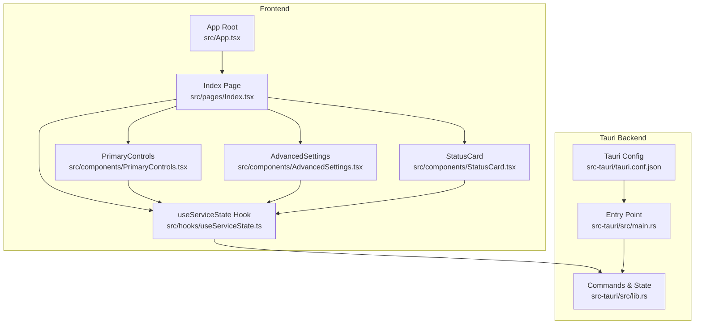
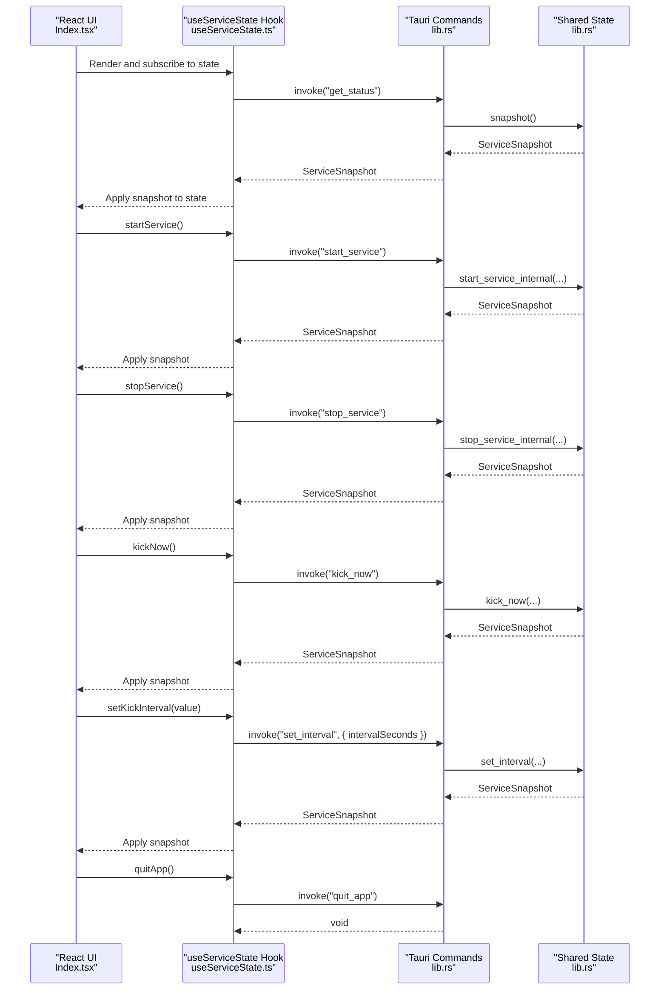
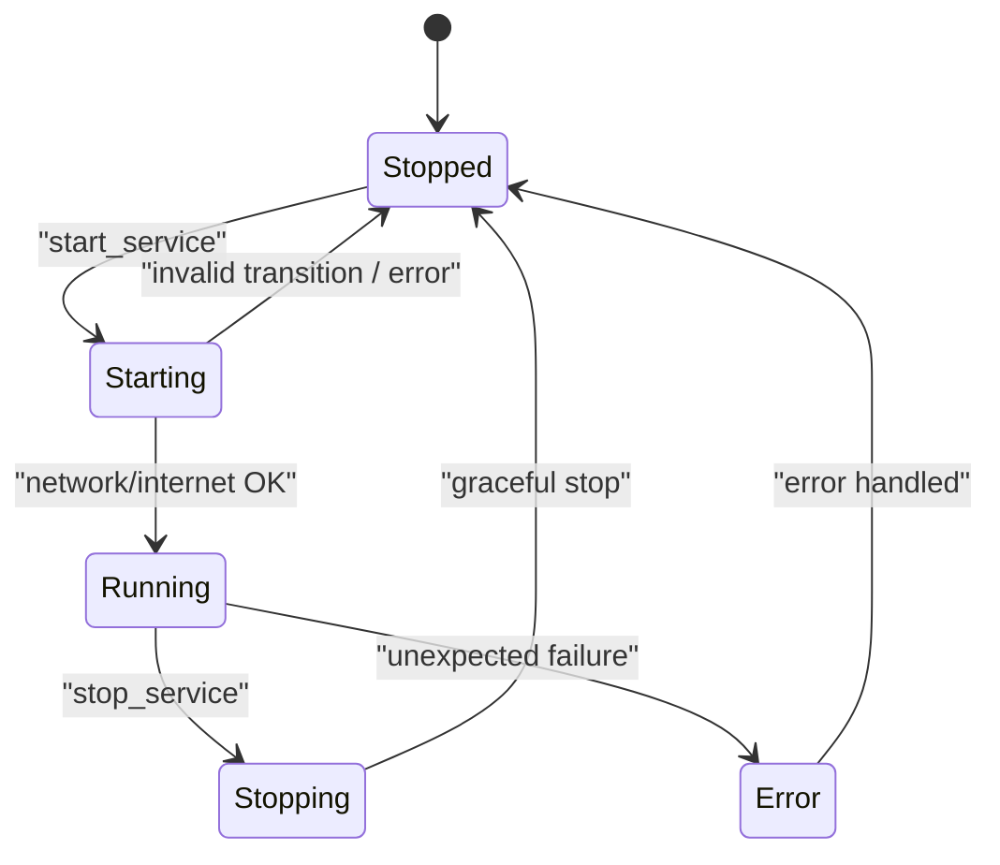
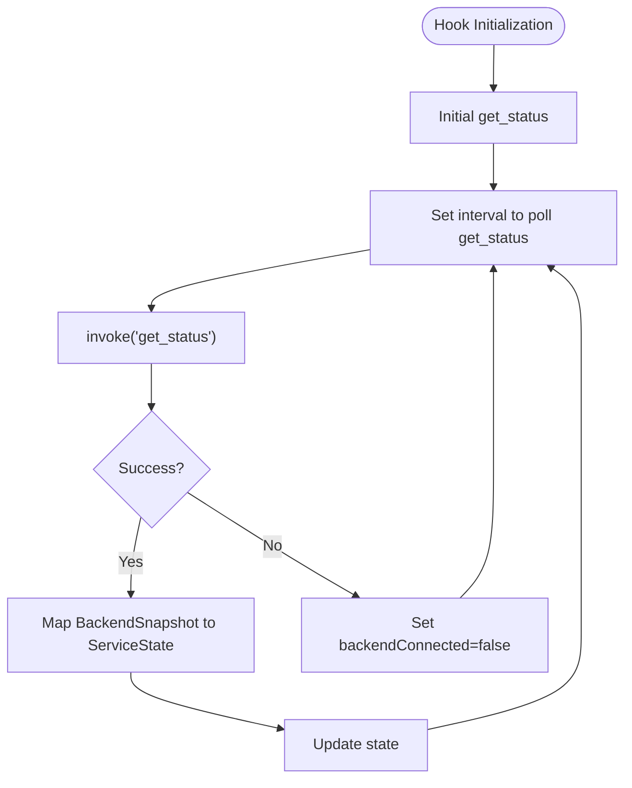
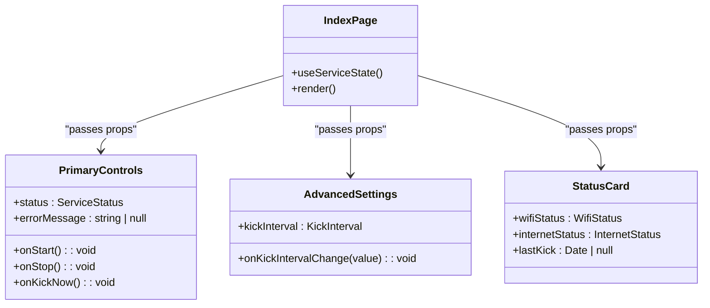
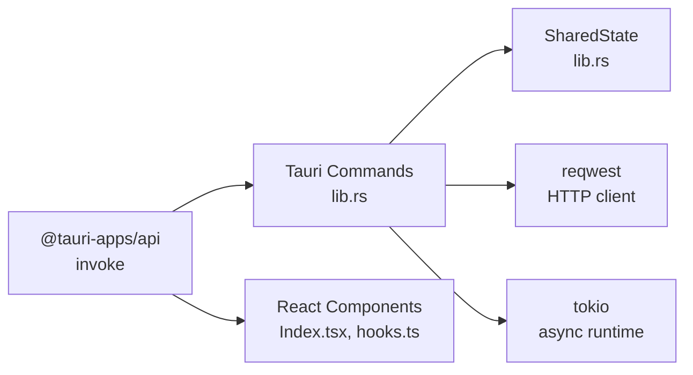

# API Reference

<cite>
**Referenced Files in This Document**
- [src-tauri/src/lib.rs](file://src-tauri/src/lib.rs)
- [src-tauri/src/main.rs](file://src-tauri/src/main.rs)
- [src/hooks/useServiceState.ts](file://src/hooks/useServiceState.ts)
- [src/pages/Index.tsx](file://src/pages/Index.tsx)
- [src/components/PrimaryControls.tsx](file://src/components/PrimaryControls.tsx)
- [src/components/AdvancedSettings.tsx](file://src/components/AdvancedSettings.tsx)
- [src/components/StatusCard.tsx](file://src/components/StatusCard.tsx)
- [src/App.tsx](file://src/App.tsx)
- [src-tauri/tauri.conf.json](file://src-tauri/tauri.conf.json)
- [src-tauri/Cargo.toml](file://src-tauri/Cargo.toml)
- [package.json](file://package.json)
- [README.md](file://README.md)
</cite>

## Table of Contents
1. [Introduction](#introduction)
2. [Project Structure](#project-structure)
3. [Core Components](#core-components)
4. [Architecture Overview](#architecture-overview)
5. [Detailed Component Analysis](#detailed-component-analysis)
6. [Dependency Analysis](#dependency-analysis)
7. [Performance Considerations](#performance-considerations)
8. [Troubleshooting Guide](#troubleshooting-guide)
9. [Conclusion](#conclusion)
10. [Appendices](#appendices)

## Introduction
This document provides a comprehensive API reference for Hutch-Pulse (formerly Hutch-Kick), a Tauri-powered Windows tray application. It documents the backend Tauri command handlers and the frontend React hooks and components that consume them. The API enables:
- Retrieving the current service state
- Starting/stopping the background service
- Manually triggering a “kick”
- Adjusting the kick interval
- Quitting the application

It also covers frontend state management, component props, bridge communication patterns, serialization formats, and practical usage guidance.

## Project Structure
The project follows a clear separation of concerns:
- Backend (Rust/Tauri): Implements commands, state machine, and worker loop
- Frontend (React/TypeScript): Provides UI, state synchronization via polling, and invokes commands

**Diagram sources**
- [src/pages/Index.tsx](file://src/pages/Index.tsx#L1-L55)
- [src/hooks/useServiceState.ts](file://src/hooks/useServiceState.ts#L1-L163)
- [src/components/PrimaryControls.tsx](file://src/components/PrimaryControls.tsx#L1-L73)
- [src/components/AdvancedSettings.tsx](file://src/components/AdvancedSettings.tsx#L1-L73)
- [src/components/StatusCard.tsx](file://src/components/StatusCard.tsx#L1-L63)
- [src-tauri/src/lib.rs](file://src-tauri/src/lib.rs#L599-L686)
- [src-tauri/src/main.rs](file://src-tauri/src/main.rs#L1-L7)
- [src-tauri/tauri.conf.json](file://src-tauri/tauri.conf.json#L1-L42)

**Section sources**
- [README.md](file://README.md#L22-L50)
- [src-tauri/tauri.conf.json](file://src-tauri/tauri.conf.json#L1-L42)
- [src-tauri/src/lib.rs](file://src-tauri/src/lib.rs#L599-L686)
- [src-tauri/src/main.rs](file://src-tauri/src/main.rs#L1-L7)

## Core Components
This section documents the Tauri command handlers and the frontend hook that consumes them.

- Command: get_status
  - Purpose: Retrieve a snapshot of the current service state
  - Parameters: None
  - Returns: ServiceSnapshot object
  - Errors: None declared; returns current state snapshot
  - Usage: Polling via frontend hook
  - Example invocation path: [src/hooks/useServiceState.ts](file://src/hooks/useServiceState.ts#L88-L98)

- Command: start_service
  - Purpose: Start the background service if conditions permit
  - Parameters: None
  - Returns: ServiceSnapshot object
  - Errors: Returns error string on failure
  - Usage: Triggered by UI controls
  - Example invocation path: [src/hooks/useServiceState.ts](file://src/hooks/useServiceState.ts#L109-L116)

- Command: stop_service
  - Purpose: Stop the background service gracefully
  - Parameters: None
  - Returns: ServiceSnapshot object
  - Errors: Returns error string on failure
  - Usage: Triggered by UI controls
  - Example invocation path: [src/hooks/useServiceState.ts](file://src/hooks/useServiceState.ts#L118-L125)

- Command: kick_now
  - Purpose: Manually trigger a single “kick” request
  - Parameters: None
  - Returns: ServiceSnapshot object
  - Errors: Returns error string on failure
  - Usage: Triggered by UI controls
  - Example invocation path: [src/hooks/useServiceState.ts](file://src/hooks/useServiceState.ts#L127-L134)

- Command: set_interval
  - Purpose: Set the periodic kick interval (minimum enforced)
  - Parameters:
    - interval_seconds: number
  - Returns: ServiceSnapshot object
  - Errors: None declared; returns updated snapshot
  - Usage: Triggered by UI controls
  - Example invocation path: [src/hooks/useServiceState.ts](file://src/hooks/useServiceState.ts#L136-L144)

- Command: quit_app
  - Purpose: Terminate the application
  - Parameters: None
  - Returns: Void
  - Errors: None declared
  - Usage: Triggered by UI footer
  - Example invocation path: [src/hooks/useServiceState.ts](file://src/hooks/useServiceState.ts#L146-L152)

Serialization and Types
- Backend types (Rust):
  - ServiceMachineState: enum values include Stopped, Starting, Running, Stopping, Error
  - WifiStatus: enum values include Connected, Disconnected, Unknown
  - InternetStatus: enum values include Online, Offline, Unknown
  - LogEvent: fields include id, timestamp_ms, message
  - ServiceSnapshot: fields include current_state, wifi_status, internet_status, last_kick_time_ms, interval_seconds, logs, error_message
- Frontend types (TypeScript):
  - ServiceStatus: union of "RUNNING" | "STOPPED" | "STARTING" | "STOPPING" | "ERROR"
  - WifiStatus: union of "CONNECTED" | "DISCONNECTED" | "UNKNOWN"
  - InternetStatus: union of "ONLINE" | "OFFLINE" | "UNKNOWN"
  - KickInterval: union of "20" | "60" | "120" | "300"
  - LogEntry: fields include id, message, timestamp
  - BackendLogEntry: fields include id, message, timestampMs
  - BackendSnapshot: fields mirror ServiceSnapshot with camelCase naming
  - ServiceState: fields include status, wifiStatus, internetStatus, lastKick, kickInterval, logs, errorMessage, backendConnected

Bridge Communication Patterns
- Frontend invokes commands via @tauri-apps/api invoke
- Backend registers commands with tauri::Builder.invoke_handler
- Frontend polls get_status at a fixed interval to keep UI in sync
- Frontend maps backend snapshots to frontend types and updates state

**Section sources**
- [src-tauri/src/lib.rs](file://src-tauri/src/lib.rs#L27-L71)
- [src-tauri/src/lib.rs](file://src-tauri/src/lib.rs#L599-L686)
- [src/hooks/useServiceState.ts](file://src/hooks/useServiceState.ts#L1-L163)

## Architecture Overview
The system architecture connects the frontend React UI to the Tauri backend via typed invocations and a polling-based state synchronization mechanism.

**Diagram sources**
- [src/pages/Index.tsx](file://src/pages/Index.tsx#L1-L55)
- [src/hooks/useServiceState.ts](file://src/hooks/useServiceState.ts#L67-L162)
- [src-tauri/src/lib.rs](file://src-tauri/src/lib.rs#L599-L686)

## Detailed Component Analysis

### Backend Commands and State Machine
- Commands:
  - get_status: returns ServiceSnapshot
  - start_service: returns ServiceSnapshot or error string
  - stop_service: returns ServiceSnapshot or error string
  - kick_now: returns ServiceSnapshot or error string
  - set_interval: returns ServiceSnapshot
  - quit_app: terminates the app
- State machine:
  - States: Stopped, Starting, Running, Stopping, Error
  - Transitions are validated; invalid transitions produce errors
- Logging:
  - LogEvent entries include monotonic id, millisecond timestamp, and message
  - Maximum log buffer size is enforced

**Diagram sources**
- [src-tauri/src/lib.rs](file://src-tauri/src/lib.rs#L27-L35)
- [src-tauri/src/lib.rs](file://src-tauri/src/lib.rs#L160-L171)

**Section sources**
- [src-tauri/src/lib.rs](file://src-tauri/src/lib.rs#L27-L141)
- [src-tauri/src/lib.rs](file://src-tauri/src/lib.rs#L599-L686)

### Frontend Hook: useServiceState
- Responsibilities:
  - Poll get_status periodically
  - Map backend snapshot to frontend types
  - Expose actions: startService, stopService, kickNow, setKickInterval, quitApp
  - Track backend connectivity and error messages
- Polling:
  - Initial fetch followed by periodic polling at a fixed interval
- Error handling:
  - Catches invocation errors and sets errorMessage
  - Marks backendConnected when invocations fail

**Diagram sources**
- [src/hooks/useServiceState.ts](file://src/hooks/useServiceState.ts#L88-L107)

**Section sources**
- [src/hooks/useServiceState.ts](file://src/hooks/useServiceState.ts#L1-L163)

### Frontend Components and Props
- Index Page
  - Consumes useServiceState and passes state to child components
  - Displays status, controls, advanced settings, logs, and footer
- PrimaryControls
  - Props: status, onStart, onStop, onKickNow, errorMessage
  - Behavior: renders start/stop button and manual kick button based on status
- AdvancedSettings
  - Props: kickInterval, onKickIntervalChange
  - Behavior: toggles advanced panel and exposes interval buttons
- StatusCard
  - Props: wifiStatus, internetStatus, lastKick
  - Behavior: displays network, internet, and last kick time

**Diagram sources**
- [src/pages/Index.tsx](file://src/pages/Index.tsx#L9-L52)
- [src/components/PrimaryControls.tsx](file://src/components/PrimaryControls.tsx#L4-L18)
- [src/components/AdvancedSettings.tsx](file://src/components/AdvancedSettings.tsx#L5-L8)
- [src/components/StatusCard.tsx](file://src/components/StatusCard.tsx#L4-L8)

**Section sources**
- [src/pages/Index.tsx](file://src/pages/Index.tsx#L1-L55)
- [src/components/PrimaryControls.tsx](file://src/components/PrimaryControls.tsx#L1-L73)
- [src/components/AdvancedSettings.tsx](file://src/components/AdvancedSettings.tsx#L1-L73)
- [src/components/StatusCard.tsx](file://src/components/StatusCard.tsx#L1-L63)

### Programmatic Usage Examples
- Start the service programmatically:
  - Call startService from the hook; it internally invokes the backend command
  - Invocation path: [src/hooks/useServiceState.ts](file://src/hooks/useServiceState.ts#L109-L116)
- Stop the service programmatically:
  - Call stopService from the hook
  - Invocation path: [src/hooks/useServiceState.ts](file://src/hooks/useServiceState.ts#L118-L125)
- Manually trigger a kick:
  - Call kickNow from the hook
  - Invocation path: [src/hooks/useServiceState.ts](file://src/hooks/useServiceState.ts#L127-L134)
- Change kick interval:
  - Call setKickInterval with a KickInterval value
  - Invocation path: [src/hooks/useServiceState.ts](file://src/hooks/useServiceState.ts#L136-L144)
- Quit the app:
  - Call quitApp from the hook
  - Invocation path: [src/hooks/useServiceState.ts](file://src/hooks/useServiceState.ts#L146-L152)

Integration Patterns
- Use the hook in any component to access state and actions
- Wrap the app with providers as configured in the root
  - Providers include QueryClientProvider, TooltipProvider, Toaster, Sonner, and Router
  - Provider setup: [src/App.tsx](file://src/App.tsx#L9-L25)

**Section sources**
- [src/hooks/useServiceState.ts](file://src/hooks/useServiceState.ts#L109-L152)
- [src/App.tsx](file://src/App.tsx#L9-L25)

## Dependency Analysis
- Frontend dependencies relevant to the API:
  - @tauri-apps/api: core invoke mechanism
  - @tauri-apps/plugin-notification: notifications integration
  - @tanstack/react-query: state caching and refetching
- Backend dependencies relevant to the API:
  - tauri: command registration and state management
  - serde: serialization for types
  - reqwest: HTTP requests for connectivity checks and kicks
  - tokio: async runtime for worker loop

**Diagram sources**
- [package.json](file://package.json#L48-L69)
- [src-tauri/Cargo.toml](file://src-tauri/Cargo.toml#L20-L28)
- [src-tauri/src/lib.rs](file://src-tauri/src/lib.rs#L1-L26)

**Section sources**
- [package.json](file://package.json#L48-L69)
- [src-tauri/Cargo.toml](file://src-tauri/Cargo.toml#L20-L28)
- [src-tauri/src/lib.rs](file://src-tauri/src/lib.rs#L1-L26)

## Performance Considerations
- Polling interval: The frontend polls get_status at a fixed interval. Adjusting this interval affects responsiveness versus resource usage.
- Minimum interval enforcement: The backend enforces a minimum interval to prevent excessive requests.
- Worker loop: The background service sleeps for the configured interval between kicks.
- Network checks: Connectivity checks and internet checks are lightweight but still incur overhead; avoid overly aggressive intervals.

[No sources needed since this section provides general guidance]

## Troubleshooting Guide
Common issues and resolutions:
- Backend unavailable:
  - Symptom: UI indicates backend unavailable
  - Cause: Running the UI outside the Tauri desktop runtime
  - Resolution: Run with the Tauri desktop runtime
  - Detection: [src/hooks/useServiceState.ts](file://src/hooks/useServiceState.ts#L88-L98)
- Start blocked due to network state:
  - Symptom: Start fails with a message indicating unknown network state
  - Cause: Network adapter state cannot be determined
  - Resolution: Ensure network adapter is present and functioning
  - Handling: [src-tauri/src/lib.rs](file://src-tauri/src/lib.rs#L489-L502)
- Start blocked due to no network adapter:
  - Symptom: Start fails with a message indicating no active network adapter
  - Cause: No Wi-Fi or Ethernet adapter connected
  - Resolution: Connect to a network
  - Handling: [src-tauri/src/lib.rs](file://src-tauri/src/lib.rs#L504-L516)
- Start blocked due to offline internet:
  - Symptom: Start fails with a message indicating internet unavailable
  - Cause: Internet connectivity check fails
  - Resolution: Fix internet connectivity
  - Handling: [src-tauri/src/lib.rs](file://src-tauri/src/lib.rs#L528-L536)
- Unexpected error during operation:
  - Symptom: Service moves to ERROR state and stops
  - Cause: Failure in kick or internal transition
  - Resolution: Inspect logs and retry
  - Handling: [src-tauri/src/lib.rs](file://src-tauri/src/lib.rs#L193-L205)

**Section sources**
- [src/hooks/useServiceState.ts](file://src/hooks/useServiceState.ts#L88-L98)
- [src-tauri/src/lib.rs](file://src-tauri/src/lib.rs#L489-L536)
- [src-tauri/src/lib.rs](file://src-tauri/src/lib.rs#L193-L205)

## Conclusion
Hutch-Pulse exposes a concise and robust API surface for controlling a background service that periodically triggers a lightweight request to maintain connectivity. The frontend hook provides a clean abstraction for state synchronization and command invocation, while the backend enforces safe state transitions and minimum operational constraints. Following the usage patterns and best practices outlined here ensures reliable integration and predictable behavior.

[No sources needed since this section summarizes without analyzing specific files]

## Appendices

### API Definitions

- get_status
  - Description: Retrieve current service snapshot
  - Method: invoke("get_status")
  - Returns: ServiceSnapshot
  - Errors: None declared
  - Example path: [src/hooks/useServiceState.ts](file://src/hooks/useServiceState.ts#L88-L98)

- start_service
  - Description: Start the service if preconditions are met
  - Method: invoke("start_service")
  - Returns: ServiceSnapshot
  - Errors: Returns error string on failure
  - Example path: [src/hooks/useServiceState.ts](file://src/hooks/useServiceState.ts#L109-L116)

- stop_service
  - Description: Stop the service gracefully
  - Method: invoke("stop_service")
  - Returns: ServiceSnapshot
  - Errors: Returns error string on failure
  - Example path: [src/hooks/useServiceState.ts](file://src/hooks/useServiceState.ts#L118-L125)

- kick_now
  - Description: Manually trigger a single kick
  - Method: invoke("kick_now")
  - Returns: ServiceSnapshot
  - Errors: Returns error string on failure
  - Example path: [src/hooks/useServiceState.ts](file://src/hooks/useServiceState.ts#L127-L134)

- set_interval
  - Description: Set the periodic kick interval (minimum enforced)
  - Method: invoke("set_interval", { intervalSeconds })
  - Returns: ServiceSnapshot
  - Errors: None declared
  - Example path: [src/hooks/useServiceState.ts](file://src/hooks/useServiceState.ts#L136-L144)

- quit_app
  - Description: Quit the application
  - Method: invoke("quit_app")
  - Returns: Void
  - Errors: None declared
  - Example path: [src/hooks/useServiceState.ts](file://src/hooks/useServiceState.ts#L146-L152)

### Frontend Types and Props

- useServiceState types
  - ServiceStatus, WifiStatus, InternetStatus, KickInterval, LogEntry, BackendSnapshot, ServiceState
  - Paths:
    - [src/hooks/useServiceState.ts](file://src/hooks/useServiceState.ts#L4-L40)

- Component props
  - PrimaryControls: status, onStart, onStop, onKickNow, errorMessage
    - [src/components/PrimaryControls.tsx](file://src/components/PrimaryControls.tsx#L4-L18)
  - AdvancedSettings: kickInterval, onKickIntervalChange
    - [src/components/AdvancedSettings.tsx](file://src/components/AdvancedSettings.tsx#L5-L8)
  - StatusCard: wifiStatus, internetStatus, lastKick
    - [src/components/StatusCard.tsx](file://src/components/StatusCard.tsx#L4-L8)

**Section sources**
- [src/hooks/useServiceState.ts](file://src/hooks/useServiceState.ts#L4-L40)
- [src/components/PrimaryControls.tsx](file://src/components/PrimaryControls.tsx#L4-L18)
- [src/components/AdvancedSettings.tsx](file://src/components/AdvancedSettings.tsx#L5-L8)
- [src/components/StatusCard.tsx](file://src/components/StatusCard.tsx#L4-L8)