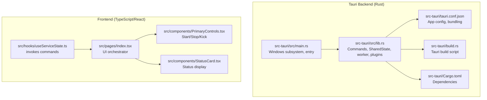
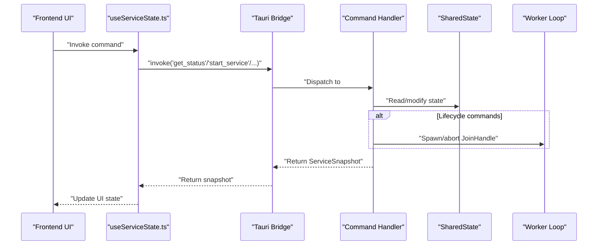
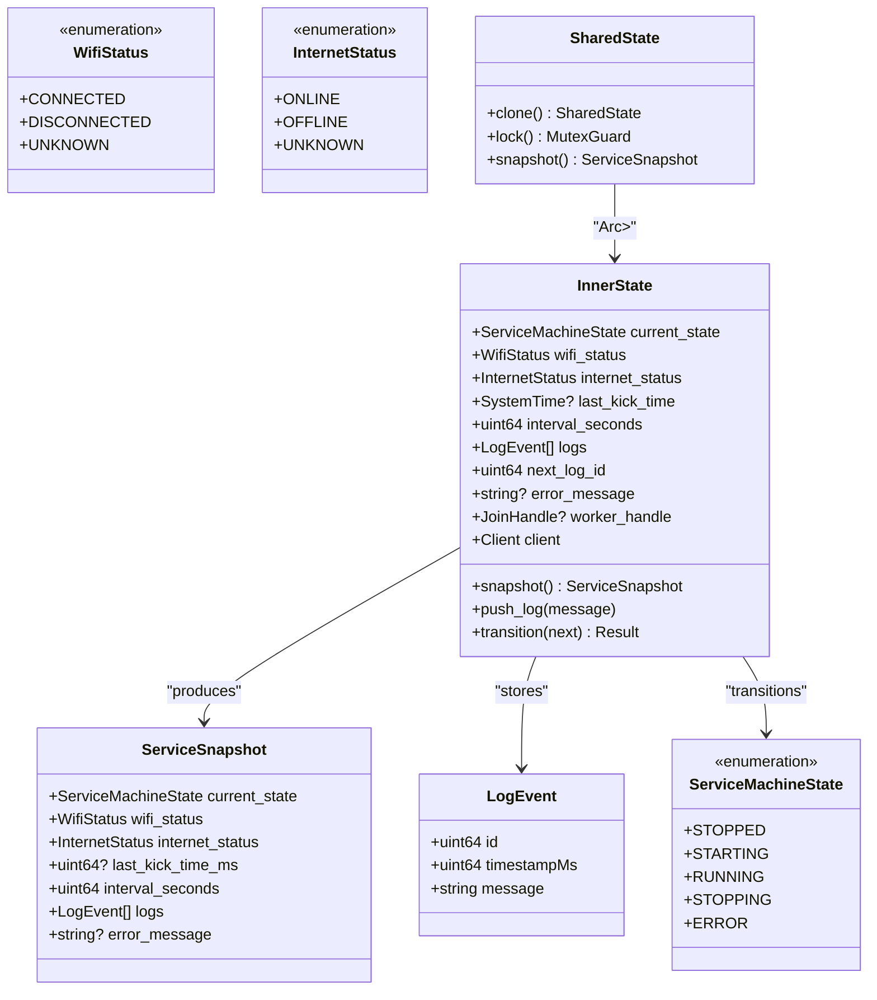
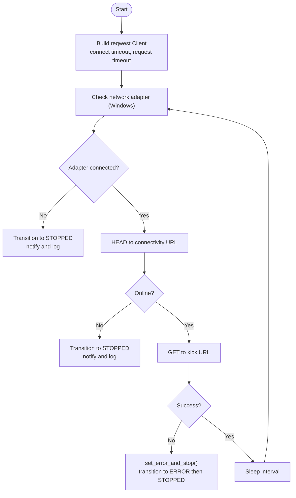
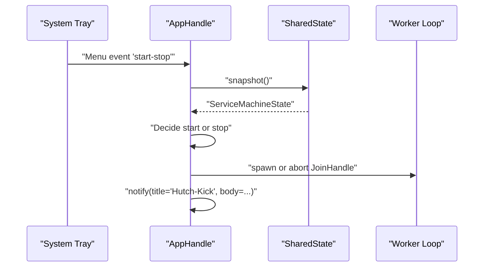
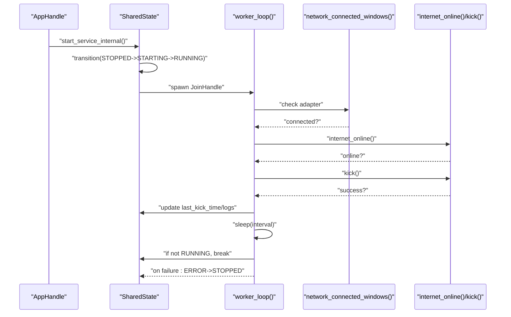
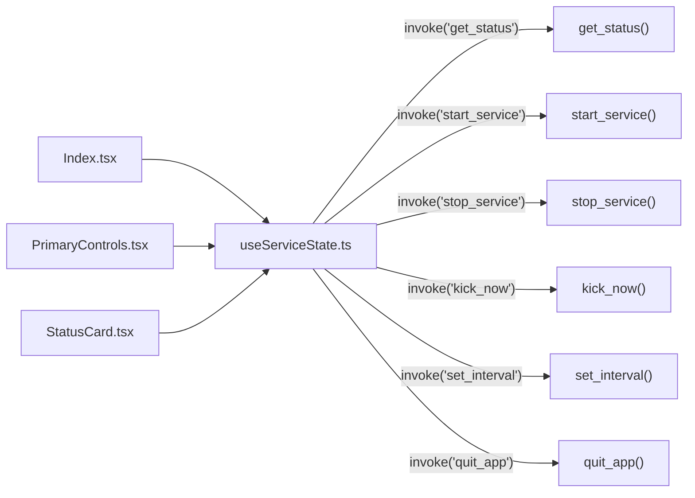
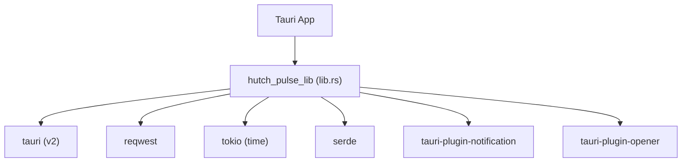

# Backend API

<cite>
**Referenced Files in This Document**
- [src-tauri/src/lib.rs](file://src-tauri/src/lib.rs)
- [src-tauri/src/main.rs](file://src-tauri/src/main.rs)
- [src-tauri/Cargo.toml](file://src-tauri/Cargo.toml)
- [src-tauri/tauri.conf.json](file://src-tauri/tauri.conf.json)
- [src-tauri/build.rs](file://src-tauri/build.rs)
- [src/hooks/useServiceState.ts](file://src/hooks/useServiceState.ts)
- [src/pages/Index.tsx](file://src/pages/Index.tsx)
- [src/components/PrimaryControls.tsx](file://src/components/PrimaryControls.tsx)
- [src/components/StatusCard.tsx](file://src/components/StatusCard.tsx)
</cite>

## Table of Contents
1. [Introduction](#introduction)
2. [Project Structure](#project-structure)
3. [Core Components](#core-components)
4. [Architecture Overview](#architecture-overview)
5. [Detailed Component Analysis](#detailed-component-analysis)
6. [Dependency Analysis](#dependency-analysis)
7. [Performance Considerations](#performance-considerations)
8. [Troubleshooting Guide](#troubleshooting-guide)
9. [Conclusion](#conclusion)
10. [Appendices](#appendices)

## Introduction
This document describes the backend API of the Hutch-Pulse (Tauri) application. It focuses on the Tauri command handlers that expose the service lifecycle and state to the frontend, the SharedState architecture and state machine, thread-safe operations, asynchronous patterns, HTTP client configuration, network detection, platform-specific implementations, plugin integrations, notifications, and system tray functionality. It also provides guidance on extending the backend API with new command handlers and custom service logic.

## Project Structure
The backend is implemented in Rust under the Tauri framework. The primary entry point initializes the application and registers commands. The frontend invokes commands via @tauri-apps/api.

**Diagram sources**
- [src-tauri/src/main.rs](file://src-tauri/src/main.rs#L1-L7)
- [src-tauri/src/lib.rs](file://src-tauri/src/lib.rs#L658-L686)
- [src-tauri/tauri.conf.json](file://src-tauri/tauri.conf.json#L1-L42)
- [src-tauri/build.rs](file://src-tauri/build.rs#L1-L4)
- [src-tauri/Cargo.toml](file://src-tauri/Cargo.toml#L1-L29)
- [src/hooks/useServiceState.ts](file://src/hooks/useServiceState.ts#L1-L163)
- [src/pages/Index.tsx](file://src/pages/Index.tsx#L1-L55)
- [src/components/PrimaryControls.tsx](file://src/components/PrimaryControls.tsx#L1-L73)
- [src/components/StatusCard.tsx](file://src/components/StatusCard.tsx#L1-L63)

**Section sources**
- [src-tauri/src/main.rs](file://src-tauri/src/main.rs#L1-L7)
- [src-tauri/src/lib.rs](file://src-tauri/src/lib.rs#L658-L686)
- [src-tauri/tauri.conf.json](file://src-tauri/tauri.conf.json#L1-L42)
- [src-tauri/build.rs](file://src-tauri/build.rs#L1-L4)
- [src-tauri/Cargo.toml](file://src-tauri/Cargo.toml#L1-L29)

## Core Components
- SharedState: Thread-safe state container wrapping InnerState behind an Arc<Mutex<>>.
- State Machine: ServiceMachineState defines allowed transitions among STOPPED, STARTING, RUNNING, STOPPING, and ERROR.
- Worker Loop: Asynchronous loop that periodically checks network/internet and performs kick requests.
- HTTP Client: Configured reqwest client with connect and request timeouts.
- Plugins: Notification and opener plugins integrated during setup.
- Commands: Exposed Tauri commands for status, lifecycle control, manual kick, interval setting, and app exit.

Key constants and behaviors:
- Minimum interval enforced at 20 seconds.
- Connectivity URL and kick URL used for checks.
- Logging queue capped at 30 entries.
- Platform-specific network detection on Windows.

**Section sources**
- [src-tauri/src/lib.rs](file://src-tauri/src/lib.rs#L17-L26)
- [src-tauri/src/lib.rs](file://src-tauri/src/lib.rs#L27-L51)
- [src-tauri/src/lib.rs](file://src-tauri/src/lib.rs#L73-L141)
- [src-tauri/src/lib.rs](file://src-tauri/src/lib.rs#L143-L158)
- [src-tauri/src/lib.rs](file://src-tauri/src/lib.rs#L160-L171)
- [src-tauri/src/lib.rs](file://src-tauri/src/lib.rs#L351-L371)
- [src-tauri/src/lib.rs](file://src-tauri/src/lib.rs#L308-L349)
- [src-tauri/src/lib.rs](file://src-tauri/src/lib.rs#L415-L473)
- [src-tauri/src/lib.rs](file://src-tauri/src/lib.rs#L658-L686)

## Architecture Overview
The backend exposes commands to the frontend. The frontend polls status and triggers actions. The backend manages a long-running worker loop that monitors connectivity and performs periodic kicks.

**Diagram sources**
- [src-tauri/src/lib.rs](file://src-tauri/src/lib.rs#L599-L656)
- [src-tauri/src/lib.rs](file://src-tauri/src/lib.rs#L415-L473)
- [src/hooks/useServiceState.ts](file://src/hooks/useServiceState.ts#L88-L152)

## Detailed Component Analysis

### SharedState and State Machine
SharedState encapsulates InnerState with thread-safe access. The state machine enforces valid transitions and snapshots the current state for the UI.

**Diagram sources**
- [src-tauri/src/lib.rs](file://src-tauri/src/lib.rs#L27-L71)
- [src-tauri/src/lib.rs](file://src-tauri/src/lib.rs#L73-L141)
- [src-tauri/src/lib.rs](file://src-tauri/src/lib.rs#L143-L158)

**Section sources**
- [src-tauri/src/lib.rs](file://src-tauri/src/lib.rs#L27-L71)
- [src-tauri/src/lib.rs](file://src-tauri/src/lib.rs#L73-L141)
- [src-tauri/src/lib.rs](file://src-tauri/src/lib.rs#L143-L158)
- [src-tauri/src/lib.rs](file://src-tauri/src/lib.rs#L160-L171)

### HTTP Client and Network Detection
- HTTP client built with connect and request timeouts.
- Connectivity check uses a known endpoint to detect online status.
- Platform-specific network adapter detection on Windows; other platforms return an error indicating unsupported.

**Diagram sources**
- [src-tauri/src/lib.rs](file://src-tauri/src/lib.rs#L660-L664)
- [src-tauri/src/lib.rs](file://src-tauri/src/lib.rs#L351-L371)
- [src-tauri/src/lib.rs](file://src-tauri/src/lib.rs#L308-L349)
- [src-tauri/src/lib.rs](file://src-tauri/src/lib.rs#L415-L473)
- [src-tauri/src/lib.rs](file://src-tauri/src/lib.rs#L193-L205)

**Section sources**
- [src-tauri/src/lib.rs](file://src-tauri/src/lib.rs#L660-L664)
- [src-tauri/src/lib.rs](file://src-tauri/src/lib.rs#L351-L371)
- [src-tauri/src/lib.rs](file://src-tauri/src/lib.rs#L308-L349)
- [src-tauri/src/lib.rs](file://src-tauri/src/lib.rs#L415-L473)
- [src-tauri/src/lib.rs](file://src-tauri/src/lib.rs#L193-L205)

### System Tray and Notifications
- Tray menu items: Show/Hide, Start/Stop, Quit.
- Toggle main window visibility and focus.
- Notification plugin used to inform users about state changes and errors.

**Diagram sources**
- [src-tauri/src/lib.rs](file://src-tauri/src/lib.rs#L259-L306)
- [src-tauri/src/lib.rs](file://src-tauri/src/lib.rs#L184-L205)
- [src-tauri/src/lib.rs](file://src-tauri/src/lib.rs#L415-L473)

**Section sources**
- [src-tauri/src/lib.rs](file://src-tauri/src/lib.rs#L259-L306)
- [src-tauri/src/lib.rs](file://src-tauri/src/lib.rs#L184-L205)

### Command Handlers

#### get_status(state: State<SharedState>) -> ServiceSnapshot
- Purpose: Return a snapshot of the current service state, statuses, logs, and optional error.
- Parameters:
  - state: Tauri State guard for SharedState.
- Returns:
  - ServiceSnapshot containing current_state, wifi_status, internet_status, last_kick_time_ms, interval_seconds, logs, error_message.
- Error conditions:
  - None; returns snapshot even if in ERROR state.
- Usage example (frontend):
  - invoke("get_status").then(applySnapshot).

**Section sources**
- [src-tauri/src/lib.rs](file://src-tauri/src/lib.rs#L599-L602)
- [src/hooks/useServiceState.ts](file://src/hooks/useServiceState.ts#L88-L98)

#### start_service(app: AppHandle, state: State<SharedState>) -> Result<ServiceSnapshot, String>
- Purpose: Start the service if network adapter is connected and internet is reachable.
- Parameters:
  - app: Application handle for notifications and window operations.
  - state: Tauri State guard for SharedState.
- Returns:
  - ServiceSnapshot on success; error string on failure.
- Error conditions:
  - Network check fails or returns unknown state.
  - No network adapter connected.
  - Internet unreachable.
  - Transition failures lead to ERROR then STOPPED.
- Usage example (frontend):
  - invoke("start_service").then(applySnapshot).

**Section sources**
- [src-tauri/src/lib.rs](file://src-tauri/src/lib.rs#L604-L610)
- [src-tauri/src/lib.rs](file://src-tauri/src/lib.rs#L475-L564)
- [src/hooks/useServiceState.ts](file://src/hooks/useServiceState.ts#L109-L116)

#### stop_service(app: AppHandle, state: State<SharedState>) -> Result<ServiceSnapshot, String>
- Purpose: Gracefully stop the service by aborting the worker and transitioning to STOPPED.
- Parameters:
  - app: Application handle.
  - state: Tauri State guard for SharedState.
- Returns:
  - ServiceSnapshot on success; error string on failure.
- Error conditions:
  - Called when not RUNNING; returns current snapshot.
- Usage example (frontend):
  - invoke("stop_service").then(applySnapshot).

**Section sources**
- [src-tauri/src/lib.rs](file://src-tauri/src/lib.rs#L612-L618)
- [src-tauri/src/lib.rs](file://src-tauri/src/lib.rs#L566-L597)
- [src/hooks/useServiceState.ts](file://src/hooks/useServiceState.ts#L118-L125)

#### kick_now(app: AppHandle, state: State<SharedState>) -> Result<ServiceSnapshot, String>
- Purpose: Perform an immediate kick request if service is RUNNING.
- Parameters:
  - app: Application handle for notifications.
  - state: Tauri State guard for SharedState.
- Returns:
  - ServiceSnapshot on success; error string on failure.
- Error conditions:
  - Not RUNNING; returns current snapshot.
  - Kick request fails; triggers ERROR then STOPPED.
- Usage example (frontend):
  - invoke("kick_now").then(applySnapshot).

**Section sources**
- [src-tauri/src/lib.rs](file://src-tauri/src/lib.rs#L620-L642)
- [src-tauri/src/lib.rs](file://src-tauri/src/lib.rs#L630-L633)
- [src/hooks/useServiceState.ts](file://src/hooks/useServiceState.ts#L127-L134)

#### set_interval(interval_seconds: u64, state: State<SharedState>) -> ServiceSnapshot
- Purpose: Set the minimum interval between kicks, clamped to a minimum of 20 seconds.
- Parameters:
  - interval_seconds: New interval in seconds.
  - state: Tauri State guard for SharedState.
- Returns:
  - ServiceSnapshot reflecting the new interval.
- Error conditions:
  - None; sanitizes input to minimum.
- Usage example (frontend):
  - invoke("set_interval", { intervalSeconds }).then(applySnapshot).

**Section sources**
- [src-tauri/src/lib.rs](file://src-tauri/src/lib.rs#L644-L651)
- [src/hooks/useServiceState.ts](file://src/hooks/useServiceState.ts#L136-L144)

#### quit_app(app: AppHandle)
- Purpose: Exit the application immediately.
- Parameters:
  - app: Application handle.
- Returns:
  - None.
- Error conditions:
  - None.
- Usage example (frontend):
  - invoke("quit_app").

**Section sources**
- [src-tauri/src/lib.rs](file://src-tauri/src/lib.rs#L653-L656)
- [src/hooks/useServiceState.ts](file://src/hooks/useServiceState.ts#L146-L152)

### Service Lifecycle Management and Worker Coordination
- Worker loop runs while state remains RUNNING, checking adapter, internet, and performing kicks.
- On connectivity loss or internet outage, transitions to STOPPING then STOPPED and notifies.
- On errors, transitions to ERROR then STOPPED and clears worker handle.
- Start spawns a JoinHandle; Stop aborts it.

**Diagram sources**
- [src-tauri/src/lib.rs](file://src-tauri/src/lib.rs#L475-L564)
- [src-tauri/src/lib.rs](file://src-tauri/src/lib.rs#L415-L473)
- [src-tauri/src/lib.rs](file://src-tauri/src/lib.rs#L308-L349)
- [src-tauri/src/lib.rs](file://src-tauri/src/lib.rs#L351-L371)
- [src-tauri/src/lib.rs](file://src-tauri/src/lib.rs#L193-L205)

**Section sources**
- [src-tauri/src/lib.rs](file://src-tauri/src/lib.rs#L475-L564)
- [src-tauri/src/lib.rs](file://src-tauri/src/lib.rs#L415-L473)
- [src-tauri/src/lib.rs](file://src-tauri/src/lib.rs#L193-L205)

### Frontend Integration
- useServiceState.ts invokes commands and maps backend snapshots to frontend types.
- Index.tsx composes UI components and passes callbacks to controls.
- PrimaryControls.tsx renders Start/Stop/Kick buttons and disables based on state.
- StatusCard.tsx displays network, internet, and last kick time.

**Diagram sources**
- [src/hooks/useServiceState.ts](file://src/hooks/useServiceState.ts#L88-L152)
- [src/pages/Index.tsx](file://src/pages/Index.tsx#L1-L55)
- [src/components/PrimaryControls.tsx](file://src/components/PrimaryControls.tsx#L1-L73)
- [src/components/StatusCard.tsx](file://src/components/StatusCard.tsx#L1-L63)

**Section sources**
- [src/hooks/useServiceState.ts](file://src/hooks/useServiceState.ts#L1-L163)
- [src/pages/Index.tsx](file://src/pages/Index.tsx#L1-L55)
- [src/components/PrimaryControls.tsx](file://src/components/PrimaryControls.tsx#L1-L73)
- [src/components/StatusCard.tsx](file://src/components/StatusCard.tsx#L1-L63)

## Dependency Analysis
External dependencies include Tauri v2, reqwest, tokio, serde, and plugins for notifications and opening URLs. The backend integrates these via tauri.conf.json and Cargo.toml.

**Diagram sources**
- [src-tauri/Cargo.toml](file://src-tauri/Cargo.toml#L20-L28)
- [src-tauri/src/lib.rs](file://src-tauri/src/lib.rs#L658-L686)

**Section sources**
- [src-tauri/Cargo.toml](file://src-tauri/Cargo.toml#L20-L28)
- [src-tauri/src/lib.rs](file://src-tauri/src/lib.rs#L658-L686)

## Performance Considerations
- Worker loop sleeps for the configured interval; keep interval reasonable to avoid excessive wake-ups.
- Logging queue capped at 30 entries; consider adjusting MAX_LOGS if more history is needed.
- HTTP timeouts configured; ensure they align with network conditions to prevent long blocking.
- Avoid frequent polling from the frontend; the current 1200 ms poll interval balances responsiveness and overhead.

## Troubleshooting Guide
Common issues and remedies:
- Network state unknown or adapter disconnected:
  - The service blocks start and transitions to STOPPED with an explanatory error message.
  - Verify network adapter connection and retry start.
- Internet unreachable:
  - The service blocks start and transitions to STOPPED with an explanatory error message.
  - Check router/modem and retry start.
- Unexpected failure during operation:
  - The service transitions to ERROR then STOPPED and notifies the user.
  - Inspect logs for details and restart the service.
- Manual kick fails:
  - The service transitions to ERROR then STOPPED and notifies the user.
  - Retry or adjust network settings.

Operational indicators:
- System tray notifications provide concise status updates.
- Logs are maintained in SharedState and surfaced to the UI.

**Section sources**
- [src-tauri/src/lib.rs](file://src-tauri/src/lib.rs#L475-L564)
- [src-tauri/src/lib.rs](file://src-tauri/src/lib.rs#L373-L413)
- [src-tauri/src/lib.rs](file://src-tauri/src/lib.rs#L193-L205)
- [src-tauri/src/lib.rs](file://src-tauri/src/lib.rs#L620-L642)

## Conclusion
The backend provides a robust, thread-safe service lifecycle managed by a state machine, with asynchronous worker coordination and explicit error handling. The Tauri command handlers expose a clean API to the frontend, enabling start/stop/kick operations, interval configuration, and graceful shutdown. Plugins integrate notifications and external URL handling, while platform-specific network detection ensures reliable startup checks on Windows.

## Appendices

### Extending the Backend API
- Add a new command handler:
  - Define a new #[tauri::command] function in the backend library with appropriate parameters and return types.
  - Register the command in the invoke_handler list during builder setup.
  - Example registration pattern: see the existing commands registered in the builder.
- Implement custom service logic:
  - Use SharedState to read/write state atomically.
  - Spawn or abort async tasks via tauri::async_runtime::spawn and JoinHandle.
  - Emit notifications via the notification plugin.
- Frontend integration:
  - Add a new invoke call in useServiceState.ts and map the returned snapshot to UI state.
  - Wire up UI components to trigger the new command.

**Section sources**
- [src-tauri/src/lib.rs](file://src-tauri/src/lib.rs#L658-L686)
- [src/hooks/useServiceState.ts](file://src/hooks/useServiceState.ts#L1-L163)