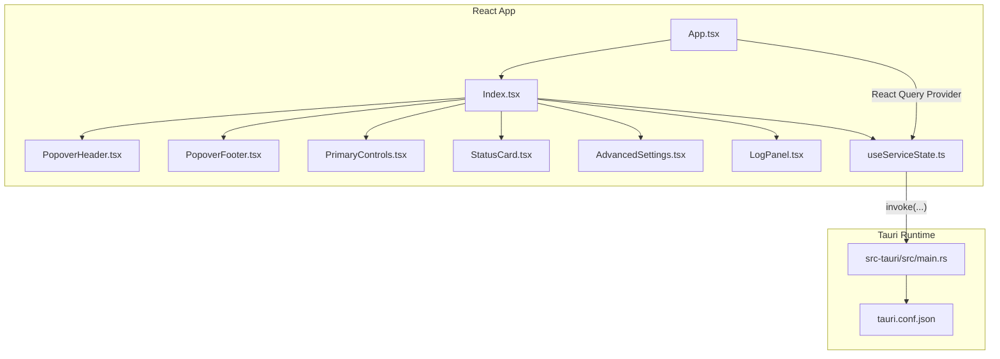
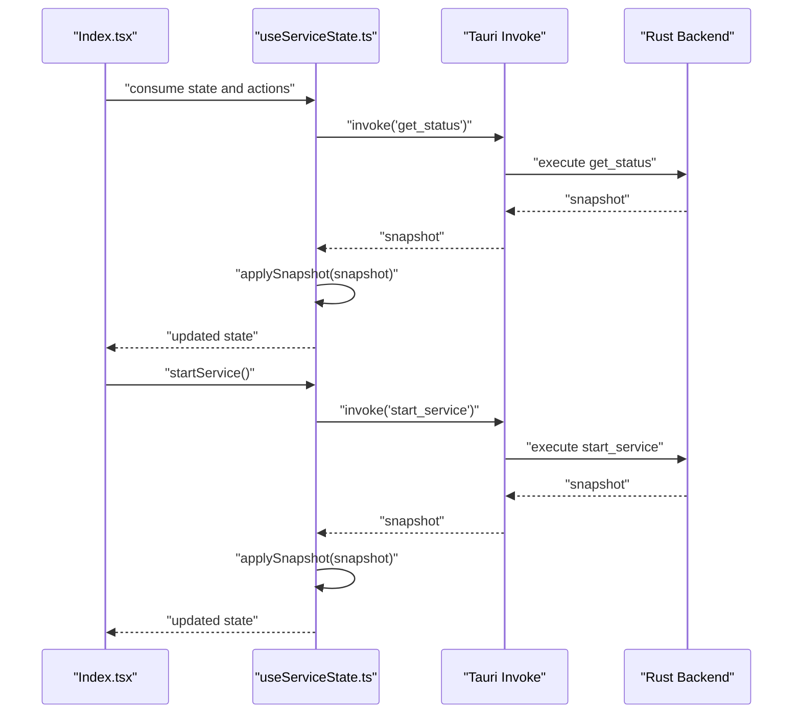
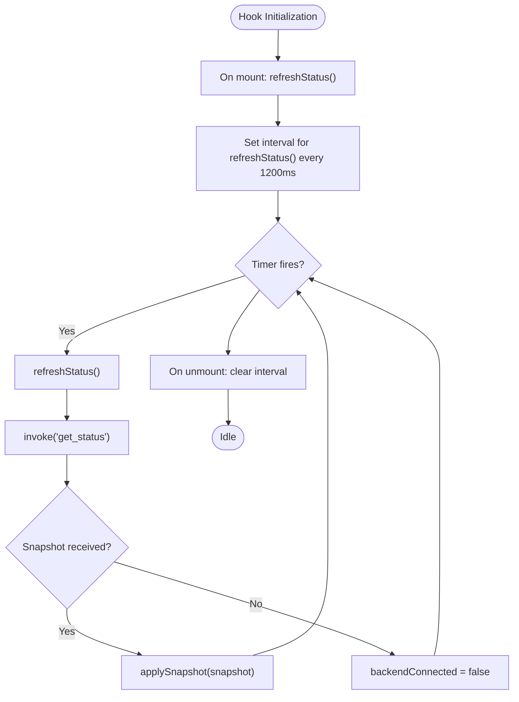
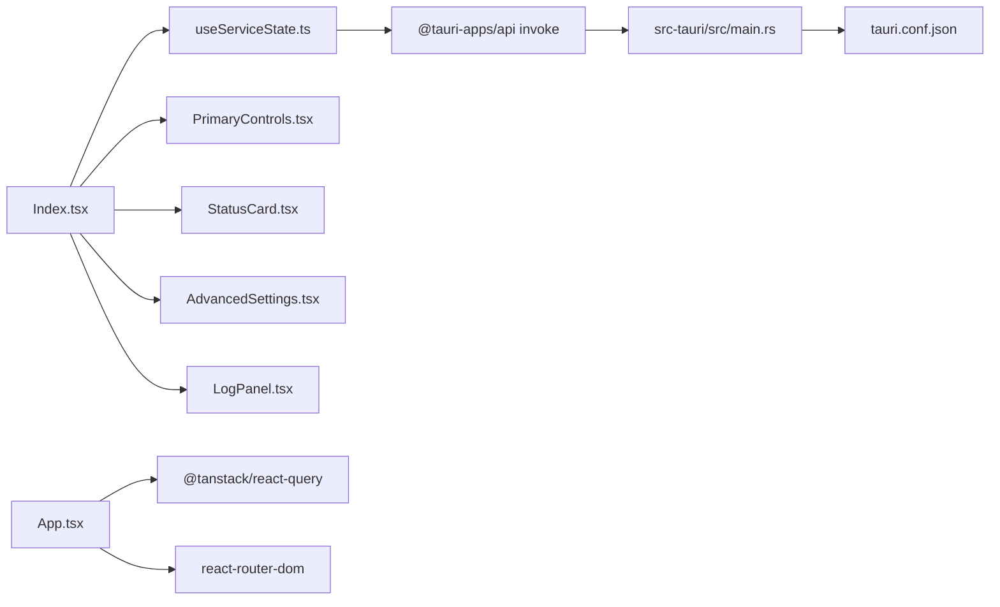

# Frontend API

<cite>
**Referenced Files in This Document**
- [useServiceState.ts](file://src/hooks/useServiceState.ts)
- [PrimaryControls.tsx](file://src/components/PrimaryControls.tsx)
- [StatusCard.tsx](file://src/components/StatusCard.tsx)
- [AdvancedSettings.tsx](file://src/components/AdvancedSettings.tsx)
- [LogPanel.tsx](file://src/components/LogPanel.tsx)
- [Index.tsx](file://src/pages/Index.tsx)
- [App.tsx](file://src/App.tsx)
- [PopoverHeader.tsx](file://src/components/PopoverHeader.tsx)
- [PopoverFooter.tsx](file://src/components/PopoverFooter.tsx)
- [main.rs](file://src-tauri/src/main.rs)
- [tauri.conf.json](file://src-tauri/tauri.conf.json)
- [package.json](file://package.json)
</cite>

## Table of Contents
1. [Introduction](#introduction)
2. [Project Structure](#project-structure)
3. [Core Components](#core-components)
4. [Architecture Overview](#architecture-overview)
5. [Detailed Component Analysis](#detailed-component-analysis)
6. [Dependency Analysis](#dependency-analysis)
7. [Performance Considerations](#performance-considerations)
8. [Troubleshooting Guide](#troubleshooting-guide)
9. [Conclusion](#conclusion)
10. [Appendices](#appendices)

## Introduction
This document describes the frontend API of the Hutch-Pulse React application, focusing on the state management hook useServiceState, the UI components that render and control the service, and the Tauri bridge communication patterns. It explains how the frontend polls the backend, handles reactive updates, and integrates with React Query. It also documents component prop interfaces, error handling, loading states, and performance optimization techniques, along with guidelines for extending the frontend API while maintaining type safety.

## Project Structure
The frontend is organized into:
- Hooks: centralized state and side effects
- Components: presentational and composite UI elements
- Pages: page-level composition and data binding
- App bootstrap: React Query provider and routing setup
- Tauri integration: configuration and runtime entry point

**Diagram sources**
- [App.tsx](file://src/App.tsx#L9-L25)
- [Index.tsx](file://src/pages/Index.tsx#L1-L55)
- [useServiceState.ts](file://src/hooks/useServiceState.ts#L67-L162)
- [main.rs](file://src-tauri/src/main.rs#L4-L6)
- [tauri.conf.json](file://src-tauri/tauri.conf.json#L1-L42)

**Section sources**
- [App.tsx](file://src/App.tsx#L9-L25)
- [Index.tsx](file://src/pages/Index.tsx#L1-L55)
- [tauri.conf.json](file://src-tauri/tauri.conf.json#L1-L42)
- [main.rs](file://src-tauri/src/main.rs#L4-L6)

## Core Components
This section documents the primary frontend APIs and their roles.

- useServiceState hook
  - Purpose: centralizes service state, polling, and Tauri invocations
  - Polling: periodic refresh via a timer
  - Actions: start, stop, kick now, set interval, quit app
  - Reactive updates: applies snapshots to state, manages connection health, and error messages
  - Returns: state fields plus action methods

- Page composition
  - Index page composes UI components and binds useServiceState outputs to props

- UI components
  - PrimaryControls: start/stop/kick controls with status-aware rendering
  - StatusCard: network/internet connectivity and last kick display
  - AdvancedSettings: kick interval selection and informational hints
  - LogPanel: recent log entries with copy-to-clipboard
  - PopoverHeader/Footer: status header and footer actions

**Section sources**
- [useServiceState.ts](file://src/hooks/useServiceState.ts#L67-L162)
- [Index.tsx](file://src/pages/Index.tsx#L9-L52)
- [PrimaryControls.tsx](file://src/components/PrimaryControls.tsx#L12-L72)
- [StatusCard.tsx](file://src/components/StatusCard.tsx#L19-L62)
- [AdvancedSettings.tsx](file://src/components/AdvancedSettings.tsx#L17-L72)
- [LogPanel.tsx](file://src/components/LogPanel.tsx#L12-L51)
- [PopoverHeader.tsx](file://src/components/PopoverHeader.tsx#L15-L31)
- [PopoverFooter.tsx](file://src/components/PopoverFooter.tsx#L6-L20)

## Architecture Overview
The frontend uses a polling-driven pattern to fetch service snapshots from the backend via Tauri’s invoke mechanism. React Query is initialized at the root to support potential future data-fetching abstractions. The Index page orchestrates component composition and passes state/action callbacks to child components.

**Diagram sources**
- [Index.tsx](file://src/pages/Index.tsx#L9-L52)
- [useServiceState.ts](file://src/hooks/useServiceState.ts#L88-L107)
- [useServiceState.ts](file://src/hooks/useServiceState.ts#L109-L125)
- [useServiceState.ts](file://src/hooks/useServiceState.ts#L127-L134)
- [useServiceState.ts](file://src/hooks/useServiceState.ts#L136-L144)
- [main.rs](file://src-tauri/src/main.rs#L4-L6)

## Detailed Component Analysis

### useServiceState Hook
- Responsibilities
  - Manage internal state for service status, connectivity, logs, and errors
  - Poll backend periodically for fresh snapshots
  - Translate backend snapshots to frontend types
  - Expose imperative actions that invoke backend commands and update state

- State model
  - ServiceStatus: "RUNNING" | "STOPPED" | "STARTING" | "STOPPING" | "ERROR"
  - WifiStatus: "CONNECTED" | "DISCONNECTED" | "UNKNOWN"
  - InternetStatus: "ONLINE" | "OFFLINE" | "UNKNOWN"
  - KickInterval: "20" | "60" | "120" | "300"
  - LogEntry: id, message, timestamp
  - BackendSnapshot: shape returned by backend; mapped to ServiceState

- Polling and lifecycle
  - On mount, immediately fetches a snapshot
  - Schedules periodic refresh at a fixed interval
  - Clears interval on unmount
  - Marks backendConnected false on invocation failures

- Action methods
  - startService: invokes backend to start service and applies snapshot
  - stopService: invokes backend to stop service and applies snapshot
  - kickNow: triggers immediate kick and applies snapshot
  - setKickInterval: sets interval seconds and applies snapshot
  - quitApp: requests app termination

- Error handling
  - Catches invocation errors and sets errorMessage
  - Treats non-Error exceptions by converting to string

- Integration points
  - Uses @tauri-apps/api invoke
  - Integrates with React Query provider at root

**Diagram sources**
- [useServiceState.ts](file://src/hooks/useServiceState.ts#L100-L107)
- [useServiceState.ts](file://src/hooks/useServiceState.ts#L88-L98)

**Section sources**
- [useServiceState.ts](file://src/hooks/useServiceState.ts#L4-L162)

### PrimaryControls Component
- Props
  - status: ServiceStatus
  - onStart: () => void
  - onStop: () => void
  - onKickNow: () => void
  - errorMessage: string | null

- Behavior
  - Renders a single primary button that toggles between Start and Stop depending on status
  - Shows loading indicators during STARTING/STOPPING
  - Disables buttons appropriately
  - Displays error message banner when present

- Composition pattern
  - Receives actions from useServiceState and delegates to them

**Section sources**
- [PrimaryControls.tsx](file://src/components/PrimaryControls.tsx#L4-L10)
- [PrimaryControls.tsx](file://src/components/PrimaryControls.tsx#L12-L72)

### StatusCard Component
- Props
  - wifiStatus: WifiStatus
  - internetStatus: InternetStatus
  - lastKick: Date | null

- Behavior
  - Renders three rows: Network, Internet, Last Kick
  - Network and Internet show connected/disconnected/unknown with color-coded status
  - Last Kick shows relative time ("Never", "Xs ago", "Xm ago", "Xh ago")
  - Includes a brief explanatory note

**Section sources**
- [StatusCard.tsx](file://src/components/StatusCard.tsx#L4-L8)
- [StatusCard.tsx](file://src/components/StatusCard.tsx#L19-L62)

### AdvancedSettings Component
- Props
  - kickInterval: KickInterval
  - onKickIntervalChange: (value: KickInterval) => void

- Behavior
  - Collapsible advanced panel with:
    - Fixed kick URL
    - Kick interval selector with four options
    - Connectivity check hint
  - Highlights current interval and triggers change handler

**Section sources**
- [AdvancedSettings.tsx](file://src/components/AdvancedSettings.tsx#L5-L8)
- [AdvancedSettings.tsx](file://src/components/AdvancedSettings.tsx#L17-L72)

### LogPanel Component
- Props
  - logs: LogEntry[]

- Behavior
  - Displays recent log entries with timestamps
  - Provides a copy-to-clipboard action for all entries
  - Shows empty state when no logs

**Section sources**
- [LogPanel.tsx](file://src/components/LogPanel.tsx#L4-L6)
- [LogPanel.tsx](file://src/components/LogPanel.tsx#L12-L51)

### Page Composition (Index)
- Composes:
  - PopoverHeader bound to status
  - StatusCard with wifi/internet/last kick
  - PrimaryControls wired to start/stop/kick
  - AdvancedSettings wired to interval change
  - LogPanel bound to logs
  - PopoverFooter with quit action
  - Backend connectivity notice when backendConnected is false

**Section sources**
- [Index.tsx](file://src/pages/Index.tsx#L9-L52)

## Dependency Analysis
- Internal dependencies
  - Index.tsx depends on useServiceState and all UI components
  - UI components depend on types exported by useServiceState
- External dependencies
  - @tauri-apps/api for invoke
  - @tanstack/react-query for state caching and invalidation
  - react-router-dom for routing
- Tauri configuration
  - Dev/build URLs and window configuration
  - Runtime entry point delegates to Rust library

**Diagram sources**
- [Index.tsx](file://src/pages/Index.tsx#L1-L8)
- [useServiceState.ts](file://src/hooks/useServiceState.ts#L1-L2)
- [App.tsx](file://src/App.tsx#L4-L6)
- [main.rs](file://src-tauri/src/main.rs#L4-L6)
- [tauri.conf.json](file://src-tauri/tauri.conf.json#L6-L11)

**Section sources**
- [package.json](file://package.json#L47-L68)
- [tauri.conf.json](file://src-tauri/tauri.conf.json#L6-L11)
- [main.rs](file://src-tauri/src/main.rs#L4-L6)

## Performance Considerations
- Polling interval
  - Current interval is 1200 ms. Consider increasing for lower load or exposing a configurable rate.
- Rendering cost
  - LogPanel maps over logs; for very large histories, consider pagination or virtualization.
- State updates
  - applySnapshot performs a shallow merge; ensure snapshot sizes remain bounded.
- Network reliability
  - The hook marks backendConnected false on invocation failure. Debounce or exponential backoff could reduce unnecessary retries.
- React Query integration
  - While React Query is initialized, the hook currently uses manual polling. Consider migrating to React Query queries for automatic refetching and caching semantics.

[No sources needed since this section provides general guidance]

## Troubleshooting Guide
- Backend unavailable
  - Symptom: "Backend unavailable" banner appears
  - Cause: Invocation failures mark backendConnected false
  - Resolution: Ensure Tauri desktop runtime is used; verify backend availability
- Error messages
  - Symptom: Error banner in PrimaryControls
  - Cause: Exceptions during start/stop/kick/setInterval
  - Resolution: Inspect errorMessage field; confirm backend command names and permissions
- Stuck status
  - Symptom: Buttons disabled during STARTING/STOPPING
  - Cause: UI disables controls while state indicates transitional phases
  - Resolution: Wait for poll to reflect final state; check logs for details
- Logs not updating
  - Symptom: LogPanel remains empty
  - Cause: No logs in snapshot or polling paused
  - Resolution: Verify backend logging and ensure polling continues

**Section sources**
- [useServiceState.ts](file://src/hooks/useServiceState.ts#L88-L98)
- [useServiceState.ts](file://src/hooks/useServiceState.ts#L109-L125)
- [useServiceState.ts](file://src/hooks/useServiceState.ts#L127-L134)
- [useServiceState.ts](file://src/hooks/useServiceState.ts#L136-L144)
- [PrimaryControls.tsx](file://src/components/PrimaryControls.tsx#L25-L29)
- [Index.tsx](file://src/pages/Index.tsx#L39-L43)

## Conclusion
The frontend API centers on a robust polling hook that bridges to the Tauri backend, providing a reactive surface for UI components. The design cleanly separates concerns: state and side effects live in the hook, while components focus on presentation and user interaction. With optional migration to React Query, the system can gain richer caching and invalidation semantics while preserving existing prop interfaces and type safety.

[No sources needed since this section summarizes without analyzing specific files]

## Appendices

### Programmatic Usage Examples
- Start the service programmatically
  - Call the startService action from useServiceState
  - Example path: [Index.tsx](file://src/pages/Index.tsx#L28-L32)
- Stop the service programmatically
  - Call the stopService action from useServiceState
  - Example path: [Index.tsx](file://src/pages/Index.tsx#L29-L32)
- Trigger an immediate kick
  - Call the kickNow action from useServiceState
  - Example path: [Index.tsx](file://src/pages/Index.tsx#L30-L32)
- Change the kick interval
  - Call the setKickInterval action with a KickInterval value
  - Example path: [Index.tsx](file://src/pages/Index.tsx#L35-L37)
- Quit the application
  - Call the quitApp action from useServiceState
  - Example path: [Index.tsx](file://src/pages/Index.tsx#L48-L49)

### Component Prop Interfaces Summary
- PrimaryControlsProps
  - status: ServiceStatus
  - onStart: () => void
  - onStop: () => void
  - onKickNow: () => void
  - errorMessage: string | null
  - Reference: [PrimaryControls.tsx](file://src/components/PrimaryControls.tsx#L4-L10)

- StatusCardProps
  - wifiStatus: WifiStatus
  - internetStatus: InternetStatus
  - lastKick: Date | null
  - Reference: [StatusCard.tsx](file://src/components/StatusCard.tsx#L4-L8)

- AdvancedSettingsProps
  - kickInterval: KickInterval
  - onKickIntervalChange: (value: KickInterval) => void
  - Reference: [AdvancedSettings.tsx](file://src/components/AdvancedSettings.tsx#L5-L8)

- LogPanelProps
  - logs: LogEntry[]
  - Reference: [LogPanel.tsx](file://src/components/LogPanel.tsx#L4-L6)

### Tauri Bridge Communication Patterns
- Invocation targets
  - get_status: retrieves a snapshot of service state
  - start_service: starts the service
  - stop_service: stops the service
  - kick_now: performs an immediate kick
  - set_interval: updates the kick interval
  - quit_app: terminates the app
- References
  - [useServiceState.ts](file://src/hooks/useServiceState.ts#L88-L152)
  - [main.rs](file://src-tauri/src/main.rs#L4-L6)

### Data Fetching Strategies and Reactive Updates
- Polling-based refresh
  - Immediate fetch on mount followed by periodic polling
  - Reference: [useServiceState.ts](file://src/hooks/useServiceState.ts#L100-L107)
- Snapshot application
  - Converts backend timestamps and IDs, normalizes intervals, and merges into state
  - Reference: [useServiceState.ts](file://src/hooks/useServiceState.ts#L70-L86)
- Error propagation
  - Errors are mapped to strings and stored in errorMessage
  - Reference: [useServiceState.ts](file://src/hooks/useServiceState.ts#L62-L65)

### Integration with React Query
- Provider setup
  - QueryClientProvider wraps the app
  - Reference: [App.tsx](file://src/App.tsx#L9-L25)
- Recommendations
  - Convert polling to React Query queries for automatic refetching and caching
  - Use query keys aligned with service state to enable cache invalidation on actions

### Guidelines for Extending the Frontend API
- Maintain type safety
  - Keep backend snapshot types distinct from frontend state types
  - Add explicit conversion helpers (as seen with applySnapshot)
- Preserve component boundaries
  - Pass only necessary props; avoid leaking internal state
- Error handling
  - Centralize error mapping and propagate user-friendly messages
- Performance
  - Limit log history and consider virtualization
  - Tune polling interval based on UX and backend capacity
- Tauri compatibility
  - Ensure all invoke targets exist and are callable from the frontend
  - Respect Tauri configuration for dev/build URLs and window behavior

**Section sources**
- [useServiceState.ts](file://src/hooks/useServiceState.ts#L70-L86)
- [App.tsx](file://src/App.tsx#L9-L25)
- [tauri.conf.json](file://src-tauri/tauri.conf.json#L6-L11)