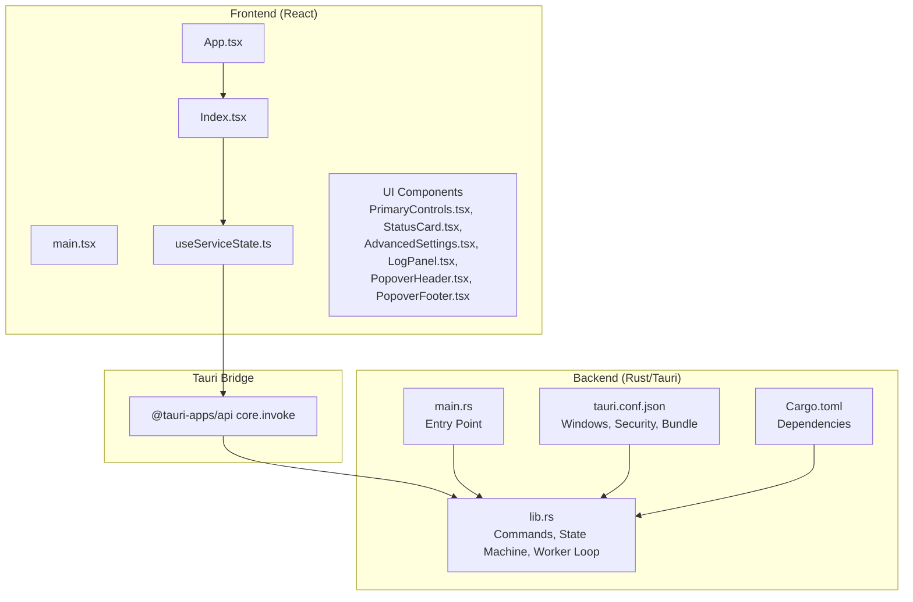
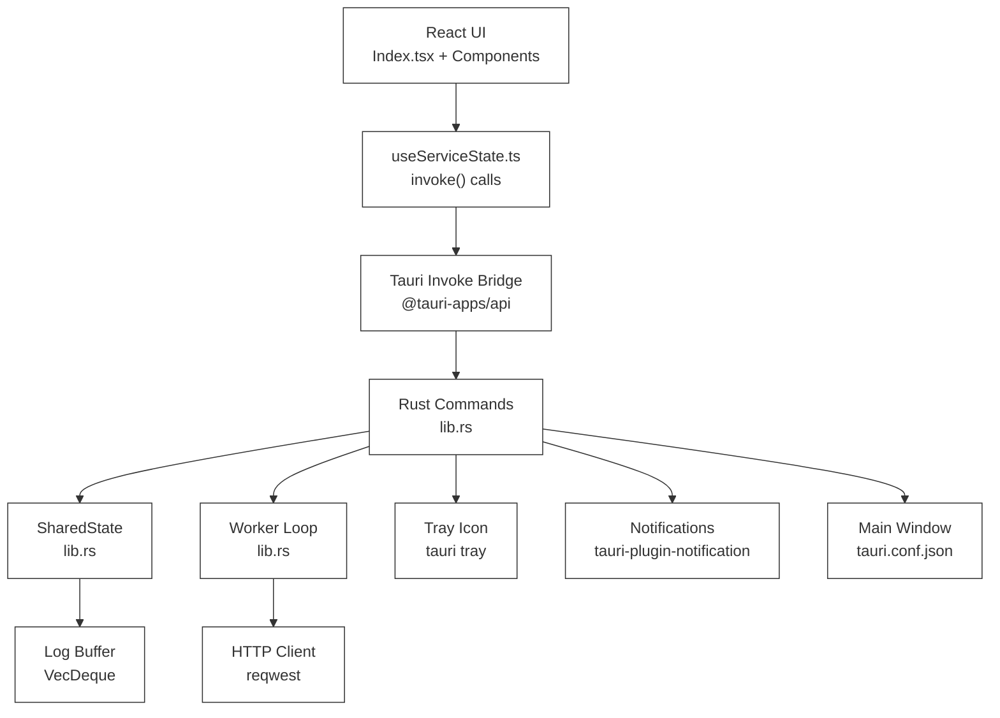
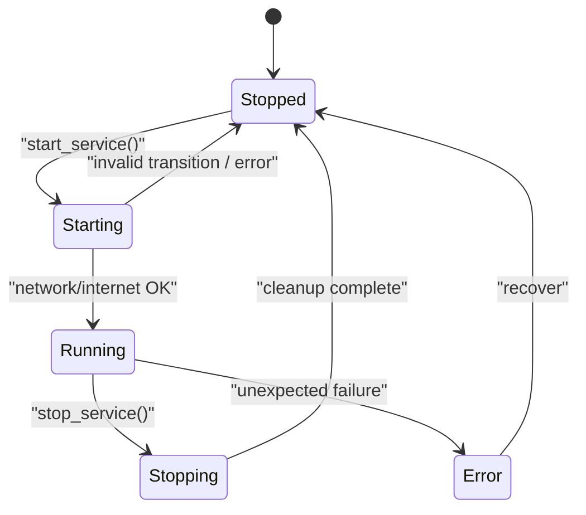
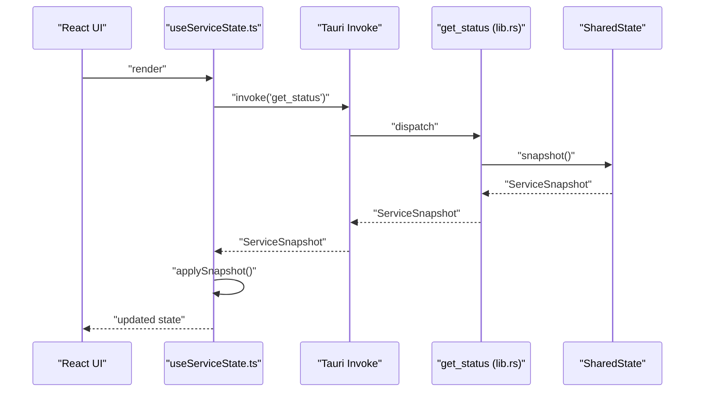
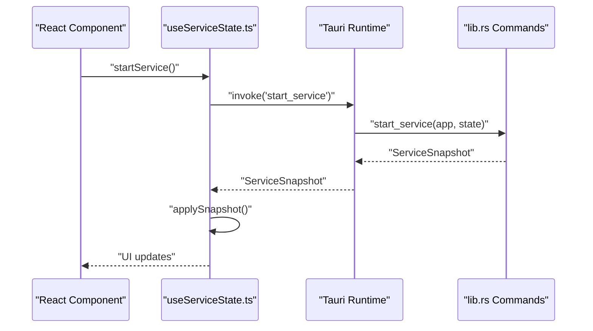
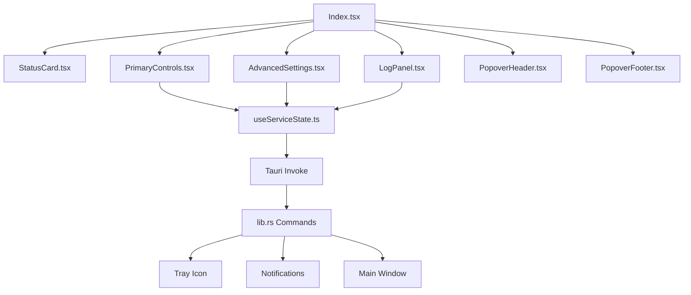
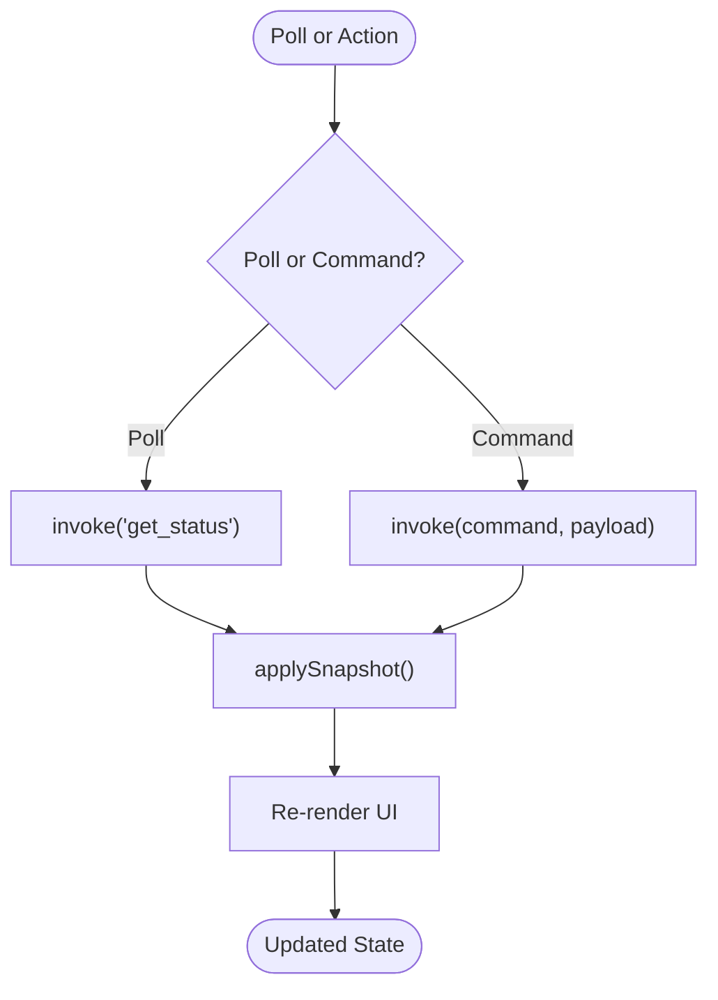
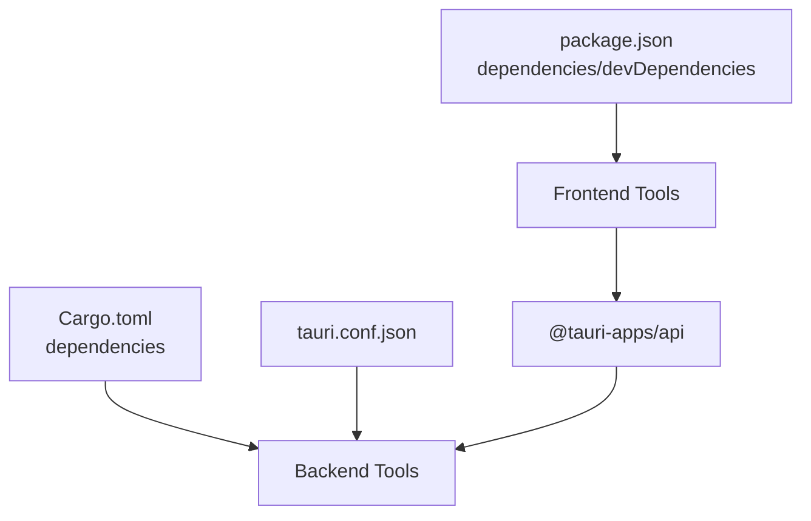

# Architecture Overview

<cite>
**Referenced Files in This Document**
- [package.json](file://package.json)
- [Cargo.toml](file://src-tauri/Cargo.toml)
- [tauri.conf.json](file://src-tauri/tauri.conf.json)
- [lib.rs](file://src-tauri/src/lib.rs)
- [main.rs](file://src-tauri/src/main.rs)
- [App.tsx](file://src/App.tsx)
- [main.tsx](file://src/main.tsx)
- [useServiceState.ts](file://src/hooks/useServiceState.ts)
- [Index.tsx](file://src/pages/Index.tsx)
- [PrimaryControls.tsx](file://src/components/PrimaryControls.tsx)
- [StatusCard.tsx](file://src/components/StatusCard.tsx)
- [AdvancedSettings.tsx](file://src/components/AdvancedSettings.tsx)
- [LogPanel.tsx](file://src/components/LogPanel.tsx)
- [PopoverHeader.tsx](file://src/components/PopoverHeader.tsx)
- [PopoverFooter.tsx](file://src/components/PopoverFooter.tsx)
</cite>

## Table of Contents
1. [Introduction](#introduction)
2. [Project Structure](#project-structure)
3. [Core Components](#core-components)
4. [Architecture Overview](#architecture-overview)
5. [Detailed Component Analysis](#detailed-component-analysis)
6. [Dependency Analysis](#dependency-analysis)
7. [Performance Considerations](#performance-considerations)
8. [Troubleshooting Guide](#troubleshooting-guide)
9. [Conclusion](#conclusion)

## Introduction
This document describes the architecture of the Hutch-Pulse desktop application, a hybrid system built with a React frontend and a Rust backend orchestrated via Tauri. The application runs as a compact always-on-top overlay window with a tray icon, periodically sending HTTP requests to maintain internet connectivity for a captive portal service. The backend encapsulates service lifecycle management using a state machine, exposes commands to the frontend through Tauri’s invoke bridge, and integrates with the operating system for notifications and window positioning. Cross-cutting concerns include error handling, logging, and platform-specific features such as network detection on Windows.

## Project Structure
The project is organized into two primary parts:
- Frontend (React + TypeScript): Provides UI components, state management hooks, routing, and Tauri bridge invocations.
- Backend (Rust + Tauri): Implements the service lifecycle, HTTP operations, OS integrations, and Tauri command handlers.

**Diagram sources**
- [App.tsx](file://src/App.tsx#L1-L28)
- [main.tsx](file://src/main.tsx#L1-L10)
- [Index.tsx](file://src/pages/Index.tsx#L1-L55)
- [useServiceState.ts](file://src/hooks/useServiceState.ts#L1-L163)
- [lib.rs](file://src-tauri/src/lib.rs#L599-L686)
- [main.rs](file://src-tauri/src/main.rs#L1-L7)
- [tauri.conf.json](file://src-tauri/tauri.conf.json#L1-L42)
- [Cargo.toml](file://src-tauri/Cargo.toml#L1-L29)

**Section sources**
- [package.json](file://package.json#L1-L96)
- [tauri.conf.json](file://src-tauri/tauri.conf.json#L1-L42)
- [Cargo.toml](file://src-tauri/Cargo.toml#L1-L29)

## Core Components
- React Application Shell
  - Routing and providers: QueryClientProvider, TooltipProvider, Toaster, Sonner.
  - Root entrypoint renders the application into the DOM.
- UI Pages and Components
  - Index page composes StatusCard, PrimaryControls, AdvancedSettings, LogPanel, and footer/header components.
  - Components render status, controls, settings, and logs with minimal logic.
- Tauri Bridge Hook
  - useServiceState manages polling, invoking backend commands, and transforming snapshots into UI state.
- Rust Backend
  - SharedState encapsulates service state, logs, and worker handle.
  - Commands expose get_status, start_service, stop_service, kick_now, set_interval, quit_app.
  - State machine enforces valid transitions and logs lifecycle events.
  - Worker loop performs periodic checks and kicks, with platform-specific network detection.

**Section sources**
- [App.tsx](file://src/App.tsx#L1-L28)
- [main.tsx](file://src/main.tsx#L1-L10)
- [Index.tsx](file://src/pages/Index.tsx#L1-L55)
- [PrimaryControls.tsx](file://src/components/PrimaryControls.tsx#L1-L73)
- [StatusCard.tsx](file://src/components/StatusCard.tsx#L1-L63)
- [AdvancedSettings.tsx](file://src/components/AdvancedSettings.tsx#L1-L73)
- [LogPanel.tsx](file://src/components/LogPanel.tsx#L1-L52)
- [PopoverHeader.tsx](file://src/components/PopoverHeader.tsx#L1-L32)
- [PopoverFooter.tsx](file://src/components/PopoverFooter.tsx#L1-L21)
- [useServiceState.ts](file://src/hooks/useServiceState.ts#L1-L163)
- [lib.rs](file://src-tauri/src/lib.rs#L73-L158)
- [lib.rs](file://src-tauri/src/lib.rs#L599-L686)

## Architecture Overview
The system follows a hybrid architecture:
- Frontend (React) handles UI rendering and user interactions.
- Backend (Rust/Tauri) executes long-running tasks, OS integrations, and HTTP operations.
- Tauri bridge mediates communication via typed commands and snapshots.

**Diagram sources**
- [useServiceState.ts](file://src/hooks/useServiceState.ts#L1-L163)
- [lib.rs](file://src-tauri/src/lib.rs#L599-L686)
- [tauri.conf.json](file://src-tauri/tauri.conf.json#L1-L42)

## Detailed Component Analysis

### State Machine Pattern for Service Lifecycle Management
The backend defines a finite state machine governing the service lifecycle:
- States: Stopped, Starting, Running, Stopping, Error.
- Transitions: Valid transitions are constrained to ensure safe progression and recovery.
- Snapshot: A serializable snapshot captures current state, statuses, timing, logs, and optional error messages.

**Diagram sources**
- [lib.rs](file://src-tauri/src/lib.rs#L27-L51)
- [lib.rs](file://src-tauri/src/lib.rs#L160-L171)
- [lib.rs](file://src-tauri/src/lib.rs#L104-L114)

Implementation highlights:
- Transition validation prevents illegal state changes.
- Error handling transitions to Error then Stopped, with notifications and log entries.
- Worker loop enforces runtime checks and graceful shutdown.

**Section sources**
- [lib.rs](file://src-tauri/src/lib.rs#L27-L51)
- [lib.rs](file://src-tauri/src/lib.rs#L160-L171)
- [lib.rs](file://src-tauri/src/lib.rs#L104-L114)
- [lib.rs](file://src-tauri/src/lib.rs#L373-L413)
- [lib.rs](file://src-tauri/src/lib.rs#L415-L473)

### Observer Pattern for Real-Time State Updates
The frontend polls the backend for a fresh snapshot at a fixed interval, applying updates to local state. The hook transforms backend snapshots into UI-friendly structures and updates logs, status, and error messages.

**Diagram sources**
- [useServiceState.ts](file://src/hooks/useServiceState.ts#L88-L107)
- [useServiceState.ts](file://src/hooks/useServiceState.ts#L70-L86)
- [lib.rs](file://src-tauri/src/lib.rs#L599-L602)
- [lib.rs](file://src-tauri/src/lib.rs#L104-L114)

**Section sources**
- [useServiceState.ts](file://src/hooks/useServiceState.ts#L1-L163)
- [lib.rs](file://src-tauri/src/lib.rs#L599-L602)
- [lib.rs](file://src-tauri/src/lib.rs#L104-L114)

### Bridge Communication Mechanism
The bridge uses Tauri’s typed command system:
- Commands: get_status, start_service, stop_service, kick_now, set_interval, quit_app.
- Invocation: React invokes commands via @tauri-apps/api core.invoke.
- Serialization: Rust structs are serialized to JSON for transport.

**Diagram sources**
- [useServiceState.ts](file://src/hooks/useServiceState.ts#L109-L116)
- [lib.rs](file://src-tauri/src/lib.rs#L604-L618)

**Section sources**
- [useServiceState.ts](file://src/hooks/useServiceState.ts#L1-L163)
- [lib.rs](file://src-tauri/src/lib.rs#L599-L686)

### System Context and Component Interactions
- UI Components
  - Index orchestrates StatusCard, PrimaryControls, AdvancedSettings, LogPanel, and footer/header.
  - PrimaryControls enables start/stop and manual kick actions.
  - AdvancedSettings exposes interval selection and informational hints.
  - LogPanel displays recent events and supports copy-to-clipboard.
- Backend Integrations
  - Tray icon menu toggles visibility and triggers start/stop.
  - Notifications inform user of state changes and errors.
  - Main window is positioned bottom-right and hidden on focus loss.

**Diagram sources**
- [Index.tsx](file://src/pages/Index.tsx#L1-L55)
- [StatusCard.tsx](file://src/components/StatusCard.tsx#L1-L63)
- [PrimaryControls.tsx](file://src/components/PrimaryControls.tsx#L1-L73)
- [AdvancedSettings.tsx](file://src/components/AdvancedSettings.tsx#L1-L73)
- [LogPanel.tsx](file://src/components/LogPanel.tsx#L1-L52)
- [PopoverHeader.tsx](file://src/components/PopoverHeader.tsx#L1-L32)
- [PopoverFooter.tsx](file://src/components/PopoverFooter.tsx#L1-L21)
- [useServiceState.ts](file://src/hooks/useServiceState.ts#L1-L163)
- [lib.rs](file://src-tauri/src/lib.rs#L259-L306)
- [lib.rs](file://src-tauri/src/lib.rs#L184-L205)
- [lib.rs](file://src-tauri/src/lib.rs#L238-L257)

**Section sources**
- [Index.tsx](file://src/pages/Index.tsx#L1-L55)
- [PrimaryControls.tsx](file://src/components/PrimaryControls.tsx#L1-L73)
- [AdvancedSettings.tsx](file://src/components/AdvancedSettings.tsx#L1-L73)
- [LogPanel.tsx](file://src/components/LogPanel.tsx#L1-L52)
- [PopoverHeader.tsx](file://src/components/PopoverHeader.tsx#L1-L32)
- [PopoverFooter.tsx](file://src/components/PopoverFooter.tsx#L1-L21)
- [lib.rs](file://src-tauri/src/lib.rs#L259-L306)
- [lib.rs](file://src-tauri/src/lib.rs#L184-L205)
- [lib.rs](file://src-tauri/src/lib.rs#L238-L257)

### Data Flow Between Frontend and Backend
- Polling: useServiceState polls get_status every ~1200 ms to keep UI synchronized.
- Commands: start_service, stop_service, kick_now, set_interval update backend state and return snapshots.
- Logging: Backend maintains a bounded log buffer; UI renders recent entries.

**Diagram sources**
- [useServiceState.ts](file://src/hooks/useServiceState.ts#L88-L107)
- [useServiceState.ts](file://src/hooks/useServiceState.ts#L109-L144)

**Section sources**
- [useServiceState.ts](file://src/hooks/useServiceState.ts#L1-L163)

## Dependency Analysis
Technology stack and key dependencies:
- Frontend
  - React, React Router, TanStack React Query, Tailwind UI primitives, Tauri API.
- Backend
  - Tauri v2, reqwest for HTTP, tokio for async runtime, serde for serialization, tauri-plugin-notification and tauri-plugin-opener.

**Diagram sources**
- [package.json](file://package.json#L18-L94)
- [Cargo.toml](file://src-tauri/Cargo.toml#L20-L28)
- [tauri.conf.json](file://src-tauri/tauri.conf.json#L1-L42)

**Section sources**
- [package.json](file://package.json#L1-L96)
- [Cargo.toml](file://src-tauri/Cargo.toml#L1-L29)
- [tauri.conf.json](file://src-tauri/tauri.conf.json#L1-L42)

## Performance Considerations
- Polling interval: The frontend polls every ~1200 ms; adjust for responsiveness vs. overhead.
- Worker loop: Uses tokio sleep with a minimum interval; ensures non-blocking operation.
- HTTP timeouts: Separate connect and request timeouts prevent blocking.
- Logging: Fixed-size log buffer prevents memory growth.
- Platform-specific network check: Windows-only netsh parsing avoids unnecessary overhead on other platforms.

[No sources needed since this section provides general guidance]

## Troubleshooting Guide
Common scenarios and diagnostics:
- Backend unavailability
  - UI shows a connectivity warning when invoke fails; ensure the app runs under Tauri desktop runtime.
- Network or internet failures
  - Service transitions to Stopping/Stopped and logs reasons; verify Wi-Fi/Ethernet and internet reachability.
- Errors during operations
  - set_error_and_stop transitions to Error then Stopped, sets an error message, and notifies the user.
- Manual kick failures
  - kick_now reports failure and triggers error handling.

**Section sources**
- [useServiceState.ts](file://src/hooks/useServiceState.ts#L88-L98)
- [lib.rs](file://src-tauri/src/lib.rs#L373-L413)
- [lib.rs](file://src-tauri/src/lib.rs#L193-L205)
- [lib.rs](file://src-tauri/src/lib.rs#L621-L642)

## Conclusion
Hutch-Pulse employs a clean hybrid architecture leveraging React for UI and Rust/Tauri for robust backend operations. The state machine ensures predictable lifecycle transitions, while the Tauri bridge provides reliable command invocation and snapshot-based updates. Cross-cutting concerns such as logging, notifications, and platform-specific checks are integrated thoughtfully. The design balances simplicity, safety, and performance, enabling a small, always-on-top overlay with tray-driven control.