# Data Flow Architecture

<cite>
**Referenced Files in This Document**
- [README.md](file://README.md)
- [package.json](file://package.json)
- [src-tauri/Cargo.toml](file://src-tauri/Cargo.toml)
- [src-tauri/tauri.conf.json](file://src-tauri/tauri.conf.json)
- [src-tauri/src/lib.rs](file://src-tauri/src/lib.rs)
- [src-tauri/src/main.rs](file://src-tauri/src/main.rs)
- [src/App.tsx](file://src/App.tsx)
- [src/main.tsx](file://src/main.tsx)
- [src/pages/Index.tsx](file://src/pages/Index.tsx)
- [src/hooks/useServiceState.ts](file://src/hooks/useServiceState.ts)
- [src/components/PrimaryControls.tsx](file://src/components/PrimaryControls.tsx)
- [src/components/StatusCard.tsx](file://src/components/StatusCard.tsx)
- [src/components/LogPanel.tsx](file://src/components/LogPanel.tsx)
- [src/components/AdvancedSettings.tsx](file://src/components/AdvancedSettings.tsx)
- [src/components/PopoverHeader.tsx](file://src/components/PopoverHeader.tsx)
</cite>

## Table of Contents
1. [Introduction](#introduction)
2. [Project Structure](#project-structure)
3. [Core Components](#core-components)
4. [Architecture Overview](#architecture-overview)
5. [Detailed Component Analysis](#detailed-component-analysis)
6. [Dependency Analysis](#dependency-analysis)
7. [Performance Considerations](#performance-considerations)
8. [Troubleshooting Guide](#troubleshooting-guide)
9. [Conclusion](#conclusion)
10. [Appendices](#appendices)

## Introduction
This document describes the data flow architecture of Hutch-Pulse (formerly Hutch-Kick). It explains how user interactions propagate through the frontend to Tauri commands, how the Rust backend executes service operations, and how the frontend receives updates via periodic polling. It also documents the request-response cycles for service operations, the polling mechanism for real-time status updates, the event-driven notification system, logging, error propagation, and integration with operating system services. The goal is to provide a clear understanding of bidirectional communication channels and consistency guarantees across layers.

## Project Structure
Hutch-Pulse is a Tauri v2 application with a React + TypeScript frontend and a Rust backend. The frontend communicates with the backend through Tauri’s invoke handler, which exposes typed commands. The backend manages a long-running worker loop, performs connectivity checks, and triggers HTTP requests to maintain network activity. The UI polls the backend for status snapshots and renders logs and state.

```mermaid
graph TB
subgraph "Frontend (React)"
A_App["App.tsx"]
A_Index["Index.tsx"]
A_Hook["useServiceState.ts"]
A_Components["UI Components<br/>PrimaryControls, StatusCard, LogPanel, AdvancedSettings, PopoverHeader"]
end
subgraph "Tauri Runtime"
T_Main["src-tauri/src/main.rs"]
T_Lib["src-tauri/src/lib.rs"]
T_Conf["tauri.conf.json"]
end
subgraph "Backend (Rust)"
R_State["SharedState + InnerState"]
R_Worker["worker_loop"]
R_HTTP["HTTP Client (reqwest)"]
R_OS["Windows netsh integration"]
R_Notifications["Notifications Plugin"]
end
A_App --> A_Index
A_Index --> A_Hook
A_Hook --> A_Components
A_Hook <- --> T_Main
T_Main --> T_Lib
T_Lib --> R_State
T_Lib --> R_Worker
T_Lib --> R_HTTP
T_Lib --> R_OS
T_Lib --> R_Notifications
T_Conf --> T_Main
```

**Diagram sources**
- [src-tauri/src/main.rs](file://src-tauri/src/main.rs#L4-L6)
- [src-tauri/src/lib.rs](file://src-tauri/src/lib.rs#L658-L685)
- [src-tauri/tauri.conf.json](file://src-tauri/tauri.conf.json#L1-L42)
- [src/App.tsx](file://src/App.tsx#L1-L28)
- [src/pages/Index.tsx](file://src/pages/Index.tsx#L1-L55)
- [src/hooks/useServiceState.ts](file://src/hooks/useServiceState.ts#L1-L163)

**Section sources**
- [README.md](file://README.md#L25-L31)
- [package.json](file://package.json#L1-L96)
- [src-tauri/Cargo.toml](file://src-tauri/Cargo.toml#L1-L29)
- [src-tauri/tauri.conf.json](file://src-tauri/tauri.conf.json#L1-L42)

## Core Components
- Frontend App shell and routing provider
- Hook for Tauri command invocation and polling
- UI components rendering status, controls, logs, and advanced settings
- Tauri plugin initialization and command registration
- Shared state container and worker loop in Rust
- HTTP client and OS integration for connectivity checks
- Notification system for user feedback

Key responsibilities:
- Frontend: user interaction capture, polling, and rendering
- Tauri: command exposure, window/tray lifecycle, plugin wiring
- Backend: state machine transitions, connectivity checks, HTTP operations, logging, notifications

**Section sources**
- [src/App.tsx](file://src/App.tsx#L1-L28)
- [src/main.tsx](file://src/main.tsx#L1-L10)
- [src/pages/Index.tsx](file://src/pages/Index.tsx#L1-L55)
- [src/hooks/useServiceState.ts](file://src/hooks/useServiceState.ts#L1-L163)
- [src-tauri/src/lib.rs](file://src-tauri/src/lib.rs#L658-L685)

## Architecture Overview
The system follows a hybrid model:
- Synchronous request-response for explicit operations (start/stop/kick/set interval)
- Periodic polling for continuous status updates
- Event-driven notifications for asynchronous system events
- Shared state managed by the backend and serialized to the frontend

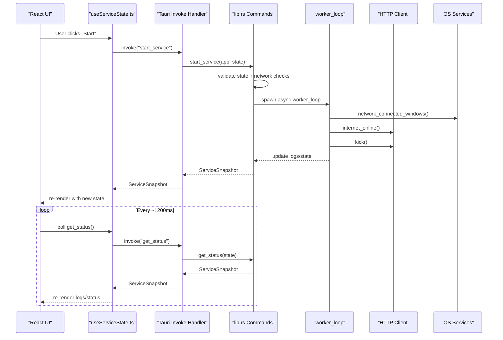

**Diagram sources**
- [src/hooks/useServiceState.ts](file://src/hooks/useServiceState.ts#L88-L107)
- [src-tauri/src/lib.rs](file://src-tauri/src/lib.rs#L599-L656)
- [src-tauri/src/lib.rs](file://src-tauri/src/lib.rs#L415-L473)

## Detailed Component Analysis

### Frontend Data Flow: Polling and Command Invocation
- The hook initializes a polling loop that invokes a backend command to fetch the current service snapshot.
- Explicit actions (start, stop, kick, set interval) are invoked synchronously and update the UI immediately upon receiving a snapshot.
- The hook transforms backend snapshots into frontend-friendly types, including log entries and timestamps.

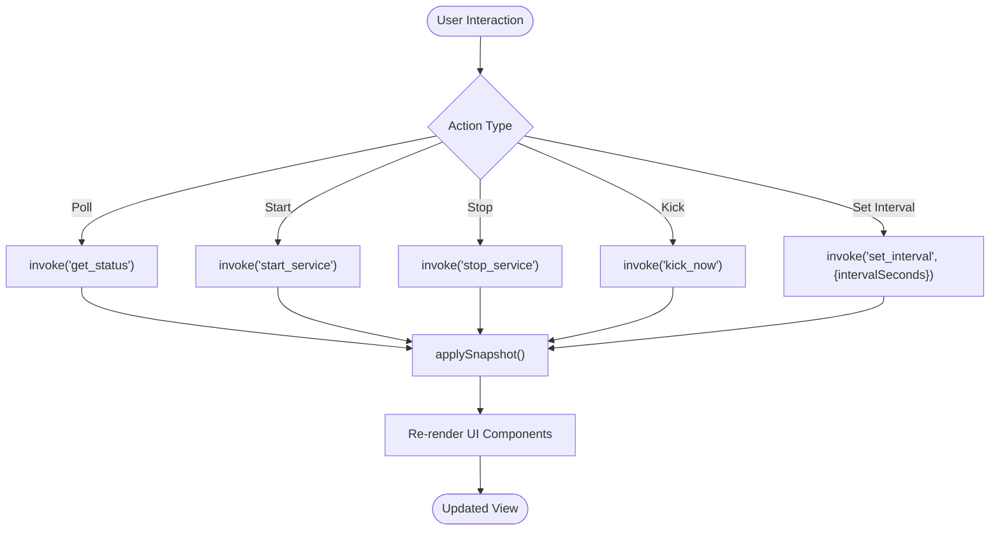

**Diagram sources**
- [src/hooks/useServiceState.ts](file://src/hooks/useServiceState.ts#L88-L144)

**Section sources**
- [src/hooks/useServiceState.ts](file://src/hooks/useServiceState.ts#L1-L163)
- [src/pages/Index.tsx](file://src/pages/Index.tsx#L1-L55)
- [src/components/PrimaryControls.tsx](file://src/components/PrimaryControls.tsx#L1-L73)
- [src/components/StatusCard.tsx](file://src/components/StatusCard.tsx#L1-L63)
- [src/components/LogPanel.tsx](file://src/components/LogPanel.tsx#L1-L52)
- [src/components/AdvancedSettings.tsx](file://src/components/AdvancedSettings.tsx#L1-L73)
- [src/components/PopoverHeader.tsx](file://src/components/PopoverHeader.tsx#L1-L32)

### Backend Data Flow: Commands, State Machine, and Worker Loop
- The backend exposes commands for status retrieval and service control.
- A shared state container holds the current state, logs, and worker handle.
- A finite state machine governs transitions between STOPPED, STARTING, RUNNING, STOPPING, and ERROR.
- The worker loop performs periodic checks and HTTP operations, updating state and logs accordingly.

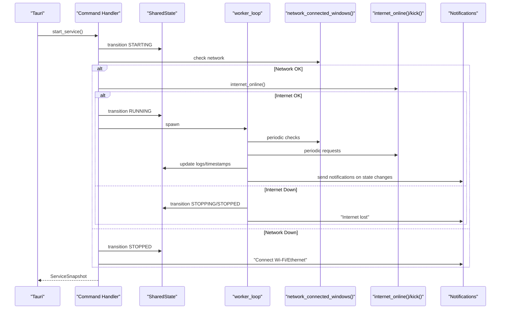

**Diagram sources**
- [src-tauri/src/lib.rs](file://src-tauri/src/lib.rs#L475-L564)
- [src-tauri/src/lib.rs](file://src-tauri/src/lib.rs#L566-L597)
- [src-tauri/src/lib.rs](file://src-tauri/src/lib.rs#L619-L642)
- [src-tauri/src/lib.rs](file://src-tauri/src/lib.rs#L415-L473)

**Section sources**
- [src-tauri/src/lib.rs](file://src-tauri/src/lib.rs#L1-L686)

### Request-Response Cycle for Service Operations
- Explicit operations (start, stop, kick, set interval) are synchronous invocations that return a ServiceSnapshot reflecting the latest state.
- The frontend applies the snapshot immediately, ensuring UI consistency.

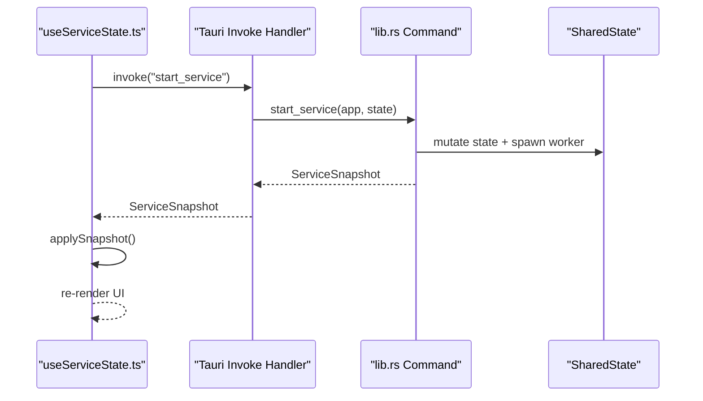

**Diagram sources**
- [src/hooks/useServiceState.ts](file://src/hooks/useServiceState.ts#L109-L116)
- [src-tauri/src/lib.rs](file://src-tauri/src/lib.rs#L604-L610)

**Section sources**
- [src/hooks/useServiceState.ts](file://src/hooks/useServiceState.ts#L109-L116)
- [src-tauri/src/lib.rs](file://src-tauri/src/lib.rs#L604-L610)

### Polling Mechanism for Real-Time Status Updates
- The frontend polls the backend every ~1200 ms to keep the UI up-to-date.
- On successful poll, the backend returns a snapshot containing current state, statuses, logs, and timestamps.
- On failure, the frontend marks backend connectivity as unavailable without crashing.

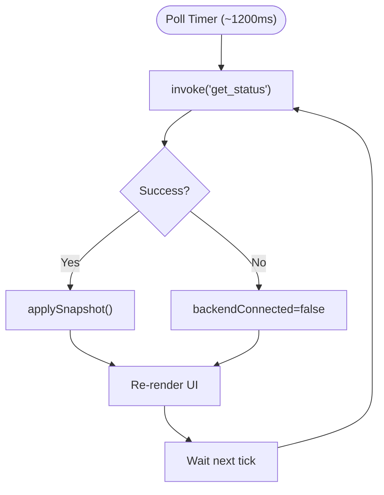

**Diagram sources**
- [src/hooks/useServiceState.ts](file://src/hooks/useServiceState.ts#L88-L107)

**Section sources**
- [src/hooks/useServiceState.ts](file://src/hooks/useServiceState.ts#L42-L107)

### Event-Driven Architecture for System Notifications
- Notifications are triggered by state changes and errors, surfaced to the user via the OS notification system.
- The backend sends notifications when network conditions change or when unexpected failures occur.

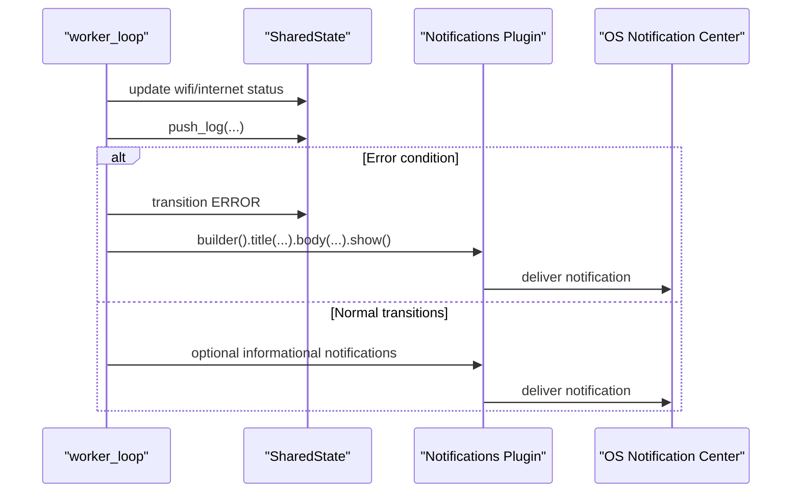

**Diagram sources**
- [src-tauri/src/lib.rs](file://src-tauri/src/lib.rs#L184-L205)
- [src-tauri/src/lib.rs](file://src-tauri/src/lib.rs#L373-L413)

**Section sources**
- [src-tauri/src/lib.rs](file://src-tauri/src/lib.rs#L184-L205)
- [src-tauri/src/lib.rs](file://src-tauri/src/lib.rs#L373-L413)

### Logging System Architecture
- Backend maintains a bounded deque of log events with auto-truncation to a maximum size.
- Each log entry includes an ID, timestamp, and message.
- The frontend displays logs with formatted timestamps and supports copying to clipboard.

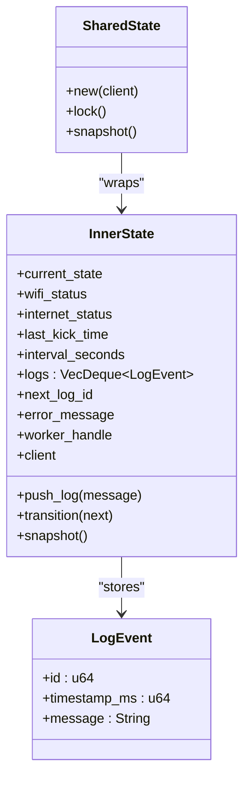

**Diagram sources**
- [src-tauri/src/lib.rs](file://src-tauri/src/lib.rs#L73-L141)
- [src-tauri/src/lib.rs](file://src-tauri/src/lib.rs#L53-L71)

**Section sources**
- [src-tauri/src/lib.rs](file://src-tauri/src/lib.rs#L116-L127)
- [src-tauri/src/lib.rs](file://src-tauri/src/lib.rs#L104-L114)
- [src/components/LogPanel.tsx](file://src/components/LogPanel.tsx#L1-L52)

### Error Propagation and Consistency Guarantees
- Errors are captured and transformed into user-visible messages; the backend transitions to ERROR and then STOPPED, clearing worker handles.
- The frontend surfaces errors via inline alerts and marks backend connectivity when invocations fail.
- State consistency is ensured by:
  - Atomic snapshot reads for polling
  - Controlled state transitions via the state machine
  - Bounded logs to prevent memory growth
  - Immediate UI updates after command completion

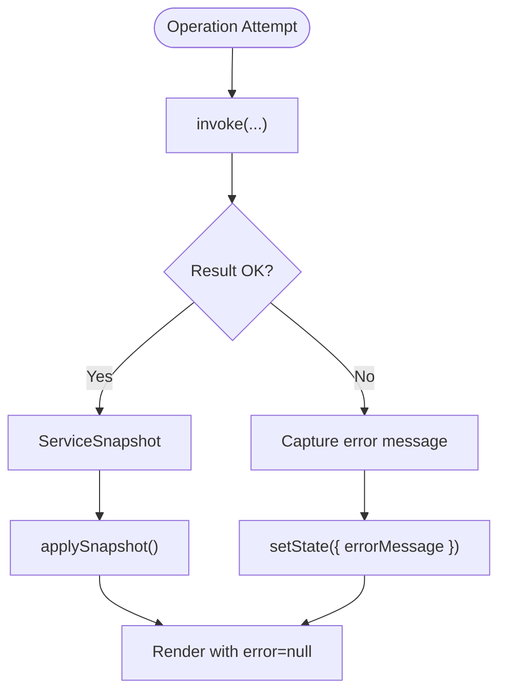

**Diagram sources**
- [src/hooks/useServiceState.ts](file://src/hooks/useServiceState.ts#L113-L115)
- [src/hooks/useServiceState.ts](file://src/hooks/useServiceState.ts#L122-L124)
- [src/hooks/useServiceState.ts](file://src/hooks/useServiceState.ts#L129-L133)
- [src/hooks/useServiceState.ts](file://src/hooks/useServiceState.ts#L138-L143)

**Section sources**
- [src-tauri/src/lib.rs](file://src-tauri/src/lib.rs#L193-L205)
- [src/hooks/useServiceState.ts](file://src/hooks/useServiceState.ts#L113-L115)
- [src/hooks/useServiceState.ts](file://src/hooks/useServiceState.ts#L122-L124)
- [src/hooks/useServiceState.ts](file://src/hooks/useServiceState.ts#L129-L133)
- [src/hooks/useServiceState.ts](file://src/hooks/useServiceState.ts#L138-L143)

### Data Validation and Transformation
- Frontend validates and normalizes backend snapshots:
  - Converts backend enum variants to frontend types
  - Translates millisecond timestamps to Date objects
  - Maps log entries to frontend shape
- Backend enforces minimum intervals and sanitizes inputs for set_interval.

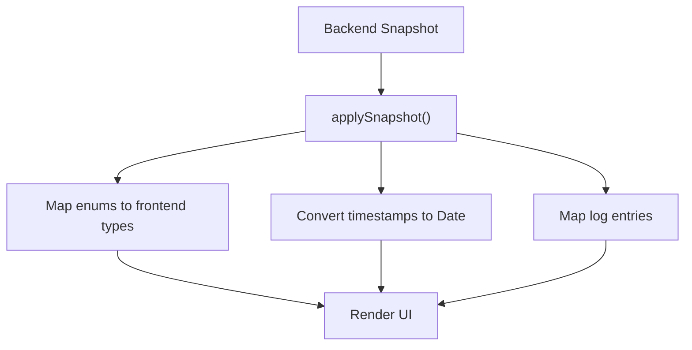

**Diagram sources**
- [src/hooks/useServiceState.ts](file://src/hooks/useServiceState.ts#L70-L86)
- [src-tauri/src/lib.rs](file://src-tauri/src/lib.rs#L644-L651)

**Section sources**
- [src/hooks/useServiceState.ts](file://src/hooks/useServiceState.ts#L55-L86)
- [src-tauri/src/lib.rs](file://src-tauri/src/lib.rs#L644-L651)

## Dependency Analysis
- Frontend depends on Tauri core APIs for command invocation and plugins for notifications.
- Backend depends on Tauri runtime, reqwest for HTTP, tokio for async, and platform-specific utilities for network checks.
- The UI components depend on the hook for state and commands.

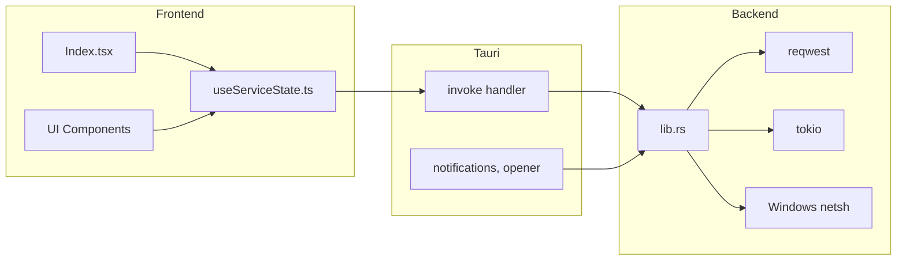

**Diagram sources**
- [package.json](file://package.json#L48-L69)
- [src-tauri/Cargo.toml](file://src-tauri/Cargo.toml#L20-L28)
- [src-tauri/src/lib.rs](file://src-tauri/src/lib.rs#L658-L685)

**Section sources**
- [package.json](file://package.json#L18-L70)
- [src-tauri/Cargo.toml](file://src-tauri/Cargo.toml#L20-L28)
- [src-tauri/src/lib.rs](file://src-tauri/src/lib.rs#L658-L685)

## Performance Considerations
- Polling interval: ~1200 ms strikes a balance between responsiveness and resource usage.
- HTTP timeouts: connect and request timeouts are configured to avoid blocking the UI.
- Worker loop sleeps for the configured interval, minimizing CPU usage during idle periods.
- Log buffer size is bounded to prevent unbounded memory growth.
- OS network checks are performed efficiently using a single command on Windows.

[No sources needed since this section provides general guidance]

## Troubleshooting Guide
Common scenarios and remedies:
- Backend unavailable: The UI shows a connectivity notice; ensure the app runs under Tauri desktop runtime.
- Start blocked due to network: The backend checks for an active adapter and internet availability before transitioning to RUNNING.
- Automatic stop on network loss: The worker loop monitors connectivity and internet status, stopping the service and notifying the user.
- Manual kick failures: The backend records an error and transitions to ERROR then STOPPED, notifying the user.
- Logs not updating: Verify the polling interval and that the backend is reachable.

**Section sources**
- [src/pages/Index.tsx](file://src/pages/Index.tsx#L39-L43)
- [src-tauri/src/lib.rs](file://src-tauri/src/lib.rs#L475-L564)
- [src-tauri/src/lib.rs](file://src-tauri/src/lib.rs#L415-L473)
- [src-tauri/src/lib.rs](file://src-tauri/src/lib.rs#L619-L642)

## Conclusion
Hutch-Pulse implements a clear, layered data flow: the frontend drives user interactions and polls for updates, while the backend orchestrates service operations, enforces state transitions, and integrates with OS services. The combination of synchronous commands and periodic polling ensures timely UI updates, while notifications provide immediate feedback. Robust logging and error handling maintain transparency and reliability across layers.

[No sources needed since this section summarizes without analyzing specific files]

## Appendices

### Appendix A: Command Surface
- get_status: returns ServiceSnapshot
- start_service: returns ServiceSnapshot
- stop_service: returns ServiceSnapshot
- kick_now: returns ServiceSnapshot
- set_interval: returns ServiceSnapshot
- quit_app: terminates the app

**Section sources**
- [src-tauri/src/lib.rs](file://src-tauri/src/lib.rs#L599-L656)

### Appendix B: State Machine Diagram
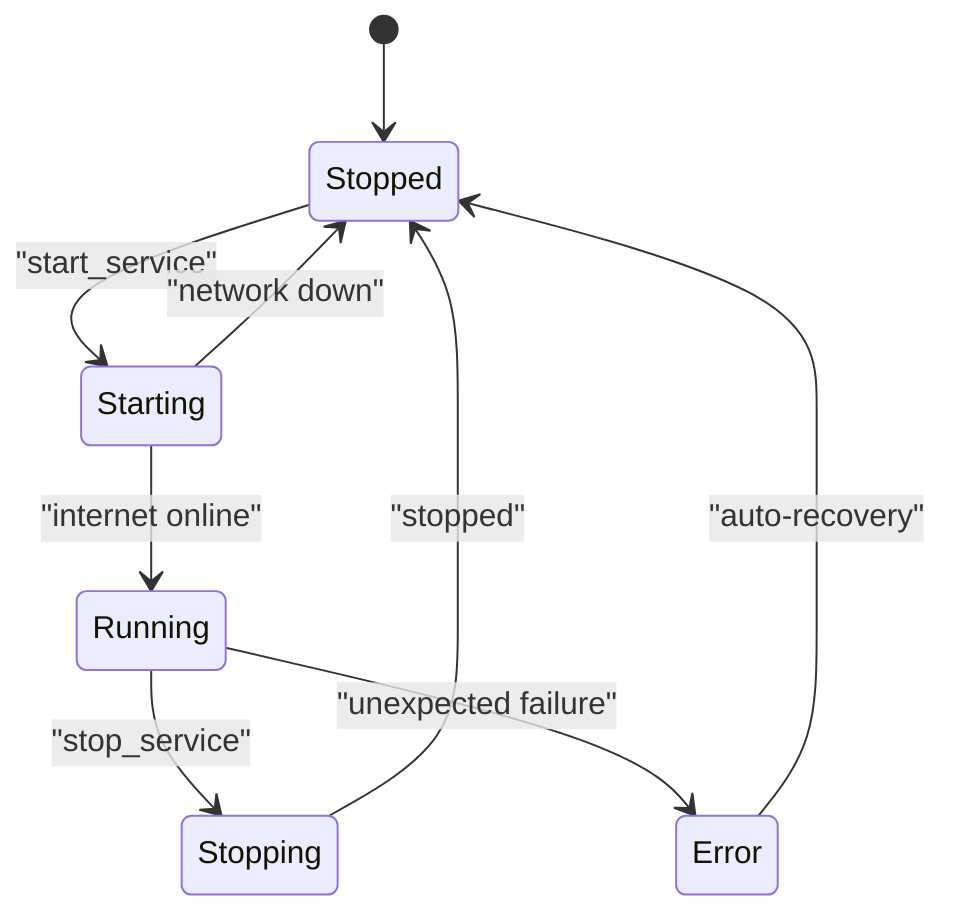

**Diagram sources**
- [src-tauri/src/lib.rs](file://src-tauri/src/lib.rs#L160-L171)