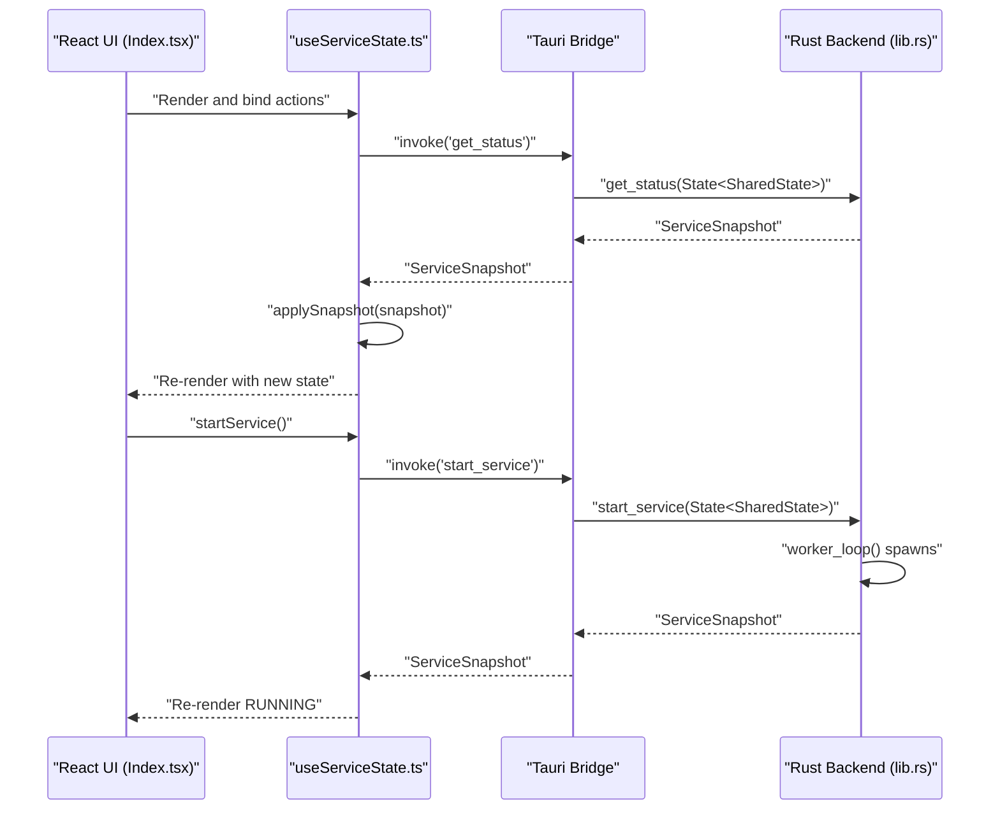
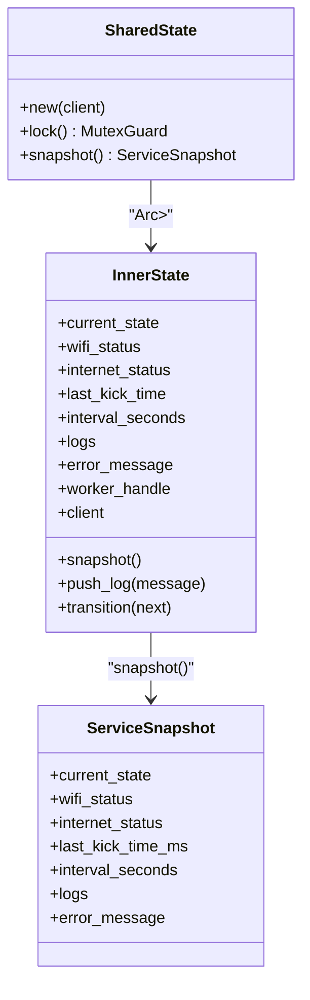
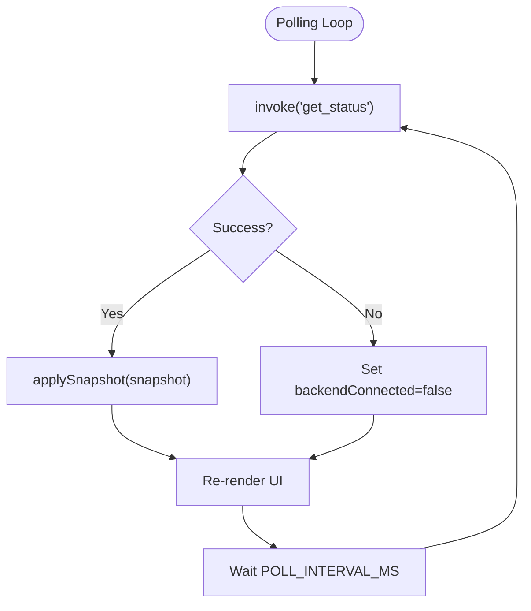
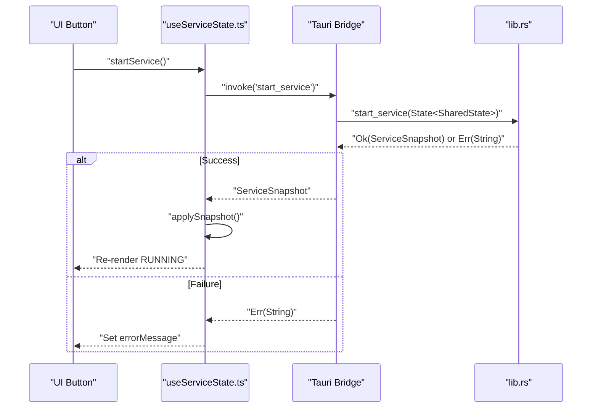
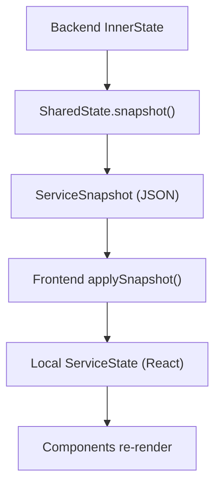
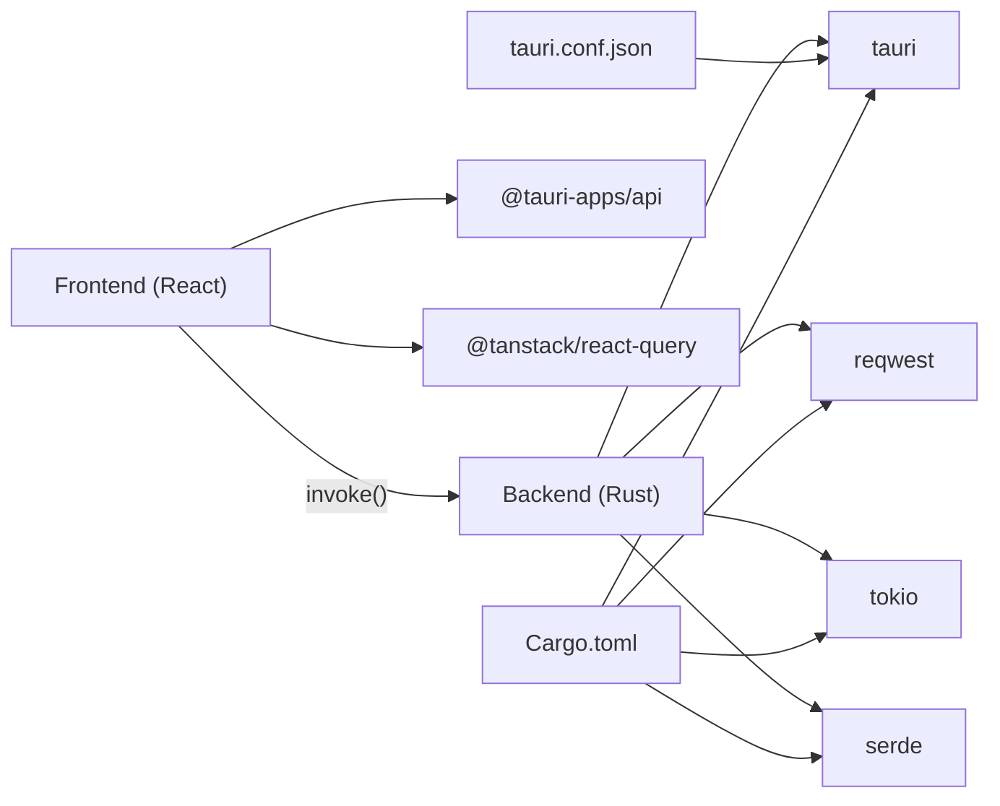

# Frontend-Backend Communication

<cite>
**Referenced Files in This Document**
- [src-tauri/src/main.rs](file://src-tauri/src/main.rs)
- [src-tauri/src/lib.rs](file://src-tauri/src/lib.rs)
- [src-tauri/Cargo.toml](file://src-tauri/Cargo.toml)
- [src-tauri/tauri.conf.json](file://src-tauri/tauri.conf.json)
- [src/App.tsx](file://src/App.tsx)
- [src/main.tsx](file://src/main.tsx)
- [src/hooks/useServiceState.ts](file://src/hooks/useServiceState.ts)
- [src/pages/Index.tsx](file://src/pages/Index.tsx)
- [src/components/PrimaryControls.tsx](file://src/components/PrimaryControls.tsx)
- [src/components/AdvancedSettings.tsx](file://src/components/AdvancedSettings.tsx)
- [src/components/StatusCard.tsx](file://src/components/StatusCard.tsx)
- [src/components/LogPanel.tsx](file://src/components/LogPanel.tsx)
- [package.json](file://package.json)
- [vite.config.ts](file://vite.config.ts)
</cite>

## Table of Contents
1. [Introduction](#introduction)
2. [Project Structure](#project-structure)
3. [Core Components](#core-components)
4. [Architecture Overview](#architecture-overview)
5. [Detailed Component Analysis](#detailed-component-analysis)
6. [Dependency Analysis](#dependency-analysis)
7. [Performance Considerations](#performance-considerations)
8. [Troubleshooting Guide](#troubleshooting-guide)
9. [Conclusion](#conclusion)

## Introduction
This document explains the frontend-backend communication mechanism in Hutch-Pulse, focusing on the Tauri bridge, command handler patterns, and state synchronization between the React frontend and the Rust backend. It covers the polling-based real-time update model, the command-based API design, error handling across the bridge, and the SharedState pattern for thread-safe state management. It also addresses performance considerations, memory management, and the observer-like behavior achieved via periodic polling and state snapshots.

## Project Structure
Hutch-Pulse is a Tauri v2 desktop application with a React frontend and a Rust backend. The frontend is built with Vite and React, and communicates with the backend through Tauri’s invoke-based command system. The backend exposes typed commands and manages a shared state object protected by a mutex, enabling safe concurrent access from asynchronous tasks.

```mermaid
graph TB
subgraph "Frontend (React)"
A_App["App.tsx"]
A_Index["Index.tsx"]
A_Hook["useServiceState.ts"]
A_Components["UI Components<br/>PrimaryControls, AdvancedSettings, StatusCard, LogPanel"]
end
subgraph "Tauri Runtime"
B_Conf["tauri.conf.json"]
B_Main["src/main.rs"]
B_Lib["src/lib.rs"]
B_Cargo["Cargo.toml"]
end
A_App --> A_Index
A_Index --> A_Hook
A_Hook --> A_Components
A_Hook <- --> B_Lib
B_Main --> B_Lib
B_Conf --> B_Main
B_Cargo --> B_Lib
```

**Diagram sources**
- [src-tauri/src/main.rs](file://src-tauri/src/main.rs#L1-L7)
- [src-tauri/src/lib.rs](file://src-tauri/src/lib.rs#L658-L686)
- [src-tauri/tauri.conf.json](file://src-tauri/tauri.conf.json#L1-L42)
- [src-tauri/Cargo.toml](file://src-tauri/Cargo.toml#L1-L29)
- [src/App.tsx](file://src/App.tsx#L1-L28)
- [src/pages/Index.tsx](file://src/pages/Index.tsx#L1-L55)
- [src/hooks/useServiceState.ts](file://src/hooks/useServiceState.ts#L1-L163)

**Section sources**
- [src-tauri/src/main.rs](file://src-tauri/src/main.rs#L1-L7)
- [src-tauri/src/lib.rs](file://src-tauri/src/lib.rs#L658-L686)
- [src-tauri/tauri.conf.json](file://src-tauri/tauri.conf.json#L1-L42)
- [src-tauri/Cargo.toml](file://src-tauri/Cargo.toml#L1-L29)
- [src/App.tsx](file://src/App.tsx#L1-L28)
- [src/main.tsx](file://src/main.tsx#L1-L10)
- [src/pages/Index.tsx](file://src/pages/Index.tsx#L1-L55)
- [src/hooks/useServiceState.ts](file://src/hooks/useServiceState.ts#L1-L163)

## Core Components
- Tauri backend commands: expose typed APIs to the frontend (status retrieval, service lifecycle, manual kick, interval setting, quit).
- SharedState: a thread-safe container wrapping InnerState with Arc<Mutex<>> for concurrent access.
- Async worker: a long-running loop that periodically checks connectivity, internet availability, and performs kicks.
- Frontend hook: useServiceState orchestrates polling, invokes commands, and maps backend snapshots to frontend state.

Key responsibilities:
- Backend: manage state transitions, enforce constraints, and expose commands.
- Frontend: poll status, dispatch actions, and render UI reflecting the latest snapshot.

**Section sources**
- [src-tauri/src/lib.rs](file://src-tauri/src/lib.rs#L73-L158)
- [src-tauri/src/lib.rs](file://src-tauri/src/lib.rs#L599-L656)
- [src-tauri/src/lib.rs](file://src-tauri/src/lib.rs#L415-L473)
- [src/hooks/useServiceState.ts](file://src/hooks/useServiceState.ts#L67-L107)
- [src/hooks/useServiceState.ts](file://src/hooks/useServiceState.ts#L109-L152)

## Architecture Overview
The frontend polls the backend at a fixed interval to fetch a ServiceSnapshot. Commands are invoked via @tauri-apps/api to request state changes or immediate actions. The backend runs an async worker loop guarded by SharedState, ensuring thread-safe updates and notifications.



**Diagram sources**
- [src/pages/Index.tsx](file://src/pages/Index.tsx#L9-L52)
- [src/hooks/useServiceState.ts](file://src/hooks/useServiceState.ts#L88-L107)
- [src/hooks/useServiceState.ts](file://src/hooks/useServiceState.ts#L109-L125)
- [src-tauri/src/lib.rs](file://src-tauri/src/lib.rs#L599-L618)
- [src-tauri/src/lib.rs](file://src-tauri/src/lib.rs#L415-L473)

## Detailed Component Analysis

### Tauri Bridge and Command Handlers
- Commands exposed:
  - get_status: returns a ServiceSnapshot snapshot of current state.
  - start_service: initializes and starts the async worker loop.
  - stop_service: cancels the worker and transitions to stopped.
  - kick_now: performs an immediate kick request.
  - set_interval: adjusts the polling interval with a minimum bound.
  - quit_app: exits the application.

- Command signatures and behavior:
  - get_status: synchronous snapshot retrieval.
  - start_service/stop_service/kick_now/set_interval: async commands returning a snapshot after applying changes.
  - quit_app: fire-and-forget exit.

- Invocation pattern:
  - Frontend uses invoke with command names and optional payload.
  - Backend receives State<SharedState> to access the shared mutable state.

**Section sources**
- [src-tauri/src/lib.rs](file://src-tauri/src/lib.rs#L599-L656)
- [src/hooks/useServiceState.ts](file://src/hooks/useServiceState.ts#L109-L152)

### SharedState Pattern and Thread-Safe Communication
- SharedState wraps InnerState behind Arc<Mutex<InnerState>> for thread-safe access across async tasks and command handlers.
- Snapshot method copies current state into a serializable structure for the frontend.
- Locking strategy:
  - Short-lived locks around state reads/writes.
  - Avoid holding locks during blocking I/O or long-running operations.

- Worker loop:
  - Spawns a JoinHandle inside SharedState.
  - Periodically checks network/internet and performs kick requests.
  - Updates logs and transitions state safely under lock.



**Diagram sources**
- [src-tauri/src/lib.rs](file://src-tauri/src/lib.rs#L73-L158)
- [src-tauri/src/lib.rs](file://src-tauri/src/lib.rs#L63-L71)

**Section sources**
- [src-tauri/src/lib.rs](file://src-tauri/src/lib.rs#L73-L158)
- [src-tauri/src/lib.rs](file://src-tauri/src/lib.rs#L415-L473)

### Polling Mechanism for Real-Time Updates
- The frontend uses a polling loop to call get_status every fixed interval.
- The hook maintains a local ServiceState derived from the backend snapshot.
- UI components re-render reactively when state updates.



**Diagram sources**
- [src/hooks/useServiceState.ts](file://src/hooks/useServiceState.ts#L88-L107)

**Section sources**
- [src/hooks/useServiceState.ts](file://src/hooks/useServiceState.ts#L42-L107)
- [src/pages/Index.tsx](file://src/pages/Index.tsx#L39-L43)

### Command-Based API Design
- Commands are declared with #[tauri::command] and registered in the invoke handler.
- Payloads are passed as arguments; return values are serialized snapshots or unit results.
- Error propagation:
  - Async commands return Result<ServiceSnapshot, String>.
  - Frontend catches errors and surfaces messages via the errorMessage field.



**Diagram sources**
- [src/hooks/useServiceState.ts](file://src/hooks/useServiceState.ts#L109-L125)
- [src-tauri/src/lib.rs](file://src-tauri/src/lib.rs#L604-L618)

**Section sources**
- [src-tauri/src/lib.rs](file://src-tauri/src/lib.rs#L675-L682)
- [src/hooks/useServiceState.ts](file://src/hooks/useServiceState.ts#L109-L144)

### State Synchronization Between React and Rust
- Backend state is serialized into ServiceSnapshot for transport.
- Frontend maps backend fields to its own types and converts timestamps to Date objects.
- The hook normalizes intervals into discrete KickInterval options for UI binding.



**Diagram sources**
- [src-tauri/src/lib.rs](file://src-tauri/src/lib.rs#L104-L114)
- [src/hooks/useServiceState.ts](file://src/hooks/useServiceState.ts#L70-L86)

**Section sources**
- [src-tauri/src/lib.rs](file://src-tauri/src/lib.rs#L63-L71)
- [src/hooks/useServiceState.ts](file://src/hooks/useServiceState.ts#L21-L40)
- [src/hooks/useServiceState.ts](file://src/hooks/useServiceState.ts#L55-L60)

### Observer Pattern Implementation
- The frontend does not subscribe to backend events; instead, it observes state changes through periodic polling.
- This pull-based model avoids complex pub/sub wiring and simplifies threading.
- The observer-like effect is achieved by updating React state whenever a fresh snapshot arrives.

**Section sources**
- [src/hooks/useServiceState.ts](file://src/hooks/useServiceState.ts#L88-L107)
- [src/pages/Index.tsx](file://src/pages/Index.tsx#L9-L52)

### Error Handling Strategies Across the Bridge
- Backend:
  - set_error_and_stop centralizes error handling and transitions to Error then Stopped.
  - stop_for_connectivity handles network/internet loss by transitioning states and logging.
- Frontend:
  - invoke calls are wrapped in try/catch; errors are mapped to a string and stored in errorMessage.
  - Network failures during polling mark backendConnected as false.

**Section sources**
- [src-tauri/src/lib.rs](file://src-tauri/src/lib.rs#L193-L205)
- [src-tauri/src/lib.rs](file://src-tauri/src/lib.rs#L373-L413)
- [src/hooks/useServiceState.ts](file://src/hooks/useServiceState.ts#L92-L98)
- [src/hooks/useServiceState.ts](file://src/hooks/useServiceState.ts#L113-L115)
- [src/hooks/useServiceState.ts](file://src/hooks/useServiceState.ts#L122-L124)
- [src/hooks/useServiceState.ts](file://src/hooks/useServiceState.ts#L131-L133)
- [src/hooks/useServiceState.ts](file://src/hooks/useServiceState.ts#L141-L143)
- [src/hooks/useServiceState.ts](file://src/hooks/useServiceState.ts#L149-L151)

### Concrete Examples: Frontend Interactions with Backend Commands
- Start service:
  - UI calls startService, which invokes start_service and applies the returned snapshot.
- Stop service:
  - UI calls stopService, which invokes stop_service and applies the returned snapshot.
- Manual kick:
  - UI calls kickNow, which invokes kick_now and applies the returned snapshot.
- Set interval:
  - UI calls setKickInterval with a discrete option, which invokes set_interval and applies the returned snapshot.
- Quit app:
  - UI calls quitApp, which invokes quit_app.

**Section sources**
- [src/pages/Index.tsx](file://src/pages/Index.tsx#L26-L37)
- [src/components/PrimaryControls.tsx](file://src/components/PrimaryControls.tsx#L32-L68)
- [src/components/AdvancedSettings.tsx](file://src/components/AdvancedSettings.tsx#L42-L54)
- [src/hooks/useServiceState.ts](file://src/hooks/useServiceState.ts#L109-L152)

## Dependency Analysis
- Frontend depends on @tauri-apps/api for invoking commands and @tanstack/react-query for caching and background queries.
- Backend depends on Tauri v2, reqwest for HTTP, tokio for async runtime, and serde for serialization.
- Tauri configuration defines the dev/build pipeline and window behavior.



**Diagram sources**
- [package.json](file://package.json#L48-L69)
- [src-tauri/Cargo.toml](file://src-tauri/Cargo.toml#L20-L28)
- [src-tauri/tauri.conf.json](file://src-tauri/tauri.conf.json#L6-L11)

**Section sources**
- [package.json](file://package.json#L1-L96)
- [src-tauri/Cargo.toml](file://src-tauri/Cargo.toml#L1-L29)
- [src-tauri/tauri.conf.json](file://src-tauri/tauri.conf.json#L1-L42)

## Performance Considerations
- Polling interval: The frontend polls every 1200 ms. Adjusting this balances responsiveness vs. CPU/network usage.
- Min interval enforcement: The backend enforces a minimum interval to avoid excessive requests.
- Async runtime: Tokio is used for async tasks; ensure long-running operations do not block the main thread.
- Memory management: Logs are capped to a fixed size to prevent unbounded growth.
- HTTP timeouts: Connection and request timeouts are configured to avoid hanging operations.

Recommendations:
- Keep polling interval tuned to user expectations and system load.
- Consider debouncing rapid UI-triggered commands to reduce redundant backend work.
- Monitor log buffer size and adjust capacity if needed.

**Section sources**
- [src/hooks/useServiceState.ts](file://src/hooks/useServiceState.ts#L42-L42)
- [src-tauri/src/lib.rs](file://src-tauri/src/lib.rs#L17-L21)
- [src-tauri/src/lib.rs](file://src-tauri/src/lib.rs#L94-L94)
- [src-tauri/Cargo.toml](file://src-tauri/Cargo.toml#L26-L26)

## Troubleshooting Guide
Common issues and remedies:
- Backend unavailable:
  - Symptom: backendConnected becomes false.
  - Cause: invoke fails (e.g., running in browser dev server).
  - Fix: run with Tauri desktop runtime.
- Start blocked due to network:
  - Symptom: Start prevented with an error message.
  - Cause: No active network adapter or unknown network state.
  - Fix: connect Wi-Fi/Ethernet and retry.
- Internet offline:
  - Symptom: Start blocked with internet unavailable.
  - Cause: Connectivity check fails.
  - Fix: restore internet connectivity and retry.
- Worker stops unexpectedly:
  - Symptom: Service moves to STOPPED after ERROR.
  - Cause: exceptions in worker loop or failed kick request.
  - Fix: inspect logs and retry; backend will notify on errors.

Operational tips:
- Use the log panel to copy recent events for diagnostics.
- Verify kick URL and connectivity endpoints in advanced settings.

**Section sources**
- [src/pages/Index.tsx](file://src/pages/Index.tsx#L39-L43)
- [src-tauri/src/lib.rs](file://src-tauri/src/lib.rs#L489-L516)
- [src-tauri/src/lib.rs](file://src-tauri/src/lib.rs#L528-L536)
- [src-tauri/src/lib.rs](file://src-tauri/src/lib.rs#L193-L205)
- [src-tauri/src/lib.rs](file://src-tauri/src/lib.rs#L430-L443)
- [src-tauri/src/lib.rs](file://src-tauri/src/lib.rs#L460-L463)
- [src/components/AdvancedSettings.tsx](file://src/components/AdvancedSettings.tsx#L33-L36)
- [src/components/AdvancedSettings.tsx](file://src/components/AdvancedSettings.tsx#L58-L63)
- [src/components/LogPanel.tsx](file://src/components/LogPanel.tsx#L13-L16)

## Conclusion
Hutch-Pulse employs a robust Tauri bridge with a command-driven API and a polling-based observation model to synchronize state between the React frontend and the Rust backend. The SharedState pattern ensures thread-safe access to mutable state, while async runtime enables responsive background operations. Error handling is centralized in the backend and surfaced gracefully in the frontend. The design balances simplicity, safety, and performance, making it suitable for a desktop tray application requiring reliable periodic network operations.