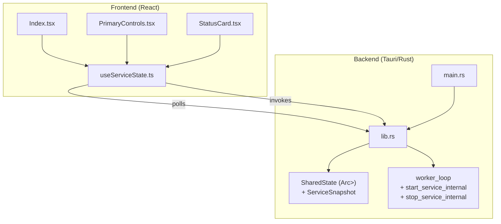
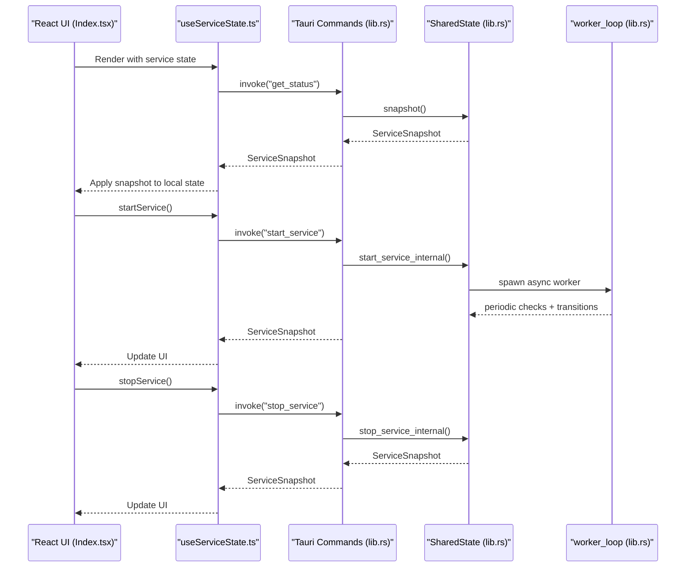
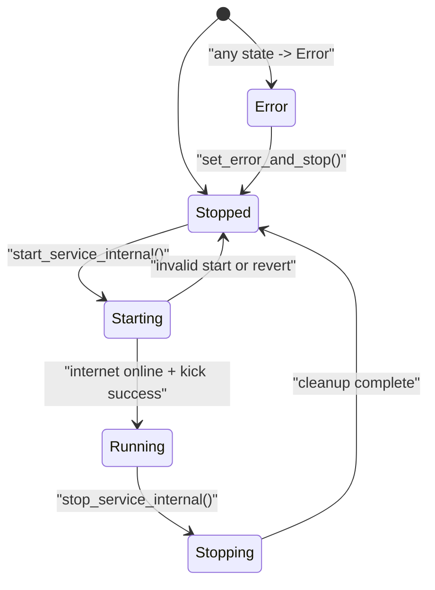
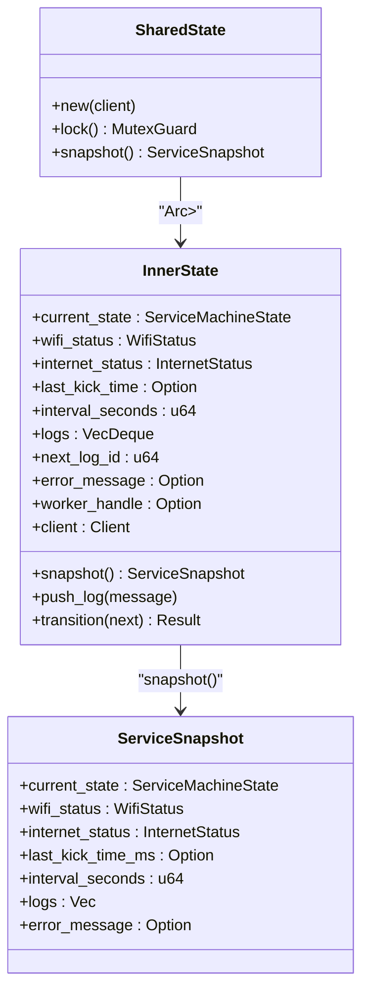
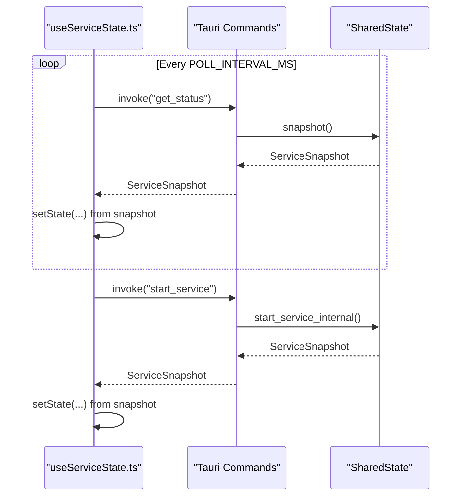
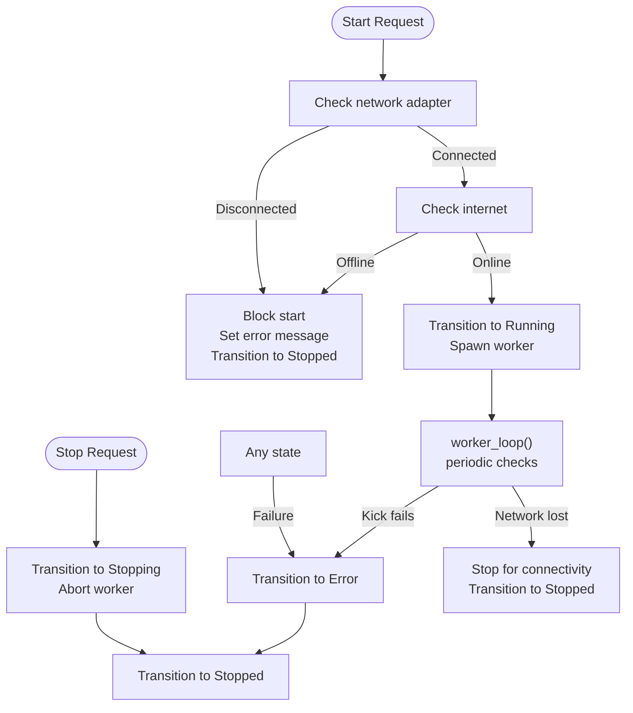
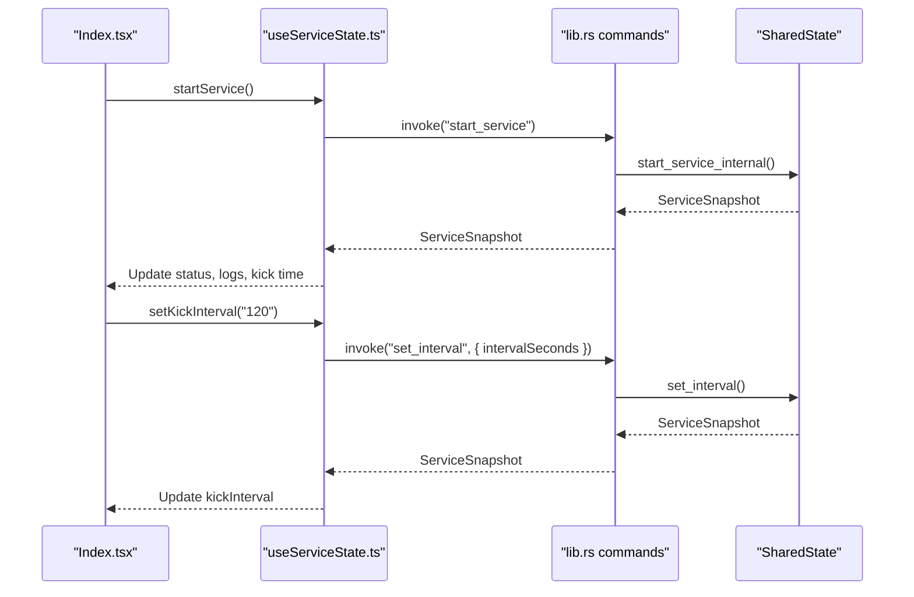
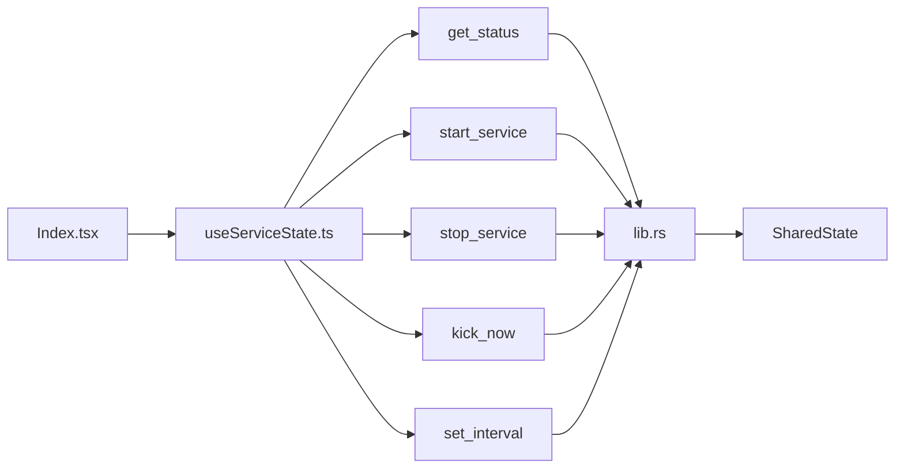

# State Management Patterns

<cite>
**Referenced Files in This Document**
- [useServiceState.ts](file://src/hooks/useServiceState.ts)
- [lib.rs](file://src-tauri/src/lib.rs)
- [main.rs](file://src-tauri/src/main.rs)
- [Index.tsx](file://src/pages/Index.tsx)
- [PrimaryControls.tsx](file://src/components/PrimaryControls.tsx)
- [StatusCard.tsx](file://src/components/StatusCard.tsx)
- [App.tsx](file://src/App.tsx)
</cite>

## Table of Contents
1. [Introduction](#introduction)
2. [Project Structure](#project-structure)
3. [Core Components](#core-components)
4. [Architecture Overview](#architecture-overview)
5. [Detailed Component Analysis](#detailed-component-analysis)
6. [Dependency Analysis](#dependency-analysis)
7. [Performance Considerations](#performance-considerations)
8. [Troubleshooting Guide](#troubleshooting-guide)
9. [Conclusion](#conclusion)

## Introduction
This document explains the state management patterns used in Hutch-Pulse, focusing on:
- The finite state machine (FSM) for service lifecycle management
- The SharedState wrapper pattern with mutex-based thread safety
- The Observer pattern for frontend polling
- The ServiceSnapshot data structure representing complete application state
- Examples of state transitions, error handling, and backend–frontend integration
- Concurrency considerations, memory safety, and reactive programming approaches

## Project Structure
Hutch-Pulse is a Tauri desktop application with a React frontend and a Rust backend. State management spans both layers:
- Frontend: React hook that polls the backend and updates local UI state
- Backend: Rust module implementing the FSM, shared state, and commands

**Diagram sources**
- [Index.tsx](file://src/pages/Index.tsx#L9-L52)
- [useServiceState.ts](file://src/hooks/useServiceState.ts#L67-L162)
- [main.rs](file://src-tauri/src/main.rs#L4-L6)
- [lib.rs](file://src-tauri/src/lib.rs#L659-L685)
- [PrimaryControls.tsx](file://src/components/PrimaryControls.tsx#L12-L72)
- [StatusCard.tsx](file://src/components/StatusCard.tsx#L19-L62)

**Section sources**
- [Index.tsx](file://src/pages/Index.tsx#L9-L52)
- [useServiceState.ts](file://src/hooks/useServiceState.ts#L67-L162)
- [main.rs](file://src-tauri/src/main.rs#L4-L6)
- [lib.rs](file://src-tauri/src/lib.rs#L659-L685)

## Core Components
- ServiceMachineState (Rust enum): Defines the lifecycle states and enforces valid transitions.
- SharedState (wrapper around Arc<Mutex<InnerState>>): Provides thread-safe access to the service state.
- ServiceSnapshot (data structure): Serializes the current state for frontend consumption.
- useServiceState (React hook): Implements the Observer pattern via periodic polling and command invocations.

Key responsibilities:
- FSM transitions: Controlled by explicit rules ensuring safe progression.
- Thread safety: Guarded access to shared state using a mutex; poisoning handled gracefully.
- Frontend updates: Polling loop and command responses update UI reactively.

**Section sources**
- [lib.rs](file://src-tauri/src/lib.rs#L27-L51)
- [lib.rs](file://src-tauri/src/lib.rs#L73-L144)
- [lib.rs](file://src-tauri/src/lib.rs#L143-L158)
- [lib.rs](file://src-tauri/src/lib.rs#L159-L171)
- [useServiceState.ts](file://src/hooks/useServiceState.ts#L4-L40)

## Architecture Overview
The system follows a reactive, observer-driven architecture:
- Backend maintains a single source of truth (SharedState) with an FSM.
- Frontend polls backend snapshots and invokes commands to mutate state.
- UI components re-render based on React state updates.

**Diagram sources**
- [Index.tsx](file://src/pages/Index.tsx#L9-L52)
- [useServiceState.ts](file://src/hooks/useServiceState.ts#L88-L125)
- [lib.rs](file://src-tauri/src/lib.rs#L599-L651)
- [lib.rs](file://src-tauri/src/lib.rs#L475-L564)
- [lib.rs](file://src-tauri/src/lib.rs#L566-L597)
- [lib.rs](file://src-tauri/src/lib.rs#L415-L473)

## Detailed Component Analysis

### Finite State Machine (ServiceLifecycle)
The service lifecycle is modeled as a deterministic FSM with five states:
- Stopped
- Starting
- Running
- Stopping
- Error

Transitions are validated by a dedicated function that permits only legal state changes. Special rules:
- Any state can transition to Error
- Error must transition to Stopped
- Starting can revert to Stopped
- Running can only transition to Stopping

**Diagram sources**
- [lib.rs](file://src-tauri/src/lib.rs#L27-L35)
- [lib.rs](file://src-tauri/src/lib.rs#L159-L171)
- [lib.rs](file://src-tauri/src/lib.rs#L193-L205)

**Section sources**
- [lib.rs](file://src-tauri/src/lib.rs#L27-L35)
- [lib.rs](file://src-tauri/src/lib.rs#L159-L171)

### SharedState Wrapper Pattern and Thread Safety
SharedState wraps an Arc<Mutex<InnerState>> to share mutable state across threads safely:
- Construction initializes InnerState with defaults and logs initial state.
- Locking returns a MutexGuard; on poisoning, the guard is recovered to continue operation.
- Snapshot creation captures a consistent view of state for serialization.

Concurrency and memory safety:
- Arc enables shared ownership across tasks and threads.
- Mutex ensures mutual exclusion; poisoning is handled to avoid panics.
- Immutable snapshots decouple frontend from backend mutation.

**Diagram sources**
- [lib.rs](file://src-tauri/src/lib.rs#L73-L84)
- [lib.rs](file://src-tauri/src/lib.rs#L104-L114)
- [lib.rs](file://src-tauri/src/lib.rs#L143-L158)

**Section sources**
- [lib.rs](file://src-tauri/src/lib.rs#L73-L84)
- [lib.rs](file://src-tauri/src/lib.rs#L143-L158)

### Observer Pattern for Frontend Polling
The frontend uses a React hook to observe backend state:
- Periodic polling via setInterval invokes a Tauri command to fetch a snapshot.
- On successful response, the hook applies the snapshot to local state.
- On invocation errors, backendConnected is toggled to inform the UI.
- Commands (start, stop, kick, set interval) also return snapshots to update UI immediately.

**Diagram sources**
- [useServiceState.ts](file://src/hooks/useServiceState.ts#L88-L107)
- [useServiceState.ts](file://src/hooks/useServiceState.ts#L88-L98)
- [useServiceState.ts](file://src/hooks/useServiceState.ts#L109-L125)
- [lib.rs](file://src-tauri/src/lib.rs#L599-L610)

**Section sources**
- [useServiceState.ts](file://src/hooks/useServiceState.ts#L42-L107)
- [useServiceState.ts](file://src/hooks/useServiceState.ts#L109-L144)

### ServiceSnapshot Data Structure
ServiceSnapshot serializes the complete application state for transport:
- current_state: Current service state (serialized to camelCase for frontend).
- wifi_status, internet_status: Connectivity indicators.
- last_kick_time_ms: Optional timestamp of last successful kick.
- interval_seconds: Kick interval in seconds.
- logs: Recent log entries with ids and timestamps.
- error_message: Optional error message.

Frontend receives BackendSnapshot and maps it to ServiceState, including converting backend timestamps and log entries.

**Section sources**
- [lib.rs](file://src-tauri/src/lib.rs#L61-L71)
- [useServiceState.ts](file://src/hooks/useServiceState.ts#L21-L40)
- [useServiceState.ts](file://src/hooks/useServiceState.ts#L70-L86)

### State Transitions and Error Handling Examples
Common transitions:
- Start flow: Stopped → Starting → Running; revert to Stopped on failure.
- Stop flow: Running → Stopping → Stopped; aborts worker.
- Error handling: Any state → Error → Stopped; logs and notifies.

**Diagram sources**
- [lib.rs](file://src-tauri/src/lib.rs#L475-L564)
- [lib.rs](file://src-tauri/src/lib.rs#L566-L597)
- [lib.rs](file://src-tauri/src/lib.rs#L193-L205)
- [lib.rs](file://src-tauri/src/lib.rs#L415-L473)

**Section sources**
- [lib.rs](file://src-tauri/src/lib.rs#L475-L564)
- [lib.rs](file://src-tauri/src/lib.rs#L566-L597)
- [lib.rs](file://src-tauri/src/lib.rs#L193-L205)
- [lib.rs](file://src-tauri/src/lib.rs#L415-L473)

### Backend–Frontend Integration
- Commands exposed to frontend:
  - get_status: Returns ServiceSnapshot.
  - start_service: Starts service and returns snapshot.
  - stop_service: Stops service and returns snapshot.
  - kick_now: Forces a kick and returns snapshot.
  - set_interval: Updates interval and returns snapshot.
  - quit_app: Exits the application.
- Frontend components consume the hook’s state and actions to render UI and trigger commands.

**Diagram sources**
- [Index.tsx](file://src/pages/Index.tsx#L9-L52)
- [useServiceState.ts](file://src/hooks/useServiceState.ts#L136-L144)
- [lib.rs](file://src-tauri/src/lib.rs#L644-L651)
- [lib.rs](file://src-tauri/src/lib.rs#L604-L610)

**Section sources**
- [lib.rs](file://src-tauri/src/lib.rs#L599-L656)
- [useServiceState.ts](file://src/hooks/useServiceState.ts#L136-L144)
- [Index.tsx](file://src/pages/Index.tsx#L9-L52)

## Dependency Analysis
- Frontend depends on Tauri commands for state queries and mutations.
- Backend exposes commands and manages SharedState.
- UI components depend on the hook’s state and action callbacks.

**Diagram sources**
- [Index.tsx](file://src/pages/Index.tsx#L9-L52)
- [useServiceState.ts](file://src/hooks/useServiceState.ts#L88-L144)
- [lib.rs](file://src-tauri/src/lib.rs#L599-L656)

**Section sources**
- [useServiceState.ts](file://src/hooks/useServiceState.ts#L88-L144)
- [lib.rs](file://src-tauri/src/lib.rs#L599-L656)

## Performance Considerations
- Polling interval: The frontend polls every fixed interval; tune to balance responsiveness and CPU/network usage.
- Logging buffer: Backend limits logs to a fixed capacity to bound memory growth.
- Worker sleep: The worker sleeps for the configured interval between kicks.
- Mutex contention: Access to SharedState is brief per operation; keep critical sections small.
- Error short-circuit: On failures, transitions to Error and Stopped prevent wasted work.

[No sources needed since this section provides general guidance]

## Troubleshooting Guide
Common scenarios and handling:
- Backend unavailability: The frontend sets backendConnected to false when invocation fails.
- Network or internet loss during Running: The worker detects disconnections and transitions to Stopped, logging and notifying.
- Start blocked: If network or internet is unavailable, the backend blocks start and transitions to Stopped with an error message.
- Manual kick failure: The backend transitions to Error and Stopped, logging and notifying.

Actions:
- Verify Tauri runtime is used for desktop features.
- Check network adapter and internet connectivity.
- Review logs in the UI panel for detailed messages.

**Section sources**
- [useServiceState.ts](file://src/hooks/useServiceState.ts#L88-L98)
- [lib.rs](file://src-tauri/src/lib.rs#L373-L413)
- [lib.rs](file://src-tauri/src/lib.rs#L489-L536)
- [lib.rs](file://src-tauri/src/lib.rs#L619-L642)

## Conclusion
Hutch-Pulse employs a clean separation of concerns:
- A robust FSM governs service lifecycle with explicit transitions.
- SharedState ensures thread-safe access to mutable state with resilient error handling.
- The frontend observes backend state via polling and commands, enabling reactive UI updates.
- The design balances simplicity, safety, and responsiveness across the desktop runtime.