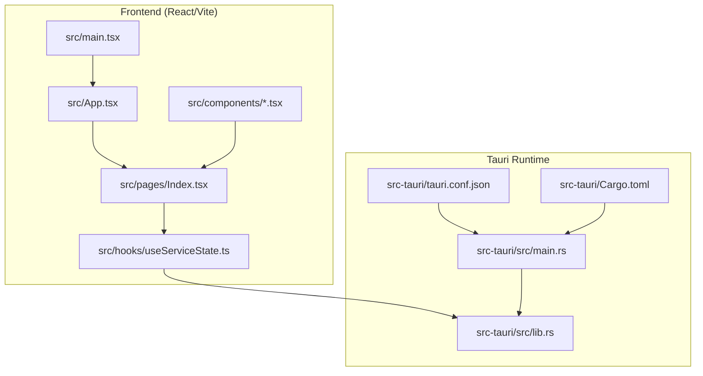
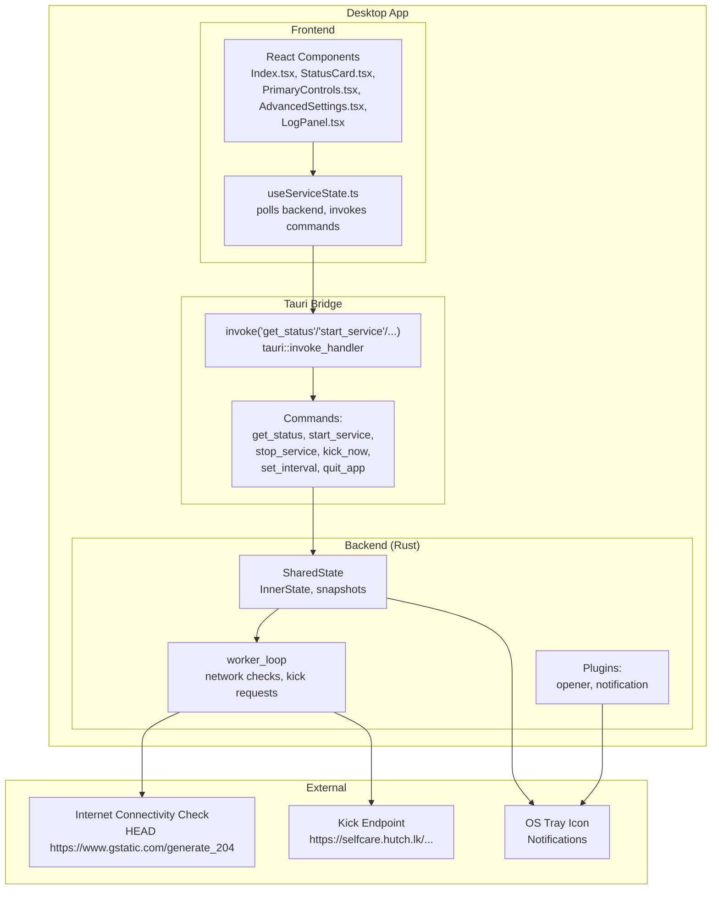
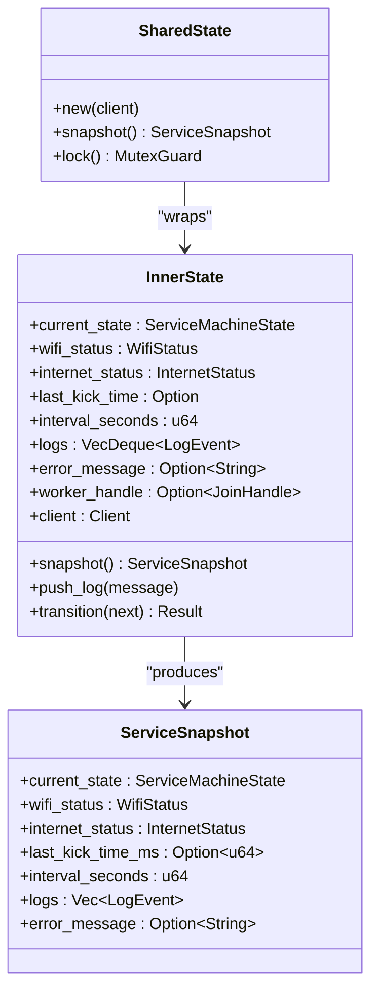
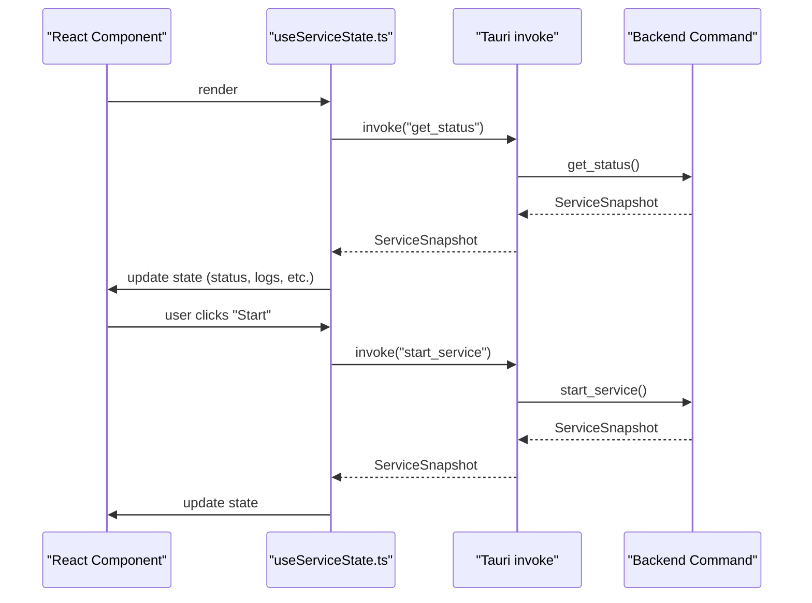
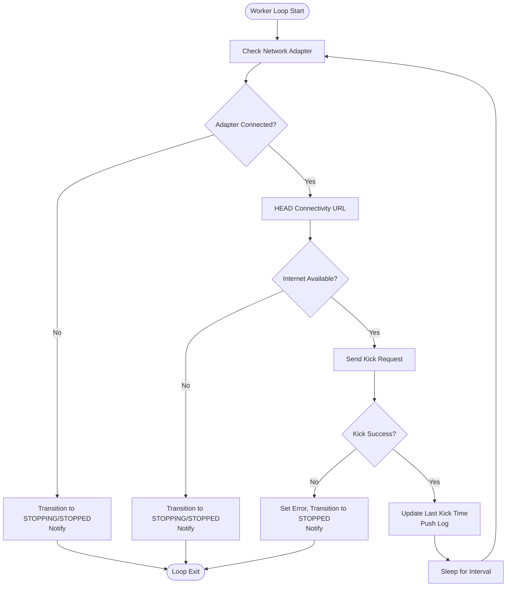
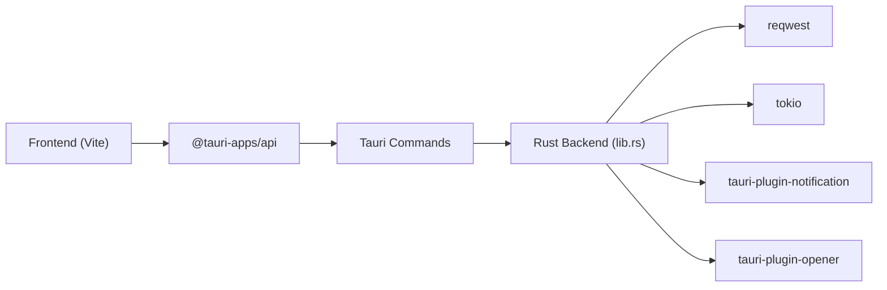

# System Architecture

<cite>
**Referenced Files in This Document**
- [tauri.conf.json](file://src-tauri/tauri.conf.json)
- [Cargo.toml](file://src-tauri/Cargo.toml)
- [lib.rs](file://src-tauri/src/lib.rs)
- [main.rs](file://src-tauri/src/main.rs)
- [package.json](file://package.json)
- [vite.config.ts](file://vite.config.ts)
- [main.tsx](file://src/main.tsx)
- [App.tsx](file://src/App.tsx)
- [Index.tsx](file://src/pages/Index.tsx)
- [useServiceState.ts](file://src/hooks/useServiceState.ts)
- [StatusCard.tsx](file://src/components/StatusCard.tsx)
- [PrimaryControls.tsx](file://src/components/PrimaryControls.tsx)
- [AdvancedSettings.tsx](file://src/components/AdvancedSettings.tsx)
- [LogPanel.tsx](file://src/components/LogPanel.tsx)
</cite>

## Table of Contents
1. [Introduction](#introduction)
2. [Project Structure](#project-structure)
3. [Core Components](#core-components)
4. [Architecture Overview](#architecture-overview)
5. [Detailed Component Analysis](#detailed-component-analysis)
6. [Dependency Analysis](#dependency-analysis)
7. [Performance Considerations](#performance-considerations)
8. [Troubleshooting Guide](#troubleshooting-guide)
9. [Conclusion](#conclusion)

## Introduction
This document describes the system architecture of the Hutch-Pulse hybrid desktop application. The system combines a React-based web frontend with a Rust backend orchestrated via Tauri. The frontend renders the user interface and manages UI state, while the backend handles service orchestration, network checks, and OS integrations (tray icon, notifications). Tauri bridges the two layers, enabling secure, efficient communication and native OS capabilities without the overhead of a full browser engine.

## Project Structure
The repository is organized into:
- Frontend (React + Vite): located under src/, with pages, components, hooks, and styles.
- Backend (Rust + Tauri): located under src-tauri/, including Tauri configuration, Rust libraries, and platform-specific logic.
- Build and packaging: configured via Vite for the frontend and Tauri for bundling the desktop app.

**Diagram sources**
- [main.tsx](file://src/main.tsx#L1-L10)
- [App.tsx](file://src/App.tsx#L1-L28)
- [Index.tsx](file://src/pages/Index.tsx#L1-L55)
- [useServiceState.ts](file://src/hooks/useServiceState.ts#L1-L163)
- [lib.rs](file://src-tauri/src/lib.rs#L658-L686)
- [main.rs](file://src-tauri/src/main.rs#L1-L7)
- [tauri.conf.json](file://src-tauri/tauri.conf.json#L1-L42)
- [Cargo.toml](file://src-tauri/Cargo.toml#L1-L29)

**Section sources**
- [main.tsx](file://src/main.tsx#L1-L10)
- [App.tsx](file://src/App.tsx#L1-L28)
- [Index.tsx](file://src/pages/Index.tsx#L1-L55)
- [useServiceState.ts](file://src/hooks/useServiceState.ts#L1-L163)
- [lib.rs](file://src-tauri/src/lib.rs#L658-L686)
- [main.rs](file://src-tauri/src/main.rs#L1-L7)
- [tauri.conf.json](file://src-tauri/tauri.conf.json#L1-L42)
- [Cargo.toml](file://src-tauri/Cargo.toml#L1-L29)

## Core Components
- Tauri Application Runtime
  - Initializes the backend service state, registers commands, sets up the tray icon and main window, and runs the Tauri application.
  - Exposes commands for frontend invocation: get_status, start_service, stop_service, kick_now, set_interval, quit_app.
- Shared State Management
  - Encapsulates service machine state, network statuses, logs, and worker handle behind a thread-safe wrapper for safe access from async tasks and UI.
- Network and Connectivity Services
  - Performs Wi-Fi connectivity checks (Windows-specific), internet connectivity verification, and periodic “kick” requests to maintain session.
- Frontend React Layer
  - Provides UI components for status display, controls, advanced settings, and log panel.
  - Uses a custom hook to poll backend state and invoke commands via Tauri’s invoke mechanism.

Key responsibilities:
- UI Presentation: React components render status, controls, and logs.
- Service Logic: Rust backend manages state transitions, timers, network checks, and HTTP requests.
- Bridge: Tauri commands enable typed, bidirectional communication between UI and backend.

**Section sources**
- [lib.rs](file://src-tauri/src/lib.rs#L658-L686)
- [lib.rs](file://src-tauri/src/lib.rs#L73-L158)
- [lib.rs](file://src-tauri/src/lib.rs#L415-L473)
- [lib.rs](file://src-tauri/src/lib.rs#L659-L686)
- [useServiceState.ts](file://src/hooks/useServiceState.ts#L67-L162)
- [StatusCard.tsx](file://src/components/StatusCard.tsx#L1-L63)
- [PrimaryControls.tsx](file://src/components/PrimaryControls.tsx#L1-L73)
- [AdvancedSettings.tsx](file://src/components/AdvancedSettings.tsx#L1-L73)
- [LogPanel.tsx](file://src/components/LogPanel.tsx#L1-L52)

## Architecture Overview
The system follows a hybrid desktop architecture:
- Frontend: React SPA served by Vite during development and packaged into the Tauri bundle for production.
- Backend: Rust library exposing Tauri commands and orchestrating service lifecycle.
- Bridge: Tauri’s invoke handler mediates command calls from the frontend to the backend.
- OS Integration: Tray icon, notifications, and window positioning are handled by Tauri plugins and APIs.

**Diagram sources**
- [useServiceState.ts](file://src/hooks/useServiceState.ts#L67-L162)
- [lib.rs](file://src-tauri/src/lib.rs#L658-L686)
- [lib.rs](file://src-tauri/src/lib.rs#L415-L473)
- [lib.rs](file://src-tauri/src/lib.rs#L351-L371)
- [lib.rs](file://src-tauri/src/lib.rs#L659-L686)

## Detailed Component Analysis

### Tauri Backend Library and Commands
The Rust backend defines the service state machine, exposes Tauri commands, and manages asynchronous workers. It also configures the tray icon and main window behavior.

**Diagram sources**
- [lib.rs](file://src-tauri/src/lib.rs#L73-L158)
- [lib.rs](file://src-tauri/src/lib.rs#L63-L114)

Key command handlers:
- get_status: returns a snapshot of the current service state.
- start_service/stop_service/kick_now/set_interval/quit_app: mutate state and trigger actions.

**Section sources**
- [lib.rs](file://src-tauri/src/lib.rs#L599-L656)
- [lib.rs](file://src-tauri/src/lib.rs#L658-L686)

### Frontend Bridge and State Polling
The frontend uses a custom hook to poll backend status and invoke commands. It maintains a local UI state derived from backend snapshots and displays errors when the backend is unavailable.

**Diagram sources**
- [useServiceState.ts](file://src/hooks/useServiceState.ts#L88-L107)
- [useServiceState.ts](file://src/hooks/useServiceState.ts#L109-L125)
- [lib.rs](file://src-tauri/src/lib.rs#L599-L610)

**Section sources**
- [useServiceState.ts](file://src/hooks/useServiceState.ts#L67-L162)
- [Index.tsx](file://src/pages/Index.tsx#L9-L52)

### Network and Service Lifecycle
The backend implements a finite state machine for the service and a continuous worker loop that:
- Validates network adapter presence (Windows-specific).
- Checks internet connectivity via a lightweight HEAD request.
- Sends a “kick” request to the target endpoint.
- Updates state and logs accordingly, and stops automatically on connectivity loss.

**Diagram sources**
- [lib.rs](file://src-tauri/src/lib.rs#L415-L473)
- [lib.rs](file://src-tauri/src/lib.rs#L351-L371)
- [lib.rs](file://src-tauri/src/lib.rs#L475-L564)
- [lib.rs](file://src-tauri/src/lib.rs#L566-L597)

**Section sources**
- [lib.rs](file://src-tauri/src/lib.rs#L160-L171)
- [lib.rs](file://src-tauri/src/lib.rs#L415-L473)
- [lib.rs](file://src-tauri/src/lib.rs#L475-L564)
- [lib.rs](file://src-tauri/src/lib.rs#L566-L597)

### UI Components and Responsibilities
- Index page composes the header, status card, primary controls, advanced settings, logs, and footer.
- StatusCard displays Wi-Fi, internet, and last kick time with contextual styling.
- PrimaryControls enables start/stop and manual kick, reflecting service state.
- AdvancedSettings allows adjusting the kick interval and shows internal URLs.
- LogPanel renders recent events and supports copying logs.

**Section sources**
- [Index.tsx](file://src/pages/Index.tsx#L9-L52)
- [StatusCard.tsx](file://src/components/StatusCard.tsx#L1-L63)
- [PrimaryControls.tsx](file://src/components/PrimaryControls.tsx#L1-L73)
- [AdvancedSettings.tsx](file://src/components/AdvancedSettings.tsx#L1-L73)
- [LogPanel.tsx](file://src/components/LogPanel.tsx#L1-L52)

## Dependency Analysis
- Frontend-to-Backend Communication
  - The frontend depends on @tauri-apps/api for invoking backend commands.
  - The backend registers commands via tauri::generate_handler and exposes them to the frontend.
- Build and Runtime
  - Vite builds the React app and serves it during development.
  - Tauri bundles the built frontend into the desktop app and launches the Rust backend.
- External Dependencies
  - reqwest for HTTP requests.
  - tokio for async runtime.
  - tauri-plugin-notification and tauri-plugin-opener for OS integrations.

**Diagram sources**
- [package.json](file://package.json#L48-L69)
- [lib.rs](file://src-tauri/src/lib.rs#L20-L28)
- [lib.rs](file://src-tauri/src/lib.rs#L668-L669)
- [lib.rs](file://src-tauri/src/lib.rs#L675-L682)

**Section sources**
- [package.json](file://package.json#L18-L69)
- [Cargo.toml](file://src-tauri/Cargo.toml#L20-L28)
- [vite.config.ts](file://vite.config.ts#L1-L22)
- [tauri.conf.json](file://src-tauri/tauri.conf.json#L6-L11)

## Performance Considerations
- Tauri vs. Electron
  - Tauri uses a small, native runtime and communicates with the frontend via a lightweight protocol, reducing memory footprint compared to Electron’s full Chromium environment.
  - Rust backend ensures efficient, low-level control over network operations and timers, minimizing CPU overhead.
- Frontend Efficiency
  - The frontend polls backend state at a fixed interval to balance responsiveness and resource usage.
  - Asynchronous command invocations prevent UI blocking.
- Network Operations
  - Lightweight HEAD requests for connectivity checks reduce bandwidth and latency.
  - Configurable intervals allow tuning frequency versus resource consumption.

[No sources needed since this section provides general guidance]

## Troubleshooting Guide
Common issues and diagnostics:
- Backend Unavailable
  - The frontend detects backend unavailability and displays a message instructing to run the app with the Tauri desktop runtime.
- Error Propagation
  - Errors encountered in backend commands are captured, logged, and surfaced to the UI state for display.
- Automatic Stops
  - The service stops automatically on network or internet loss; check connectivity and restart the service.
- Manual Kick Failures
  - If a manual kick fails, the service transitions to an error state and stops; verify endpoint accessibility and retry.

**Section sources**
- [Index.tsx](file://src/pages/Index.tsx#L39-L43)
- [useServiceState.ts](file://src/hooks/useServiceState.ts#L113-L133)
- [lib.rs](file://src-tauri/src/lib.rs#L373-L413)
- [lib.rs](file://src-tauri/src/lib.rs#L630-L641)

## Conclusion
Hutch-Pulse employs a clean separation of concerns: the React frontend focuses on UI presentation and user interactions, while the Rust backend manages service logic, state transitions, and OS integrations through Tauri. This hybrid architecture leverages Tauri’s efficiency and Rust’s performance to deliver a responsive, secure desktop application. The explicit command bridge and structured state management ensure predictable behavior and straightforward maintenance.