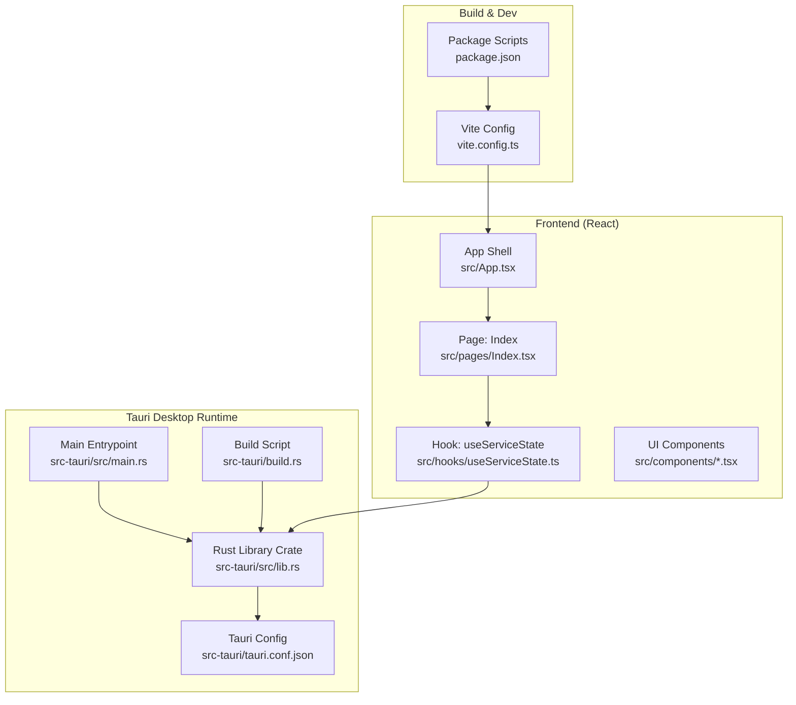
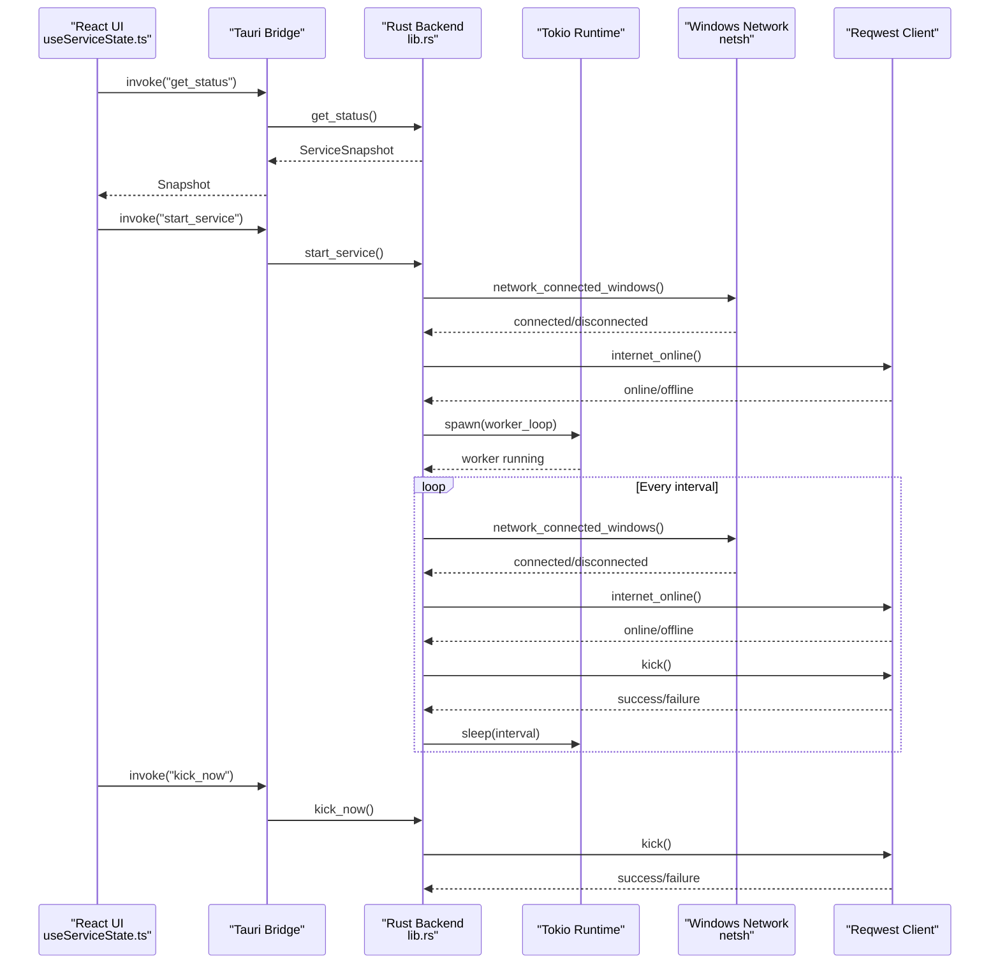
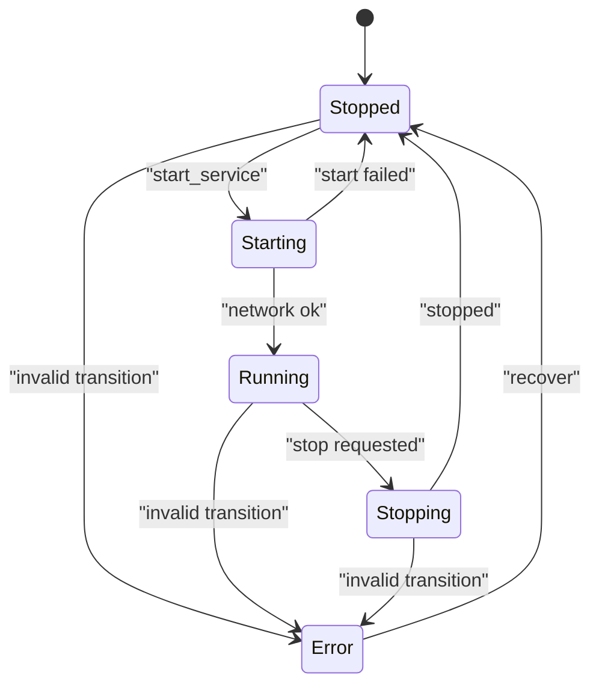
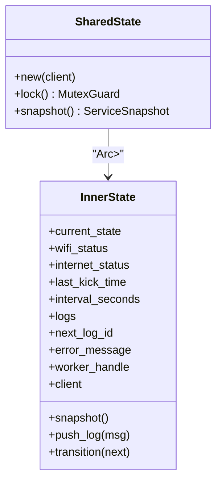
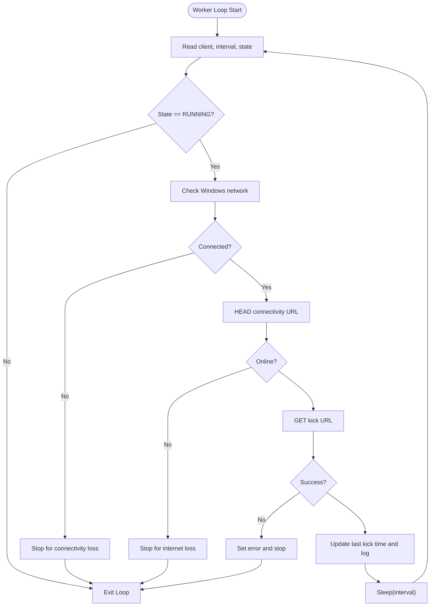
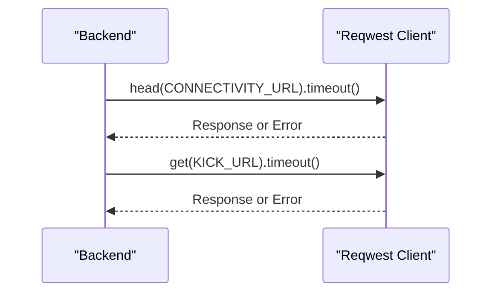
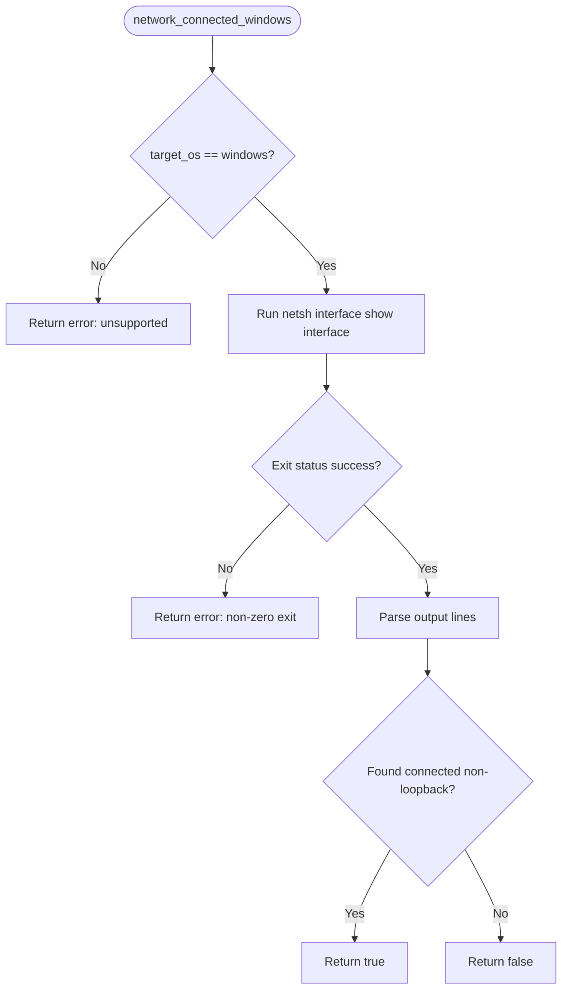
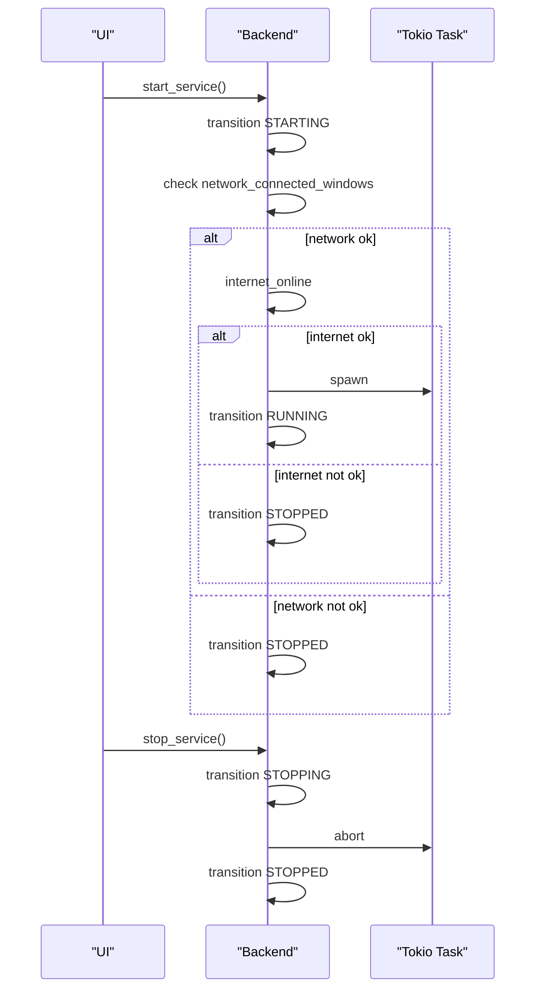
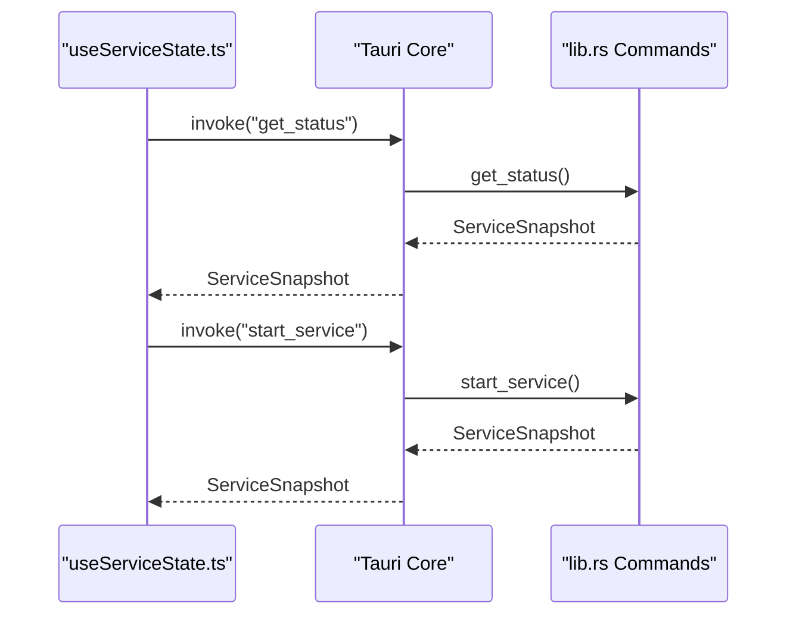
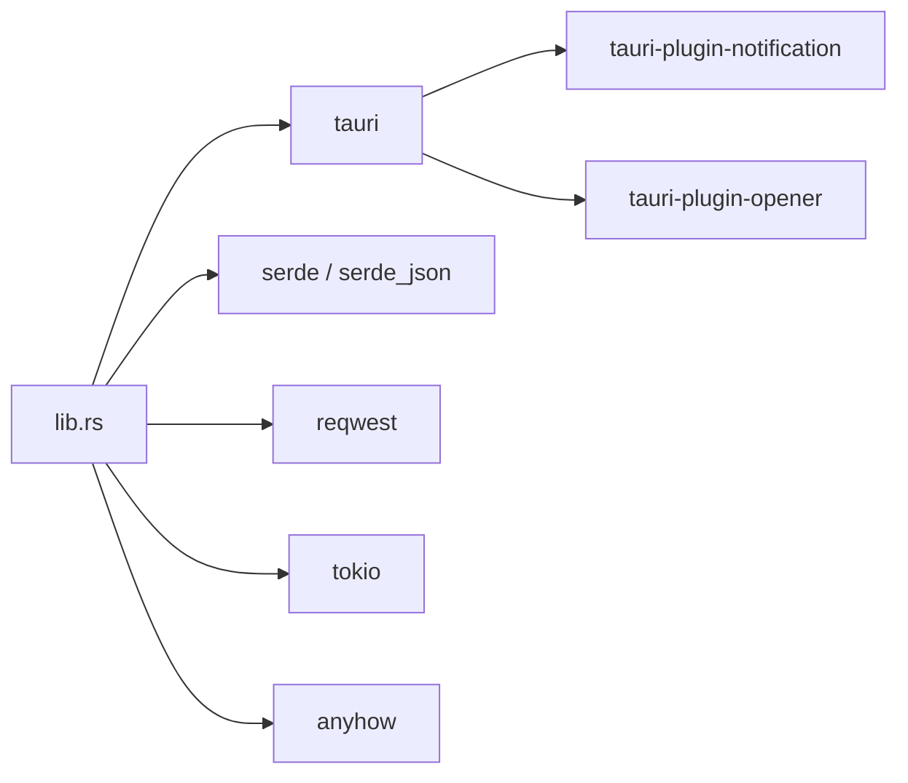

# Backend Service

<cite>
**Referenced Files in This Document**
- [Cargo.toml](file://src-tauri/Cargo.toml)
- [main.rs](file://src-tauri/src/main.rs)
- [lib.rs](file://src-tauri/src/lib.rs)
- [tauri.conf.json](file://src-tauri/tauri.conf.json)
- [build.rs](file://src-tauri/build.rs)
- [App.tsx](file://src/App.tsx)
- [Index.tsx](file://src/pages/Index.tsx)
- [useServiceState.ts](file://src/hooks/useServiceState.ts)
- [PrimaryControls.tsx](file://src/components/PrimaryControls.tsx)
- [AdvancedSettings.tsx](file://src/components/AdvancedSettings.tsx)
- [StatusCard.tsx](file://src/components/StatusCard.tsx)
- [package.json](file://package.json)
- [vite.config.ts](file://vite.config.ts)
</cite>

## Table of Contents
1. [Introduction](#introduction)
2. [Project Structure](#project-structure)
3. [Core Components](#core-components)
4. [Architecture Overview](#architecture-overview)
5. [Detailed Component Analysis](#detailed-component-analysis)
6. [Dependency Analysis](#dependency-analysis)
7. [Performance Considerations](#performance-considerations)
8. [Troubleshooting Guide](#troubleshooting-guide)
9. [Conclusion](#conclusion)
10. [Appendices](#appendices)

## Introduction
This document describes the Rust backend service that powers the Tauri desktop application. It explains the service state machine, concurrent processing with Tokio, HTTP client integration via Reqwest, and Windows-specific network detection. It also covers the service lifecycle, authentication workflow, timer mechanisms, error handling, Tauri command handlers, bridge communication patterns, and security model. Finally, it provides guidance on initialization, shutdown, resource management, and extending the service logic.

## Project Structure
The backend is implemented as a Tauri library crate with a thin entrypoint. The frontend is a React application that communicates with the backend via Tauri commands. The build system integrates Vite for development and Tauri for packaging.

**Diagram sources**
- [lib.rs](file://src-tauri/src/lib.rs#L658-L686)
- [main.rs](file://src-tauri/src/main.rs#L1-L7)
- [tauri.conf.json](file://src-tauri/tauri.conf.json#L1-L42)
- [build.rs](file://src-tauri/build.rs#L1-L4)
- [App.tsx](file://src/App.tsx#L1-L28)
- [Index.tsx](file://src/pages/Index.tsx#L1-L55)
- [useServiceState.ts](file://src/hooks/useServiceState.ts#L1-L163)
- [vite.config.ts](file://vite.config.ts#L1-L22)
- [package.json](file://package.json#L1-L96)

**Section sources**
- [Cargo.toml](file://src-tauri/Cargo.toml#L1-L29)
- [main.rs](file://src-tauri/src/main.rs#L1-L7)
- [lib.rs](file://src-tauri/src/lib.rs#L658-L686)
- [tauri.conf.json](file://src-tauri/tauri.conf.json#L1-L42)
- [build.rs](file://src-tauri/build.rs#L1-L4)
- [App.tsx](file://src/App.tsx#L1-L28)
- [Index.tsx](file://src/pages/Index.tsx#L1-L55)
- [useServiceState.ts](file://src/hooks/useServiceState.ts#L1-L163)
- [vite.config.ts](file://vite.config.ts#L1-L22)
- [package.json](file://package.json#L1-L96)

## Core Components
- Service state machine: Defines allowed transitions and current state representation.
- Shared state container: Thread-safe state with logging, timers, and worker handle.
- Worker loop: Periodic checks and actions using async concurrency.
- HTTP client: Reqwest client configured with timeouts and connection limits.
- Windows network detection: Uses system commands to detect active network interfaces.
- Tauri commands: Exposes start/stop/kick/set interval/get status/quit to the frontend.
- Frontend bridge: React hook invokes commands and polls status snapshots.

Key constants and URLs:
- Minimum interval seconds, default interval seconds, connect timeout, request timeout, max log entries, window margins.
- Connectivity URL for online check, kick URL for periodic action.

**Section sources**
- [lib.rs](file://src-tauri/src/lib.rs#L17-L26)
- [lib.rs](file://src-tauri/src/lib.rs#L27-L71)
- [lib.rs](file://src-tauri/src/lib.rs#L73-L141)
- [lib.rs](file://src-tauri/src/lib.rs#L415-L473)
- [lib.rs](file://src-tauri/src/lib.rs#L308-L349)
- [lib.rs](file://src-tauri/src/lib.rs#L599-L656)
- [useServiceState.ts](file://src/hooks/useServiceState.ts#L88-L107)

## Architecture Overview
The backend runs inside Tauri as a managed library. The frontend periodically requests a snapshot of the service state and triggers commands to start/stop/kick/set interval. The backend maintains a finite state machine and spawns a Tokio task to run the worker loop. The worker performs network checks, internet connectivity verification, and sends a kick request at intervals.

**Diagram sources**
- [lib.rs](file://src-tauri/src/lib.rs#L599-L656)
- [lib.rs](file://src-tauri/src/lib.rs#L415-L473)
- [lib.rs](file://src-tauri/src/lib.rs#L308-L349)
- [lib.rs](file://src-tauri/src/lib.rs#L351-L371)
- [useServiceState.ts](file://src/hooks/useServiceState.ts#L88-L134)

## Detailed Component Analysis

### Service State Machine
The state machine defines five states and valid transitions. It prevents illegal state changes and moves to error state on invalid transitions or failures.

**Diagram sources**
- [lib.rs](file://src-tauri/src/lib.rs#L29-L35)
- [lib.rs](file://src-tauri/src/lib.rs#L160-L171)

**Section sources**
- [lib.rs](file://src-tauri/src/lib.rs#L29-L35)
- [lib.rs](file://src-tauri/src/lib.rs#L160-L171)

### Shared State and Logging
SharedState wraps InnerState behind an Arc<Mutex<...>>. It provides thread-safe access, snapshots, and log management. Logs are stored in a bounded VecDeque with auto-truncation.

**Diagram sources**
- [lib.rs](file://src-tauri/src/lib.rs#L143-L158)
- [lib.rs](file://src-tauri/src/lib.rs#L73-L141)

**Section sources**
- [lib.rs](file://src-tauri/src/lib.rs#L73-L141)
- [lib.rs](file://src-tauri/src/lib.rs#L143-L158)

### Worker Loop and Timer Mechanisms
The worker loop runs while the service is in Running state. It checks network connectivity, internet availability, performs a kick, updates timestamps, and sleeps for the configured interval. Intervals are clamped to a minimum.

**Diagram sources**
- [lib.rs](file://src-tauri/src/lib.rs#L415-L473)
- [lib.rs](file://src-tauri/src/lib.rs#L308-L349)
- [lib.rs](file://src-tauri/src/lib.rs#L351-L371)

**Section sources**
- [lib.rs](file://src-tauri/src/lib.rs#L415-L473)
- [lib.rs](file://src-tauri/src/lib.rs#L17-L26)

### HTTP Client Integration (Reqwest)
The backend creates a single HTTP client with connection and request timeouts. It uses head requests for connectivity checks and get requests for kicks.

**Diagram sources**
- [lib.rs](file://src-tauri/src/lib.rs#L660-L664)
- [lib.rs](file://src-tauri/src/lib.rs#L351-L371)

**Section sources**
- [lib.rs](file://src-tauri/src/lib.rs#L20-L21)
- [lib.rs](file://src-tauri/src/lib.rs#L660-L664)
- [lib.rs](file://src-tauri/src/lib.rs#L351-L371)

### Windows-Specific Network Detection
On Windows, the backend parses the output of a system command to detect whether any non-loopback interface is connected. On non-Windows platforms, the operation is unsupported.

**Diagram sources**
- [lib.rs](file://src-tauri/src/lib.rs#L308-L349)

**Section sources**
- [lib.rs](file://src-tauri/src/lib.rs#L308-L349)

### Service Lifecycle Management
Lifecycle includes initialization, start validation, worker spawning, graceful stopping, and cleanup.

**Diagram sources**
- [lib.rs](file://src-tauri/src/lib.rs#L475-L564)
- [lib.rs](file://src-tauri/src/lib.rs#L566-L597)

**Section sources**
- [lib.rs](file://src-tauri/src/lib.rs#L475-L564)
- [lib.rs](file://src-tauri/src/lib.rs#L566-L597)

### Authentication Workflow
The backend does not implement authentication. It performs a GET request to a predefined URL to keep the connection alive. The frontend exposes a manual kick action that triggers the same request.

**Section sources**
- [lib.rs](file://src-tauri/src/lib.rs#L25-L25)
- [lib.rs](file://src-tauri/src/lib.rs#L621-L642)

### Tauri Command Handlers and Bridge Communication
Commands exposed to the frontend:
- get_status: Returns a snapshot of the service state.
- start_service: Starts the service after validating network/internet.
- stop_service: Stops the service gracefully.
- kick_now: Performs an immediate kick.
- set_interval: Updates the kick interval (clamped to minimum).
- quit_app: Exits the application.

The frontend uses a hook to poll status and invoke commands. It maps backend snapshots to frontend types and handles errors.

**Diagram sources**
- [lib.rs](file://src-tauri/src/lib.rs#L599-L656)
- [useServiceState.ts](file://src/hooks/useServiceState.ts#L88-L144)

**Section sources**
- [lib.rs](file://src-tauri/src/lib.rs#L599-L656)
- [useServiceState.ts](file://src/hooks/useServiceState.ts#L88-L144)

### Security Model
- The Tauri config disables CSP for development and allows bundling across targets.
- The backend uses a dedicated HTTP client with timeouts and a single-purpose endpoint.
- No sensitive credentials are stored or transmitted by the backend.

**Section sources**
- [tauri.conf.json](file://src-tauri/tauri.conf.json#L26-L28)
- [lib.rs](file://src-tauri/src/lib.rs#L660-L664)

## Dependency Analysis
External crates and their roles:
- tauri: Application framework and window/tray management.
- tauri-plugin-opener/notification: System integration for opening links and notifications.
- serde/serde_json: Serialization for state and snapshots.
- reqwest: HTTP client for connectivity and kick requests.
- tokio: Async runtime for scheduling the worker loop.
- anyhow: Error handling abstraction.

**Diagram sources**
- [Cargo.toml](file://src-tauri/Cargo.toml#L20-L29)
- [lib.rs](file://src-tauri/src/lib.rs#L1-L16)

**Section sources**
- [Cargo.toml](file://src-tauri/Cargo.toml#L20-L29)

## Performance Considerations
- Minimize contention: SharedState uses a single mutex per snapshot; keep critical sections short.
- Interval clamping: Ensures reasonable polling cadence and avoids excessive network calls.
- Timeout tuning: Connection and request timeouts prevent blocking operations.
- Worker abort: Graceful cancellation of the Tokio task on stop.
- Logging overhead: Bounded log queue prevents memory growth.

[No sources needed since this section provides general guidance]

## Troubleshooting Guide
Common issues and remedies:
- Network detection fails on non-Windows: The operation is unsupported outside Windows.
- Start blocked due to unknown network state: Ensure a working network adapter is present.
- Start blocked due to offline internet: Bring up connectivity before starting.
- Worker stops unexpectedly: Check logs for connectivity loss or kick failure.
- Manual kick fails: Verify internet connectivity and target URL accessibility.

Operational helpers:
- Use get_status to inspect current state, statuses, and recent logs.
- Use set_interval to adjust polling cadence.
- Use kick_now to force a single iteration.

**Section sources**
- [lib.rs](file://src-tauri/src/lib.rs#L346-L349)
- [lib.rs](file://src-tauri/src/lib.rs#L489-L516)
- [lib.rs](file://src-tauri/src/lib.rs#L528-L536)
- [lib.rs](file://src-tauri/src/lib.rs#L644-L651)
- [lib.rs](file://src-tauri/src/lib.rs#L621-L642)

## Conclusion
The backend provides a robust, minimal service that monitors network and internet connectivity, periodically performs a kick, and exposes a clean Tauri command surface. It leverages Tokio for concurrency, Reqwest for HTTP, and a Windows-specific detection method. The frontend integrates seamlessly via Tauri commands and polling, offering a responsive UI with actionable controls.

[No sources needed since this section summarizes without analyzing specific files]

## Appendices

### Initialization and Shutdown Procedures
- Initialization: Build a single HTTP client with timeouts and register the SharedState with Tauri. Set up the main window and tray.
- Shutdown: Abort the worker task, transition to Stopped, clear error messages, and exit the application.

**Section sources**
- [lib.rs](file://src-tauri/src/lib.rs#L658-L686)
- [lib.rs](file://src-tauri/src/lib.rs#L566-L597)
- [lib.rs](file://src-tauri/src/lib.rs#L653-L656)

### Extending the Service Logic
- Add new network detection methods: Implement platform-specific checks and integrate into the worker loop.
- Introduce authentication: Modify the kick request to include credentials and update state accordingly.
- Expand timer mechanisms: Support dynamic intervals, jitter, or adaptive pacing based on conditions.
- Enhance error handling: Add retry logic, circuit breaker behavior, or richer diagnostics.

[No sources needed since this section provides general guidance]