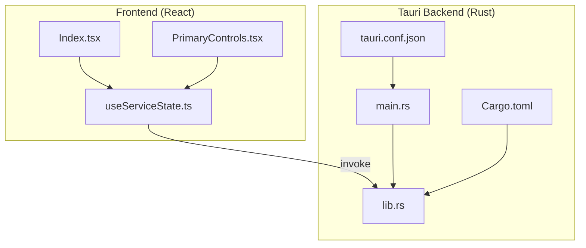
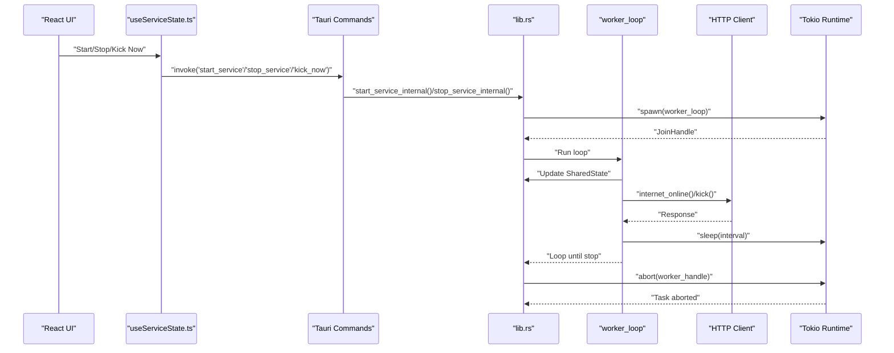
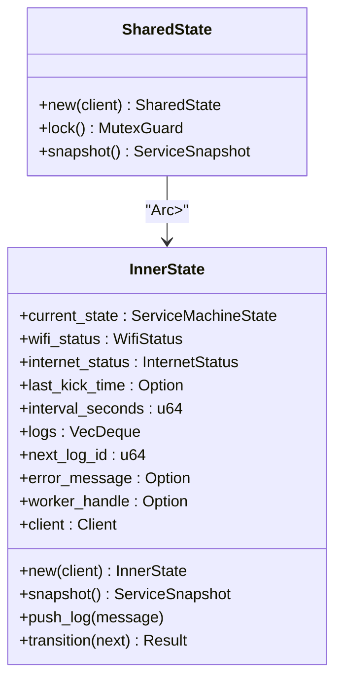
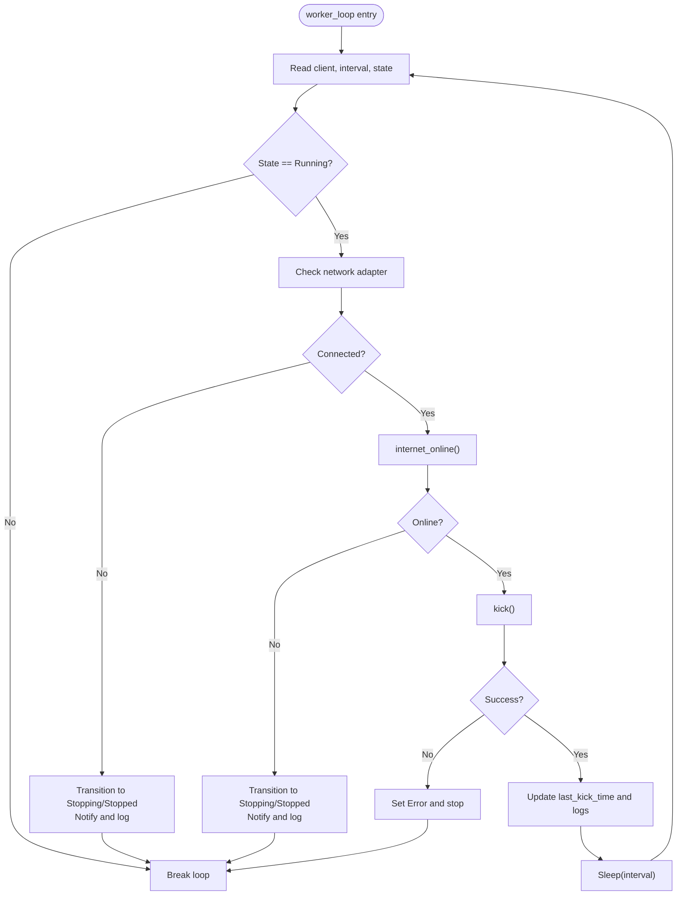
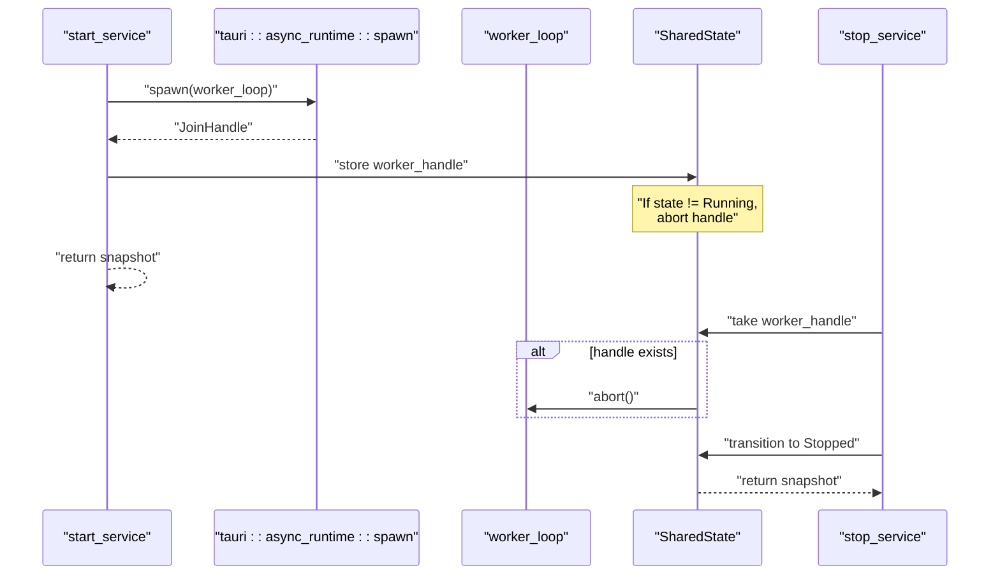
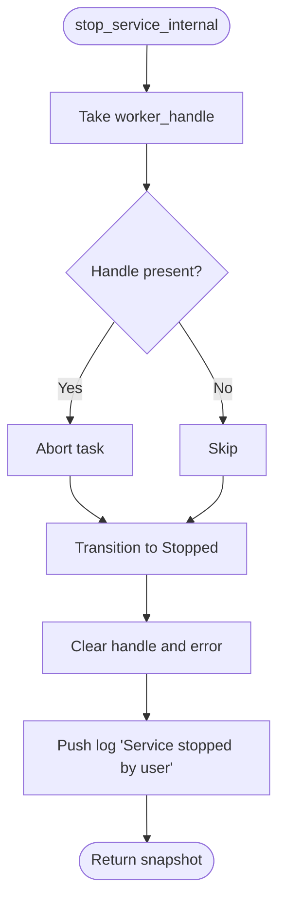
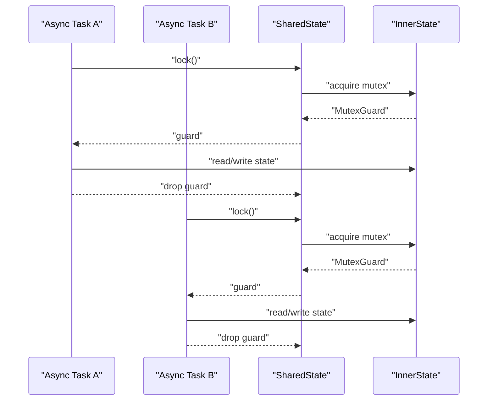
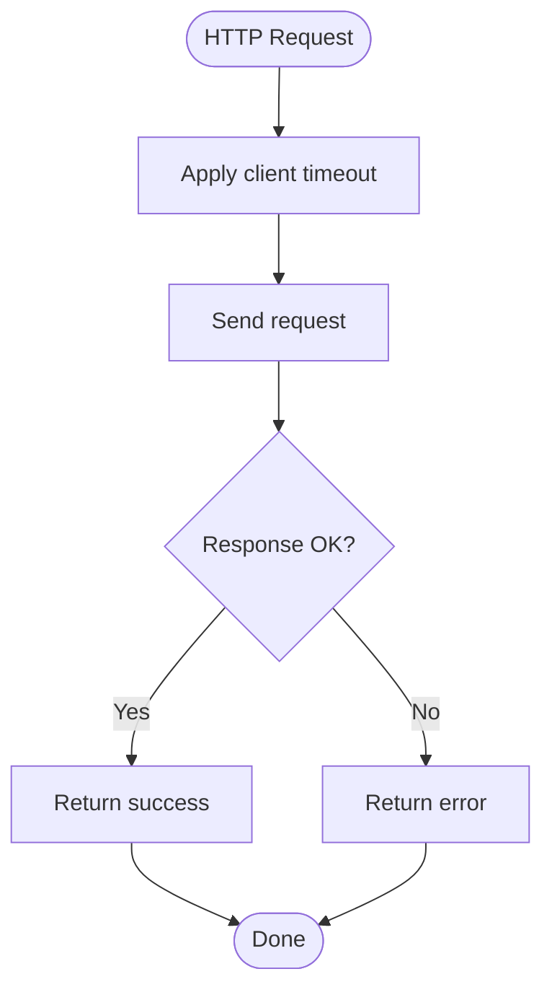
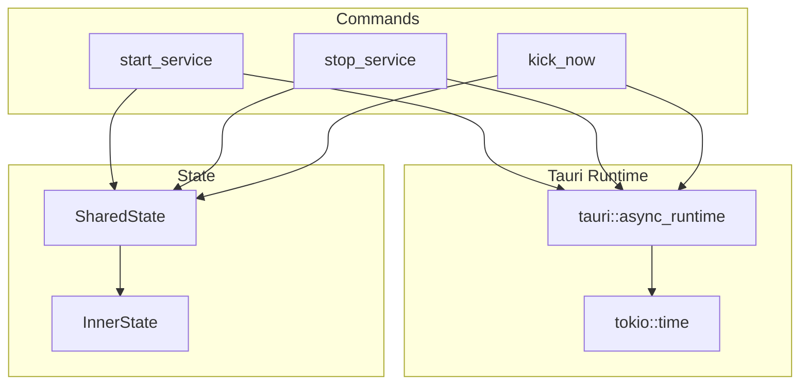
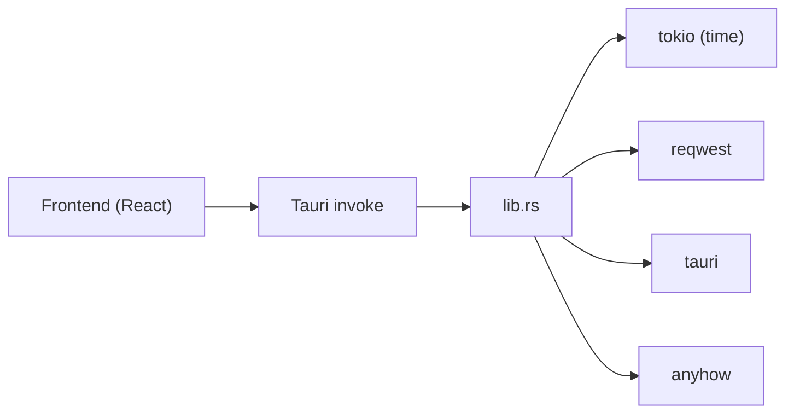

# Concurrent Processing

<cite>
**Referenced Files in This Document**
- [lib.rs](file://src-tauri/src/lib.rs)
- [Cargo.toml](file://src-tauri/Cargo.toml)
- [tauri.conf.json](file://src-tauri/tauri.conf.json)
- [useServiceState.ts](file://src/hooks/useServiceState.ts)
- [Index.tsx](file://src/pages/Index.tsx)
- [PrimaryControls.tsx](file://src/components/PrimaryControls.tsx)
- [main.rs](file://src-tauri/src/main.rs)
</cite>

## Table of Contents
1. [Introduction](#introduction)
2. [Project Structure](#project-structure)
3. [Core Components](#core-components)
4. [Architecture Overview](#architecture-overview)
5. [Detailed Component Analysis](#detailed-component-analysis)
6. [Dependency Analysis](#dependency-analysis)
7. [Performance Considerations](#performance-considerations)
8. [Troubleshooting Guide](#troubleshooting-guide)
9. [Conclusion](#conclusion)
10. [Appendices](#appendices)

## Introduction
This document explains the concurrent processing architecture built on the Tokio async runtime within the Tauri desktop application. It focuses on the worker loop implementation, async task spawning, graceful shutdown, JoinHandle management, task abortion, thread-safe state sharing, sleep intervals and timeouts, error propagation, and integration with Tauri’s async runtime. Practical examples of async/await patterns, task coordination, and resource cleanup are included, along with best practices for developing robust async services.

## Project Structure
The concurrent logic resides in the Tauri backend (Rust) under src-tauri. The frontend (TypeScript/React) triggers commands that invoke backend async operations. The backend manages a long-running worker loop that periodically checks connectivity, performs HTTP requests, and updates shared state.

**Diagram sources**
- [main.rs](file://src-tauri/src/main.rs#L1-L7)
- [lib.rs](file://src-tauri/src/lib.rs#L658-L686)
- [Cargo.toml](file://src-tauri/Cargo.toml#L1-L29)
- [tauri.conf.json](file://src-tauri/tauri.conf.json#L1-L42)
- [useServiceState.ts](file://src/hooks/useServiceState.ts#L1-L163)
- [Index.tsx](file://src/pages/Index.tsx#L1-L55)
- [PrimaryControls.tsx](file://src/components/PrimaryControls.tsx#L1-L73)

**Section sources**
- [main.rs](file://src-tauri/src/main.rs#L1-L7)
- [lib.rs](file://src-tauri/src/lib.rs#L658-L686)
- [Cargo.toml](file://src-tauri/Cargo.toml#L1-L29)
- [tauri.conf.json](file://src-tauri/tauri.conf.json#L1-L42)
- [useServiceState.ts](file://src/hooks/useServiceState.ts#L1-L163)
- [Index.tsx](file://src/pages/Index.tsx#L1-L55)
- [PrimaryControls.tsx](file://src/components/PrimaryControls.tsx#L1-L73)

## Core Components
- SharedState: Thread-safe state container wrapping InnerState with an Arc<Mutex<>> guard. Exposes snapshot and locking helpers.
- Worker Loop: Long-running async loop that checks network, validates internet connectivity, performs HTTP “kick” requests, updates timestamps/logs, and sleeps between iterations.
- Async Task Spawning: Uses tauri::async_runtime::spawn to launch the worker loop as a detached task and stores a JoinHandle for later control.
- Graceful Shutdown: Transitions to Stopping, aborts the worker task, resets state, and clears the handle.
- Timeout and Sleep: Uses tokio::time::sleep for intervals and reqwest client timeouts for HTTP operations.
- Error Propagation: Uses anyhow for errors and propagates failures up the call chain; also sets the service into Error state and stops automatically on unexpected failures.

**Section sources**
- [lib.rs](file://src-tauri/src/lib.rs#L73-L158)
- [lib.rs](file://src-tauri/src/lib.rs#L414-L473)
- [lib.rs](file://src-tauri/src/lib.rs#L548-L561)
- [lib.rs](file://src-tauri/src/lib.rs#L566-L597)
- [lib.rs](file://src-tauri/src/lib.rs#L351-L371)
- [lib.rs](file://src-tauri/src/lib.rs#L192-L205)

## Architecture Overview
The backend exposes Tauri commands invoked by the frontend. On user action, the frontend calls start_service or stop_service, which in turn spawn or abort the worker loop. The worker loop runs independently, periodically checking connectivity and performing HTTP requests. SharedState ensures safe access to mutable state across async tasks.

**Diagram sources**
- [useServiceState.ts](file://src/hooks/useServiceState.ts#L109-L134)
- [lib.rs](file://src-tauri/src/lib.rs#L604-L618)
- [lib.rs](file://src-tauri/src/lib.rs#L548-L561)
- [lib.rs](file://src-tauri/src/lib.rs#L414-L473)
- [lib.rs](file://src-tauri/src/lib.rs#L351-L371)

## Detailed Component Analysis

### SharedState and InnerState
SharedState encapsulates InnerState behind an Arc<Mutex<>> to enable thread-safe access across async tasks. It provides:
- Snapshot creation for UI consumption
- Locking helpers to safely mutate state
- Transition validation and logging

**Diagram sources**
- [lib.rs](file://src-tauri/src/lib.rs#L73-L158)

**Section sources**
- [lib.rs](file://src-tauri/src/lib.rs#L73-L158)

### Worker Loop Implementation
The worker loop runs continuously while the service is in Running state. It:
- Checks network adapter connectivity
- Validates internet availability via HEAD request
- Performs a GET “kick” request
- Updates timestamps and logs
- Sleeps for the configured interval

**Diagram sources**
- [lib.rs](file://src-tauri/src/lib.rs#L414-L473)
- [lib.rs](file://src-tauri/src/lib.rs#L351-L371)
- [lib.rs](file://src-tauri/src/lib.rs#L373-L413)

**Section sources**
- [lib.rs](file://src-tauri/src/lib.rs#L414-L473)
- [lib.rs](file://src-tauri/src/lib.rs#L351-L371)
- [lib.rs](file://src-tauri/src/lib.rs#L373-L413)

### Async Task Spawning and JoinHandle Management
- Spawning: The start command spawns the worker loop using tauri::async_runtime::spawn and stores the JoinHandle in SharedState.
- Task Abortion: The stop command aborts the stored JoinHandle and transitions the state to Stopped.
- Conditional Abort: If the state changed between spawn and assignment, the task is aborted immediately to prevent leaks.

**Diagram sources**
- [lib.rs](file://src-tauri/src/lib.rs#L548-L561)
- [lib.rs](file://src-tauri/src/lib.rs#L566-L597)

**Section sources**
- [lib.rs](file://src-tauri/src/lib.rs#L548-L561)
- [lib.rs](file://src-tauri/src/lib.rs#L566-L597)

### Graceful Shutdown Mechanisms
Graceful shutdown involves:
- Transitioning to Stopping
- Aborting the worker task
- Clearing the handle
- Resetting error state and pushing a log
- Notifying the user

**Diagram sources**
- [lib.rs](file://src-tauri/src/lib.rs#L566-L597)

**Section sources**
- [lib.rs](file://src-tauri/src/lib.rs#L566-L597)

### Thread-Safe State Sharing Between Async Tasks
- SharedState wraps InnerState in Arc<Mutex<>> to allow safe mutation across tasks.
- Locking is performed around reads/writes to ensure consistency.
- Snapshot creation copies data to avoid holding locks longer than necessary.

**Diagram sources**
- [lib.rs](file://src-tauri/src/lib.rs#L143-L158)
- [lib.rs](file://src-tauri/src/lib.rs#L104-L114)

**Section sources**
- [lib.rs](file://src-tauri/src/lib.rs#L143-L158)
- [lib.rs](file://src-tauri/src/lib.rs#L104-L114)

### Sleep Intervals, Timeout Handling, and Error Propagation
- Sleep Interval: The worker sleeps for the configured interval seconds using tokio::time::sleep.
- HTTP Timeouts: Requests use reqwest client timeouts for connect and request durations.
- Error Propagation: Failures are propagated via Result<String> from commands; unexpected errors trigger automatic Error state and stop.

**Diagram sources**
- [lib.rs](file://src-tauri/src/lib.rs#L351-L371)
- [lib.rs](file://src-tauri/src/lib.rs#L660-L664)

**Section sources**
- [lib.rs](file://src-tauri/src/lib.rs#L470-L470)
- [lib.rs](file://src-tauri/src/lib.rs#L351-L371)
- [lib.rs](file://src-tauri/src/lib.rs#L660-L664)
- [lib.rs](file://src-tauri/src/lib.rs#L192-L205)

### Integration with Tauri’s Async Runtime and Best Practices
- Tauri Commands: Frontend invokes commands that are handled asynchronously by the backend.
- Async Runtime: Uses tauri::async_runtime::spawn to run the worker loop and tokio::time::sleep for intervals.
- Best Practices:
  - Always store JoinHandles for controlled abortion.
  - Validate state transitions before mutating.
  - Use timeouts on HTTP clients to avoid blocking.
  - Prefer snapshot-based reads for UI updates to minimize lock contention.
  - Notify users on state changes and errors.

**Diagram sources**
- [lib.rs](file://src-tauri/src/lib.rs#L604-L618)
- [lib.rs](file://src-tauri/src/lib.rs#L548-L561)
- [lib.rs](file://src-tauri/src/lib.rs#L620-L642)
- [lib.rs](file://src-tauri/src/lib.rs#L73-L158)

**Section sources**
- [lib.rs](file://src-tauri/src/lib.rs#L604-L618)
- [lib.rs](file://src-tauri/src/lib.rs#L548-L561)
- [lib.rs](file://src-tauri/src/lib.rs#L620-L642)
- [lib.rs](file://src-tauri/src/lib.rs#L73-L158)

## Dependency Analysis
The backend depends on Tauri for command handling and UI integration, Tokio for async runtime and timers, reqwest for HTTP, and anyhow for error handling. The frontend communicates via Tauri’s invoke mechanism.

**Diagram sources**
- [useServiceState.ts](file://src/hooks/useServiceState.ts#L88-L144)
- [lib.rs](file://src-tauri/src/lib.rs#L1-L26)
- [Cargo.toml](file://src-tauri/Cargo.toml#L20-L28)

**Section sources**
- [Cargo.toml](file://src-tauri/Cargo.toml#L20-L28)
- [lib.rs](file://src-tauri/src/lib.rs#L1-L26)
- [useServiceState.ts](file://src/hooks/useServiceState.ts#L88-L144)

## Performance Considerations
- Minimize lock contention by taking snapshots for UI rendering and avoiding long-held mutexes.
- Use appropriate sleep intervals to balance responsiveness and resource usage.
- Apply HTTP timeouts to prevent blocking operations from stalling the worker loop.
- Avoid spawning unnecessary tasks; reuse the existing worker loop for periodic work.

## Troubleshooting Guide
Common issues and resolutions:
- Worker does not stop: Ensure stop_service_internal takes and aborts the stored JoinHandle and transitions to Stopped.
- Frequent errors: The service moves to Error and stops automatically; check logs and network connectivity.
- UI not updating: Verify that get_status snapshots are polled and applied correctly by the frontend hook.
- Network checks failing: On Windows, network_connected_windows relies on netsh; ensure the process can execute netsh without a console window.

**Section sources**
- [lib.rs](file://src-tauri/src/lib.rs#L566-L597)
- [lib.rs](file://src-tauri/src/lib.rs#L192-L205)
- [useServiceState.ts](file://src/hooks/useServiceState.ts#L88-L107)
- [lib.rs](file://src-tauri/src/lib.rs#L308-L344)

## Conclusion
The application employs a clean, robust concurrent architecture: a long-running worker loop managed by a JoinHandle, coordinated via Tauri commands, with thread-safe state updates and explicit error handling. By leveraging Tokio’s async runtime and Tauri’s async spawn, the system remains responsive while performing periodic network checks and HTTP operations. Following the outlined best practices ensures predictable behavior, graceful shutdown, and maintainable async service development.

## Appendices

### Async/Await Patterns Used Throughout the Service
- HTTP operations: internet_online and kick use await to send requests with timeouts.
- Worker loop: sleep uses tokio::time::sleep with await to pause between iterations.
- Command handlers: start_service, stop_service, and kick_now are async and await internal operations.

**Section sources**
- [lib.rs](file://src-tauri/src/lib.rs#L351-L371)
- [lib.rs](file://src-tauri/src/lib.rs#L470-L470)
- [lib.rs](file://src-tauri/src/lib.rs#L604-L618)
- [lib.rs](file://src-tauri/src/lib.rs#L620-L642)

### Task Coordination and Resource Cleanup
- Task Coordination: Commands coordinate via SharedState transitions and JoinHandle storage.
- Resource Cleanup: On stop, the worker handle is aborted and state is reset; on error, the service transitions to Stopped and logs the failure.

**Section sources**
- [lib.rs](file://src-tauri/src/lib.rs#L548-L561)
- [lib.rs](file://src-tauri/src/lib.rs#L566-L597)
- [lib.rs](file://src-tauri/src/lib.rs#L192-L205)