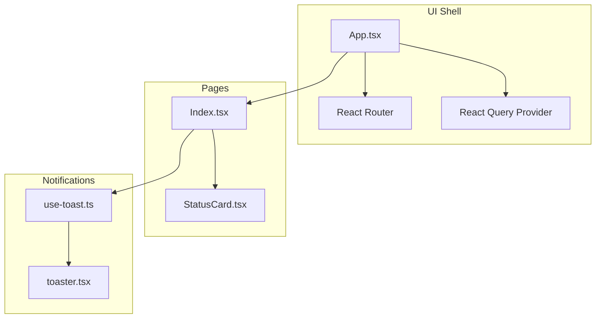
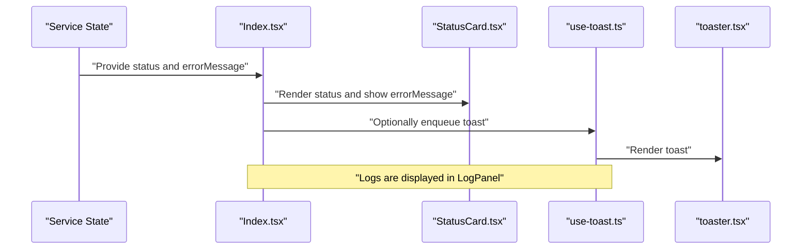
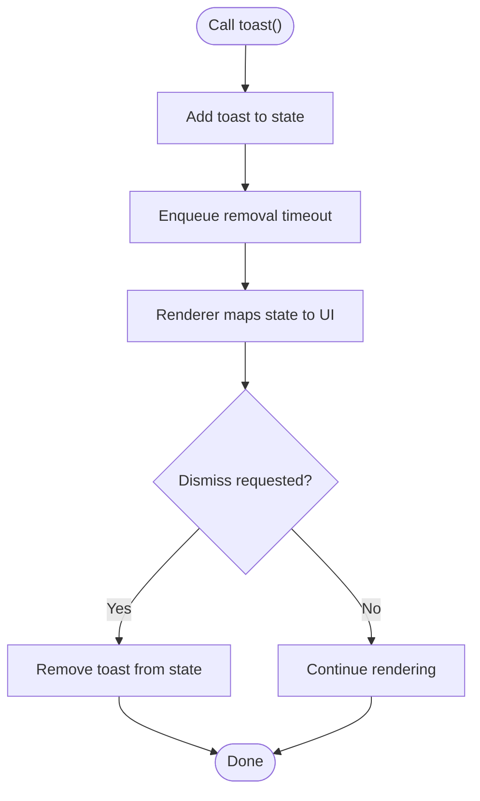
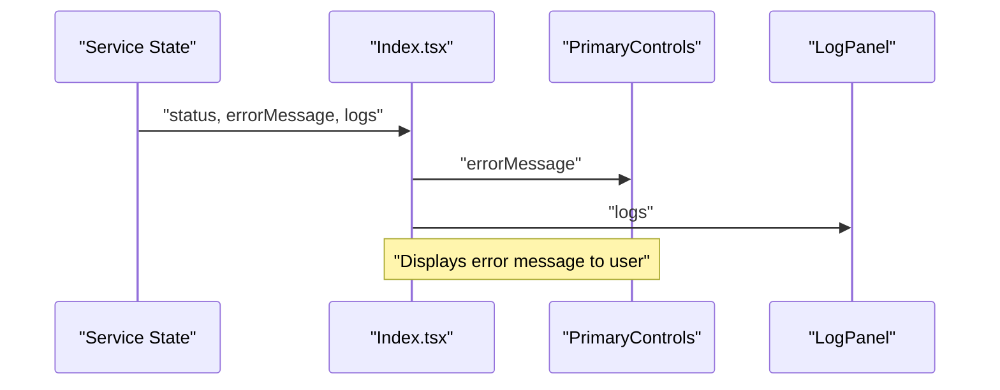
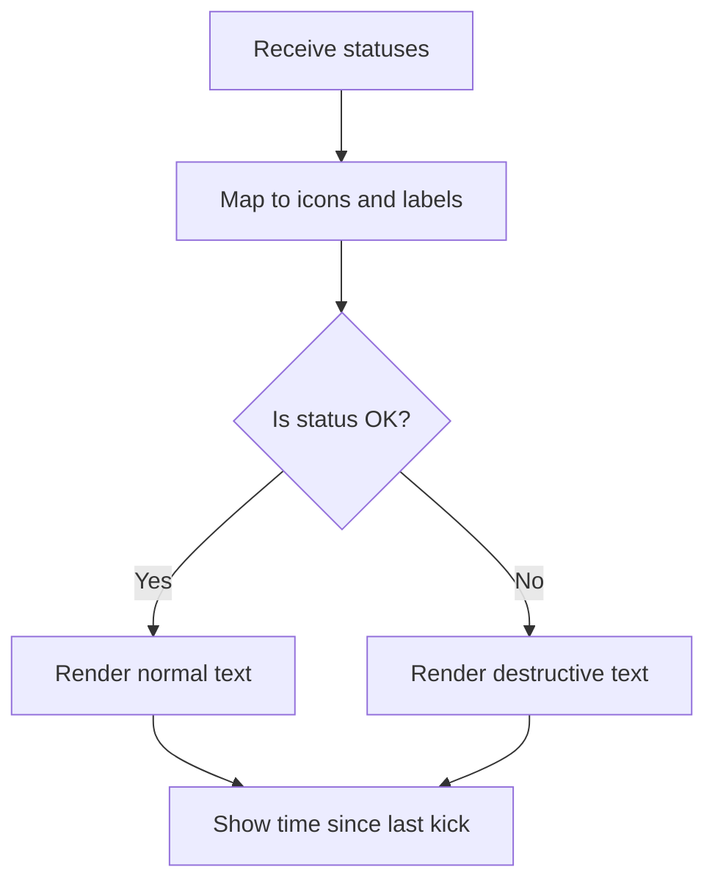
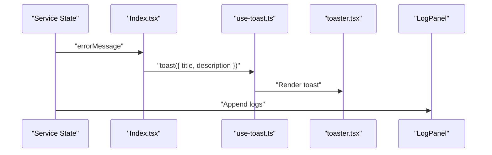
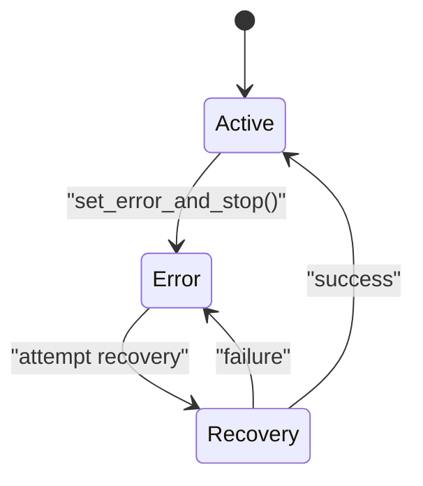
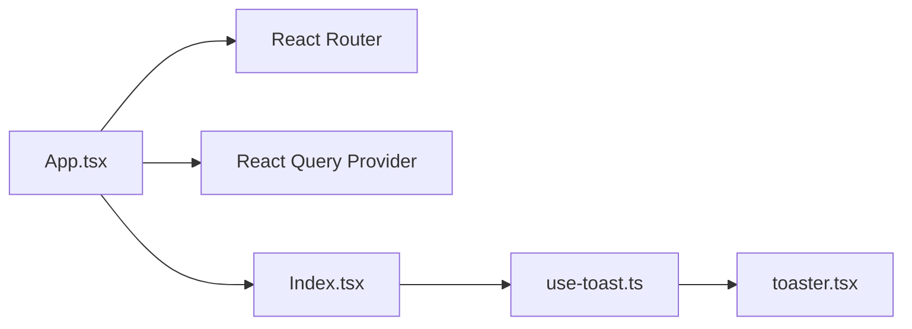

# Error Handling Strategies

<cite>
**Referenced Files in This Document**
- [App.tsx](file://src/App.tsx)
- [Index.tsx](file://src/pages/Index.tsx)
- [StatusCard.tsx](file://src/components/StatusCard.tsx)
- [use-toast.ts](file://src/hooks/use-toast.ts)
- [toaster.tsx](file://src/components/ui/toaster.tsx)
</cite>

## Table of Contents
1. [Introduction](#introduction)
2. [Project Structure](#project-structure)
3. [Core Components](#core-components)
4. [Architecture Overview](#architecture-overview)
5. [Detailed Component Analysis](#detailed-component-analysis)
6. [Dependency Analysis](#dependency-analysis)
7. [Performance Considerations](#performance-considerations)
8. [Troubleshooting Guide](#troubleshooting-guide)
9. [Conclusion](#conclusion)

## Introduction
This document explains the error handling and recovery strategies implemented in the application. It focuses on how errors propagate, how the system transitions into an ERROR state, and how automatic recovery mechanisms operate. It also documents the integration with the notification system for user-facing messages, error logging via the log panel, and guidance for extending error handling with custom recovery logic.

## Project Structure
The error handling surface in this project centers around:
- Application shell and providers that enable global state and notifications
- A page that orchestrates service state and displays error messages
- A toast-based notification system for transient user feedback
- A log panel that surfaces operational logs for debugging

**Diagram sources**
- [App.tsx](file://src/App.tsx#L1-L28)
- [Index.tsx](file://src/pages/Index.tsx#L1-L55)
- [StatusCard.tsx](file://src/components/StatusCard.tsx#L1-L63)
- [use-toast.ts](file://src/hooks/use-toast.ts#L1-L187)
- [toaster.tsx](file://src/components/ui/toaster.tsx#L1-L25)

**Section sources**
- [App.tsx](file://src/App.tsx#L1-L28)
- [Index.tsx](file://src/pages/Index.tsx#L1-L55)
- [use-toast.ts](file://src/hooks/use-toast.ts#L1-L187)
- [toaster.tsx](file://src/components/ui/toaster.tsx#L1-L25)

## Core Components
- Notification system: Provides a toast manager and renderer for transient user notifications.
- Page orchestration: Renders status indicators, controls, and passes error messages to the UI.
- Status display: Visualizes connectivity and last activity, aiding diagnosis.
- Log panel: Presents logs for debugging and auditing.

Key integration points:
- The page exposes an error message prop to the primary controls, enabling immediate user visibility of errors.
- The toast system manages a capped number of toasts and schedules removal after a delay, ensuring non-blocking UX.

**Section sources**
- [Index.tsx](file://src/pages/Index.tsx#L19-L32)
- [StatusCard.tsx](file://src/components/StatusCard.tsx#L19-L62)
- [use-toast.ts](file://src/hooks/use-toast.ts#L5-L187)
- [toaster.tsx](file://src/components/ui/toaster.tsx#L4-L24)

## Architecture Overview
The error handling architecture combines reactive state updates, a toast notification bus, and a log panel. When an error occurs:
- The service state emits an error message and sets the system into an ERROR state.
- The page receives the error message and renders it prominently.
- The toast system can optionally enqueue a toast for persistent or repeated user feedback.
- Logs are appended to the log panel for later inspection.

**Diagram sources**
- [Index.tsx](file://src/pages/Index.tsx#L19-L32)
- [StatusCard.tsx](file://src/components/StatusCard.tsx#L19-L62)
- [use-toast.ts](file://src/hooks/use-toast.ts#L137-L164)
- [toaster.tsx](file://src/components/ui/toaster.tsx#L4-L24)

## Detailed Component Analysis

### Notification System (use-toast.ts and toaster.tsx)
- State machine: Manages toasts with actions to add, update, dismiss, and remove toasts.
- Toast lifecycle: Adds a toast, enqueues a delayed removal, and limits concurrent toasts.
- Renderer: Maps the toast state to visible toast components.

**Diagram sources**
- [use-toast.ts](file://src/hooks/use-toast.ts#L71-L122)
- [use-toast.ts](file://src/hooks/use-toast.ts#L137-L164)
- [toaster.tsx](file://src/components/ui/toaster.tsx#L4-L24)

**Section sources**
- [use-toast.ts](file://src/hooks/use-toast.ts#L1-L187)
- [toaster.tsx](file://src/components/ui/toaster.tsx#L1-L25)

### Page-Level Error Propagation (Index.tsx)
- Receives service status, error message, and control callbacks.
- Passes the error message to the primary controls for user visibility.
- Conditionally renders a backend availability notice when the backend is not connected.

**Diagram sources**
- [Index.tsx](file://src/pages/Index.tsx#L9-L52)

**Section sources**
- [Index.tsx](file://src/pages/Index.tsx#L1-L55)

### Status Visualization (StatusCard.tsx)
- Visualizes network and internet status, and last activity.
- Uses color-coded labels to indicate OK vs problematic states.
- Provides contextual messaging to guide user expectations about automatic stopping behavior.

**Diagram sources**
- [StatusCard.tsx](file://src/components/StatusCard.tsx#L19-L62)

**Section sources**
- [StatusCard.tsx](file://src/components/StatusCard.tsx#L1-L63)

### Error Message Management and User Notification Integration
- Error messages are propagated from the service state to the page and rendered in the primary controls area.
- The toast system can be used to present transient notifications; the current implementation caps toasts and schedules removal.
- The log panel displays logs for diagnostics and historical context.

**Diagram sources**
- [Index.tsx](file://src/pages/Index.tsx#L26-L32)
- [use-toast.ts](file://src/hooks/use-toast.ts#L137-L164)
- [toaster.tsx](file://src/components/ui/toaster.tsx#L4-L24)

**Section sources**
- [Index.tsx](file://src/pages/Index.tsx#L19-L32)
- [use-toast.ts](file://src/hooks/use-toast.ts#L5-L187)
- [toaster.tsx](file://src/components/ui/toaster.tsx#L1-L25)

### Error Propagation Patterns and State Transitions
- The service state sets an error message and transitions into an ERROR state upon failure.
- The page reflects the ERROR state visually and communicates the error to the user.
- Automatic recovery attempts can be triggered by controls; the system should reset the error state and clear the error message upon successful recovery.

[No sources needed since this diagram shows conceptual workflow, not actual code structure]

### Async Contexts and Network Operation Failures
- Asynchronous failures should update the error message and trigger the ERROR state.
- The toast system can be used to inform users about transient failures while allowing automatic retry.
- Logs should capture timestamps and context for diagnosing intermittent network issues.

[No sources needed since this section provides general guidance]

### Debugging Strategies
- Inspect the log panel for recent entries and timestamps.
- Observe the status indicators for network and internet connectivity.
- Verify that the toast queue does not overflow and that toasts are removed after the configured delay.

**Section sources**
- [use-toast.ts](file://src/hooks/use-toast.ts#L5-L187)
- [toaster.tsx](file://src/components/ui/toaster.tsx#L1-L25)
- [StatusCard.tsx](file://src/components/StatusCard.tsx#L19-L62)

## Dependency Analysis
The error handling stack depends on:
- React state and hooks for managing toast state and UI updates
- React Query provider for caching and background state
- Router for navigation and route-level fallbacks

**Diagram sources**
- [App.tsx](file://src/App.tsx#L1-L28)
- [Index.tsx](file://src/pages/Index.tsx#L1-L55)
- [use-toast.ts](file://src/hooks/use-toast.ts#L1-L187)
- [toaster.tsx](file://src/components/ui/toaster.tsx#L1-L25)

**Section sources**
- [App.tsx](file://src/App.tsx#L1-L28)
- [Index.tsx](file://src/pages/Index.tsx#L1-L55)
- [use-toast.ts](file://src/hooks/use-toast.ts#L1-L187)
- [toaster.tsx](file://src/components/ui/toaster.tsx#L1-L25)

## Performance Considerations
- Limit the number of concurrent toasts to avoid UI thrashing.
- Schedule removal of toasts after a fixed delay to prevent indefinite stacking.
- Keep logs concise and timestamped for efficient filtering during debugging.

[No sources needed since this section provides general guidance]

## Troubleshooting Guide
Common scenarios and recovery procedures:
- Network drop: The system transitions to ERROR; reconnect and retry. Observe status indicators and logs.
- Backend unavailability: The page displays a notice; ensure the Tauri runtime is available.
- Persistent toast: Clear the toast queue or wait for automatic removal.

Debugging steps:
- Review the log panel for recent events and error messages.
- Confirm the toast queue state and removal timers.
- Validate that the page receives and renders the error message.

**Section sources**
- [Index.tsx](file://src/pages/Index.tsx#L39-L43)
- [use-toast.ts](file://src/hooks/use-toast.ts#L55-L69)
- [StatusCard.tsx](file://src/components/StatusCard.tsx#L19-L62)

## Conclusion
The application’s error handling integrates service state reporting, toast notifications, and a log panel to provide timely user feedback and robust diagnostics. Extending the system involves propagating error messages from the service state, updating the ERROR state, and leveraging the toast system for user notifications while appending logs for debugging.