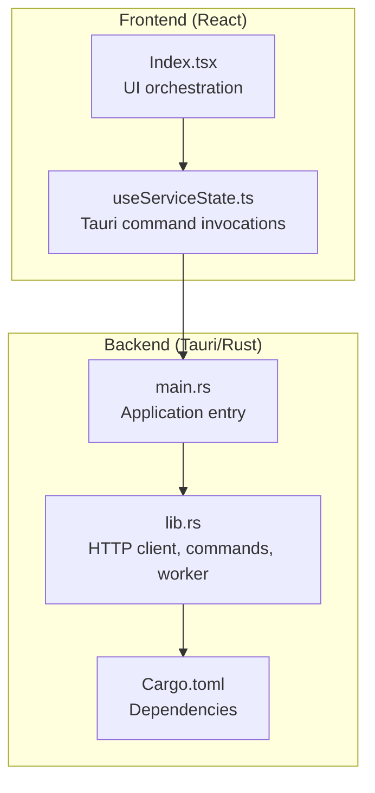
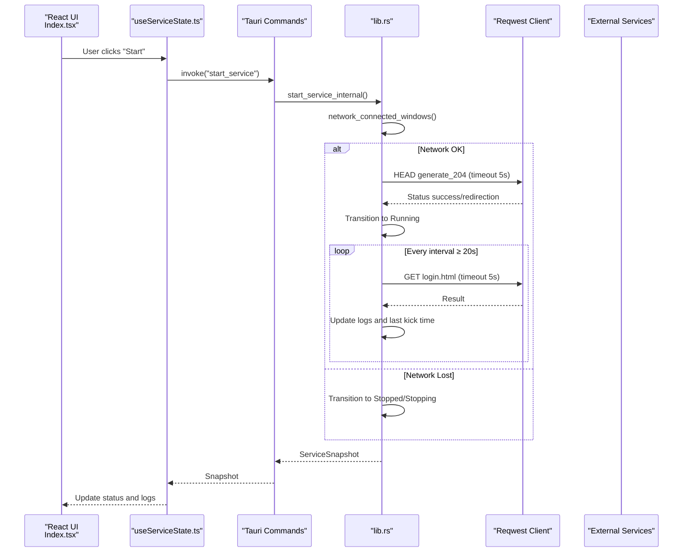
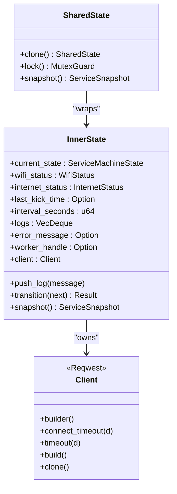
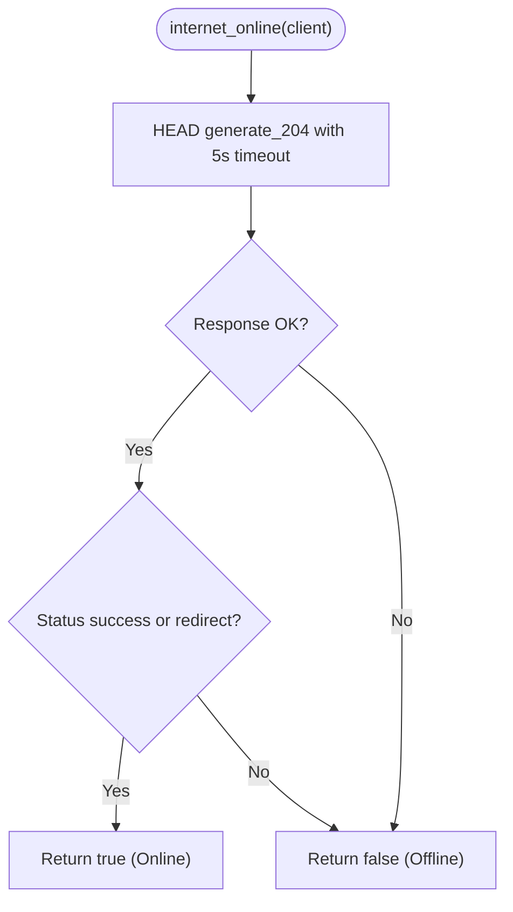
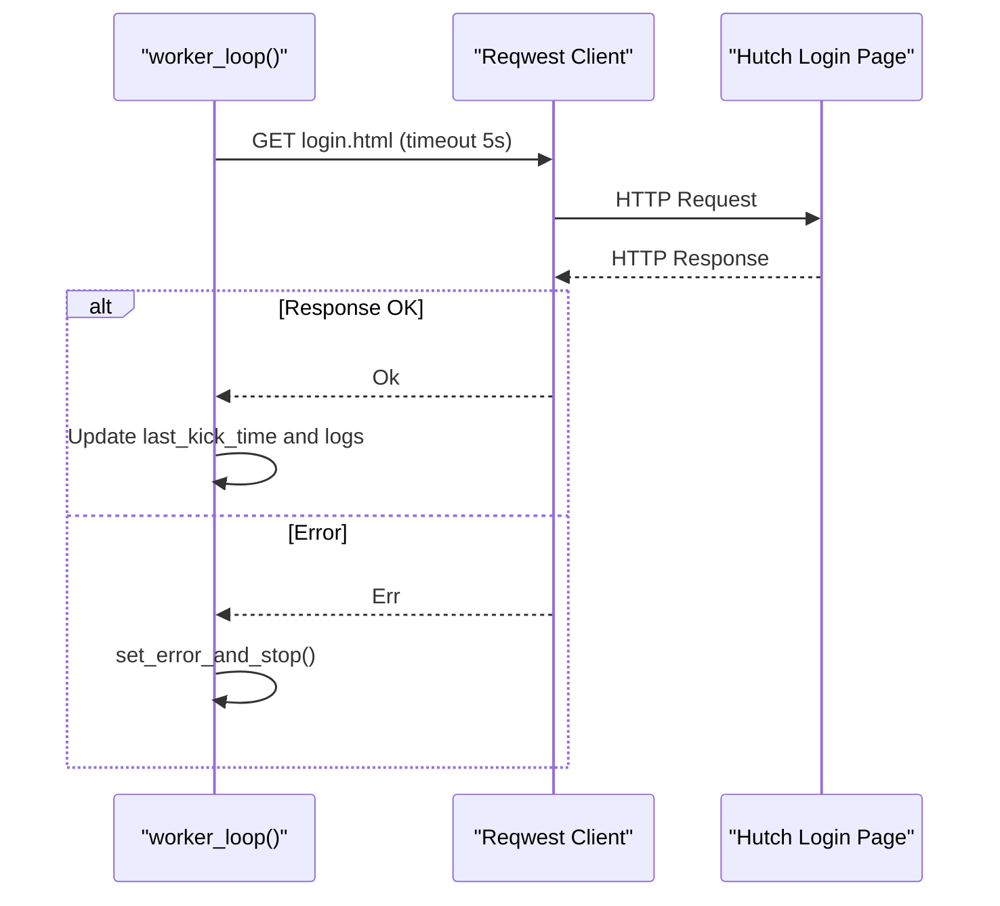
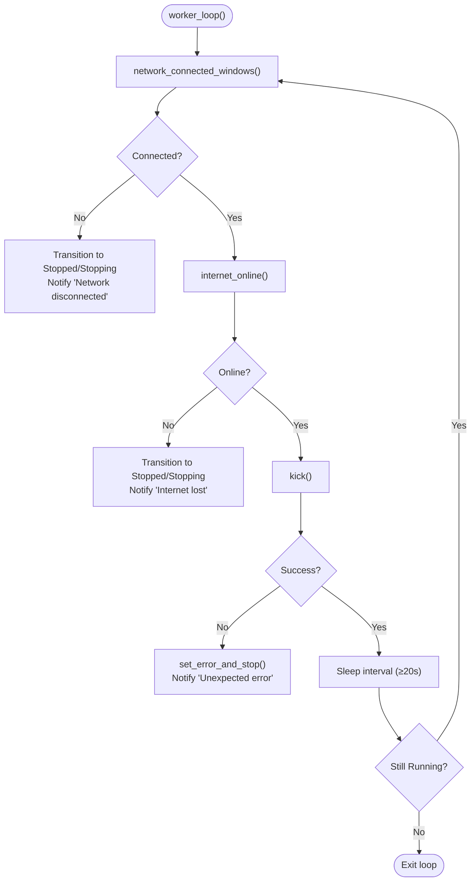
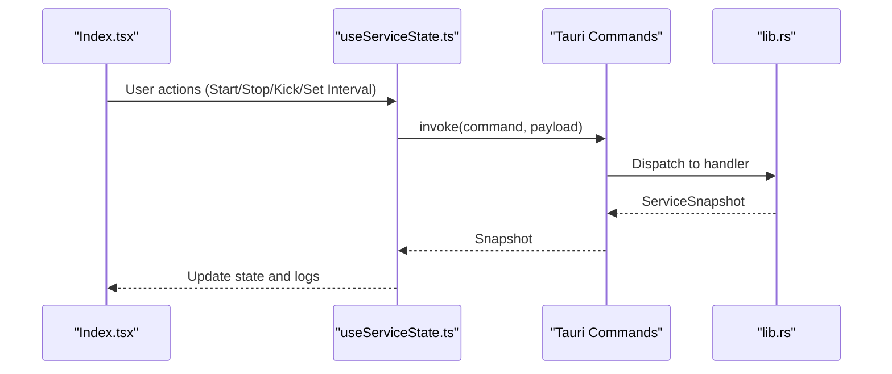
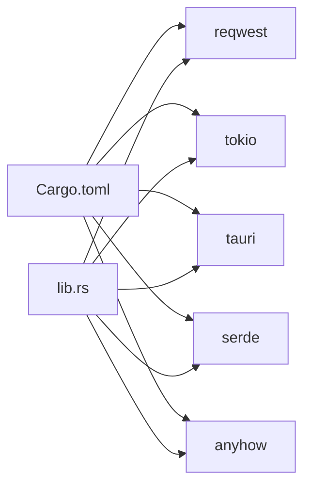

# HTTP Client Integration

<cite>
**Referenced Files in This Document**
- [lib.rs](file://src-tauri/src/lib.rs)
- [main.rs](file://src-tauri/src/main.rs)
- [Cargo.toml](file://src-tauri/Cargo.toml)
- [Index.tsx](file://src/pages/Index.tsx)
- [useServiceState.ts](file://src/hooks/useServiceState.ts)
- [README.md](file://README.md)
</cite>

## Table of Contents
1. [Introduction](#introduction)
2. [Project Structure](#project-structure)
3. [Core Components](#core-components)
4. [Architecture Overview](#architecture-overview)
5. [Detailed Component Analysis](#detailed-component-analysis)
6. [Dependency Analysis](#dependency-analysis)
7. [Performance Considerations](#performance-considerations)
8. [Troubleshooting Guide](#troubleshooting-guide)
9. [Conclusion](#conclusion)
10. [Appendices](#appendices)

## Introduction
This document explains the HTTP client integration using Reqwest in the Tauri backend. It covers client configuration, timeouts, connectivity checks via Google's generate_204 endpoint, the authentication kick mechanism against Hutch.lk's login page, asynchronous operations, error handling, and lifecycle management. It also provides guidance on extending functionality and adding custom endpoints.

## Project Structure
The HTTP client integration resides in the Tauri Rust backend module. The frontend React application communicates with the backend via Tauri commands, which internally use the configured HTTP client.

**Diagram sources**
- [main.rs](file://src-tauri/src/main.rs#L1-L7)
- [lib.rs](file://src-tauri/src/lib.rs#L658-L686)
- [Cargo.toml](file://src-tauri/Cargo.toml#L1-L29)

**Section sources**
- [README.md](file://README.md#L34-L62)
- [main.rs](file://src-tauri/src/main.rs#L1-L7)
- [lib.rs](file://src-tauri/src/lib.rs#L658-L686)
- [Cargo.toml](file://src-tauri/Cargo.toml#L1-L29)

## Core Components
- HTTP Client Builder: Creates a shared Reqwest client with connect and request timeouts.
- Connectivity Checker: Uses Google's generate_204 endpoint to detect internet availability.
- Authentication Kick: Sends a GET request to Hutch.lk's login page to maintain session activity.
- Worker Loop: Periodically performs connectivity checks and kicks, managing state transitions and notifications.
- Tauri Commands: Exposes start/stop/kick/set_interval/get_status to the frontend.

Key constants and endpoints:
- Connectivity URL: https://www.gstatic.com/generate_204
- Kick URL: https://selfcare.hutch.lk/selfcare/login.html
- Connect timeout: 3 seconds
- Request timeout: 5 seconds
- Minimum interval: 20 seconds

**Section sources**
- [lib.rs](file://src-tauri/src/lib.rs#L17-L26)
- [lib.rs](file://src-tauri/src/lib.rs#L660-L664)
- [lib.rs](file://src-tauri/src/lib.rs#L351-L371)

## Architecture Overview
The frontend triggers Tauri commands that delegate to Rust functions. These functions use the shared HTTP client to perform async operations, update internal state, and notify the user via system notifications.

**Diagram sources**
- [useServiceState.ts](file://src/hooks/useServiceState.ts#L109-L125)
- [lib.rs](file://src-tauri/src/lib.rs#L475-L564)
- [lib.rs](file://src-tauri/src/lib.rs#L415-L473)
- [lib.rs](file://src-tauri/src/lib.rs#L351-L371)

## Detailed Component Analysis

### HTTP Client Configuration and Lifecycle
- Client creation occurs once during application startup and is managed via a shared state wrapper.
- Timeout configuration:
  - Connect timeout: 3 seconds
  - Request timeout: 5 seconds
- The client is cloned per operation to avoid borrowing issues in async contexts.
- Lifecycle:
  - Created in the main entry point.
  - Managed by SharedState/Arc<Mutex<InnerState>>.
  - Used by worker loop and command handlers.
  - No explicit destructor; client is dropped when the process exits.

**Diagram sources**
- [lib.rs](file://src-tauri/src/lib.rs#L73-L158)
- [lib.rs](file://src-tauri/src/lib.rs#L658-L664)

**Section sources**
- [lib.rs](file://src-tauri/src/lib.rs#L658-L664)
- [lib.rs](file://src-tauri/src/lib.rs#L83-L84)
- [lib.rs](file://src-tauri/src/lib.rs#L143-L158)

### Connectivity Checking with Google generate_204
- Purpose: Determine if the device has internet access without relying on captive portals.
- Implementation:
  - Performs a HEAD request to https://www.gstatic.com/generate_204.
  - Applies a 5-second request timeout.
  - Treats success or redirection statuses as online; errors as offline.
- Integration:
  - Called during service start and in the worker loop.
  - Updates internal internet status and triggers stop logic if offline.

**Diagram sources**
- [lib.rs](file://src-tauri/src/lib.rs#L351-L362)

**Section sources**
- [lib.rs](file://src-tauri/src/lib.rs#L24-L25)
- [lib.rs](file://src-tauri/src/lib.rs#L351-L362)

### Authentication Kick Mechanism (Hutch.lk)
- Purpose: Keep the Hutch selfcare session alive by periodically requesting the login page.
- Implementation:
  - GET request to https://selfcare.hutch.lk/selfcare/login.html.
  - 5-second request timeout.
  - On failure, transitions to error state and stops the service.
- Integration:
  - Executed inside the worker loop at configured intervals.
  - Logs successful kicks and updates last kick time.

**Diagram sources**
- [lib.rs](file://src-tauri/src/lib.rs#L415-L473)
- [lib.rs](file://src-tauri/src/lib.rs#L460-L463)
- [lib.rs](file://src-tauri/src/lib.rs#L364-L371)

**Section sources**
- [lib.rs](file://src-tauri/src/lib.rs#L25)
- [lib.rs](file://src-tauri/src/lib.rs#L364-L371)
- [lib.rs](file://src-tauri/src/lib.rs#L460-L463)

### Async Operations, Timeouts, and Error Handling
- Async model:
  - Worker loop runs continuously while service is running.
  - Each iteration sleeps for the configured interval (minimum 20 seconds).
- Timeouts:
  - Connect timeout: 3 seconds.
  - Request timeout: 5 seconds.
- Error handling:
  - Network adapter checks: on failure, service stops and notifies the user.
  - Internet check failures: service transitions to stopped with error state.
  - Kick failures: service transitions to error and stops.
  - General panics: captured and converted to error state with notification.

**Diagram sources**
- [lib.rs](file://src-tauri/src/lib.rs#L415-L473)
- [lib.rs](file://src-tauri/src/lib.rs#L351-L371)
- [lib.rs](file://src-tauri/src/lib.rs#L373-L413)
- [lib.rs](file://src-tauri/src/lib.rs#L193-L205)

**Section sources**
- [lib.rs](file://src-tauri/src/lib.rs#L18-L21)
- [lib.rs](file://src-tauri/src/lib.rs#L660-L664)
- [lib.rs](file://src-tauri/src/lib.rs#L415-L473)
- [lib.rs](file://src-tauri/src/lib.rs#L351-L371)
- [lib.rs](file://src-tauri/src/lib.rs#L373-L413)
- [lib.rs](file://src-tauri/src/lib.rs#L193-L205)

### Frontend Integration and Command Usage
- The React UI invokes Tauri commands to control the backend service:
  - get_status: Polls the current state and logs.
  - start_service: Starts the worker loop.
  - stop_service: Stops the worker loop.
  - kick_now: Forces a single kick.
  - set_interval: Adjusts the kick interval (min 20s).
  - quit_app: Exits the application.
- The frontend polls status every ~1.2 seconds and displays logs and status.

**Diagram sources**
- [Index.tsx](file://src/pages/Index.tsx#L9-L52)
- [useServiceState.ts](file://src/hooks/useServiceState.ts#L88-L107)
- [useServiceState.ts](file://src/hooks/useServiceState.ts#L109-L144)
- [lib.rs](file://src-tauri/src/lib.rs#L599-L656)

**Section sources**
- [Index.tsx](file://src/pages/Index.tsx#L9-L52)
- [useServiceState.ts](file://src/hooks/useServiceState.ts#L88-L144)
- [lib.rs](file://src-tauri/src/lib.rs#L599-L656)

## Dependency Analysis
- External libraries:
  - reqwest: HTTP client with async support.
  - tokio: async runtime and sleep utilities.
  - tauri: desktop framework and plugin ecosystem.
  - serde: serialization for snapshots and logs.
  - anyhow: error handling abstraction.
- Internal dependencies:
  - SharedState manages access to the HTTP client and worker handle.
  - Commands depend on SharedState to coordinate state and client usage.

**Diagram sources**
- [Cargo.toml](file://src-tauri/Cargo.toml#L20-L28)
- [lib.rs](file://src-tauri/src/lib.rs#L1-L15)

**Section sources**
- [Cargo.toml](file://src-tauri/Cargo.toml#L20-L28)
- [lib.rs](file://src-tauri/src/lib.rs#L1-L15)

## Performance Considerations
- Minimize overhead:
  - Reuse a single HTTP client instance via SharedState.
  - Use short timeouts (connect 3s, request 5s) to prevent blocking UI.
- Reduce contention:
  - Clone the client per operation to avoid borrowing across awaits.
- Backoff and throttling:
  - Minimum 20-second interval prevents excessive network traffic.
- Logging limits:
  - Fixed-size log buffer (30 entries) keeps memory bounded.

[No sources needed since this section provides general guidance]

## Troubleshooting Guide
Common scenarios and resolutions:
- Network adapter disconnected:
  - Symptom: Service transitions to Stopped with notification "Network disconnected".
  - Resolution: Connect Wi-Fi/Ethernet and restart the service.
- Internet offline:
  - Symptom: Service transitions to Stopped with notification "Internet lost".
  - Resolution: Fix connectivity and restart the service.
- Kick request fails:
  - Symptom: Error state triggered and service stops.
  - Resolution: Verify Hutch.lk accessibility and network policies; retry later.
- Backend unresponsive:
  - Symptom: UI shows "Backend unavailable" message.
  - Resolution: Ensure the app is running under Tauri desktop runtime.

**Section sources**
- [lib.rs](file://src-tauri/src/lib.rs#L373-L413)
- [lib.rs](file://src-tauri/src/lib.rs#L455-L463)
- [lib.rs](file://src-tauri/src/lib.rs#L193-L205)
- [Index.tsx](file://src/pages/Index.tsx#L39-L43)

## Conclusion
The HTTP client integration leverages a configured Reqwest client to perform periodic connectivity checks and authentication kicks. The design emphasizes reliability with timeouts, robust error handling, and a clear state machine. The frontend integrates seamlessly via Tauri commands, enabling real-time monitoring and control.

[No sources needed since this section summarizes without analyzing specific files]

## Appendices

### Example Workflows

#### Successful Kick Cycle
- Start service → network check passes → internet check passes → kick succeeds → log updated → sleep until next interval.

**Section sources**
- [lib.rs](file://src-tauri/src/lib.rs#L475-L564)
- [lib.rs](file://src-tauri/src/lib.rs#L415-L473)
- [lib.rs](file://src-tauri/src/lib.rs#L621-L642)

#### Failed Kick Scenario
- Start service → network check passes → internet check passes → kick fails → error state → stop service → notification shown.

**Section sources**
- [lib.rs](file://src-tauri/src/lib.rs#L455-L463)
- [lib.rs](file://src-tauri/src/lib.rs#L193-L205)

#### Connection Failure Scenario
- Start service → network check fails → stop service → notification "Network state unknown" or "No active network adapter".

**Section sources**
- [lib.rs](file://src-tauri/src/lib.rs#L489-L516)

### Extending HTTP Functionality
- Add a new endpoint:
  - Define a constant for the URL.
  - Create a function similar to kick/internet_online with appropriate timeout.
  - Wire it into the worker loop or expose via a new Tauri command.
- Customize timeouts:
  - Adjust CONNECT_TIMEOUT_SECONDS and REQUEST_TIMEOUT_SECONDS as needed.
- Integrate with existing state:
  - Use SharedState to access the client and update logs/status.

**Section sources**
- [lib.rs](file://src-tauri/src/lib.rs#L17-L21)
- [lib.rs](file://src-tauri/src/lib.rs#L24-L25)
- [lib.rs](file://src-tauri/src/lib.rs#L351-L371)
- [lib.rs](file://src-tauri/src/lib.rs#L621-L642)