# Service State Machine

<cite>
**Referenced Files in This Document**
- [lib.rs](file://src-tauri/src/lib.rs)
- [main.rs](file://src-tauri/src/main.rs)
- [Cargo.toml](file://src-tauri/Cargo.toml)
- [useServiceState.ts](file://src/hooks/useServiceState.ts)
- [Index.tsx](file://src/pages/Index.tsx)
- [README.md](file://README.md)
</cite>

## Table of Contents
1. [Introduction](#introduction)
2. [Project Structure](#project-structure)
3. [Core Components](#core-components)
4. [Architecture Overview](#architecture-overview)
5. [Detailed Component Analysis](#detailed-component-analysis)
6. [Dependency Analysis](#dependency-analysis)
7. [Performance Considerations](#performance-considerations)
8. [Troubleshooting Guide](#troubleshooting-guide)
9. [Conclusion](#conclusion)
10. [Appendices](#appendices)

## Introduction
This document explains the service state machine that powers the Hutch-Kick application. The state machine manages the lifecycle of a background service that periodically "kicks" the Hutch self-care page to maintain connectivity. It defines five states: Stopped, Starting, Running, Stopping, and Error. The implementation enforces strict state transitions, captures comprehensive snapshots of the service state, and ensures thread-safe access using a shared state container with an internal mutex. The frontend integrates with the backend via Tauri commands to reflect real-time state changes and enable user-driven actions.

## Project Structure
The state machine resides in the Rust backend and is exposed to the React frontend through Tauri commands. The frontend polls the backend for state updates and invokes commands to start, stop, or manually trigger kicks.

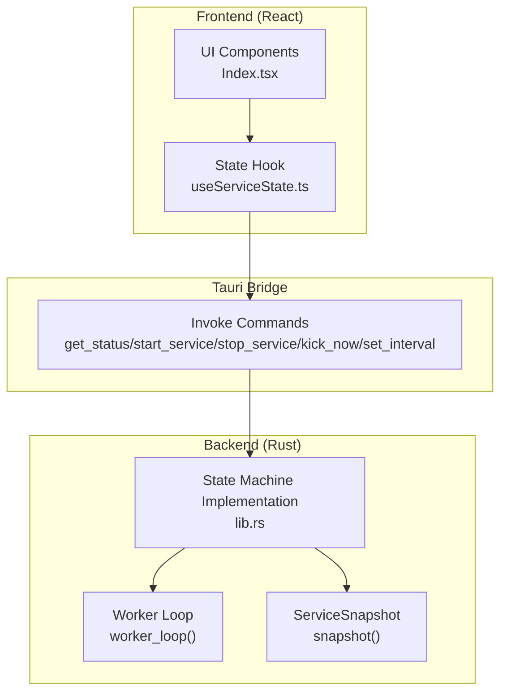

**Diagram sources**
- [lib.rs](file://src-tauri/src/lib.rs#L61-L114)
- [lib.rs](file://src-tauri/src/lib.rs#L415-L473)
- [useServiceState.ts](file://src/hooks/useServiceState.ts#L88-L107)
- [Index.tsx](file://src/pages/Index.tsx#L9-L52)

**Section sources**
- [README.md](file://README.md#L22-L50)
- [lib.rs](file://src-tauri/src/lib.rs#L61-L114)
- [useServiceState.ts](file://src/hooks/useServiceState.ts#L67-L107)

## Core Components
- ServiceMachineState: Enumerates the five states (Stopped, Starting, Running, Stopping, Error).
- ServiceSnapshot: Immutable view of the service state, including current state, Wi-Fi and internet status, last kick time, interval, logs, and error message.
- InnerState: Mutable state container holding the current state, statuses, timing, logs, error message, worker handle, and HTTP client.
- SharedState: Thread-safe wrapper around InnerState using Arc<Mutex<InnerState>>.
- Transition Validation: A deterministic function that validates allowed transitions between states.
- Worker Loop: Background task that periodically checks connectivity, performs kicks, and updates state.
- Tauri Commands: Exposed commands for UI interaction (start, stop, manual kick, status query, interval setting).

**Section sources**
- [lib.rs](file://src-tauri/src/lib.rs#L27-L35)
- [lib.rs](file://src-tauri/src/lib.rs#L61-L71)
- [lib.rs](file://src-tauri/src/lib.rs#L73-L84)
- [lib.rs](file://src-tauri/src/lib.rs#L143-L158)
- [lib.rs](file://src-tauri/src/lib.rs#L160-L171)
- [lib.rs](file://src-tauri/src/lib.rs#L415-L473)
- [lib.rs](file://src-tauri/src/lib.rs#L599-L651)

## Architecture Overview
The state machine follows a finite state machine pattern with explicit validation and a snapshot-based query mechanism. The backend exposes commands to the frontend, which polls for updates and triggers actions. The worker loop runs only while the service is in the Running state, checking connectivity and performing periodic kicks.

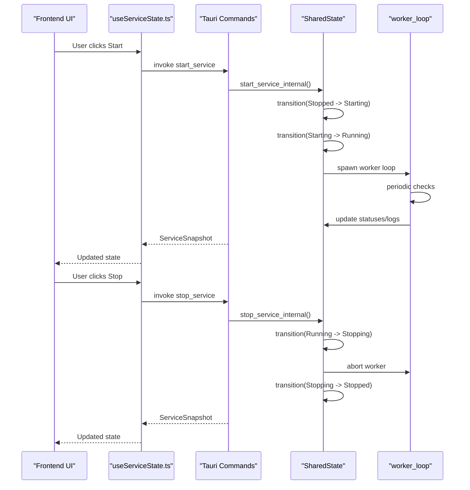

**Diagram sources**
- [lib.rs](file://src-tauri/src/lib.rs#L475-L564)
- [lib.rs](file://src-tauri/src/lib.rs#L566-L597)
- [lib.rs](file://src-tauri/src/lib.rs#L415-L473)
- [useServiceState.ts](file://src/hooks/useServiceState.ts#L109-L125)

## Detailed Component Analysis

### State Machine Definition and Transitions
The state machine defines five states and a deterministic transition function that validates allowed transitions. The function accepts any transition to Error and any transition from Error to Stopped, plus the following ordered transitions:
- Stopped -> Starting
- Starting -> Running
- Starting -> Stopped
- Running -> Stopping
- Stopping -> Stopped

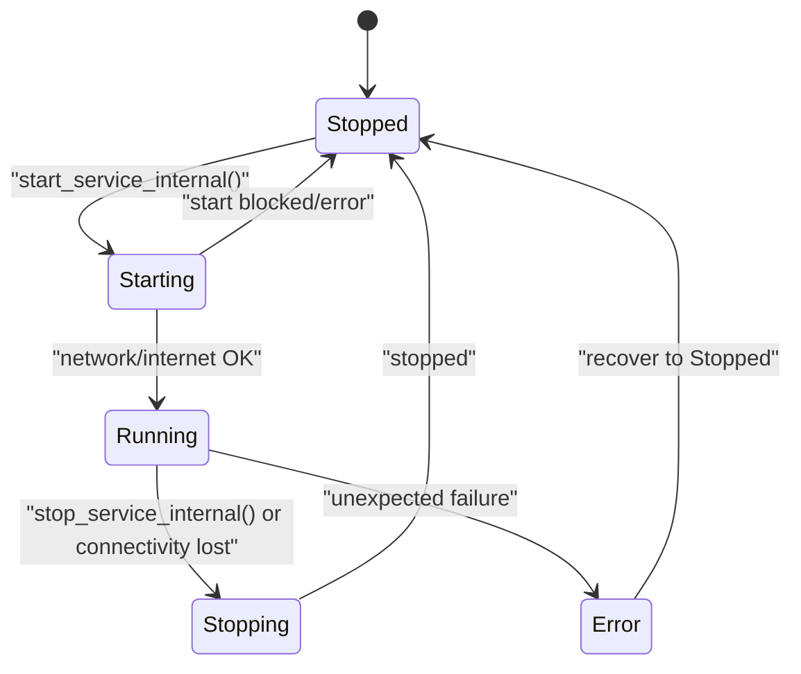

**Diagram sources**
- [lib.rs](file://src-tauri/src/lib.rs#L27-L35)
- [lib.rs](file://src-tauri/src/lib.rs#L160-L171)
- [lib.rs](file://src-tauri/src/lib.rs#L475-L564)
- [lib.rs](file://src-tauri/src/lib.rs#L566-L597)

**Section sources**
- [lib.rs](file://src-tauri/src/lib.rs#L27-L35)
- [lib.rs](file://src-tauri/src/lib.rs#L160-L171)

### ServiceSnapshot and State Representation
ServiceSnapshot encapsulates the complete service state for UI consumption:
- current_state: Current state of the service
- wifi_status: Wi-Fi connectivity status
- internet_status: Internet availability status
- last_kick_time_ms: Timestamp of the last successful kick
- interval_seconds: Kick interval in seconds
- logs: Recent log entries
- error_message: Last error message if any

The snapshot is generated from InnerState and is immutable, enabling safe sharing across threads and UI updates.

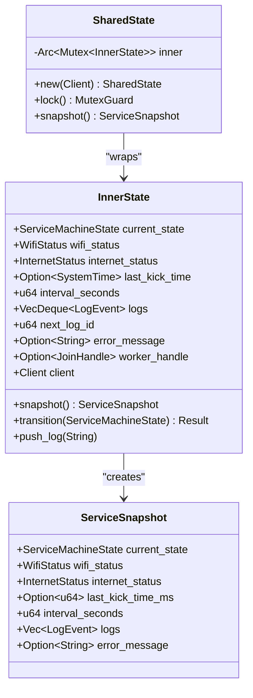

**Diagram sources**
- [lib.rs](file://src-tauri/src/lib.rs#L61-L71)
- [lib.rs](file://src-tauri/src/lib.rs#L73-L84)
- [lib.rs](file://src-tauri/src/lib.rs#L143-L158)
- [lib.rs](file://src-tauri/src/lib.rs#L104-L114)

**Section sources**
- [lib.rs](file://src-tauri/src/lib.rs#L61-L71)
- [lib.rs](file://src-tauri/src/lib.rs#L73-L84)
- [lib.rs](file://src-tauri/src/lib.rs#L104-L114)
- [lib.rs](file://src-tauri/src/lib.rs#L143-L158)

### Thread-Safe State Management
SharedState wraps InnerState in Arc<Mutex<InnerState>> to ensure thread-safe access across asynchronous tasks and Tauri commands. The lock() method returns a MutexGuard, and snapshot() creates an immutable copy of the state for UI consumption.

Key characteristics:
- Atomic access to state changes
- Snapshot pattern prevents long-held locks during UI rendering
- Poisoned mutex recovery using unwrap_or_else to continue operation

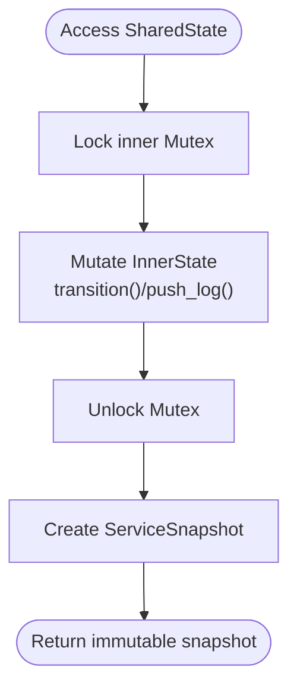

**Diagram sources**
- [lib.rs](file://src-tauri/src/lib.rs#L143-L158)
- [lib.rs](file://src-tauri/src/lib.rs#L104-L114)

**Section sources**
- [lib.rs](file://src-tauri/src/lib.rs#L143-L158)
- [lib.rs](file://src-tauri/src/lib.rs#L104-L114)

### Transition Validation Logic
The transition validator enforces the state machine rules. It allows:
- Any transition to Error
- Recovery from Error to Stopped
- Ordered transitions: Stopped -> Starting -> Running
- Reverse transitions: Running -> Stopping -> Stopped
- Immediate stop from Starting to Stopped

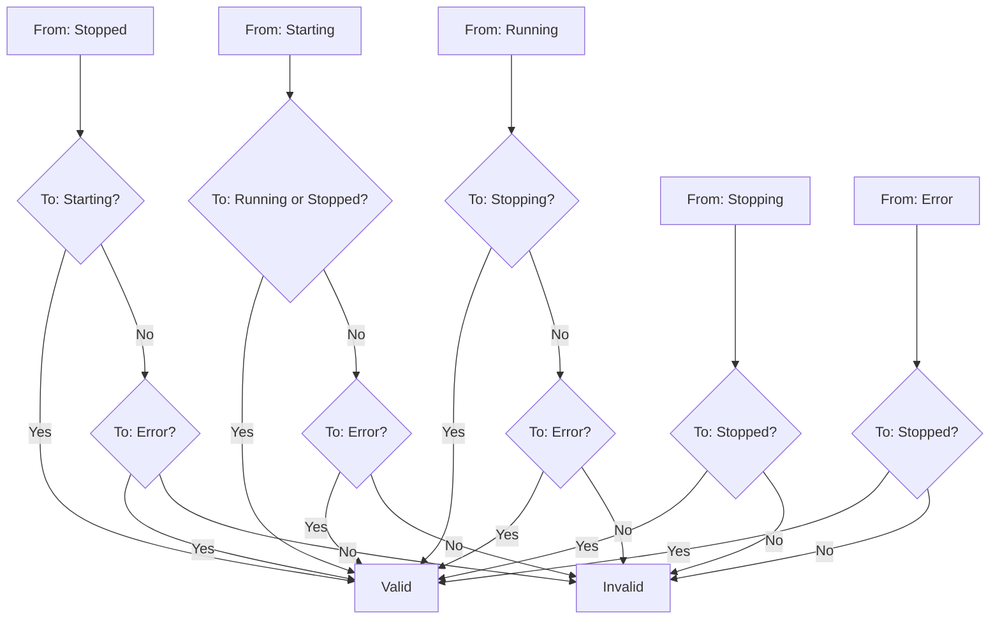

**Diagram sources**
- [lib.rs](file://src-tauri/src/lib.rs#L160-L171)

**Section sources**
- [lib.rs](file://src-tauri/src/lib.rs#L160-L171)

### State Change Triggers and User Actions
User actions trigger state changes through Tauri commands invoked by the frontend hook:

- Start action:
  - Calls start_service command
  - Validates network and internet connectivity
  - Transitions to Starting, then Running, spawns worker loop
  - On failure, transitions to Error, then Stopped

- Stop action:
  - Calls stop_service command
  - Transitions to Stopping, aborts worker, then to Stopped

- Manual kick:
  - Calls kick_now command
  - Sends a single kick request
  - On failure, transitions to Error, then Stopped

- Interval change:
  - Calls set_interval command
  - Updates the kick interval (minimum enforced)

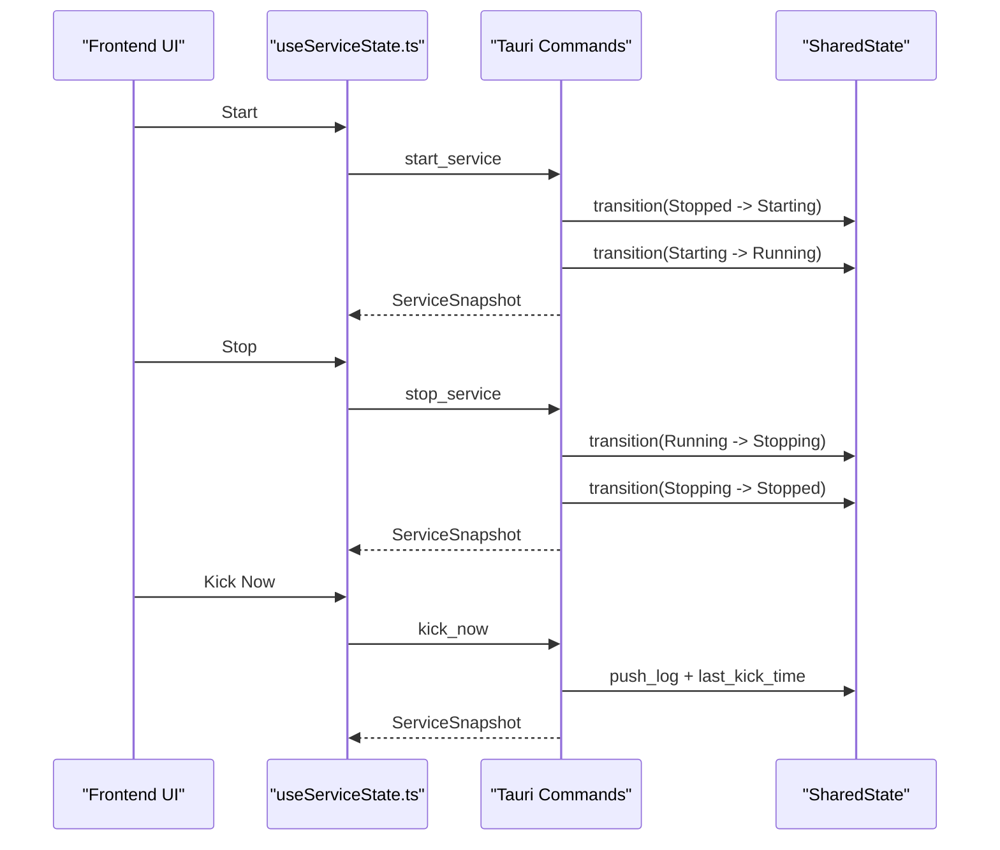

**Diagram sources**
- [useServiceState.ts](file://src/hooks/useServiceState.ts#L109-L134)
- [lib.rs](file://src-tauri/src/lib.rs#L599-L651)
- [lib.rs](file://src-tauri/src/lib.rs#L475-L564)
- [lib.rs](file://src-tauri/src/lib.rs#L566-L597)
- [lib.rs](file://src-tauri/src/lib.rs#L621-L642)

**Section sources**
- [useServiceState.ts](file://src/hooks/useServiceState.ts#L109-L134)
- [lib.rs](file://src-tauri/src/lib.rs#L599-L651)
- [lib.rs](file://src-tauri/src/lib.rs#L475-L564)
- [lib.rs](file://src-tauri/src/lib.rs#L566-L597)
- [lib.rs](file://src-tauri/src/lib.rs#L621-L642)

### Error Handling Mechanisms
Errors are handled centrally to ensure the service recovers predictably:
- set_error_and_stop transitions to Error, records the error message, then moves to Stopped
- stop_for_connectivity transitions to Stopping and then Stopped upon network or internet loss
- start_service_internal blocks start attempts when network state is unknown or no adapter is connected
- worker_loop and manual kick failures trigger error handling

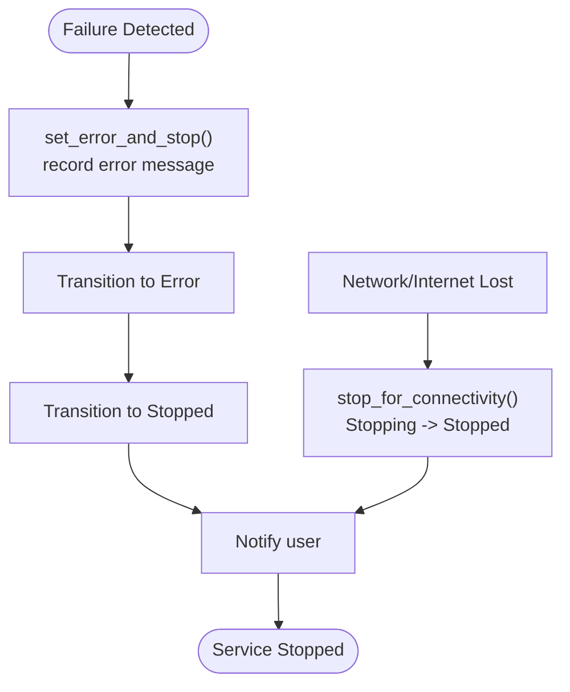

**Diagram sources**
- [lib.rs](file://src-tauri/src/lib.rs#L193-L205)
- [lib.rs](file://src-tauri/src/lib.rs#L373-L413)

**Section sources**
- [lib.rs](file://src-tauri/src/lib.rs#L193-L205)
- [lib.rs](file://src-tauri/src/lib.rs#L373-L413)

### Worker Loop and Periodic Operations
The worker loop runs while the service is Running:
- Checks Wi-Fi connectivity
- Verifies internet availability
- Performs a kick request
- Updates last kick time and logs
- Respects the configured interval (minimum enforced)

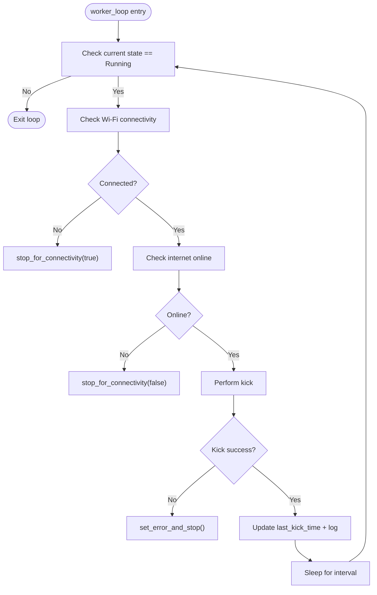

**Diagram sources**
- [lib.rs](file://src-tauri/src/lib.rs#L415-L473)
- [lib.rs](file://src-tauri/src/lib.rs#L373-L413)
- [lib.rs](file://src-tauri/src/lib.rs#L193-L205)

**Section sources**
- [lib.rs](file://src-tauri/src/lib.rs#L415-L473)
- [lib.rs](file://src-tauri/src/lib.rs#L373-L413)
- [lib.rs](file://src-tauri/src/lib.rs#L193-L205)

### Frontend Integration and State Queries
The frontend uses a React hook to poll the backend for state updates and invoke commands:
- Polling interval: 1200 ms
- Commands: get_status, start_service, stop_service, kick_now, set_interval
- Snapshot mapping: Converts backend timestamps and enumerations to frontend types
- Error handling: Displays error messages and marks backend connectivity

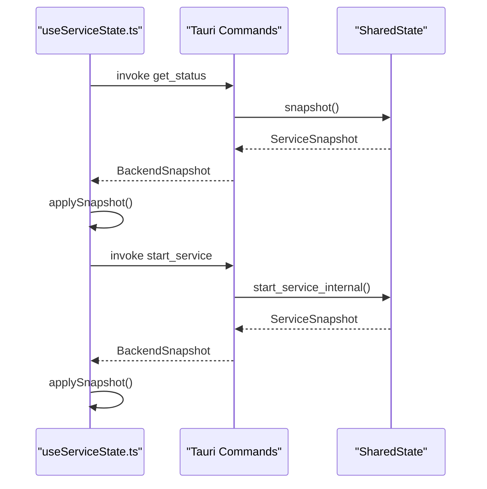

**Diagram sources**
- [useServiceState.ts](file://src/hooks/useServiceState.ts#L88-L107)
- [useServiceState.ts](file://src/hooks/useServiceState.ts#L109-L134)
- [lib.rs](file://src-tauri/src/lib.rs#L599-L651)
- [lib.rs](file://src-tauri/src/lib.rs#L155-L157)

**Section sources**
- [useServiceState.ts](file://src/hooks/useServiceState.ts#L88-L107)
- [useServiceState.ts](file://src/hooks/useServiceState.ts#L109-L134)
- [lib.rs](file://src-tauri/src/lib.rs#L599-L651)
- [lib.rs](file://src-tauri/src/lib.rs#L155-L157)

## Dependency Analysis
The backend depends on Tauri for system integration, reqwest for HTTP requests, tokio for async runtime, and serde for serialization. The frontend communicates with the backend via Tauri commands and React state.

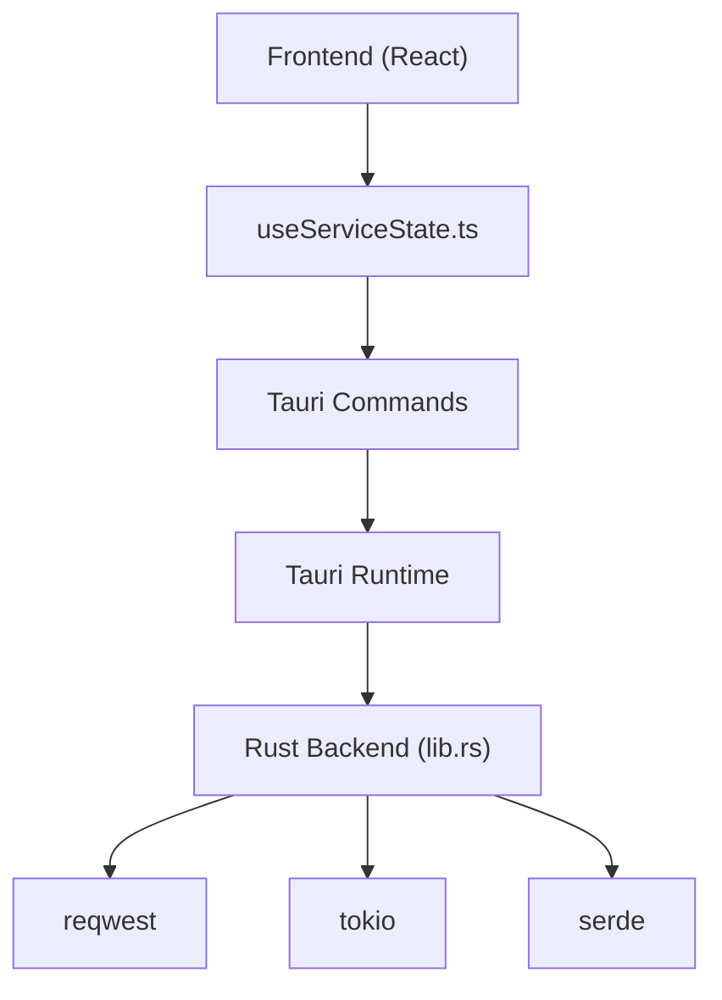

**Diagram sources**
- [Cargo.toml](file://src-tauri/Cargo.toml#L20-L28)
- [lib.rs](file://src-tauri/src/lib.rs#L1-L15)
- [useServiceState.ts](file://src/hooks/useServiceState.ts#L1-L10)

**Section sources**
- [Cargo.toml](file://src-tauri/Cargo.toml#L20-L28)
- [lib.rs](file://src-tauri/src/lib.rs#L1-L15)
- [useServiceState.ts](file://src/hooks/useServiceState.ts#L1-L10)

## Performance Considerations
- Minimum interval enforcement: Ensures the worker loop does not exceed reasonable polling rates.
- Snapshot pattern: Reduces lock contention by returning immutable snapshots for UI rendering.
- Worker abort: Gracefully stops the worker when transitioning away from Running.
- Logging limit: Maintains a bounded log buffer to prevent memory growth.

[No sources needed since this section provides general guidance]

## Troubleshooting Guide
Common issues and recovery steps:
- Network state unknown: Start blocked; connect Wi-Fi/Ethernet or check system network adapters.
- No active network adapter: Start blocked; connect a network adapter.
- Internet offline: Start blocked; resolve connectivity issues.
- Unexpected failure: Service transitions to Error, then Stopped; review logs for details.
- Connectivity loss: Service automatically transitions to Stopping and Stopped; reconnect and restart.

**Section sources**
- [lib.rs](file://src-tauri/src/lib.rs#L475-L564)
- [lib.rs](file://src-tauri/src/lib.rs#L566-L597)
- [lib.rs](file://src-tauri/src/lib.rs#L373-L413)
- [lib.rs](file://src-tauri/src/lib.rs#L193-L205)

## Conclusion
The service state machine provides a robust, thread-safe foundation for managing the Hutch-Kick service lifecycle. Its deterministic transitions, comprehensive snapshots, and centralized error handling ensure predictable behavior and reliable user experience. The frontend integration via Tauri commands enables responsive UI updates and intuitive user controls.

[No sources needed since this section summarizes without analyzing specific files]

## Appendices

### State Transition Table
Allowed transitions:
- Stopped -> Starting
- Starting -> Running
- Starting -> Stopped
- Running -> Stopping
- Stopping -> Stopped
- Any state -> Error
- Error -> Stopped

**Section sources**
- [lib.rs](file://src-tauri/src/lib.rs#L160-L171)

### Example Scenarios
- Normal start: Stopped -> Starting -> Running; worker loop begins.
- User stop: Running -> Stopping -> Stopped; worker aborted.
- Network disconnect: Running -> Stopping -> Stopped; notification sent.
- Manual kick failure: Running -> Error -> Stopped; notification sent.
- Interval change: Running state unaffected; next kick uses new interval.

**Section sources**
- [lib.rs](file://src-tauri/src/lib.rs#L475-L564)
- [lib.rs](file://src-tauri/src/lib.rs#L566-L597)
- [lib.rs](file://src-tauri/src/lib.rs#L373-L413)
- [lib.rs](file://src-tauri/src/lib.rs#L621-L642)