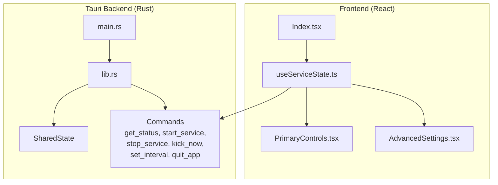
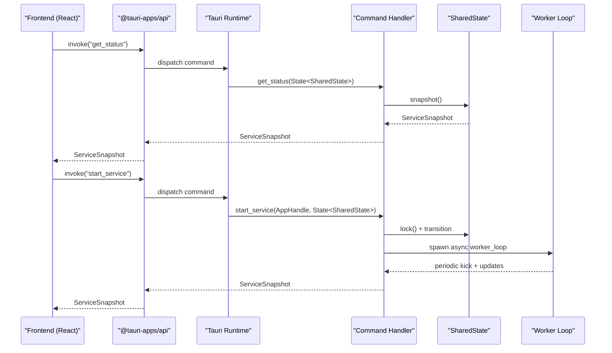
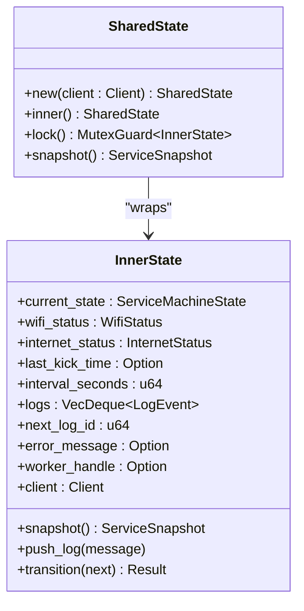
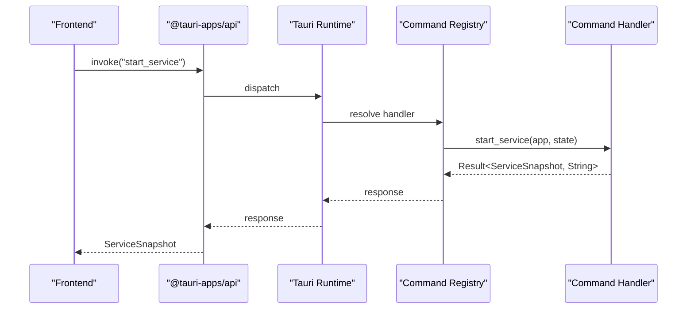
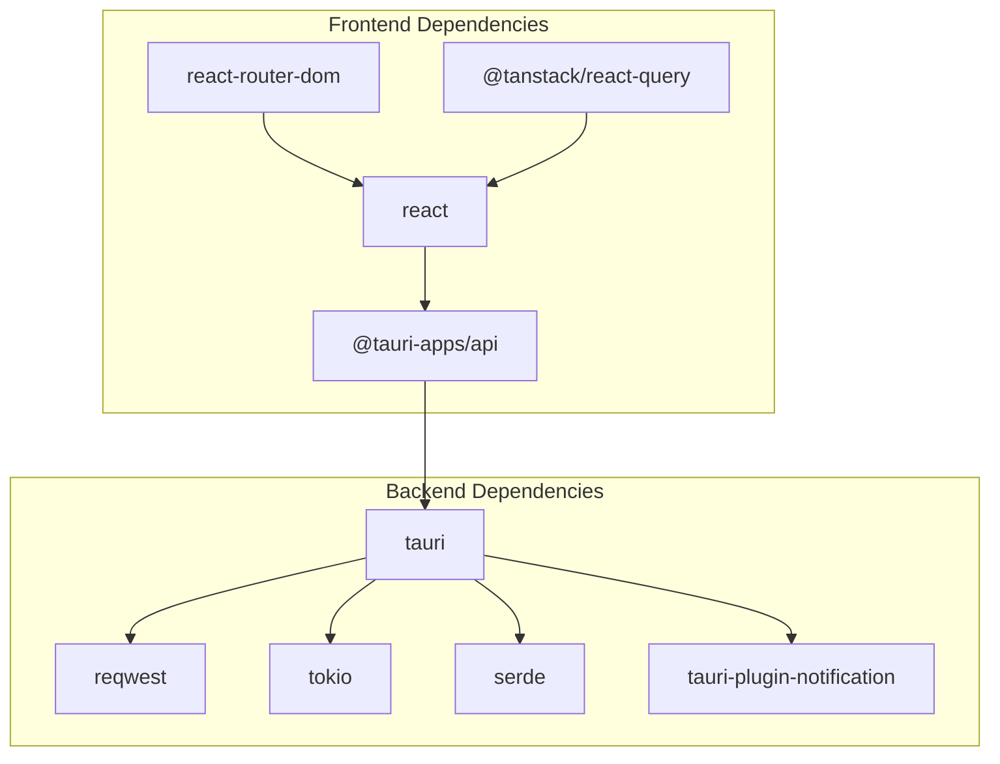

# Tauri Command Handlers

<cite>
**Referenced Files in This Document**
- [main.rs](file://src-tauri/src/main.rs)
- [lib.rs](file://src-tauri/src/lib.rs)
- [Cargo.toml](file://src-tauri/Cargo.toml)
- [tauri.conf.json](file://src-tauri/tauri.conf.json)
- [App.tsx](file://src/App.tsx)
- [Index.tsx](file://src/pages/Index.tsx)
- [useServiceState.ts](file://src/hooks/useServiceState.ts)
- [PrimaryControls.tsx](file://src/components/PrimaryControls.tsx)
- [AdvancedSettings.tsx](file://src/components/AdvancedSettings.tsx)
- [package.json](file://package.json)
</cite>

## Table of Contents
1. [Introduction](#introduction)
2. [Project Structure](#project-structure)
3. [Core Components](#core-components)
4. [Architecture Overview](#architecture-overview)
5. [Detailed Component Analysis](#detailed-component-analysis)
6. [Dependency Analysis](#dependency-analysis)
7. [Performance Considerations](#performance-considerations)
8. [Troubleshooting Guide](#troubleshooting-guide)
9. [Conclusion](#conclusion)
10. [Appendices](#appendices)

## Introduction
This document provides comprehensive documentation for the Tauri command handler system used by the Hutch-Kick application. It covers the six exposed commands: get_status, start_service, stop_service, kick_now, set_interval, and quit_app. The documentation explains command signatures, parameter validation, return value handling, State dependency injection, async command processing, error handling strategies, and integration with the SharedState pattern. It also includes examples of frontend invocation, state mutation patterns, and notification system integration, along with guidance for extending the command API.

## Project Structure
The project follows a standard Tauri desktop application layout:
- Frontend (React + Vite) in the src directory
- Backend (Rust + Tauri) in the src-tauri directory
- Configuration files for Tauri and the build pipeline

Key areas relevant to command handlers:
- Backend command definitions and state management in src-tauri/src/lib.rs
- Application entry point in src-tauri/src/main.rs
- Frontend command invocation via @tauri-apps/api in src/hooks/useServiceState.ts
- UI components that trigger commands in src/components and src/pages

**Diagram sources**
- [main.rs](file://src-tauri/src/main.rs#L1-L7)
- [lib.rs](file://src-tauri/src/lib.rs#L658-L686)
- [useServiceState.ts](file://src/hooks/useServiceState.ts#L1-L163)
- [Index.tsx](file://src/pages/Index.tsx#L1-L55)
- [PrimaryControls.tsx](file://src/components/PrimaryControls.tsx#L1-L73)
- [AdvancedSettings.tsx](file://src/components/AdvancedSettings.tsx#L1-L73)

**Section sources**
- [main.rs](file://src-tauri/src/main.rs#L1-L7)
- [lib.rs](file://src-tauri/src/lib.rs#L658-L686)
- [useServiceState.ts](file://src/hooks/useServiceState.ts#L1-L163)
- [Index.tsx](file://src/pages/Index.tsx#L1-L55)

## Core Components
This section documents the six command handlers and their roles in the system.

- get_status: Returns a snapshot of the current service state to the frontend.
- start_service: Initiates the service worker loop with network checks and transitions to RUNNING.
- stop_service: Stops the service gracefully by aborting the worker and transitioning to STOPPED.
- kick_now: Performs an immediate network kick without changing the interval or worker loop.
- set_interval: Updates the interval between automatic kicks with a minimum bound.
- quit_app: Exits the application cleanly.

Each command is defined with #[tauri::command] and integrates with the SharedState pattern for thread-safe state access.

**Section sources**
- [lib.rs](file://src-tauri/src/lib.rs#L599-L656)

## Architecture Overview
The command handler architecture combines a Rust backend with a React frontend. The backend exposes commands that the frontend invokes using @tauri-apps/api. State is managed centrally via SharedState, which encapsulates an Arc<Mutex<InnerState>> to ensure safe concurrent access.

**Diagram sources**
- [lib.rs](file://src-tauri/src/lib.rs#L599-L656)
- [lib.rs](file://src-tauri/src/lib.rs#L415-L473)
- [useServiceState.ts](file://src/hooks/useServiceState.ts#L88-L125)

## Detailed Component Analysis

### SharedState Pattern and State Management
SharedState encapsulates the application’s mutable state and provides synchronized access via a mutex. It offers:
- Snapshot creation for frontend consumption
- Safe locking mechanisms
- Centralized logging and error propagation

**Diagram sources**
- [lib.rs](file://src-tauri/src/lib.rs#L73-L158)

**Section sources**
- [lib.rs](file://src-tauri/src/lib.rs#L73-L158)

### Command: get_status
Purpose: Provide a read-only snapshot of the current service state to the frontend.

Signature pattern:
- Input: State<SharedState>
- Output: ServiceSnapshot

Processing logic:
- Locks the shared state and constructs a snapshot containing current_state, wifi_status, internet_status, last_kick_time_ms, interval_seconds, logs, and error_message.

Validation and error handling:
- No parameters to validate; returns immediately with a snapshot.

Frontend usage:
- Invoked periodically to update UI state.

**Section sources**
- [lib.rs](file://src-tauri/src/lib.rs#L599-L602)
- [useServiceState.ts](file://src/hooks/useServiceState.ts#L88-L98)

### Command: start_service
Purpose: Start the service worker loop after performing network checks.

Signature pattern:
- Input: AppHandle, State<SharedState>
- Output: Result<ServiceSnapshot, String>

Processing logic:
- Validates current state and transitions to STARTING.
- Checks network adapter connectivity; blocks start if no adapter is connected.
- Verifies internet connectivity; blocks start if offline.
- Transitions to RUNNING and spawns the worker loop.
- The worker loop periodically checks connectivity, performs kicks, and updates state.

Validation and error handling:
- Returns early if not in STOPPED state.
- On errors, sets error_message, transitions to ERROR, then to STOPPED, and notifies the user.

Async processing:
- Uses async runtime to spawn the worker loop.
- Worker loop runs until state changes to a non-running state.

**Section sources**
- [lib.rs](file://src-tauri/src/lib.rs#L604-L610)
- [lib.rs](file://src-tauri/src/lib.rs#L475-L564)

### Command: stop_service
Purpose: Gracefully stop the service by aborting the worker and resetting state.

Signature pattern:
- Input: AppHandle, State<SharedState>
- Output: Result<ServiceSnapshot, String>

Processing logic:
- Transitions to STOPPING, aborts the worker handle, then transitions to STOPPED.
- Clears error_message and resets worker_handle.

Validation and error handling:
- Returns early if not in RUNNING state.

Async processing:
- Aborts the worker handle to stop the loop.

**Section sources**
- [lib.rs](file://src-tauri/src/lib.rs#L612-L618)
- [lib.rs](file://src-tauri/src/lib.rs#L566-L597)

### Command: kick_now
Purpose: Perform an immediate network kick without altering the interval or worker loop.

Signature pattern:
- Input: AppHandle, State<SharedState>
- Output: Result<ServiceSnapshot, String>

Processing logic:
- Checks if the service is RUNNING; returns snapshot if not.
- Executes a single kick request using the HTTP client.
- On success, updates last_kick_time and logs the event.
- On failure, triggers error handling and stops the service.

Validation and error handling:
- Guards against non-RUNNING states.
- Uses centralized error handling to transition to ERROR and STOPPED.

Async processing:
- Performs a single async HTTP request.

**Section sources**
- [lib.rs](file://src-tauri/src/lib.rs#L620-L642)
- [lib.rs](file://src-tauri/src/lib.rs#L193-L205)

### Command: set_interval
Purpose: Change the interval between automatic kicks with a minimum bound.

Signature pattern:
- Input: u64 interval_seconds, State<SharedState>
- Output: ServiceSnapshot

Processing logic:
- Sanitizes the input by taking the maximum of the provided value and the minimum interval constant.
- Updates interval_seconds and logs the change.
- Returns the updated snapshot.

Validation and error handling:
- No explicit error; invalid intervals are sanitized.

Async processing:
- Synchronous state update.

**Section sources**
- [lib.rs](file://src-tauri/src/lib.rs#L644-L651)

### Command: quit_app
Purpose: Exit the application cleanly.

Signature pattern:
- Input: AppHandle
- Output: void

Processing logic:
- Calls app.exit(0) to terminate the application.

Validation and error handling:
- No validation required.

Async processing:
- Immediate termination.

**Section sources**
- [lib.rs](file://src-tauri/src/lib.rs#L653-L656)

### Command Registration and Handler Invocation
Registration:
- The commands are registered during application setup using generate_handler! and passed to the Tauri Builder.

Invocation from frontend:
- The frontend uses @tauri-apps/api invoke to call commands by name.
- Responses are typed according to the backend return types.

**Diagram sources**
- [lib.rs](file://src-tauri/src/lib.rs#L675-L682)
- [useServiceState.ts](file://src/hooks/useServiceState.ts#L109-L125)

**Section sources**
- [lib.rs](file://src-tauri/src/lib.rs#L675-L682)
- [useServiceState.ts](file://src/hooks/useServiceState.ts#L109-L152)

## Dependency Analysis
The backend depends on Tauri v2, reqwest for HTTP requests, tokio for async runtime, and serde for serialization. The frontend depends on @tauri-apps/api for command invocation and React for UI rendering.

**Diagram sources**
- [Cargo.toml](file://src-tauri/Cargo.toml#L20-L28)
- [package.json](file://package.json#L18-L69)

**Section sources**
- [Cargo.toml](file://src-tauri/Cargo.toml#L20-L28)
- [package.json](file://package.json#L18-L69)

## Performance Considerations
- Async worker loop: The worker loop uses tokio::time::sleep to avoid busy-waiting and to respect the configured interval.
- Minimum interval enforcement: set_interval enforces a minimum interval to prevent excessive network activity.
- Logging limits: Logs are capped to a fixed size to control memory usage.
- HTTP timeouts: Requests include connect and request timeouts to avoid blocking operations.

[No sources needed since this section provides general guidance]

## Troubleshooting Guide
Common issues and resolutions:
- Backend unresponsive: The frontend detects backend unavailability and displays a message. Ensure the app is run with the Tauri desktop runtime.
- Network checks failing: On Windows, the network adapter check relies on system commands. Errors are propagated to the UI and logged.
- Error transitions: When unexpected failures occur, the system transitions to ERROR then STOPPED and notifies the user.
- Worker loop termination: Stopping the service aborts the worker handle to ensure clean shutdown.

**Section sources**
- [useServiceState.ts](file://src/hooks/useServiceState.ts#L92-L98)
- [lib.rs](file://src-tauri/src/lib.rs#L373-L413)
- [lib.rs](file://src-tauri/src/lib.rs#L193-L205)

## Conclusion
The Tauri command handler system provides a robust, asynchronous, and thread-safe interface between the frontend and backend. Commands are clearly defined, validated, and integrated with a central SharedState pattern. The system handles errors gracefully, notifies users, and maintains a responsive UI through periodic polling and async processing.

[No sources needed since this section summarizes without analyzing specific files]

## Appendices

### Command Invocation Examples (Frontend)
- get_status: invoke<BackendSnapshot>("get_status")
- start_service: invoke<BackendSnapshot>("start_service")
- stop_service: invoke<BackendSnapshot>("stop_service")
- kick_now: invoke<BackendSnapshot>("kick_now")
- set_interval: invoke<BackendSnapshot>("set_interval", { intervalSeconds })
- quit_app: invoke("quit_app")

These invocations are implemented in the useServiceState hook and consumed by UI components.

**Section sources**
- [useServiceState.ts](file://src/hooks/useServiceState.ts#L88-L152)
- [Index.tsx](file://src/pages/Index.tsx#L19-L48)

### Extending the Command API
Steps to add a new command:
1. Define the command function with #[tauri::command] in the backend.
2. Add parameter validation and state mutations within the function.
3. Return a typed response suitable for the frontend.
4. Register the command in the generate_handler! list during application setup.
5. Invoke the command from the frontend using @tauri-apps/api invoke with the appropriate payload and return type.

Guidance:
- Use State<SharedState> for read/write access to shared state.
- Use AppHandle for notifications and window management.
- Prefer async commands for long-running operations.
- Sanitize inputs and enforce minimum/maximum bounds where applicable.
- Use centralized error handling to maintain consistent state transitions.

**Section sources**
- [lib.rs](file://src-tauri/src/lib.rs#L599-L656)
- [lib.rs](file://src-tauri/src/lib.rs#L675-L682)