# Windows Network Detection

<cite>
**Referenced Files in This Document**
- [main.rs](file://src-tauri/src/main.rs)
- [lib.rs](file://src-tauri/src/lib.rs)
- [Cargo.toml](file://src-tauri/Cargo.toml)
- [useServiceState.ts](file://src/hooks/useServiceState.ts)
- [StatusCard.tsx](file://src/components/StatusCard.tsx)
- [PrimaryControls.tsx](file://src/components/PrimaryControls.tsx)
</cite>

## Table of Contents
1. [Introduction](#introduction)
2. [Project Structure](#project-structure)
3. [Core Components](#core-components)
4. [Architecture Overview](#architecture-overview)
5. [Detailed Component Analysis](#detailed-component-analysis)
6. [Dependency Analysis](#dependency-analysis)
7. [Performance Considerations](#performance-considerations)
8. [Troubleshooting Guide](#troubleshooting-guide)
9. [Conclusion](#conclusion)

## Introduction
This document provides comprehensive technical documentation for the Windows-specific network detection system implemented in the Rust backend of the application. It explains how the system executes the Windows networking utility `netsh` via process APIs, parses its output to detect connected non-loopback network interfaces, and integrates this detection into the overall service state machine. The document also covers the platform-specific compilation attributes (`cfg`), fallback behavior on non-Windows platforms, error handling strategies, and potential improvements or alternative approaches for different platforms.

## Project Structure
The network detection logic resides in the Tauri Rust backend, specifically within the library module. The frontend React components communicate with the backend through Tauri commands to display service status and trigger actions.

**Diagram sources**
- [main.rs](file://src-tauri/src/main.rs#L1-L7)
- [lib.rs](file://src-tauri/src/lib.rs#L658-L686)
- [Cargo.toml](file://src-tauri/Cargo.toml#L1-L29)
- [useServiceState.ts](file://src/hooks/useServiceState.ts#L1-L163)
- [StatusCard.tsx](file://src/components/StatusCard.tsx#L1-L63)
- [PrimaryControls.tsx](file://src/components/PrimaryControls.tsx#L1-L73)

**Section sources**
- [main.rs](file://src-tauri/src/main.rs#L1-L7)
- [lib.rs](file://src-tauri/src/lib.rs#L658-L686)
- [Cargo.toml](file://src-tauri/Cargo.toml#L1-L29)

## Core Components
- Windows network detection function: Executes `netsh interface show interface`, parses output, and determines if any non-loopback interface is connected.
- Service state machine: Manages lifecycle states (Stopped, Starting, Running, Stopping, Error) and coordinates network checks, internet connectivity checks, and periodic "kick" requests.
- Frontend integration: Uses Tauri commands to fetch status snapshots and update UI components.

Key implementation references:
- Windows-specific network detection: [network_connected_windows](file://src-tauri/src/lib.rs#L308-L344)
- Non-Windows fallback: [network_connected_windows fallback](file://src-tauri/src/lib.rs#L346-L349)
- Worker loop and state transitions: [worker_loop](file://src-tauri/src/lib.rs#L415-L473), [start_service_internal](file://src-tauri/src/lib.rs#L475-L564)
- Frontend state binding: [useServiceState.ts](file://src/hooks/useServiceState.ts#L67-L107)

**Section sources**
- [lib.rs](file://src-tauri/src/lib.rs#L308-L349)
- [lib.rs](file://src-tauri/src/lib.rs#L415-L564)
- [useServiceState.ts](file://src/hooks/useServiceState.ts#L67-L107)

## Architecture Overview
The backend exposes Tauri commands that the frontend invokes. The service state machine orchestrates:
1. Initial network check using Windows-specific detection.
2. Periodic network and internet checks during runtime.
3. Conditional stopping when network or internet becomes unavailable.
4. Sending periodic "kick" requests to maintain session.

**Diagram sources**
- [lib.rs](file://src-tauri/src/lib.rs#L475-L564)
- [lib.rs](file://src-tauri/src/lib.rs#L415-L473)
- [lib.rs](file://src-tauri/src/lib.rs#L308-L344)
- [useServiceState.ts](file://src/hooks/useServiceState.ts#L109-L116)

## Detailed Component Analysis

### Windows Network Detection Function
The Windows-specific function executes the `netsh` utility to enumerate network interfaces and determines connectivity by scanning the output for a "connected" state that excludes loopback interfaces.

Implementation highlights:
- Process execution: Uses `std::process::Command` with Windows-specific creation flags to avoid spawning a visible console window.
- Command: Invokes `netsh interface show interface` and captures stdout/stderr.
- Output parsing: Iterates lines, trims whitespace, splits by whitespace into columns, validates minimum column count, extracts state and interface type, and filters for connected non-loopback interfaces.
- Early return: Returns true upon finding the first matching interface; otherwise returns false if none found.
- Error handling: Propagates non-zero exit status and command execution failures as errors.

```mermaid
flowchart TD
Start(["Function Entry"]) --> Exec["Execute 'netsh interface show interface'"]
Exec --> CheckExit{"Exit status success?"}
CheckExit --> |No| ErrExit["Return error"]
CheckExit --> |Yes| ReadStdout["Read stdout"]
ReadStdout --> IterateLines["Iterate lines"]
IterateLines --> SkipEmpty{"Line empty or header?"}
SkipEmpty --> |Yes| NextLine["Next line"]
SkipEmpty --> |No| SplitCols["Split by whitespace"]
SplitCols --> MinCols{"Columns ≥ 4?"}
MinCols --> |No| NextLine
MinCols --> Extract["Extract state and interface type"]
Extract --> Filter{"state == 'connected' AND interface_type != 'loopback'?"}
Filter --> |Yes| ReturnTrue["Return true"]
Filter --> |No| NextLine
NextLine --> IterateLines
ReturnTrue --> End(["Function Exit"])
ErrExit --> End
```

**Diagram sources**
- [lib.rs](file://src-tauri/src/lib.rs#L308-L344)

**Section sources**
- [lib.rs](file://src-tauri/src/lib.rs#L308-L344)

### Interface Filtering Logic
The filtering logic focuses on identifying a connected physical or virtual network adapter that is not the loopback interface. It operates on parsed columns derived from the `netsh` output:
- State column normalized to lowercase for comparison against "connected".
- Interface type column normalized to lowercase for comparison against "loopback".
- Returns immediately upon the first positive match to minimize processing overhead.

This approach ensures that the service does not mistakenly treat a loopback-only state as a valid connection for operational purposes.

**Section sources**
- [lib.rs](file://src-tauri/src/lib.rs#L335-L341)

### Platform-Specific Implementation and Fallback
The network detection function is conditionally compiled for Windows using a `cfg` attribute. On non-Windows platforms, the function returns an error indicating unsupported platform, preventing accidental misuse.

- Windows implementation: [Windows-specific function](file://src-tauri/src/lib.rs#L308-L344)
- Non-Windows fallback: [Fallback function](file://src-tauri/src/lib.rs#L346-L349)

**Section sources**
- [lib.rs](file://src-tauri/src/lib.rs#L308-L349)

### Integration with Service State Machine
The network detection integrates tightly with the service state machine:
- Start path: Validates network connectivity before transitioning to Running; blocks startup if no connected adapter is detected or if the check fails.
- Runtime path: Periodically re-validates network state; stops the service if connectivity is lost.
- Error propagation: Errors from network checks trigger transitions to Error and subsequent Stopped state, with notifications and log entries.

**Diagram sources**
- [lib.rs](file://src-tauri/src/lib.rs#L160-L171)
- [lib.rs](file://src-tauri/src/lib.rs#L475-L564)
- [lib.rs](file://src-tauri/src/lib.rs#L415-L473)

**Section sources**
- [lib.rs](file://src-tauri/src/lib.rs#L160-L171)
- [lib.rs](file://src-tauri/src/lib.rs#L415-L564)

### Frontend Integration and UI Updates
The frontend polls the backend for status snapshots and updates UI components accordingly:
- StatusCard displays network and internet status with appropriate icons and color coding.
- PrimaryControls enables/disables actions based on current state and shows error messages.
- useServiceState manages polling intervals and maps backend snapshots to frontend types.

**Diagram sources**
- [useServiceState.ts](file://src/hooks/useServiceState.ts#L88-L107)
- [lib.rs](file://src-tauri/src/lib.rs#L599-L602)
- [StatusCard.tsx](file://src/components/StatusCard.tsx#L19-L42)
- [PrimaryControls.tsx](file://src/components/PrimaryControls.tsx#L12-L31)

**Section sources**
- [useServiceState.ts](file://src/hooks/useServiceState.ts#L88-L107)
- [StatusCard.tsx](file://src/components/StatusCard.tsx#L19-L42)
- [PrimaryControls.tsx](file://src/components/PrimaryControls.tsx#L12-L31)

## Dependency Analysis
The backend relies on standard library process APIs and external crates for HTTP operations and async runtime. The network detection function depends on the Windows `netsh` utility being present on the system.

**Diagram sources**
- [lib.rs](file://src-tauri/src/lib.rs#L1-L9)
- [Cargo.toml](file://src-tauri/Cargo.toml#L20-L28)

**Section sources**
- [lib.rs](file://src-tauri/src/lib.rs#L1-L9)
- [Cargo.toml](file://src-tauri/Cargo.toml#L20-L28)

## Performance Considerations
- Process execution overhead: The `netsh` invocation occurs during startup and periodically during runtime. While lightweight, repeated invocations should be considered in tight loops.
- Output parsing: Linear scan of interface list with early return on match keeps parsing efficient.
- Concurrency: The worker loop uses asynchronous tasks and sleeps between iterations, avoiding busy-waiting.
- Timeout configuration: HTTP timeouts are configured to balance responsiveness and reliability.

[No sources needed since this section provides general guidance]

## Troubleshooting Guide
Common issues and resolutions:
- Command execution failures: The function returns an error when `netsh` fails to execute or exits with a non-zero status. The service transitions to Error and then Stopped, with a log entry and notification.
  - Reference: [Command execution and error handling](file://src-tauri/src/lib.rs#L314-L322)
- No connected adapters: If no interface is found in a connected state, the function returns false, causing the service to stop or block startup depending on context.
  - Reference: [Return false when no connected interface](file://src-tauri/src/lib.rs#L343-L344)
- Non-Windows platforms: Calling the Windows-specific function on other platforms results in an error indicating unsupported platform.
  - Reference: [Non-Windows fallback](file://src-tauri/src/lib.rs#L346-L349)
- Startup blocked with "Network state unknown": Occurs when the network check fails; the UI notifies the user and prevents service start.
  - Reference: [Startup error handling](file://src-tauri/src/lib.rs#L489-L501)
- Runtime stop due to connectivity loss: The worker loop detects network or internet loss and transitions the service to Stopped.
  - Reference: [Worker loop connectivity checks](file://src-tauri/src/lib.rs#L415-L473)

**Section sources**
- [lib.rs](file://src-tauri/src/lib.rs#L314-L322)
- [lib.rs](file://src-tauri/src/lib.rs#L343-L349)
- [lib.rs](file://src-tauri/src/lib.rs#L489-L501)
- [lib.rs](file://src-tauri/src/lib.rs#L415-L473)

## Conclusion
The Windows network detection system leverages the `netsh` utility to reliably determine whether a non-loopback network interface is connected. Its integration with the service state machine ensures robust operation by validating connectivity before starting and halting automatically when connectivity degrades. Platform-specific compilation guarantees safe usage on Windows while gracefully failing elsewhere. Future enhancements could include alternative detection methods for non-Windows platforms and improved resilience against transient command failures.