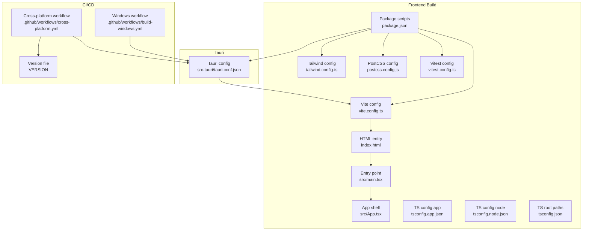
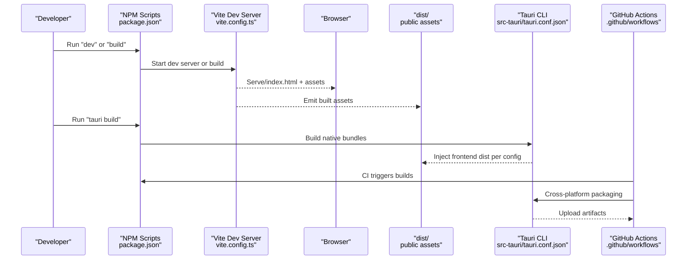
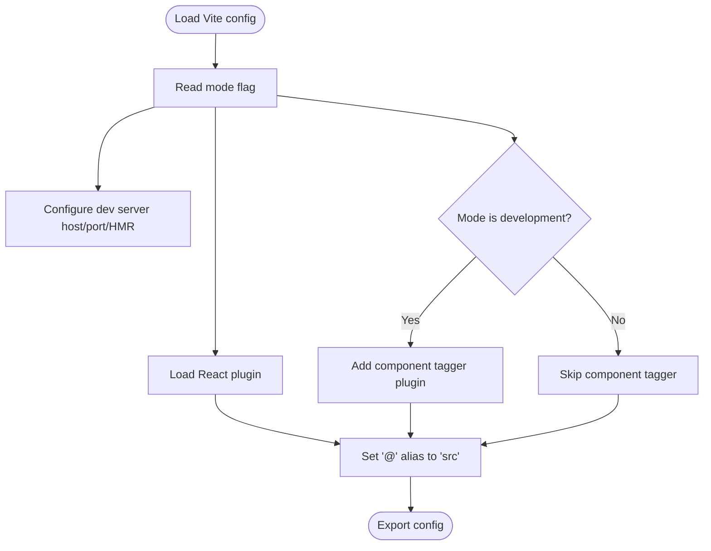
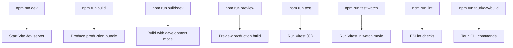
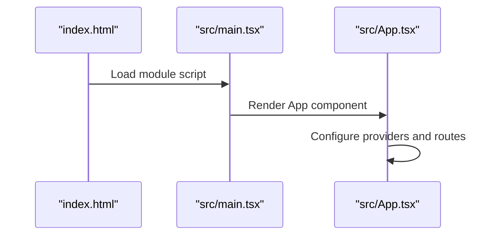
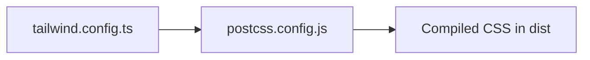
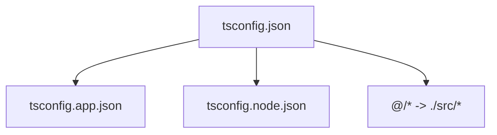
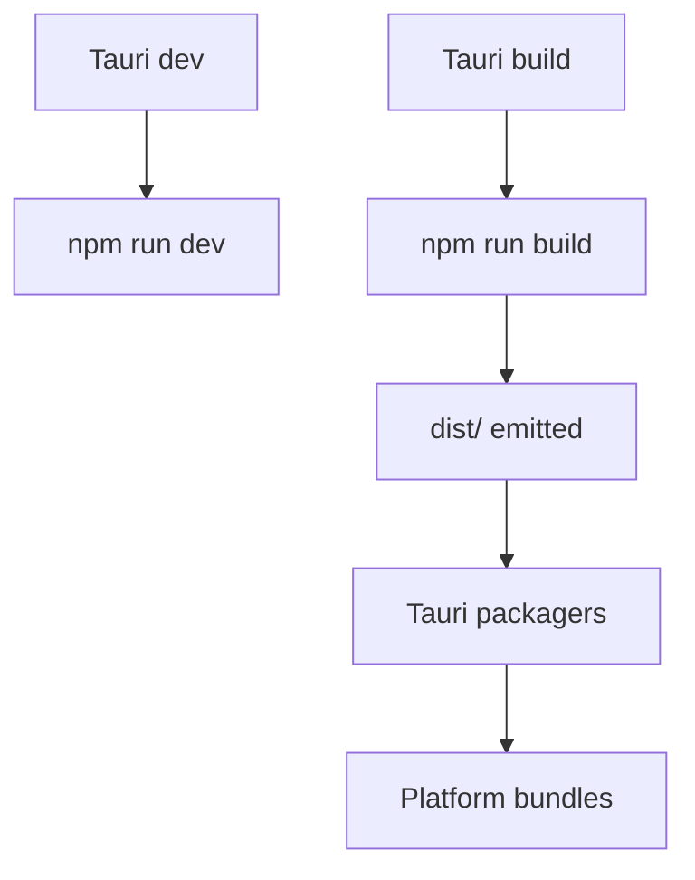
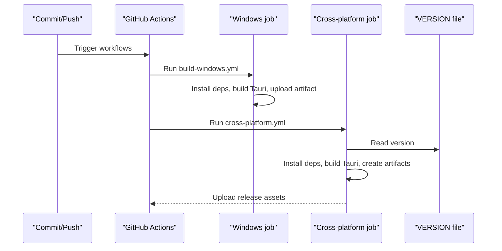
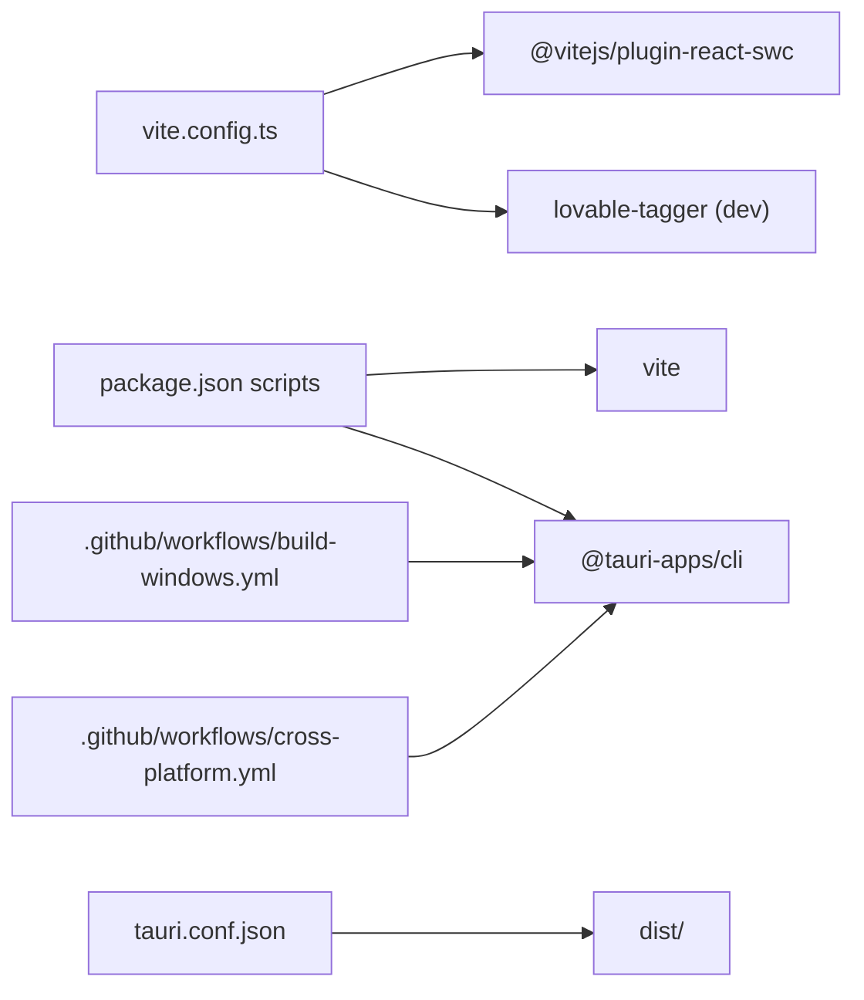

# Build Configuration

<cite>
**Referenced Files in This Document**
- [package.json](file://package.json)
- [vite.config.ts](file://vite.config.ts)
- [tailwind.config.ts](file://tailwind.config.ts)
- [postcss.config.js](file://postcss.config.js)
- [tsconfig.json](file://tsconfig.json)
- [tsconfig.app.json](file://tsconfig.app.json)
- [tsconfig.node.json](file://tsconfig.node.json)
- [vitest.config.ts](file://vitest.config.ts)
- [src-tauri/tauri.conf.json](file://src-tauri/tauri.conf.json)
- [.github/workflows/build-windows.yml](file://.github/workflows/build-windows.yml)
- [.github/workflows/cross-platform.yml](file://.github/workflows/cross-platform.yml)
- [src/main.tsx](file://src/main.tsx)
- [src/App.tsx](file://src/App.tsx)
- [index.html](file://index.html)
- [VERSION](file://VERSION)
</cite>

## Table of Contents
1. [Introduction](#introduction)
2. [Project Structure](#project-structure)
3. [Core Components](#core-components)
4. [Architecture Overview](#architecture-overview)
5. [Detailed Component Analysis](#detailed-component-analysis)
6. [Dependency Analysis](#dependency-analysis)
7. [Performance Considerations](#performance-considerations)
8. [Troubleshooting Guide](#troubleshooting-guide)
9. [Conclusion](#conclusion)
10. [Appendices](#appendices)

## Introduction
This document explains the build configuration and processes for the application, focusing on the Vite build system, development server, asset handling, package scripts, Tauri integration, and GitHub Actions CI/CD pipelines. It covers build targets, environment variables, optimization techniques, customization examples, and troubleshooting guidance to help developers configure, optimize, and deploy the application reliably.

## Project Structure
The build system spans several configuration files:
- Frontend build and dev server powered by Vite
- CSS tooling via Tailwind CSS and PostCSS
- TypeScript configuration for app and node contexts
- Test runner configuration for Vitest
- Tauri configuration for packaging and bundling native apps
- GitHub Actions workflows for Windows builds and cross-platform releases

**Diagram sources**
- [vite.config.ts](file://vite.config.ts#L1-L22)
- [package.json](file://package.json#L6-L17)
- [index.html](file://index.html#L1-L27)
- [src/main.tsx](file://src/main.tsx#L1-L10)
- [src/App.tsx](file://src/App.tsx#L1-L28)
- [tsconfig.app.json](file://tsconfig.app.json)
- [tsconfig.node.json](file://tsconfig.node.json)
- [tsconfig.json](file://tsconfig.json#L1-L17)
- [tailwind.config.ts](file://tailwind.config.ts#L1-L105)
- [postcss.config.js](file://postcss.config.js#L1-L7)
- [vitest.config.ts](file://vitest.config.ts#L1-L17)
- [src-tauri/tauri.conf.json](file://src-tauri/tauri.conf.json#L1-L42)
- [.github/workflows/build-windows.yml](file://.github/workflows/build-windows.yml#L1-L49)
- [.github/workflows/cross-platform.yml](file://.github/workflows/cross-platform.yml#L1-L194)
- [VERSION](file://VERSION#L1-L2)

**Section sources**
- [package.json](file://package.json#L6-L17)
- [vite.config.ts](file://vite.config.ts#L1-L22)
- [tailwind.config.ts](file://tailwind.config.ts#L1-L105)
- [postcss.config.js](file://postcss.config.js#L1-L7)
- [tsconfig.json](file://tsconfig.json#L1-L17)
- [vitest.config.ts](file://vitest.config.ts#L1-L17)
- [src-tauri/tauri.conf.json](file://src-tauri/tauri.conf.json#L1-L42)
- [.github/workflows/build-windows.yml](file://.github/workflows/build-windows.yml#L1-L49)
- [.github/workflows/cross-platform.yml](file://.github/workflows/cross-platform.yml#L1-L194)
- [VERSION](file://VERSION#L1-L2)

## Core Components
- Vite build and dev server configuration defines the development server host/port, HMR behavior, plugin loading, and path aliases.
- Package scripts orchestrate development, building, previewing, linting, testing, and Tauri commands.
- Tailwind CSS and PostCSS configure styling and autoprefixing.
- TypeScript configurations enable path mapping and separate app/node compilation targets.
- Vitest configuration sets up the testing environment and setup files.
- Tauri configuration integrates frontend build outputs and defines bundling targets and window properties.
- GitHub Actions workflows automate Windows builds and cross-platform releases, including artifact creation and version extraction.

**Section sources**
- [vite.config.ts](file://vite.config.ts#L7-L21)
- [package.json](file://package.json#L6-L17)
- [tailwind.config.ts](file://tailwind.config.ts#L1-L105)
- [postcss.config.js](file://postcss.config.js#L1-L7)
- [tsconfig.json](file://tsconfig.json#L4-L16)
- [vitest.config.ts](file://vitest.config.ts#L5-L16)
- [src-tauri/tauri.conf.json](file://src-tauri/tauri.conf.json#L6-L11)
- [.github/workflows/build-windows.yml](file://.github/workflows/build-windows.yml#L10-L49)
- [.github/workflows/cross-platform.yml](file://.github/workflows/cross-platform.yml#L11-L194)
- [VERSION](file://VERSION#L1-L2)

## Architecture Overview
The build pipeline connects development, bundling, and packaging:

**Diagram sources**
- [package.json](file://package.json#L6-L17)
- [vite.config.ts](file://vite.config.ts#L7-L21)
- [index.html](file://index.html#L22-L26)
- [src-tauri/tauri.conf.json](file://src-tauri/tauri.conf.json#L6-L11)
- [.github/workflows/build-windows.yml](file://.github/workflows/build-windows.yml#L10-L49)
- [.github/workflows/cross-platform.yml](file://.github/workflows/cross-platform.yml#L11-L194)

## Detailed Component Analysis

### Vite Build System Configuration
- Development server:
  - Host and port are configured for accessibility and HMR overlay behavior.
  - Hot Module Replacement is enabled with overlay disabled for cleaner logs.
- Plugins:
  - React plugin is loaded unconditionally.
  - A component tagging plugin is conditionally enabled in development mode.
- Path aliases:
  - The "@" alias resolves to the src directory for concise imports.

**Diagram sources**
- [vite.config.ts](file://vite.config.ts#L7-L21)

**Section sources**
- [vite.config.ts](file://vite.config.ts#L7-L21)

### Package Scripts and Workflows
- Development:
  - Start dev server and preview built outputs locally.
- Building:
  - Produce optimized production bundles.
  - Dedicated development build mode script exists.
- Testing:
  - Run tests in CI-friendly mode and watch mode for local iteration.
- Linting:
  - ESLint checks are available via script.
- Tauri:
  - Commands for Tauri CLI are exposed for development and production builds.

**Diagram sources**
- [package.json](file://package.json#L6-L17)
- [vitest.config.ts](file://vitest.config.ts#L5-L16)

**Section sources**
- [package.json](file://package.json#L6-L17)
- [vitest.config.ts](file://vitest.config.ts#L5-L16)

### Asset Handling and Entry Points
- HTML entry:
  - The HTML template injects the root container and the module script pointing to the main entry.
- Entry point:
  - The React root mounts the App component and global styles.
- App shell:
  - Provides routing, providers, and UI components.

**Diagram sources**
- [index.html](file://index.html#L22-L26)
- [src/main.tsx](file://src/main.tsx#L1-L10)
- [src/App.tsx](file://src/App.tsx#L11-L25)

**Section sources**
- [index.html](file://index.html#L1-L27)
- [src/main.tsx](file://src/main.tsx#L1-L10)
- [src/App.tsx](file://src/App.tsx#L1-L28)

### CSS Tooling: Tailwind and PostCSS
- Tailwind:
  - Dark mode strategy, content scanning globs, theme extensions, and animation/keyframes.
- PostCSS:
  - Enables Tailwind and Autoprefixer plugins.

**Diagram sources**
- [tailwind.config.ts](file://tailwind.config.ts#L1-L105)
- [postcss.config.js](file://postcss.config.js#L1-L7)

**Section sources**
- [tailwind.config.ts](file://tailwind.config.ts#L1-L105)
- [postcss.config.js](file://postcss.config.js#L1-L7)

### TypeScript Configuration
- Root tsconfig:
  - References app and node configs and sets path aliases for "@/*".
- App and node configs:
  - Separate compilation targets for browser and Tauri-side tooling.

**Diagram sources**
- [tsconfig.json](file://tsconfig.json#L1-L17)
- [tsconfig.app.json](file://tsconfig.app.json)
- [tsconfig.node.json](file://tsconfig.node.json)

**Section sources**
- [tsconfig.json](file://tsconfig.json#L4-L16)

### Testing Configuration
- Vitest:
  - Uses jsdom environment, global flags, setup files, and includes test/spec files under src.

**Section sources**
- [vitest.config.ts](file://vitest.config.ts#L5-L16)

### Tauri Integration and Build Targets
- Tauri configuration:
  - Before dev/build commands invoke npm scripts.
  - Frontend dist path is set to the Vite output directory.
  - Bundling targets include all supported platforms.
  - Window properties define size, behavior, and visibility.
- Build targets:
  - All targets are enabled, producing platform-specific artifacts.

**Diagram sources**
- [src-tauri/tauri.conf.json](file://src-tauri/tauri.conf.json#L6-L11)
- [package.json](file://package.json#L6-L17)

**Section sources**
- [src-tauri/tauri.conf.json](file://src-tauri/tauri.conf.json#L1-L42)

### GitHub Actions CI/CD Pipelines
- Windows workflow:
  - Runs on pushes and PRs to main.
  - Installs Node.js, Rust, caches, installs dependencies, installs Tauri CLI, builds, and uploads Windows executable.
- Cross-platform workflow:
  - Runs on commits marked with a specific message indicating a release.
  - Reads version from VERSION file and extracts release notes from the commit message.
  - Installs system dependencies for Linux, sets up Node.js and Rust, caches Rust, installs dependencies, installs Tauri CLI, disables macOS signing by clearing signing keys, builds, creates versionless artifacts per OS, and uploads them as release assets.

**Diagram sources**
- [.github/workflows/build-windows.yml](file://.github/workflows/build-windows.yml#L1-L49)
- [.github/workflows/cross-platform.yml](file://.github/workflows/cross-platform.yml#L1-L194)
- [VERSION](file://VERSION#L1-L2)

**Section sources**
- [.github/workflows/build-windows.yml](file://.github/workflows/build-windows.yml#L1-L49)
- [.github/workflows/cross-platform.yml](file://.github/workflows/cross-platform.yml#L11-L194)
- [VERSION](file://VERSION#L1-L2)

## Dependency Analysis
- Internal dependencies:
  - Vite configuration depends on React plugin and optional component tagger.
  - Tauri configuration depends on the built frontend dist.
  - Tests depend on Vitest configuration and setup files.
- External dependencies:
  - Node toolchain, Rust toolchain, and Tauri CLI are required for native builds.
  - CI workflows rely on GitHub-hosted runners and caching.

**Diagram sources**
- [vite.config.ts](file://vite.config.ts#L2-L4)
- [package.json](file://package.json#L6-L17)
- [src-tauri/tauri.conf.json](file://src-tauri/tauri.conf.json#L6-L11)
- [.github/workflows/build-windows.yml](file://.github/workflows/build-windows.yml#L35-L42)
- [.github/workflows/cross-platform.yml](file://.github/workflows/cross-platform.yml#L86-L104)

**Section sources**
- [vite.config.ts](file://vite.config.ts#L1-L22)
- [package.json](file://package.json#L6-L17)
- [src-tauri/tauri.conf.json](file://src-tauri/tauri.conf.json#L6-L11)
- [.github/workflows/build-windows.yml](file://.github/workflows/build-windows.yml#L35-L42)
- [.github/workflows/cross-platform.yml](file://.github/workflows/cross-platform.yml#L86-L104)

## Performance Considerations
- Optimize dev server:
  - Keep HMR overlay disabled for faster feedback loops during development.
  - Use efficient aliases to reduce path resolution overhead.
- Conditional plugins:
  - Enable heavy plugins only in development to avoid unnecessary overhead in production builds.
- CSS optimization:
  - Tailwind’s content globs should match only necessary files to minimize rebuilds.
  - PostCSS autoprefixer ensures compatibility without manual vendor prefixes.
- Build targets:
  - Limit bundling to necessary targets in CI to reduce build time.
- Caching:
  - Leverage Rust caching in CI to speed up Tauri builds.
- Artifact management:
  - Create versionless artifacts in cross-platform jobs to simplify distribution.

[No sources needed since this section provides general guidance]

## Troubleshooting Guide
- Development server not accessible:
  - Verify host and port settings in the Vite configuration.
- HMR issues:
  - Confirm overlay setting and ensure browser supports HMR.
- Plugin conflicts:
  - Temporarily disable conditional plugins to isolate issues.
- CSS not applied:
  - Ensure Tailwind content globs include all relevant files and re-run builds.
- Tauri dev URL mismatch:
  - Confirm dev URL matches the Vite server host/port.
- CI failures:
  - Check Node.js and Rust versions, cache keys, and environment variable availability.
  - Validate VERSION file formatting and release note extraction logic.

**Section sources**
- [vite.config.ts](file://vite.config.ts#L7-L21)
- [tailwind.config.ts](file://tailwind.config.ts#L5-L5)
- [src-tauri/tauri.conf.json](file://src-tauri/tauri.conf.json#L7-L10)
- [.github/workflows/cross-platform.yml](file://.github/workflows/cross-platform.yml#L33-L68)

## Conclusion
The build system combines Vite for fast development and optimized production builds, Tailwind and PostCSS for styling, TypeScript for type safety, Vitest for testing, and Tauri for native packaging. GitHub Actions automates Windows builds and cross-platform releases with versioned metadata and artifact normalization. By understanding and tuning the configuration files and scripts, teams can customize build processes, optimize performance, and maintain reliable deployments.

[No sources needed since this section summarizes without analyzing specific files]

## Appendices

### Environment Variables and Secrets
- Tauri signing:
  - Private key and key password are passed via environment variables in CI.
- macOS signing:
  - Signing keys are intentionally cleared in CI to disable signing for non-release builds.

**Section sources**
- [.github/workflows/cross-platform.yml](file://.github/workflows/cross-platform.yml#L94-L108)

### Version Management
- Version source:
  - The VERSION file supplies the semantic version used in cross-platform releases.

**Section sources**
- [VERSION](file://VERSION#L1-L2)