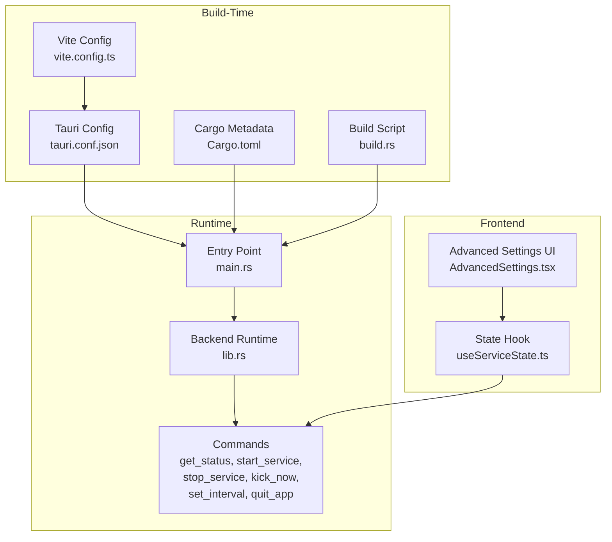
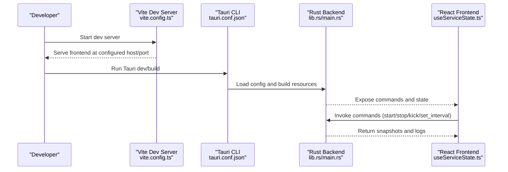
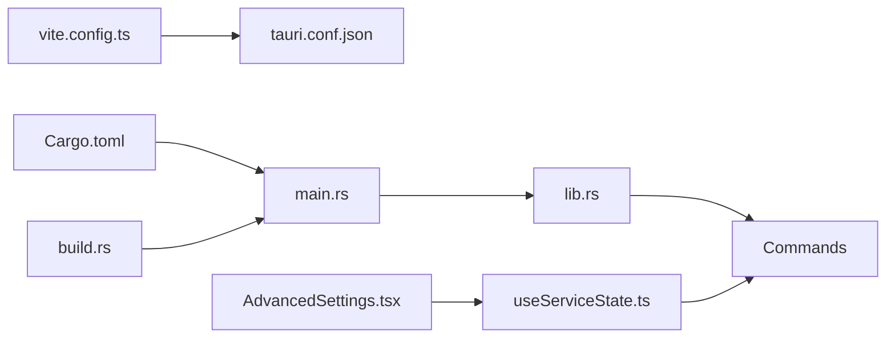

# Configuration and Settings

<cite>
**Referenced Files in This Document**
- [tauri.conf.json](file://src-tauri/tauri.conf.json)
- [Cargo.toml](file://src-tauri/Cargo.toml)
- [build.rs](file://src-tauri/build.rs)
- [vite.config.ts](file://vite.config.ts)
- [package.json](file://package.json)
- [lib.rs](file://src-tauri/src/lib.rs)
- [main.rs](file://src-tauri/src/main.rs)
- [AdvancedSettings.tsx](file://src/components/AdvancedSettings.tsx)
- [useServiceState.ts](file://src/hooks/useServiceState.ts)
</cite>

## Table of Contents
1. [Introduction](#introduction)
2. [Project Structure](#project-structure)
3. [Core Components](#core-components)
4. [Architecture Overview](#architecture-overview)
5. [Detailed Component Analysis](#detailed-component-analysis)
6. [Dependency Analysis](#dependency-analysis)
7. [Performance Considerations](#performance-considerations)
8. [Troubleshooting Guide](#troubleshooting-guide)
9. [Conclusion](#conclusion)
10. [Appendices](#appendices)

## Introduction
This document explains how the application manages configuration and settings across build-time, runtime, and deployment contexts. It covers the Tauri configuration system, Vite build configuration, environment variables, command-line arguments, and runtime configuration such as kick interval settings, network parameters, logging configuration, and performance tuning. It also provides guidance on validating configuration, default values, and backward compatibility considerations.

## Project Structure
The configuration system spans three layers:
- Build-time configuration: Tauri configuration, Vite configuration, and Rust crate metadata.
- Runtime configuration: Application constants and commands exposed to the frontend.
- Frontend configuration UX: Controls for kick interval and advanced settings display.

**Diagram sources**
- [tauri.conf.json](file://src-tauri/tauri.conf.json#L1-L42)
- [vite.config.ts](file://vite.config.ts#L1-L22)
- [Cargo.toml](file://src-tauri/Cargo.toml#L1-L29)
- [build.rs](file://src-tauri/build.rs#L1-L4)
- [lib.rs](file://src-tauri/src/lib.rs#L658-L686)
- [main.rs](file://src-tauri/src/main.rs#L1-L7)
- [useServiceState.ts](file://src/hooks/useServiceState.ts#L1-L163)
- [AdvancedSettings.tsx](file://src/components/AdvancedSettings.tsx#L1-L73)

**Section sources**
- [tauri.conf.json](file://src-tauri/tauri.conf.json#L1-L42)
- [vite.config.ts](file://vite.config.ts#L1-L22)
- [Cargo.toml](file://src-tauri/Cargo.toml#L1-L29)
- [build.rs](file://src-tauri/build.rs#L1-L4)
- [lib.rs](file://src-tauri/src/lib.rs#L658-L686)
- [main.rs](file://src-tauri/src/main.rs#L1-L7)
- [useServiceState.ts](file://src/hooks/useServiceState.ts#L1-L163)
- [AdvancedSettings.tsx](file://src/components/AdvancedSettings.tsx#L1-L73)

## Core Components
- Tauri configuration defines product metadata, build scripts, window behavior, security policy, and bundling targets.
- Vite configuration controls the dev server host/port, HMR overlay, and aliases.
- Rust backend exposes runtime configuration via constants and Tauri commands.
- Frontend integrates with the backend through Tauri commands and presents advanced settings.

Key runtime configuration highlights:
- Kick interval defaults and minimum thresholds.
- Network connectivity and request timeouts.
- Logging buffer limits and log retention.
- Window positioning and visibility behavior.

**Section sources**
- [tauri.conf.json](file://src-tauri/tauri.conf.json#L6-L29)
- [vite.config.ts](file://vite.config.ts#L7-L21)
- [lib.rs](file://src-tauri/src/lib.rs#L17-L25)
- [lib.rs](file://src-tauri/src/lib.rs#L644-L651)
- [lib.rs](file://src-tauri/src/lib.rs#L351-L371)
- [lib.rs](file://src-tauri/src/lib.rs#L116-L127)
- [AdvancedSettings.tsx](file://src/components/AdvancedSettings.tsx#L10-L15)

## Architecture Overview
The configuration system orchestrates build-time and runtime concerns to deliver a configurable desktop application.

**Diagram sources**
- [vite.config.ts](file://vite.config.ts#L7-L14)
- [tauri.conf.json](file://src-tauri/tauri.conf.json#L6-L11)
- [lib.rs](file://src-tauri/src/lib.rs#L658-L686)
- [useServiceState.ts](file://src/hooks/useServiceState.ts#L88-L107)

## Detailed Component Analysis

### Tauri Configuration (tauri.conf.json)
- Product identity and versioning: product name, version, and identifier.
- Build pipeline: beforeDevCommand, devUrl, beforeBuildCommand, and frontendDist.
- Window configuration: title, size, resize/move behavior, always-on-top, initial visibility, and taskbar skip.
- Security: CSP set to null.
- Bundling: active, targets, and icon assets.

Operational impact:
- Dev server URL and port are aligned with Vite configuration.
- Frontend distribution path is configured for the built output.
- Window behavior ensures minimal distraction and controlled visibility.

**Section sources**
- [tauri.conf.json](file://src-tauri/tauri.conf.json#L1-L42)
- [vite.config.ts](file://vite.config.ts#L8-L10)

### Vite Configuration (vite.config.ts)
- Dev server host and port are set for local development.
- HMR overlay disabled for cleaner desktop UX.
- Path alias for @ resolves to the src directory.
- Optional development-only plugin activation.

Operational impact:
- Aligns devUrl with Tauri configuration.
- Reduces noise during development.

**Section sources**
- [vite.config.ts](file://vite.config.ts#L7-L21)

### Rust Crate and Build (Cargo.toml, build.rs)
- Crate metadata and library type definitions.
- Dependencies include Tauri, reqwest, tokio, serde, and plugins.
- Build script delegates to tauri_build.

Operational impact:
- Enables Tauri tray icon, notifications, and opener plugins.
- Provides HTTP client and async runtime for network operations.

**Section sources**
- [Cargo.toml](file://src-tauri/Cargo.toml#L1-L29)
- [build.rs](file://src-tauri/build.rs#L1-L4)

### Backend Runtime Configuration (lib.rs)
- Constants define:
  - Minimum and default kick intervals.
  - Request/connect timeouts.
  - Maximum log buffer size.
  - Window margin offsets for positioning.
  - Connectivity and kick URLs.
- Commands:
  - get_status: returns a snapshot of service state, logs, and timing.
  - start_service: validates network, checks internet availability, transitions to running, and spawns worker loop.
  - stop_service: aborts worker and transitions to stopped.
  - kick_now: performs an immediate kick if running.
  - set_interval: updates interval with a minimum threshold.
  - quit_app: exits the application.

Worker loop behavior:
- Validates network adapter presence.
- Checks internet connectivity via a HEAD request.
- Performs a kick GET request.
- Sleeps for the configured interval (enforced minimum).

Logging:
- Fixed-size deque maintains recent events with monotonic IDs and timestamps.
- Snapshot truncates logs to the configured maximum.

**Section sources**
- [lib.rs](file://src-tauri/src/lib.rs#L17-L25)
- [lib.rs](file://src-tauri/src/lib.rs#L600-L602)
- [lib.rs](file://src-tauri/src/lib.rs#L604-L618)
- [lib.rs](file://src-tauri/src/lib.rs#L620-L642)
- [lib.rs](file://src-tauri/src/lib.rs#L644-L651)
- [lib.rs](file://src-tauri/src/lib.rs#L654-L656)
- [lib.rs](file://src-tauri/src/lib.rs#L415-L473)
- [lib.rs](file://src-tauri/src/lib.rs#L116-L127)

### Frontend Integration (useServiceState.ts, AdvancedSettings.tsx)
- useServiceState:
  - Polls backend status periodically.
  - Invokes commands to start/stop/kick and update interval.
  - Maps backend snapshot to frontend types and displays logs.
- AdvancedSettings:
  - Presents predefined kick interval options.
  - Displays connectivity check endpoint and default interval.

Operational impact:
- Provides user-facing controls for kick interval and visibility.
- Bridges UI state with backend commands.

**Section sources**
- [useServiceState.ts](file://src/hooks/useServiceState.ts#L88-L107)
- [useServiceState.ts](file://src/hooks/useServiceState.ts#L136-L144)
- [AdvancedSettings.tsx](file://src/components/AdvancedSettings.tsx#L10-L15)
- [AdvancedSettings.tsx](file://src/components/AdvancedSettings.tsx#L65-L67)

### Configuration Validation, Defaults, and Backward Compatibility
- Defaults:
  - Default kick interval is applied at initialization.
  - Minimum interval prevents overly aggressive polling.
- Validation:
  - set_interval enforces a minimum bound.
  - Worker loop respects minimum interval during sleep.
- Backward compatibility:
  - Snapshot serialization preserves field names and types.
  - UI mapping handles optional fields gracefully.

**Section sources**
- [lib.rs](file://src-tauri/src/lib.rs#L87-L99)
- [lib.rs](file://src-tauri/src/lib.rs#L644-L651)
- [lib.rs](file://src-tauri/src/lib.rs#L415-L473)
- [useServiceState.ts](file://src/hooks/useServiceState.ts#L70-L86)

## Dependency Analysis

**Diagram sources**
- [vite.config.ts](file://vite.config.ts#L1-L22)
- [tauri.conf.json](file://src-tauri/tauri.conf.json#L1-L42)
- [Cargo.toml](file://src-tauri/Cargo.toml#L1-L29)
- [build.rs](file://src-tauri/build.rs#L1-L4)
- [main.rs](file://src-tauri/src/main.rs#L1-L7)
- [lib.rs](file://src-tauri/src/lib.rs#L658-L686)
- [useServiceState.ts](file://src/hooks/useServiceState.ts#L1-L163)
- [AdvancedSettings.tsx](file://src/components/AdvancedSettings.tsx#L1-L73)

**Section sources**
- [vite.config.ts](file://vite.config.ts#L1-L22)
- [tauri.conf.json](file://src-tauri/tauri.conf.json#L1-L42)
- [Cargo.toml](file://src-tauri/Cargo.toml#L1-L29)
- [build.rs](file://src-tauri/build.rs#L1-L4)
- [main.rs](file://src-tauri/src/main.rs#L1-L7)
- [lib.rs](file://src-tauri/src/lib.rs#L658-L686)
- [useServiceState.ts](file://src/hooks/useServiceState.ts#L1-L163)
- [AdvancedSettings.tsx](file://src/components/AdvancedSettings.tsx#L1-L73)

## Performance Considerations
- Kick interval enforcement: The worker loop uses the maximum of the configured interval and the minimum threshold to avoid excessive network activity.
- Request timeouts: Separate connect and request timeouts prevent long blocking operations.
- Log buffer: Fixed-capacity deque ensures memory usage remains bounded.
- Polling frequency: Frontend polls backend at a moderate interval to balance responsiveness and CPU usage.

Recommendations:
- Keep kick interval above the minimum threshold to reduce churn.
- Monitor network conditions; the service automatically stops on connectivity loss.
- Adjust frontend polling interval if needed for different UX requirements.

**Section sources**
- [lib.rs](file://src-tauri/src/lib.rs#L421-L424)
- [lib.rs](file://src-tauri/src/lib.rs#L19-L20)
- [lib.rs](file://src-tauri/src/lib.rs#L21)
- [lib.rs](file://src-tauri/src/lib.rs#L415-L473)
- [useServiceState.ts](file://src/hooks/useServiceState.ts#L42)

## Troubleshooting Guide
Common configuration and runtime issues:
- Dev server not reachable:
  - Verify devUrl in Tauri config matches Vite server host/port.
- Frontend not loading in dev:
  - Confirm beforeDevCommand executes successfully and serves the expected URL.
- Build failures:
  - Ensure frontendDist points to the built output directory.
- Network connectivity checks:
  - On Windows, the backend uses a native command to detect active adapters; failures will stop the service.
- Kick requests failing:
  - Inspect request timeout and connectivity URL; adjust if corporate firewall or proxy requires special handling.
- Logs not appearing:
  - Confirm log buffer capacity and snapshot retrieval.

**Section sources**
- [tauri.conf.json](file://src-tauri/tauri.conf.json#L6-L11)
- [vite.config.ts](file://vite.config.ts#L8-L14)
- [lib.rs](file://src-tauri/src/lib.rs#L308-L349)
- [lib.rs](file://src-tauri/src/lib.rs#L364-L371)
- [lib.rs](file://src-tauri/src/lib.rs#L116-L127)

## Conclusion
The application’s configuration system cleanly separates build-time concerns (Tauri/Vite/Cargo) from runtime concerns (constants, commands, and UI integration). Defaults and validations ensure safe operation, while the frontend provides intuitive controls for kick interval and visibility. The design supports development and production workflows with clear boundaries and predictable behavior.

## Appendices

### Configuration Reference

- Tauri configuration
  - Product identity and versioning: [tauri.conf.json](file://src-tauri/tauri.conf.json#L3-L5)
  - Build pipeline: [tauri.conf.json](file://src-tauri/tauri.conf.json#L6-L11)
  - Window behavior: [tauri.conf.json](file://src-tauri/tauri.conf.json#L13-L25)
  - Security policy: [tauri.conf.json](file://src-tauri/tauri.conf.json#L26-L28)
  - Bundling: [tauri.conf.json](file://src-tauri/tauri.conf.json#L30-L40)

- Vite configuration
  - Dev server host/port: [vite.config.ts](file://vite.config.ts#L8-L14)
  - HMR overlay: [vite.config.ts](file://vite.config.ts#L11-L13)
  - Aliases: [vite.config.ts](file://vite.config.ts#L16-L20)

- Rust backend constants and commands
  - Intervals and timeouts: [lib.rs](file://src-tauri/src/lib.rs#L17-L20)
  - Log buffer and window margins: [lib.rs](file://src-tauri/src/lib.rs#L21), [lib.rs](file://src-tauri/src/lib.rs#L22-L23)
  - Connectivity and kick URLs: [lib.rs](file://src-tauri/src/lib.rs#L24-L25)
  - Commands: [lib.rs](file://src-tauri/src/lib.rs#L600-L602), [lib.rs](file://src-tauri/src/lib.rs#L604-L618), [lib.rs](file://src-tauri/src/lib.rs#L620-L642), [lib.rs](file://src-tauri/src/lib.rs#L644-L651), [lib.rs](file://src-tauri/src/lib.rs#L654-L656)

- Frontend integration
  - Status polling: [useServiceState.ts](file://src/hooks/useServiceState.ts#L88-L107)
  - Kick interval options: [AdvancedSettings.tsx](file://src/components/AdvancedSettings.tsx#L10-L15)
  - Connectivity endpoint: [AdvancedSettings.tsx](file://src/components/AdvancedSettings.tsx#L60-L62)

### Environment Variables and Command-Line Arguments
- Environment variables:
  - None explicitly defined in the provided configuration files.
- Command-line arguments:
  - Scripts for Tauri commands are defined in package.json: [package.json](file://package.json#L6-L16)
  - Vite scripts for dev/build/preview/test are defined in package.json: [package.json](file://package.json#L6-L16)

**Section sources**
- [tauri.conf.json](file://src-tauri/tauri.conf.json#L1-L42)
- [vite.config.ts](file://vite.config.ts#L1-L22)
- [Cargo.toml](file://src-tauri/Cargo.toml#L1-L29)
- [build.rs](file://src-tauri/build.rs#L1-L4)
- [lib.rs](file://src-tauri/src/lib.rs#L658-L686)
- [useServiceState.ts](file://src/hooks/useServiceState.ts#L1-L163)
- [AdvancedSettings.tsx](file://src/components/AdvancedSettings.tsx#L1-L73)
- [package.json](file://package.json#L6-L16)