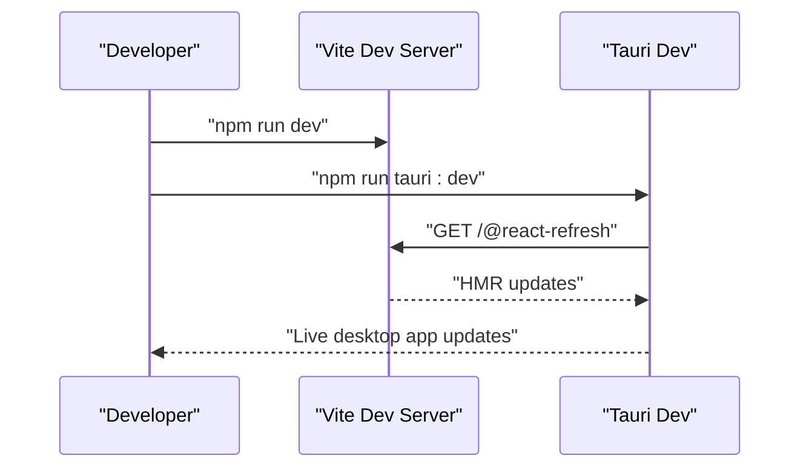
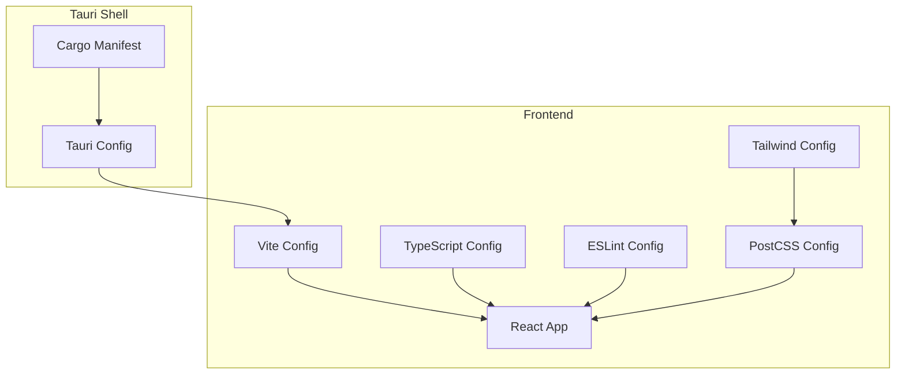
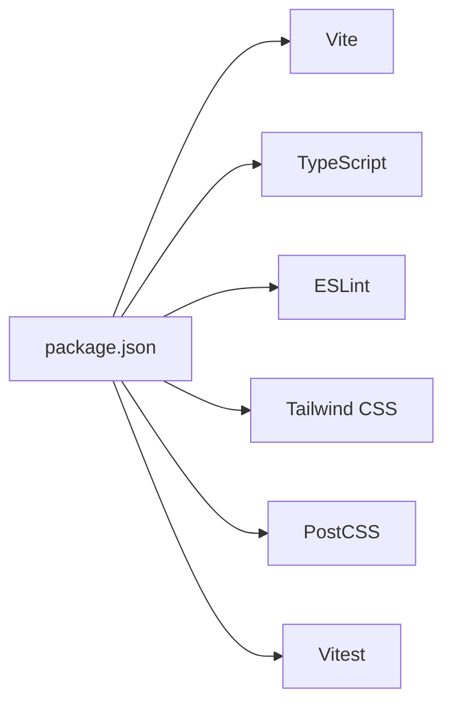

# Development Environment Setup

<cite>
**Referenced Files in This Document**
- [package.json](file://package.json)
- [vite.config.ts](file://vite.config.ts)
- [eslint.config.js](file://eslint.config.js)
- [postcss.config.js](file://postcss.config.js)
- [tailwind.config.ts](file://tailwind.config.ts)
- [tsconfig.json](file://tsconfig.json)
- [tsconfig.app.json](file://tsconfig.app.json)
- [tsconfig.node.json](file://tsconfig.node.json)
- [src-tauri/Cargo.toml](file://src-tauri/Cargo.toml)
- [src-tauri/tauri.conf.json](file://src-tauri/tauri.conf.json)
- [vitest.config.ts](file://vitest.config.ts)
- [src/test/setup.ts](file://src/test/setup.ts)
- [src/main.tsx](file://src/main.tsx)
- [src/App.tsx](file://src/App.tsx)
</cite>

## Table of Contents
1. [Introduction](#introduction)
2. [Prerequisites and Toolchain](#prerequisites-and-toolchain)
3. [Project Initialization](#project-initialization)
4. [Environment Variables and Configuration](#environment-variables-and-configuration)
5. [Development Server and Hot Reload](#development-server-and-hot-reload)
6. [Debugging Workflows](#debugging-workflows)
7. [TypeScript Configuration](#typescript-configuration)
8. [Code Quality: ESLint and Formatting](#code-quality-eslint-and-formatting)
9. [Styling Pipeline: Tailwind CSS and PostCSS](#styling-pipeline-tailwind-css-and-postcss)
10. [IDE Configuration Recommendations](#ide-configuration-recommendations)
11. [Architecture Overview](#architecture-overview)
12. [Dependency Analysis](#dependency-analysis)
13. [Performance Considerations](#performance-considerations)
14. [Troubleshooting Guide](#troubleshooting-guide)
15. [Conclusion](#conclusion)

## Introduction
This guide explains how to set up and configure the development environment for the project, which combines a React + Vite frontend with a Tauri v2 desktop shell and a Rust backend library. It covers prerequisites, initialization, configuration, development workflows, debugging, linting, styling, and best practices for both frontend and backend development.

## Prerequisites and Toolchain
- Node.js runtime and npm package manager are required for the frontend toolchain.
- Rust toolchain is required for building the Tauri backend library and CLI.
- Tauri CLI is used to develop and build the desktop app.
- Git for version control.
- An IDE with TypeScript/React/Vite support is recommended.

Key references:
- Frontend scripts and dependencies are defined in the package manifest.
- Tauri configuration and Rust dependencies are defined in the Tauri manifest and Cargo manifest.

**Section sources**
- [package.json](file://package.json#L1-L96)
- [src-tauri/Cargo.toml](file://src-tauri/Cargo.toml#L1-L29)
- [src-tauri/tauri.conf.json](file://src-tauri/tauri.conf.json#L1-L42)

## Project Initialization
- Install Node.js dependencies for the frontend.
- Install Tauri CLI globally or locally via the package scripts.
- Build the Rust backend library using the Tauri build pipeline.
- Run the development server and Tauri dev mode in parallel or sequentially depending on your workflow.

Recommended commands:
- Install dependencies: see scripts in the package manifest.
- Start development: use the frontend dev script and Tauri dev script as configured.
- Build production: use the frontend build script and Tauri build script as configured.

Notes:
- The Tauri configuration defines a pre-dev command that starts the frontend dev server automatically.
- The frontend dev server listens on a fixed port and is proxied by Tauri during development.

**Section sources**
- [package.json](file://package.json#L6-L16)
- [src-tauri/tauri.conf.json](file://src-tauri/tauri.conf.json#L6-L11)
- [vite.config.ts](file://vite.config.ts#L8-L14)

## Environment Variables and Configuration
- No explicit environment variables are defined in the repository’s configuration files.
- The project relies on default Vite behavior and Tauri defaults for development.
- If you need environment-specific variables, define them in a .env file at the project root and consume them via Vite’s import.meta.env mechanism.

Guidance:
- Keep secrets out of version control.
- Use separate .env files per environment if needed (e.g., .env.development, .env.production).
- Ensure .env files are added to .gitignore.

[No sources needed since this section provides general guidance]

## Development Server and Hot Reload
- The frontend development server runs with Vite and exposes hot module replacement (HMR).
- Host binding and port are configured in the Vite config.
- HMR overlay is disabled in development for a cleaner terminal experience.
- The Tauri dev command proxies the dev server URL and injects the frontend bundle into the Tauri window.

Workflow:
- Start the frontend dev server.
- Start Tauri dev to launch the desktop app with live reload.

**Diagram sources**
- [vite.config.ts](file://vite.config.ts#L8-L14)
- [src-tauri/tauri.conf.json](file://src-tauri/tauri.conf.json#L7-L8)

**Section sources**
- [vite.config.ts](file://vite.config.ts#L1-L22)
- [src-tauri/tauri.conf.json](file://src-tauri/tauri.conf.json#L6-L11)

## Debugging Workflows
- Frontend debugging: use browser devtools and React DevTools. HMR is enabled for rapid iteration.
- Tauri backend debugging: compile in debug mode and use standard Rust debugging tools.
- Test debugging: Vitest supports watch mode and DOM environment for unit tests.

Recommended steps:
- Use browser devtools to inspect React components and network requests.
- For Rust logic, build in debug mode and attach a debugger.
- For UI tests, run the test runner in watch mode to iterate quickly.

**Section sources**
- [vitest.config.ts](file://vitest.config.ts#L1-L17)
- [src/test/setup.ts](file://src/test/setup.ts#L1-L16)
- [src-tauri/Cargo.toml](file://src-tauri/Cargo.toml#L20-L28)

## TypeScript Configuration
- Root tsconfig references two typed configs: one for the app and one for tooling.
- App tsconfig targets modern JS environments, uses bundler module resolution, and enables JSX with react-jsx.
- Node tsconfig targets ESNext and is used for Vite config and similar tooling files.
- Path aliases are configured to resolve @/* to ./src/* in both tsconfigs.

Best practices:
- Keep strictness aligned with your team standards; current config relaxes some strict checks.
- Use path aliases consistently to avoid deep relative imports.

**Section sources**
- [tsconfig.json](file://tsconfig.json#L1-L17)
- [tsconfig.app.json](file://tsconfig.app.json#L1-L32)
- [tsconfig.node.json](file://tsconfig.node.json#L1-L23)

## Code Quality: ESLint and Formatting
- ESLint is configured with TypeScript and React Refresh plugins.
- Recommended rules include React Hooks and React Refresh rules.
- Unused variable rule is disabled in the ESLint config.

Recommendations:
- Keep lint rules consistent across the team.
- Integrate ESLint with your editor for real-time feedback.
- Run the linter before committing.

**Section sources**
- [eslint.config.js](file://eslint.config.js#L1-L27)

## Styling Pipeline: Tailwind CSS and PostCSS
- PostCSS is configured with Tailwind CSS and Autoprefixer.
- Tailwind’s content globs scan components and pages under src for class usage.
- Dark mode strategy uses a class-based approach.
- Additional animations plugin is included.

Setup highlights:
- Tailwind directives are processed by PostCSS.
- Autoprefixer ensures cross-browser compatibility.

**Section sources**
- [postcss.config.js](file://postcss.config.js#L1-L7)
- [tailwind.config.ts](file://tailwind.config.ts#L1-L105)

## IDE Configuration Recommendations
- Enable TypeScript/JavaScript and React/JSX support.
- Configure path aliases to resolve @/* to ./src/.
- Enable ESLint integration and Prettier if used.
- Configure Vitest integration for running and debugging tests.
- For Tauri/Rust development, install the Rust Analyzer extension and ensure the Rust toolchain is detected.

[No sources needed since this section provides general guidance]

## Architecture Overview
The development stack integrates a React + Vite frontend with a Tauri v2 desktop shell and a Rust backend library. The Tauri configuration orchestrates the frontend dev server and bundles the built frontend into the desktop app.

**Diagram sources**
- [vite.config.ts](file://vite.config.ts#L1-L22)
- [tsconfig.json](file://tsconfig.json#L1-L17)
- [eslint.config.js](file://eslint.config.js#L1-L27)
- [tailwind.config.ts](file://tailwind.config.ts#L1-L105)
- [postcss.config.js](file://postcss.config.js#L1-L7)
- [src-tauri/tauri.conf.json](file://src-tauri/tauri.conf.json#L1-L42)
- [src-tauri/Cargo.toml](file://src-tauri/Cargo.toml#L1-L29)

## Dependency Analysis
- Frontend dependencies include React, Radix UI, TanStack Query, Tailwind-based UI components, and Tauri APIs.
- Dev dependencies include Vite, TypeScript, ESLint, Tailwind CSS, PostCSS, and testing libraries.
- Tauri dependencies include core framework, tray icon, opener plugin, notifications, and HTTP client.

**Diagram sources**
- [package.json](file://package.json#L18-L94)

**Section sources**
- [package.json](file://package.json#L18-L94)
- [src-tauri/Cargo.toml](file://src-tauri/Cargo.toml#L20-L28)

## Performance Considerations
- Prefer lazy loading for heavy components and routes.
- Keep dev server HMR enabled for fast iteration; disable overlays only if needed for terminal clarity.
- Use production builds for performance profiling.
- Minimize unnecessary re-renders with React.memo and proper state scoping.

[No sources needed since this section provides general guidance]

## Troubleshooting Guide
Common issues and resolutions:
- Port conflicts: adjust the Vite server port in the Vite config if 8080 is in use.
- Tauri dev command failing: ensure the frontend dev server is running and reachable at the configured URL.
- Missing environment variables: define .env files at the project root and verify Vite recognizes them.
- Test environment errors: ensure jsdom is configured and setup files are loaded by Vitest.

**Section sources**
- [vite.config.ts](file://vite.config.ts#L8-L14)
- [src-tauri/tauri.conf.json](file://src-tauri/tauri.conf.json#L7-L10)
- [vitest.config.ts](file://vitest.config.ts#L7-L12)
- [src/test/setup.ts](file://src/test/setup.ts#L1-L16)

## Conclusion
With Node.js, Rust, and Tauri installed, you can initialize the project, run the frontend dev server, and launch Tauri in development mode. TypeScript, ESLint, Tailwind CSS, and PostCSS are configured to support a modern React development workflow. Use the provided scripts and configurations to streamline development, testing, and building for production.