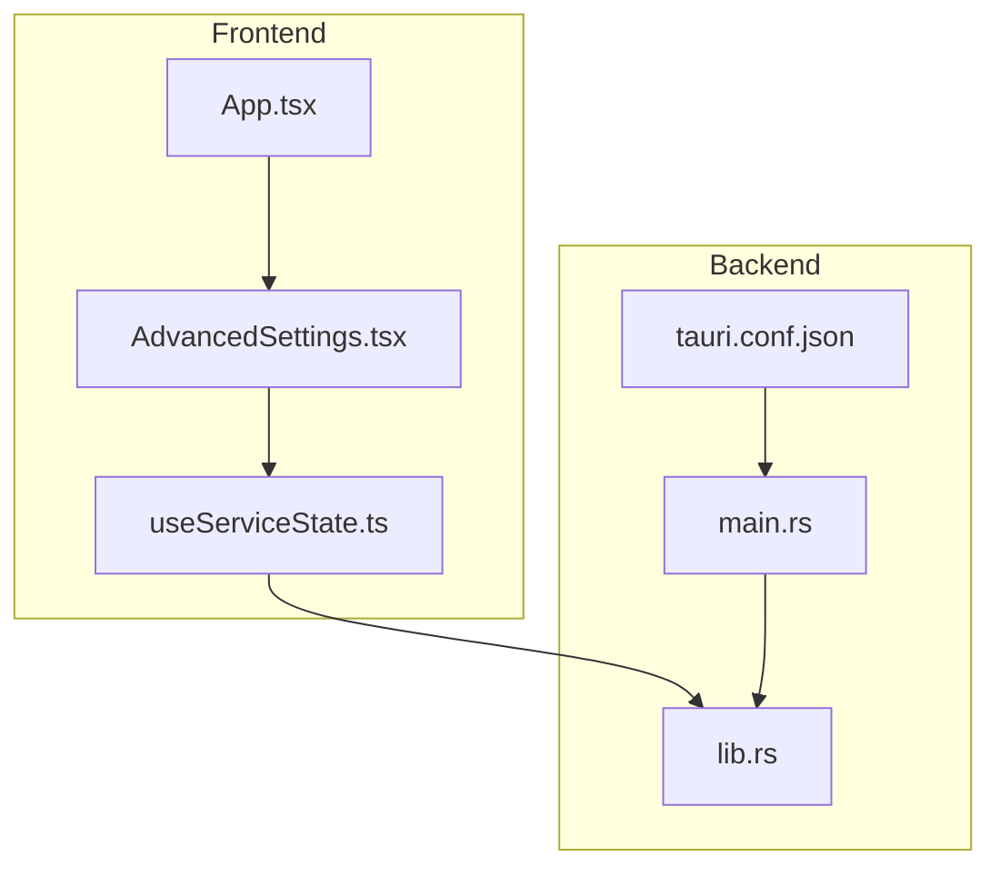
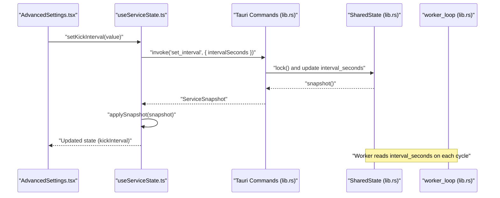
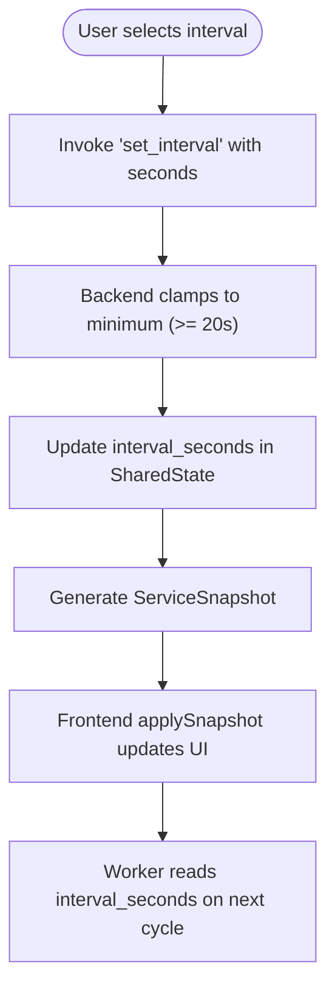
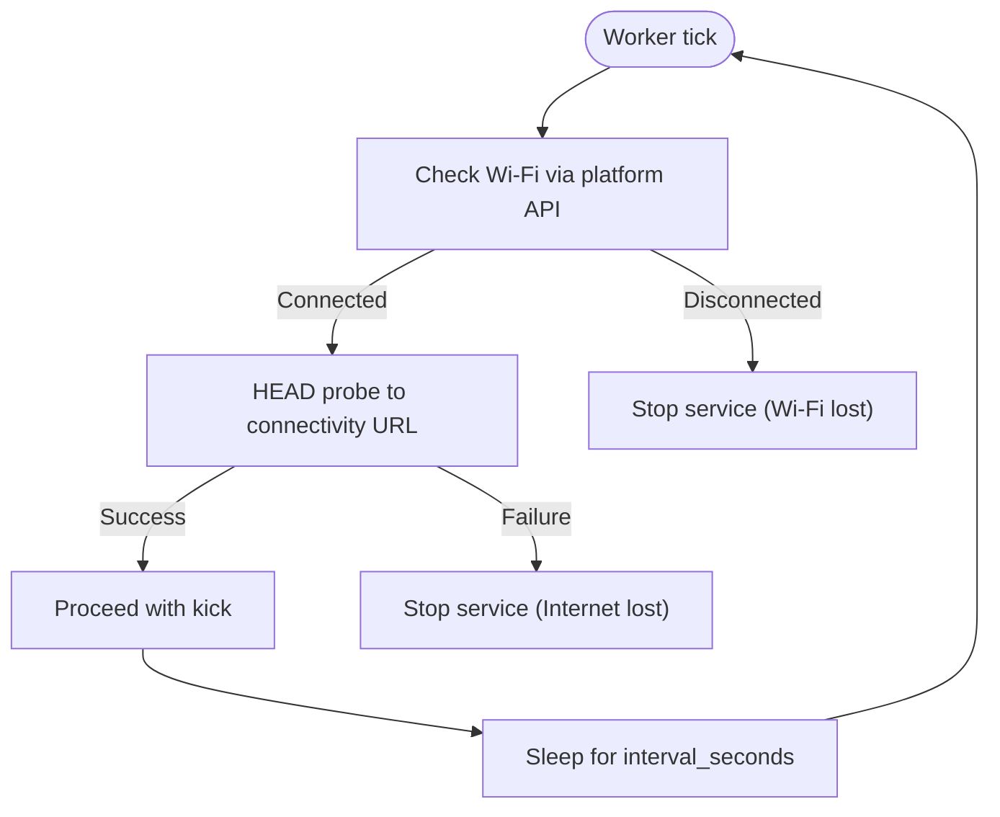
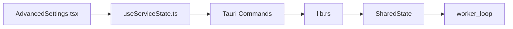

# Runtime Configuration

<cite>
**Referenced Files in This Document**
- [AdvancedSettings.tsx](file://src/components/AdvancedSettings.tsx)
- [useServiceState.ts](file://src/hooks/useServiceState.ts)
- [lib.rs](file://src-tauri/src/lib.rs)
- [main.rs](file://src-tauri/src/main.rs)
- [tauri.conf.json](file://src-tauri/tauri.conf.json)
- [App.tsx](file://src/App.tsx)
</cite>

## Table of Contents
1. [Introduction](#introduction)
2. [Project Structure](#project-structure)
3. [Core Components](#core-components)
4. [Architecture Overview](#architecture-overview)
5. [Detailed Component Analysis](#detailed-component-analysis)
6. [Dependency Analysis](#dependency-analysis)
7. [Performance Considerations](#performance-considerations)
8. [Troubleshooting Guide](#troubleshooting-guide)
9. [Conclusion](#conclusion)
10. [Appendices](#appendices)

## Introduction
This document explains runtime configuration and user settings management for the application. It covers service configuration parameters such as kick interval settings, network detection thresholds, and authentication parameters. It also documents the settings interface exposed via the AdvancedSettings component, configuration persistence mechanisms, default values, validation rules, runtime parameter adjustments, hot-reloading behavior, and guidance for configuration security, validation, and user experience.

## Project Structure
The runtime configuration spans the frontend React/Tauri frontend and the Tauri/Rust backend:
- Frontend: Settings UI and state hooks
- Backend: Service state machine, configuration constants, commands, and worker loop



**Diagram sources**
- [AdvancedSettings.tsx](file://src/components/AdvancedSettings.tsx#L1-L73)
- [useServiceState.ts](file://src/hooks/useServiceState.ts#L1-L163)
- [lib.rs](file://src-tauri/src/lib.rs#L1-L686)
- [main.rs](file://src-tauri/src/main.rs#L1-L7)
- [tauri.conf.json](file://src-tauri/tauri.conf.json#L1-L42)
- [App.tsx](file://src/App.tsx#L1-L28)

**Section sources**
- [AdvancedSettings.tsx](file://src/components/AdvancedSettings.tsx#L1-L73)
- [useServiceState.ts](file://src/hooks/useServiceState.ts#L1-L163)
- [lib.rs](file://src-tauri/src/lib.rs#L1-L686)
- [main.rs](file://src-tauri/src/main.rs#L1-L7)
- [tauri.conf.json](file://src-tauri/tauri.conf.json#L1-L42)
- [App.tsx](file://src/App.tsx#L1-L28)

## Core Components
- Kick interval settings: Exposed in the UI and persisted in backend state
- Network detection thresholds: Connectivity checks and timeouts
- Authentication parameters: Kick endpoint and connectivity probe URL
- Settings interface: AdvancedSettings component for user-driven configuration
- Configuration persistence: Backend state managed via Tauri commands
- Validation rules: Minimum interval enforcement and sanitization
- Hot-reloading: UI polls backend state; changes take effect immediately
- Security considerations: CSP configuration and platform-specific network checks

**Section sources**
- [AdvancedSettings.tsx](file://src/components/AdvancedSettings.tsx#L10-L15)
- [useServiceState.ts](file://src/hooks/useServiceState.ts#L44-L53)
- [lib.rs](file://src-tauri/src/lib.rs#L17-L25)
- [lib.rs](file://src-tauri/src/lib.rs#L644-L651)
- [lib.rs](file://src-tauri/src/lib.rs#L415-L473)
- [tauri.conf.json](file://src-tauri/tauri.conf.json#L26-L28)

## Architecture Overview
The runtime configuration system is centered around a shared state in the backend and a frontend hook that invokes Tauri commands to read/write configuration. The worker loop enforces configuration constraints and applies changes immediately.



**Diagram sources**
- [AdvancedSettings.tsx](file://src/components/AdvancedSettings.tsx#L17-L56)
- [useServiceState.ts](file://src/hooks/useServiceState.ts#L136-L144)
- [lib.rs](file://src-tauri/src/lib.rs#L644-L651)
- [lib.rs](file://src-tauri/src/lib.rs#L104-L114)
- [lib.rs](file://src-tauri/src/lib.rs#L415-L473)

## Detailed Component Analysis

### Kick Interval Settings
- Available intervals: 20s, 60s, 120s, 300s
- Default interval: 20s
- UI selection triggers a Tauri command to update backend interval
- Backend enforces a minimum interval and logs the change



**Diagram sources**
- [AdvancedSettings.tsx](file://src/components/AdvancedSettings.tsx#L42-L54)
- [useServiceState.ts](file://src/hooks/useServiceState.ts#L136-L144)
- [lib.rs](file://src-tauri/src/lib.rs#L644-L651)
- [lib.rs](file://src-tauri/src/lib.rs#L415-L473)

**Section sources**
- [AdvancedSettings.tsx](file://src/components/AdvancedSettings.tsx#L10-L15)
- [AdvancedSettings.tsx](file://src/components/AdvancedSettings.tsx#L42-L54)
- [useServiceState.ts](file://src/hooks/useServiceState.ts#L44-L53)
- [useServiceState.ts](file://src/hooks/useServiceState.ts#L136-L144)
- [lib.rs](file://src-tauri/src/lib.rs#L17-L18)
- [lib.rs](file://src-tauri/src/lib.rs#L644-L651)

### Network Detection Thresholds
- Connectivity probe URL: Used to detect internet availability
- Request timeout and connect timeout: Enforced per request
- Platform-specific Wi-Fi detection: Windows uses netsh; others return unsupported
- Worker loop stops service on network disconnect or internet loss



**Diagram sources**
- [lib.rs](file://src-tauri/src/lib.rs#L308-L349)
- [lib.rs](file://src-tauri/src/lib.rs#L351-L362)
- [lib.rs](file://src-tauri/src/lib.rs#L415-L473)

**Section sources**
- [lib.rs](file://src-tauri/src/lib.rs#L19-L20)
- [lib.rs](file://src-tauri/src/lib.rs#L24)
- [lib.rs](file://src-tauri/src/lib.rs#L308-L349)
- [lib.rs](file://src-tauri/src/lib.rs#L351-L362)
- [lib.rs](file://src-tauri/src/lib.rs#L415-L473)

### Authentication Parameters
- Kick endpoint: Used to send periodic requests to keep session alive
- Connectivity probe: Used to determine internet availability
- Both are configured as constants in the backend

**Section sources**
- [lib.rs](file://src-tauri/src/lib.rs#L25)
- [lib.rs](file://src-tauri/src/lib.rs#L24)

### Settings Interface: AdvancedSettings Component
- Provides a compact settings panel with:
  - Kick URL display
  - Kick interval selector buttons
  - Connectivity probe URL display
  - Default interval note
- Controlled by a boolean open state and exposes an onChange handler for interval changes

```mermaid
classDiagram
class AdvancedSettings {
+kickInterval : KickInterval
+onKickIntervalChange(value)
-open : boolean
+render()
}
class KickInterval {
<<enum>>
"20"
"60"
"120"
"300"
}
AdvancedSettings --> KickInterval : "uses"
```

**Diagram sources**
- [AdvancedSettings.tsx](file://src/components/AdvancedSettings.tsx#L5-L8)
- [AdvancedSettings.tsx](file://src/components/AdvancedSettings.tsx#L10-L15)

**Section sources**
- [AdvancedSettings.tsx](file://src/components/AdvancedSettings.tsx#L17-L67)

### Configuration Persistence and Defaults
- Default kick interval: 20 seconds
- Backend stores interval_seconds and applies a minimum clamp
- Logs track configuration changes
- Frontend state is refreshed periodically and updated via snapshots

**Section sources**
- [useServiceState.ts](file://src/hooks/useServiceState.ts#L44-L53)
- [lib.rs](file://src-tauri/src/lib.rs#L87-L102)
- [lib.rs](file://src-tauri/src/lib.rs#L644-L651)

### Validation Rules
- Minimum interval enforced at 20 seconds
- Frontend maps numeric seconds to discrete KickInterval values
- Backend validates transitions and errors, logging and stopping on invalid states

**Section sources**
- [lib.rs](file://src-tauri/src/lib.rs#L17-L18)
- [useServiceState.ts](file://src/hooks/useServiceState.ts#L55-L60)
- [lib.rs](file://src-tauri/src/lib.rs#L160-L171)

### Runtime Parameter Adjustment and Hot-Reloading
- Frontend invokes set_interval command with seconds
- Backend clamps and updates SharedState
- Worker loop reads the updated interval on the next iteration
- UI polling ensures immediate visual feedback

**Section sources**
- [useServiceState.ts](file://src/hooks/useServiceState.ts#L136-L144)
- [lib.rs](file://src-tauri/src/lib.rs#L644-L651)
- [lib.rs](file://src-tauri/src/lib.rs#L415-L473)
- [useServiceState.ts](file://src/hooks/useServiceState.ts#L88-L107)

### Configuration Backup and Restore
- No built-in backup/restore mechanism is present in the codebase
- Suggested approach: serialize SharedState snapshot and persist to disk via Tauri APIs; restore by invoking set_interval and rehydrating logs if needed

[No sources needed since this section provides general guidance]

### Programmatic Configuration Changes
- Use the frontend hook to call setKickInterval, which internally invokes the backend command
- Example invocation path: AdvancedSettings → useServiceState.setKickInterval → Tauri command set_interval → backend state update

**Section sources**
- [AdvancedSettings.tsx](file://src/components/AdvancedSettings.tsx#L42-L54)
- [useServiceState.ts](file://src/hooks/useServiceState.ts#L136-L144)
- [lib.rs](file://src-tauri/src/lib.rs#L644-L651)

### Exposing Configuration Endpoints
- The backend registers commands for get_status, start_service, stop_service, kick_now, set_interval, and quit_app
- These commands can be extended to expose additional configuration endpoints (e.g., get/set connectivity URL, timeouts)

**Section sources**
- [lib.rs](file://src-tauri/src/lib.rs#L675-L682)

### Configuration Migration Strategies
- Versioned configuration keys: Introduce a version field in persisted settings; on load, migrate older versions to defaults or latest schema
- Graceful degradation: If a setting is missing or invalid, fall back to defaults and log migration actions
- Atomic writes: Persist changes in a temporary location and swap atomically to avoid corruption

[No sources needed since this section provides general guidance]

### Security Considerations
- Content Security Policy: Disabled in tauri.conf.json; consider enabling a strict CSP for production builds
- Platform-specific network checks: Windows-only implementation; ensure equivalent logic exists for other platforms
- Notification UX: Errors trigger notifications; ensure messages are user-friendly and avoid leaking sensitive details

**Section sources**
- [tauri.conf.json](file://src-tauri/tauri.conf.json#L26-L28)
- [lib.rs](file://src-tauri/src/lib.rs#L308-L349)
- [lib.rs](file://src-tauri/src/lib.rs#L184-L205)

## Dependency Analysis
The frontend depends on Tauri commands to manage backend state. The backend encapsulates configuration constants and state transitions.



**Diagram sources**
- [AdvancedSettings.tsx](file://src/components/AdvancedSettings.tsx#L1-L73)
- [useServiceState.ts](file://src/hooks/useServiceState.ts#L1-L163)
- [lib.rs](file://src-tauri/src/lib.rs#L675-L682)

**Section sources**
- [useServiceState.ts](file://src/hooks/useServiceState.ts#L1-L163)
- [lib.rs](file://src-tauri/src/lib.rs#L675-L682)

## Performance Considerations
- Polling interval: Frontend polls backend state at a fixed interval; adjust for responsiveness vs. overhead
- Worker sleep: Interval is enforced per worker tick; ensure it respects minimum clamp
- Logging: Fixed-size log buffer prevents memory growth; consider rotating logs for long-running sessions

[No sources needed since this section provides general guidance]

## Troubleshooting Guide
- Service fails to start due to network checks: Verify Wi-Fi/ethernet connection; platform-specific checks may differ
- Kick requests fail: Inspect connectivity probe URL and timeouts; ensure endpoint accessibility
- Interval changes not applied: Confirm set_interval command is invoked and worker loop reads updated value
- Error notifications: Review backend logs and error messages stored in state

**Section sources**
- [lib.rs](file://src-tauri/src/lib.rs#L475-L564)
- [lib.rs](file://src-tauri/src/lib.rs#L612-L618)
- [lib.rs](file://src-tauri/src/lib.rs#L620-L642)
- [lib.rs](file://src-tauri/src/lib.rs#L184-L205)

## Conclusion
The runtime configuration system provides a clean separation between UI-driven settings and backend enforcement. Kick interval settings are user-configurable with robust defaults and validation, while network detection and timeouts ensure resilient operation. The design supports immediate hot-reloading and can be extended to include richer configuration endpoints, backup/restore, and stricter security policies.

## Appendices

### Configuration Constants Reference
- Minimum interval: enforced at backend level
- Default interval: 20 seconds
- Connectivity probe URL: used to detect internet availability
- Kick endpoint: used to keep session alive

**Section sources**
- [lib.rs](file://src-tauri/src/lib.rs#L17-L18)
- [lib.rs](file://src-tauri/src/lib.rs#L18-L18)
- [lib.rs](file://src-tauri/src/lib.rs#L24)
- [lib.rs](file://src-tauri/src/lib.rs#L25)