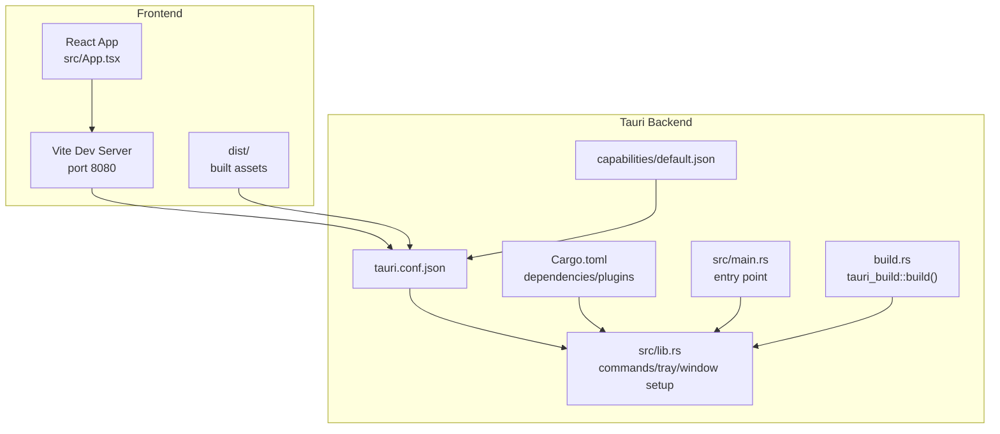
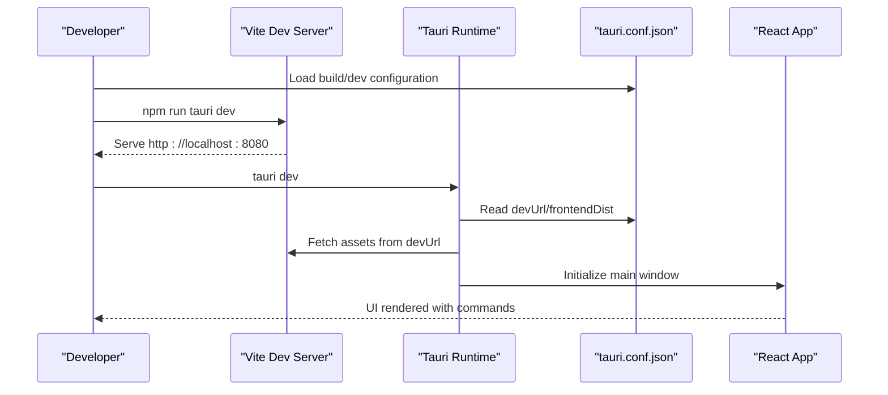
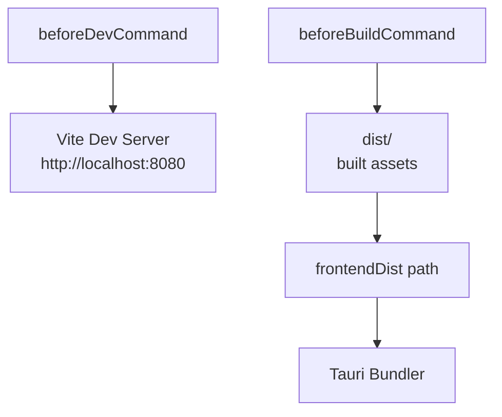
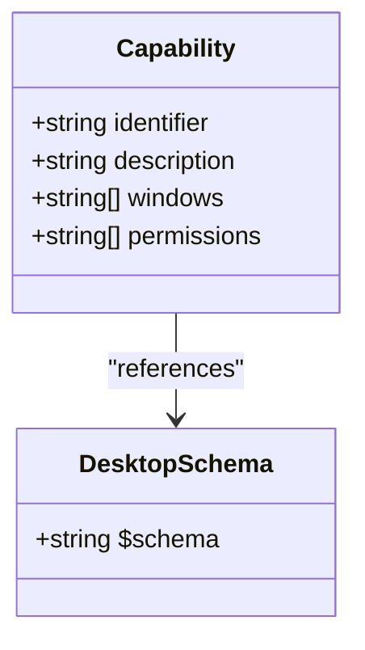
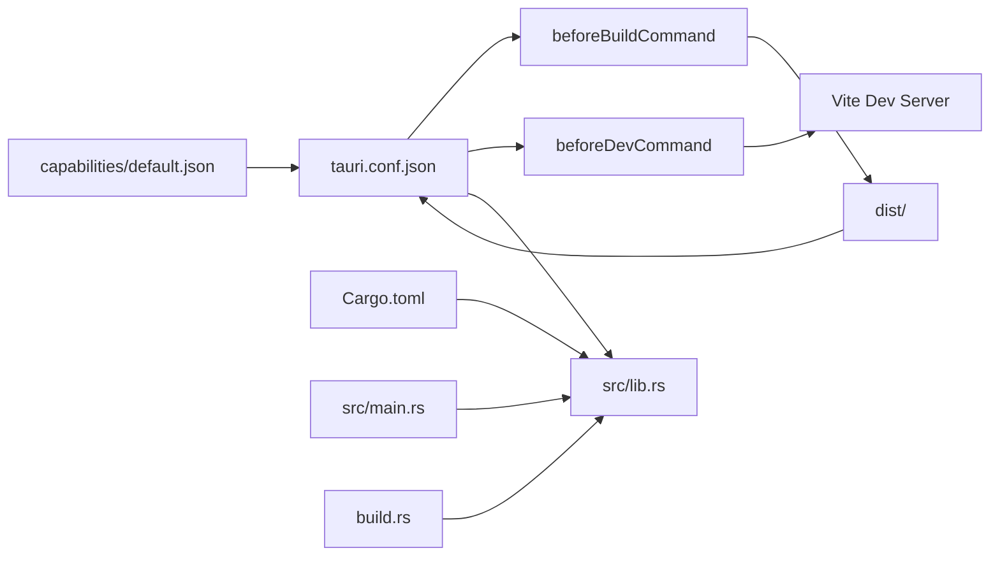

# Tauri Configuration

<cite>
**Referenced Files in This Document**
- [tauri.conf.json](file://src-tauri/tauri.conf.json)
- [Cargo.toml](file://src-tauri/Cargo.toml)
- [package.json](file://package.json)
- [vite.config.ts](file://vite.config.ts)
- [default.json](file://src-tauri/capabilities/default.json)
- [lib.rs](file://src-tauri/src/lib.rs)
- [main.rs](file://src-tauri/src/main.rs)
- [build.rs](file://src-tauri/build.rs)
- [App.tsx](file://src/App.tsx)
- [Index.tsx](file://src/pages/Index.tsx)
- [README.md](file://README.md)
</cite>

## Table of Contents
1. [Introduction](#introduction)
2. [Project Structure](#project-structure)
3. [Core Components](#core-components)
4. [Architecture Overview](#architecture-overview)
5. [Detailed Component Analysis](#detailed-component-analysis)
6. [Dependency Analysis](#dependency-analysis)
7. [Performance Considerations](#performance-considerations)
8. [Troubleshooting Guide](#troubleshooting-guide)
9. [Conclusion](#conclusion)
10. [Appendices](#appendices)

## Introduction
This document provides comprehensive guidance for configuring a Tauri application using the repository's existing configuration. It explains the tauri.conf.json structure, window configuration, build settings, security policies, and bundling options. It also covers customization patterns for window behavior, adding new windows, platform-specific settings, and bundle optimization, along with validation and common configuration patterns.

## Project Structure
The Tauri application is organized into a frontend (React + Vite) and a Rust backend (Tauri). The configuration is centralized in tauri.conf.json under src-tauri, with supporting build and dependency files in the same directory. The frontend assets are built into the dist directory and served during development and bundled for production.



**Diagram sources**
- [tauri.conf.json](file://src-tauri/tauri.conf.json#L1-L42)
- [Cargo.toml](file://src-tauri/Cargo.toml#L1-L29)
- [package.json](file://package.json#L1-L96)
- [vite.config.ts](file://vite.config.ts#L1-L22)
- [lib.rs](file://src-tauri/src/lib.rs#L658-L686)
- [main.rs](file://src-tauri/src/main.rs#L1-L7)
- [build.rs](file://src-tauri/build.rs#L1-L4)
- [default.json](file://src-tauri/capabilities/default.json#L1-L12)

**Section sources**
- [README.md](file://README.md#L22-L50)
- [tauri.conf.json](file://src-tauri/tauri.conf.json#L1-L42)
- [Cargo.toml](file://src-tauri/Cargo.toml#L1-L29)
- [package.json](file://package.json#L1-L96)
- [vite.config.ts](file://vite.config.ts#L1-L22)

## Core Components
This section documents the primary configuration areas defined in tauri.conf.json and how they integrate with the rest of the project.

- Product metadata
  - productName: application display name
  - version: semantic version
  - identifier: reverse-domain package identifier
  - Schema validation: $schema field ensures config conforms to Tauri v2 schema

- Build configuration
  - beforeDevCommand: runs before dev server starts
  - devUrl: development server URL/port
  - beforeBuildCommand: runs before production build
  - frontendDist: path to built frontend assets

- Application windows
  - Single window named "main" with fixed dimensions and restricted controls
  - Visibility and taskbar behavior configured via window flags
  - Security policy configured via CSP

- Security policies
  - Content Security Policy (CSP) set to null (relaxed policy)
  - Capability management via capabilities/default.json

- Bundling options
  - Active bundling enabled
  - Targets set to build all platforms
  - Icon resources included for multiple formats

- Platform-specific behavior
  - Tray icon plugin enabled
  - OS-specific network checks implemented in Rust

**Section sources**
- [tauri.conf.json](file://src-tauri/tauri.conf.json#L1-L42)
- [default.json](file://src-tauri/capabilities/default.json#L1-L12)
- [Cargo.toml](file://src-tauri/Cargo.toml#L20-L29)
- [lib.rs](file://src-tauri/src/lib.rs#L308-L349)

## Architecture Overview
The configuration orchestrates a development workflow where Vite serves the React frontend, and Tauri loads the built assets. During development, the devUrl points to the Vite server. In production, the frontendDist path is used to locate built assets. The Rust backend sets up the main window, tray icon, and commands, while capabilities define permissions.



**Diagram sources**
- [tauri.conf.json](file://src-tauri/tauri.conf.json#L6-L11)
- [vite.config.ts](file://vite.config.ts#L8-L14)
- [package.json](file://package.json#L6-L16)
- [lib.rs](file://src-tauri/src/lib.rs#L658-L686)

## Detailed Component Analysis

### tauri.conf.json Structure and Fields
- Schema and metadata
  - $schema: validates against Tauri v2 configuration schema
  - productName, version, identifier: branding and packaging identifiers

- Build settings
  - beforeDevCommand: triggers frontend dev script
  - devUrl: Vite dev server endpoint
  - beforeBuildCommand: triggers frontend build script
  - frontendDist: path to dist folder containing built assets

- Window configuration
  - title: window title
  - width/height: fixed size
  - resizable/maximizable/minimizable: disabled for a compact overlay
  - alwaysOnTop: keeps window above others
  - visible: hidden by default
  - skipTaskbar: excludes from Windows taskbar

- Security policies
  - csp: null (relaxed CSP)

- Bundling options
  - active: enable bundling
  - targets: build for all platforms
  - icon: multiple icon sizes and formats

**Section sources**
- [tauri.conf.json](file://src-tauri/tauri.conf.json#L1-L42)

### Window Behavior and Customization
- Default window behavior
  - Hidden on startup, positioned at bottom-right on focus, and hidden when losing focus
  - Close requests are prevented and converted to hiding
  - Focus management ensures proper UX

- Adding a new window
  - Extend the windows array in tauri.conf.json with a new window object
  - Assign a unique identifier and configure properties (size, visibility, etc.)
  - In Rust, create and manage the new window using Tauri APIs and register commands as needed

- Platform-specific settings
  - Network connectivity checks differ by OS in Rust code
  - Tray icon behavior and menu actions are implemented in Rust

```mermaid
flowchart TD
Start(["Window Event"]) --> Type{"Event Type"}
Type --> |CloseRequested| Hide["Prevent close<br/>Hide window"]
Type --> |Focused(false)| HideFocus["Hide window"]
Type --> |Other| Ignore["Ignore event"]
Hide --> End(["Done"])
HideFocus --> End
Ignore --> End
```

**Diagram sources**
- [lib.rs](file://src-tauri/src/lib.rs#L243-L254)

**Section sources**
- [lib.rs](file://src-tauri/src/lib.rs#L207-L257)
- [tauri.conf.json](file://src-tauri/tauri.conf.json#L13-L25)

### Build Configuration and Asset Bundling
- Development build
  - beforeDevCommand executes the frontend dev script
  - devUrl points to Vite server for live reload

- Production build
  - beforeBuildCommand executes the frontend build script
  - frontendDist points to the dist directory for asset inclusion

- Asset bundling
  - dist directory contains built assets
  - tauri.conf.json references frontendDist for production



**Diagram sources**
- [tauri.conf.json](file://src-tauri/tauri.conf.json#L6-L11)
- [package.json](file://package.json#L6-L16)
- [vite.config.ts](file://vite.config.ts#L8-L14)

**Section sources**
- [tauri.conf.json](file://src-tauri/tauri.conf.json#L6-L11)
- [package.json](file://package.json#L6-L16)
- [vite.config.ts](file://vite.config.ts#L1-L22)

### Security Policies and Capability Management
- Content Security Policy
  - csp is set to null in tauri.conf.json
  - Consider setting a strict CSP in production for enhanced security

- Capability management
  - capabilities/default.json defines permissions for the "main" window
  - Includes core permissions, opener, and notification plugins
  - Windows list ties the capability to the main window



**Diagram sources**
- [default.json](file://src-tauri/capabilities/default.json#L1-L12)

**Section sources**
- [tauri.conf.json](file://src-tauri/tauri.conf.json#L26-L28)
- [default.json](file://src-tauri/capabilities/default.json#L1-L12)

### Platform-Specific Settings and Plugins
- Plugins
  - tauri-plugin-opener: enables opening URLs and files
  - tauri-plugin-notification: enables desktop notifications

- OS-specific logic
  - Network connectivity checks vary by OS in Rust code
  - Tray icon and menu actions are implemented in Rust

**Section sources**
- [Cargo.toml](file://src-tauri/Cargo.toml#L20-L29)
- [lib.rs](file://src-tauri/src/lib.rs#L308-L349)

### Configuration Validation and Common Patterns
- Validation
  - $schema field in tauri.conf.json ensures configuration conforms to Tauri v2 schema
  - Use the Tauri CLI to validate and build the application

- Common patterns
  - Keep CSP relaxed for development; tighten in production
  - Use capabilities to granularly grant permissions per window
  - Maintain separate dev and build commands for frontend tooling
  - Position always-on-top windows near the taskbar for accessibility

**Section sources**
- [tauri.conf.json](file://src-tauri/tauri.conf.json#L2-L4)
- [package.json](file://package.json#L6-L16)

## Dependency Analysis
The Tauri configuration depends on frontend build scripts, Vite server, and Rust plugins. The Rust backend manages window lifecycle, tray integration, and commands.



**Diagram sources**
- [tauri.conf.json](file://src-tauri/tauri.conf.json#L6-L11)
- [package.json](file://package.json#L6-L16)
- [vite.config.ts](file://vite.config.ts#L8-L14)
- [Cargo.toml](file://src-tauri/Cargo.toml#L20-L29)
- [lib.rs](file://src-tauri/src/lib.rs#L658-L686)
- [main.rs](file://src-tauri/src/main.rs#L1-L7)
- [build.rs](file://src-tauri/build.rs#L1-L4)
- [default.json](file://src-tauri/capabilities/default.json#L1-L12)

**Section sources**
- [tauri.conf.json](file://src-tauri/tauri.conf.json#L6-L11)
- [Cargo.toml](file://src-tauri/Cargo.toml#L20-L29)
- [lib.rs](file://src-tauri/src/lib.rs#L658-L686)

## Performance Considerations
- Keep window dimensions minimal to reduce rendering overhead
- Disable resizing and maximize to simplify layout calculations
- Use always-on-top judiciously to avoid excessive GPU usage
- Minimize CSP restrictions in development; tighten in production to reduce XSS risks
- Optimize frontend assets in dist to reduce load times

## Troubleshooting Guide
- Development server not reachable
  - Verify devUrl and Vite server port configuration
  - Confirm beforeDevCommand executes successfully

- Assets not loading in production
  - Ensure frontendDist points to the correct dist directory
  - Confirm build completes without errors

- Window not appearing
  - Check window visibility and skipTaskbar settings
  - Verify window positioning logic and focus behavior

- Plugin not working
  - Confirm plugin dependencies in Cargo.toml
  - Ensure plugin initialization in Rust setup

**Section sources**
- [tauri.conf.json](file://src-tauri/tauri.conf.json#L6-L11)
- [vite.config.ts](file://vite.config.ts#L8-L14)
- [lib.rs](file://src-tauri/src/lib.rs#L207-L257)
- [Cargo.toml](file://src-tauri/Cargo.toml#L20-L29)

## Conclusion
The tauri.conf.json centralizes Tauri configuration for this application, coordinating development and production workflows, window behavior, security policies, and bundling. By leveraging capabilities, plugins, and platform-specific logic, the configuration supports a robust desktop experience. Following the validation and optimization guidelines ensures reliable builds and secure deployments.

## Appendices
- Example references
  - Product metadata: [tauri.conf.json](file://src-tauri/tauri.conf.json#L3-L5)
  - Build settings: [tauri.conf.json](file://src-tauri/tauri.conf.json#L6-L11)
  - Window configuration: [tauri.conf.json](file://src-tauri/tauri.conf.json#L13-L25)
  - Security policies: [tauri.conf.json](file://src-tauri/tauri.conf.json#L26-L28)
  - Bundling options: [tauri.conf.json](file://src-tauri/tauri.conf.json#L30-L40)
  - Capability management: [default.json](file://src-tauri/capabilities/default.json#L1-L12)
  - Plugins: [Cargo.toml](file://src-tauri/Cargo.toml#L20-L29)
  - Frontend build scripts: [package.json](file://package.json#L6-L16)
  - Vite dev server: [vite.config.ts](file://vite.config.ts#L8-L14)
  - Window lifecycle: [lib.rs](file://src-tauri/src/lib.rs#L207-L257)
  - Entry point: [main.rs](file://src-tauri/src/main.rs#L4-L6)
  - Build hook: [build.rs](file://src-tauri/build.rs#L1-L4)