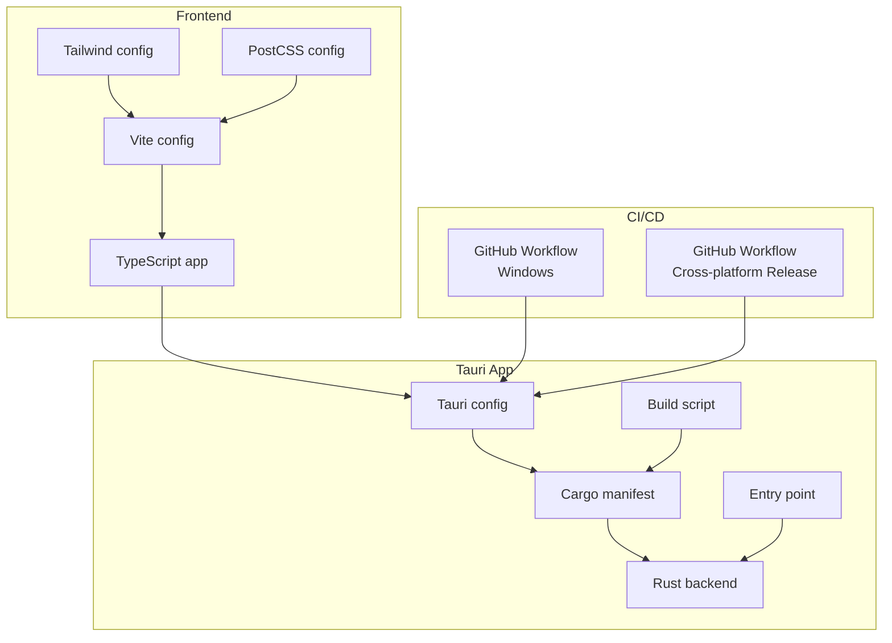
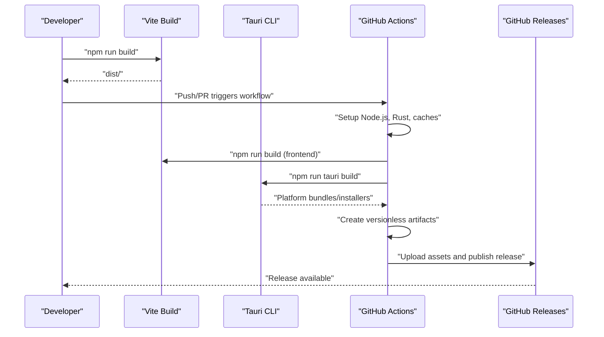
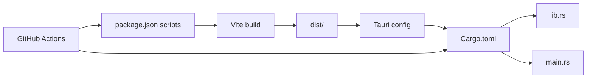

# Deployment and Distribution

<cite>
**Referenced Files in This Document**
- [package.json](file://package.json)
- [vite.config.ts](file://vite.config.ts)
- [src-tauri/tauri.conf.json](file://src-tauri/tauri.conf.json)
- [src-tauri/Cargo.toml](file://src-tauri/Cargo.toml)
- [.github/workflows/build-windows.yml](file://.github/workflows/build-windows.yml)
- [.github/workflows/cross-platform.yml](file://.github/workflows/cross-platform.yml)
- [VERSION](file://VERSION)
- [src-tauri/src/lib.rs](file://src-tauri/src/lib.rs)
- [src-tauri/src/main.rs](file://src-tauri/src/main.rs)
- [src-tauri/build.rs](file://src-tauri/build.rs)
- [tailwind.config.ts](file://tailwind.config.ts)
- [postcss.config.js](file://postcss.config.js)
- [tsconfig.app.json](file://tsconfig.app.json)
- [tsconfig.node.json](file://tsconfig.node.json)
</cite>

## Table of Contents
1. [Introduction](#introduction)
2. [Project Structure](#project-structure)
3. [Core Components](#core-components)
4. [Architecture Overview](#architecture-overview)
5. [Detailed Component Analysis](#detailed-component-analysis)
6. [Dependency Analysis](#dependency-analysis)
7. [Performance Considerations](#performance-considerations)
8. [Troubleshooting Guide](#troubleshooting-guide)
9. [Conclusion](#conclusion)
10. [Appendices](#appendices)

## Introduction
This document explains how to deploy and distribute the application across platforms. It covers the build process, asset bundling, packaging formats, installer creation, update mechanisms, CI/CD pipelines, code signing, and distribution channels. It also provides guidance on customizing builds, managing environments, handling version updates, update notifications, and rollback procedures.

## Project Structure
The project is a Tauri v2 application with a React + TypeScript frontend and a Rust backend. The frontend is built with Vite and bundled into the Tauri app’s frontend distribution. Tauri configuration defines bundling targets and icons. GitHub Actions workflows orchestrate builds and releases across Windows, Linux, and macOS.

**Diagram sources**
- [vite.config.ts](file://vite.config.ts#L1-L22)
- [tailwind.config.ts](file://tailwind.config.ts#L1-L105)
- [postcss.config.js](file://postcss.config.js#L1-L7)
- [src-tauri/tauri.conf.json](file://src-tauri/tauri.conf.json#L1-L42)
- [src-tauri/Cargo.toml](file://src-tauri/Cargo.toml#L1-L29)
- [src-tauri/src/lib.rs](file://src-tauri/src/lib.rs#L1-L686)
- [src-tauri/src/main.rs](file://src-tauri/src/main.rs#L1-L7)
- [src-tauri/build.rs](file://src-tauri/build.rs#L1-L4)
- [.github/workflows/build-windows.yml](file://.github/workflows/build-windows.yml#L1-L49)
- [.github/workflows/cross-platform.yml](file://.github/workflows/cross-platform.yml#L1-L194)

**Section sources**
- [package.json](file://package.json#L1-L96)
- [vite.config.ts](file://vite.config.ts#L1-L22)
- [src-tauri/tauri.conf.json](file://src-tauri/tauri.conf.json#L1-L42)
- [src-tauri/Cargo.toml](file://src-tauri/Cargo.toml#L1-L29)
- [.github/workflows/build-windows.yml](file://.github/workflows/build-windows.yml#L1-L49)
- [.github/workflows/cross-platform.yml](file://.github/workflows/cross-platform.yml#L1-L194)

## Core Components
- Frontend build and bundling: Vite compiles TypeScript/React and Tailwind CSS; assets are emitted to the configured dist folder consumed by Tauri.
- Tauri bundling: Tauri bundles the frontend into platform-specific installers and portable executables.
- CI/CD: GitHub Actions builds per platform and publishes artifacts and releases.

Key build and packaging configuration locations:
- Frontend build scripts and dependencies: [package.json](file://package.json#L6-L16)
- Vite configuration: [vite.config.ts](file://vite.config.ts#L7-L21)
- Tailwind configuration: [tailwind.config.ts](file://tailwind.config.ts#L1-L105)
- PostCSS configuration: [postcss.config.js](file://postcss.config.js#L1-L7)
- Tauri configuration (bundling, icons, dev/build hooks): [src-tauri/tauri.conf.json](file://src-tauri/tauri.conf.json#L6-L40)
- Rust crate and dependencies: [src-tauri/Cargo.toml](file://src-tauri/Cargo.toml#L1-L29)
- Rust entry point and app runtime: [src-tauri/src/main.rs](file://src-tauri/src/main.rs#L1-L7), [src-tauri/src/lib.rs](file://src-tauri/src/lib.rs#L658-L686)
- Tauri build script: [src-tauri/build.rs](file://src-tauri/build.rs#L1-L4)
- Version source: [VERSION](file://VERSION#L1-L2)

**Section sources**
- [package.json](file://package.json#L6-L16)
- [vite.config.ts](file://vite.config.ts#L7-L21)
- [tailwind.config.ts](file://tailwind.config.ts#L1-L105)
- [postcss.config.js](file://postcss.config.js#L1-L7)
- [src-tauri/tauri.conf.json](file://src-tauri/tauri.conf.json#L6-L40)
- [src-tauri/Cargo.toml](file://src-tauri/Cargo.toml#L1-L29)
- [src-tauri/src/main.rs](file://src-tauri/src/main.rs#L1-L7)
- [src-tauri/src/lib.rs](file://src-tauri/src/lib.rs#L658-L686)
- [src-tauri/build.rs](file://src-tauri/build.rs#L1-L4)
- [VERSION](file://VERSION#L1-L2)

## Architecture Overview
The deployment pipeline integrates frontend bundling with Tauri packaging and GitHub Actions automation. The frontend is built via Vite and then embedded into the Tauri app. Tauri builds platform-specific bundles and installers. Release artifacts are uploaded and published to GitHub Releases.

**Diagram sources**
- [package.json](file://package.json#L8-L16)
- [.github/workflows/cross-platform.yml](file://.github/workflows/cross-platform.yml#L102-L194)
- [src-tauri/tauri.conf.json](file://src-tauri/tauri.conf.json#L6-L11)

**Section sources**
- [package.json](file://package.json#L8-L16)
- [.github/workflows/cross-platform.yml](file://.github/workflows/cross-platform.yml#L102-L194)
- [src-tauri/tauri.conf.json](file://src-tauri/tauri.conf.json#L6-L11)

## Detailed Component Analysis

### Frontend Build and Asset Bundling
- Vite configuration sets up React plugin, HMR, and path aliases. In development mode, a component tagger plugin can be enabled.
- Tailwind and PostCSS are configured for CSS processing and purging.
- The Tauri build hook specifies the frontend dist path and dev URL.

Key references:
- Vite dev server and plugins: [vite.config.ts](file://vite.config.ts#L7-L21)
- Tailwind content globs and theme extensions: [tailwind.config.ts](file://tailwind.config.ts#L3-L104)
- PostCSS plugins: [postcss.config.js](file://postcss.config.js#L1-L7)
- Tauri build/dev hooks and frontend dist: [src-tauri/tauri.conf.json](file://src-tauri/tauri.conf.json#L6-L11)

Optimization tips:
- Enable minification and chunk splitting via Vite defaults.
- Keep Tailwind purge safe by ensuring content globs include all template paths.
- Prefer static assets under the public directory for cache-friendly URLs.

**Section sources**
- [vite.config.ts](file://vite.config.ts#L7-L21)
- [tailwind.config.ts](file://tailwind.config.ts#L3-L104)
- [postcss.config.js](file://postcss.config.js#L1-L7)
- [src-tauri/tauri.conf.json](file://src-tauri/tauri.conf.json#L6-L11)

### Tauri Packaging and Installer Formats
- Tauri configuration enables bundling for all targets and defines icons for multiple formats.
- The Rust crate exposes a library suitable for dynamic/static linking and is used by Tauri.
- Platform-specific bundles are produced during Tauri builds.

Key references:
- Tauri bundle targets and icons: [src-tauri/tauri.conf.json](file://src-tauri/tauri.conf.json#L30-L40)
- Rust crate types and dependencies: [src-tauri/Cargo.toml](file://src-tauri/Cargo.toml#L10-L29)
- Tauri build invocation: [package.json](file://package.json#L16-L16)

Supported formats observed in CI:
- Windows: MSI, NSIS setup, portable EXE
- Linux: AppImage, DEB, RPM, raw binary
- macOS: DMG

**Section sources**
- [src-tauri/tauri.conf.json](file://src-tauri/tauri.conf.json#L30-L40)
- [src-tauri/Cargo.toml](file://src-tauri/Cargo.toml#L10-L29)
- [package.json](file://package.json#L16-L16)
- [.github/workflows/cross-platform.yml](file://.github/workflows/cross-platform.yml#L109-L181)

### CI/CD Pipelines and Release Management
- Windows-only build workflow: runs on pushes and PRs, builds the Tauri app, and uploads the executable artifact.
- Cross-platform release workflow: runs on commits containing a specific message pattern, reads version from VERSION, extracts release notes from the commit message, installs system dependencies for Linux, disables macOS signing for local runs, builds Tauri app, creates versionless artifacts per platform, and publishes a GitHub Release.

Key references:
- Windows workflow: [build-windows.yml](file://.github/workflows/build-windows.yml#L1-L49)
- Cross-platform release workflow: [cross-platform.yml](file://.github/workflows/cross-platform.yml#L1-L194)
- Version source: [VERSION](file://VERSION#L1-L2)

Release notes extraction:
- Python script reads the commit message and writes release notes to GITHUB_OUTPUT for use in the release step.

Versioning:
- Version is read from the VERSION file and used as the tag and release name.

Signing:
- macOS signing is disabled in CI by setting empty signing environment variables.
- Windows/Linux signing requires secrets configured for Tauri private key and password.

**Section sources**
- [.github/workflows/build-windows.yml](file://.github/workflows/build-windows.yml#L1-L49)
- [.github/workflows/cross-platform.yml](file://.github/workflows/cross-platform.yml#L33-L68)
- [.github/workflows/cross-platform.yml](file://.github/workflows/cross-platform.yml#L94-L108)
- [VERSION](file://VERSION#L1-L2)

### Update Mechanisms and Rollback Procedures
- The Rust backend implements a finite state machine for the service lifecycle and logs events. Notifications are used to inform the user of state changes and errors.
- There is no in-app updater integrated in the backend; updates are distributed via GitHub Releases.

Recommended update strategy:
- Use Tauri’s updater plugin to enable automatic updates from GitHub Releases.
- Maintain semantic version tags and release notes in the VERSION file and commit messages.
- For rollback, publish a hotfix release with a higher version number and instruct users to downgrade to the previous working version.

Key references:
- State machine and logging: [src-tauri/src/lib.rs](file://src-tauri/src/lib.rs#L27-L141)
- Notifications: [src-tauri/src/lib.rs](file://src-tauri/src/lib.rs#L184-L205)

**Section sources**
- [src-tauri/src/lib.rs](file://src-tauri/src/lib.rs#L27-L141)
- [src-tauri/src/lib.rs](file://src-tauri/src/lib.rs#L184-L205)

### Platform-Specific Deployment Considerations
- Windows
  - Produces MSI, NSIS setup, and portable EXE.
  - Requires Windows runner and appropriate toolchain.
  - Consider signing with a code-signing certificate and configuring Tauri secrets.
- Linux
  - Produces AppImage, DEB, RPM, and raw binary.
  - Installs system dependencies for AppImage bundling and runtime.
  - Ensure runtime libraries are compatible with target distributions.
- macOS
  - Produces DMG.
  - CI disables signing for local runs; configure signing secrets for production.

Key references:
- Artifact creation per OS: [cross-platform.yml](file://.github/workflows/cross-platform.yml#L109-L181)
- Linux system dependencies: [cross-platform.yml](file://.github/workflows/cross-platform.yml#L25-L31)

**Section sources**
- [.github/workflows/cross-platform.yml](file://.github/workflows/cross-platform.yml#L109-L181)
- [.github/workflows/cross-platform.yml](file://.github/workflows/cross-platform.yml#L25-L31)

### Code Signing Requirements
- Secrets required for signing:
  - TAURI_PRIVATE_KEY
  - TAURI_KEY_PASSWORD
- macOS signing is disabled in CI by exporting empty signing environment variables; configure secrets for production builds.

Key references:
- Secret usage and macOS signing disablement: [cross-platform.yml](file://.github/workflows/cross-platform.yml#L94-L108)

**Section sources**
- [.github/workflows/cross-platform.yml](file://.github/workflows/cross-platform.yml#L94-L108)

### Distribution Channels
- Primary channel: GitHub Releases, with assets uploaded from the release job.
- Versionless artifacts are created to simplify download links across platforms.

Key references:
- Release upload: [cross-platform.yml](file://.github/workflows/cross-platform.yml#L182-L194)

**Section sources**
- [.github/workflows/cross-platform.yml](file://.github/workflows/cross-platform.yml#L182-L194)

### Customizing the Build Process
- Modify Vite configuration for plugins, aliases, and dev server options.
- Adjust Tauri bundle targets and icons to tailor packaging.
- Extend CI matrices to add or remove platforms.
- Integrate an updater plugin in Tauri to automate updates.

Key references:
- Vite configuration: [vite.config.ts](file://vite.config.ts#L7-L21)
- Tauri bundle configuration: [src-tauri/tauri.conf.json](file://src-tauri/tauri.conf.json#L30-L40)
- CI matrix and jobs: [cross-platform.yml](file://.github/workflows/cross-platform.yml#L16-L20)

**Section sources**
- [vite.config.ts](file://vite.config.ts#L7-L21)
- [src-tauri/tauri.conf.json](file://src-tauri/tauri.conf.json#L30-L40)
- [.github/workflows/cross-platform.yml](file://.github/workflows/cross-platform.yml#L16-L20)

### Managing Different Deployment Environments
- Use separate GitHub Actions workflows or jobs for staging vs. production.
- Control bundling targets and installer formats per environment.
- Gate releases using commit message patterns or branch protection rules.

Key references:
- Conditional gating in workflows: [build-windows.yml](file://.github/workflows/build-windows.yml#L13-L13), [cross-platform.yml](file://.github/workflows/cross-platform.yml#L13-L13)

**Section sources**
- [.github/workflows/build-windows.yml](file://.github/workflows/build-windows.yml#L13-L13)
- [.github/workflows/cross-platform.yml](file://.github/workflows/cross-platform.yml#L13-L13)

### Handling Version Updates
- Version is sourced from the VERSION file and used as the release tag and name.
- Release notes are extracted from the commit message and attached to the release.

Key references:
- Version sourcing: [cross-platform.yml](file://.github/workflows/cross-platform.yml#L33-L39)
- Release notes extraction: [cross-platform.yml](file://.github/workflows/cross-platform.yml#L41-L68)

**Section sources**
- [.github/workflows/cross-platform.yml](file://.github/workflows/cross-platform.yml#L33-L39)
- [.github/workflows/cross-platform.yml](file://.github/workflows/cross-platform.yml#L41-L68)

## Dependency Analysis
The frontend build depends on Vite and React plugins; Tauri consumes the built dist. CI depends on Node.js and Rust toolchains. Rust dependencies include Tauri, HTTP client, async runtime, and plugins.

**Diagram sources**
- [package.json](file://package.json#L6-L16)
- [vite.config.ts](file://vite.config.ts#L7-L21)
- [src-tauri/tauri.conf.json](file://src-tauri/tauri.conf.json#L6-L11)
- [src-tauri/Cargo.toml](file://src-tauri/Cargo.toml#L1-L29)
- [src-tauri/src/lib.rs](file://src-tauri/src/lib.rs#L658-L686)
- [src-tauri/src/main.rs](file://src-tauri/src/main.rs#L1-L7)

**Section sources**
- [package.json](file://package.json#L6-L16)
- [vite.config.ts](file://vite.config.ts#L7-L21)
- [src-tauri/tauri.conf.json](file://src-tauri/tauri.conf.json#L6-L11)
- [src-tauri/Cargo.toml](file://src-tauri/Cargo.toml#L1-L29)
- [src-tauri/src/lib.rs](file://src-tauri/src/lib.rs#L658-L686)
- [src-tauri/src/main.rs](file://src-tauri/src/main.rs#L1-L7)

## Performance Considerations
- Minimize payload size by enabling tree-shaking and code splitting via Vite defaults.
- Use Tailwind purging to reduce CSS size; ensure content globs cover all template paths.
- Prefer static assets and cache-busting filenames where applicable.
- Optimize Rust dependencies and avoid unnecessary features to reduce binary size.

[No sources needed since this section provides general guidance]

## Troubleshooting Guide
Common issues and resolutions:
- Linux bundling failures: ensure system dependencies are installed in the runner.
  - Reference: [cross-platform.yml](file://.github/workflows/cross-platform.yml#L25-L31)
- Missing icons or incorrect bundling: verify icon paths in Tauri configuration.
  - Reference: [src-tauri/tauri.conf.json](file://src-tauri/tauri.conf.json#L33-L39)
- CI signing failures: configure TAURI_PRIVATE_KEY and TAURI_KEY_PASSWORD secrets.
  - Reference: [cross-platform.yml](file://.github/workflows/cross-platform.yml#L105-L108)
- Version mismatch: confirm VERSION file format and that it is read correctly.
  - Reference: [cross-platform.yml](file://.github/workflows/cross-platform.yml#L33-L39)

**Section sources**
- [.github/workflows/cross-platform.yml](file://.github/workflows/cross-platform.yml#L25-L31)
- [src-tauri/tauri.conf.json](file://src-tauri/tauri.conf.json#L33-L39)
- [.github/workflows/cross-platform.yml](file://.github/workflows/cross-platform.yml#L105-L108)
- [.github/workflows/cross-platform.yml](file://.github/workflows/cross-platform.yml#L33-L39)

## Conclusion
The project uses a streamlined build and release pipeline combining Vite, Tauri, and GitHub Actions. Frontend assets are bundled and embedded into platform-specific installers and portable binaries. CI manages cross-platform builds, versioning, and release publishing. To harden distribution, integrate Tauri’s updater plugin, configure code signing, and maintain clear release notes and versioning discipline.

[No sources needed since this section summarizes without analyzing specific files]

## Appendices

### Build and Run Commands
- Development: [package.json](file://package.json#L7-L7), [src-tauri/tauri.conf.json](file://src-tauri/tauri.conf.json#L7-L8)
- Production build: [package.json](file://package.json#L8-L8), [package.json](file://package.json#L16-L16)
- Preview: [package.json](file://package.json#L11-L11)

**Section sources**
- [package.json](file://package.json#L7-L11)
- [package.json](file://package.json#L16-L16)
- [src-tauri/tauri.conf.json](file://src-tauri/tauri.conf.json#L7-L8)

### Tauri Runtime and Plugins
- Application runtime and commands: [src-tauri/src/lib.rs](file://src-tauri/src/lib.rs#L658-L686)
- Tray and notification plugins: [src-tauri/Cargo.toml](file://src-tauri/Cargo.toml#L20-L29)

**Section sources**
- [src-tauri/src/lib.rs](file://src-tauri/src/lib.rs#L658-L686)
- [src-tauri/Cargo.toml](file://src-tauri/Cargo.toml#L20-L29)