# Desktop Integration

<cite>
**Referenced Files in This Document**
- [tauri.conf.json](file://src-tauri/tauri.conf.json)
- [lib.rs](file://src-tauri/src/lib.rs)
- [main.rs](file://src-tauri/src/main.rs)
- [default.json](file://src-tauri/capabilities/default.json)
- [build.rs](file://src-tauri/build.rs)
- [useServiceState.ts](file://src/hooks/useServiceState.ts)
- [Index.tsx](file://src/pages/Index.tsx)
- [PrimaryControls.tsx](file://src/components/PrimaryControls.tsx)
- [AdvancedSettings.tsx](file://src/components/AdvancedSettings.tsx)
- [README.md](file://README.md)
</cite>

## Table of Contents
1. [Introduction](#introduction)
2. [Project Structure](#project-structure)
3. [Core Components](#core-components)
4. [Architecture Overview](#architecture-overview)
5. [Detailed Component Analysis](#detailed-component-analysis)
6. [Dependency Analysis](#dependency-analysis)
7. [Performance Considerations](#performance-considerations)
8. [Troubleshooting Guide](#troubleshooting-guide)
9. [Conclusion](#conclusion)
10. [Appendices](#appendices)

## Introduction
This document explains the desktop integration features of the application, focusing on the system tray, menu configuration, event handling, floating window behavior, notifications, platform-specific checks, and Tauri configuration. It also covers how the frontend interacts with the Rust backend via Tauri commands and how to extend the system tray functionality and add new desktop integration features.

## Project Structure
The desktop integration spans both the Tauri backend (Rust) and the React frontend:
- Tauri configuration defines the main window, bundling, and permissions.
- The Rust backend sets up the tray icon, menu, window behavior, and service lifecycle.
- The React frontend exposes UI controls that invoke Tauri commands to control the service and displays status and logs.

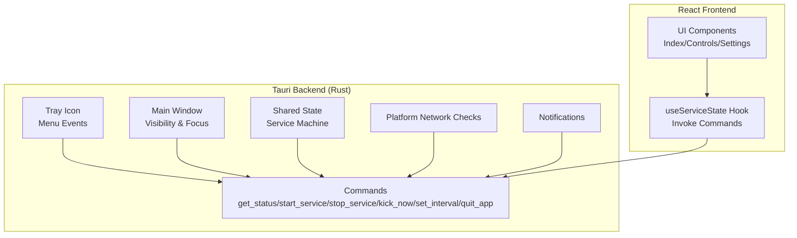

**Diagram sources**
- [lib.rs](file://src-tauri/src/lib.rs#L259-L306)
- [lib.rs](file://src-tauri/src/lib.rs#L238-L257)
- [lib.rs](file://src-tauri/src/lib.rs#L659-L685)
- [useServiceState.ts](file://src/hooks/useServiceState.ts#L88-L152)
- [Index.tsx](file://src/pages/Index.tsx#L9-L51)

**Section sources**
- [tauri.conf.json](file://src-tauri/tauri.conf.json#L12-L29)
- [lib.rs](file://src-tauri/src/lib.rs#L659-L685)
- [useServiceState.ts](file://src/hooks/useServiceState.ts#L67-L162)

## Core Components
- System tray and menu: Created with a tray builder, configured with a left-click toggle and a context menu containing Show/Hide, Start/Stop, and Quit actions.
- Floating window: A main webview window configured to be always-on-top, hidden by default, non-resizable, and positioned near the bottom-right corner of the screen.
- Event handling: Left-click toggles visibility and focus; right-click opens the context menu; window close requests are intercepted to hide instead of closing; losing focus hides the window.
- Notifications: Uses the Tauri notification plugin to inform users about service state changes and errors.
- Platform-specific checks: On Windows, network adapter connectivity is verified using system commands; other platforms return an error indicating unsupported checks.
- Tauri commands: Exposed commands allow the frontend to query status, start/stop the service, trigger a manual kick, adjust the interval, and quit the app.

**Section sources**
- [lib.rs](file://src-tauri/src/lib.rs#L259-L306)
- [lib.rs](file://src-tauri/src/lib.rs#L207-L236)
- [lib.rs](file://src-tauri/src/lib.rs#L238-L257)
- [lib.rs](file://src-tauri/src/lib.rs#L184-L205)
- [lib.rs](file://src-tauri/src/lib.rs#L308-L349)
- [lib.rs](file://src-tauri/src/lib.rs#L599-L656)

## Architecture Overview
The desktop integration follows a clear separation of concerns:
- The backend initializes the app, manages state, and exposes commands.
- The frontend polls status and invokes commands to control the service.
- The tray and window are managed by the backend, with the frontend providing a user interface.

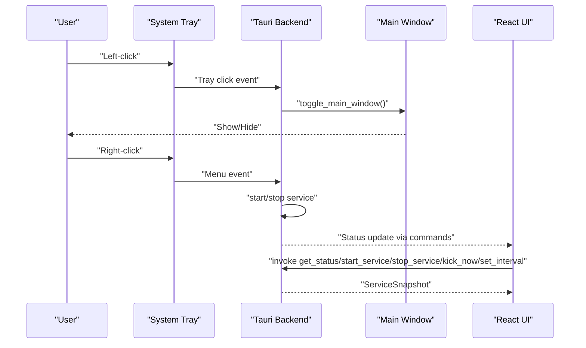

**Diagram sources**
- [lib.rs](file://src-tauri/src/lib.rs#L259-L306)
- [lib.rs](file://src-tauri/src/lib.rs#L207-L236)
- [lib.rs](file://src-tauri/src/lib.rs#L599-L656)
- [useServiceState.ts](file://src/hooks/useServiceState.ts#L88-L152)

## Detailed Component Analysis

### System Tray Implementation
- Tray creation: A tray icon is built with a custom ID and bound to a context menu.
- Left-click behavior: Controlled separately from the menu; toggles the main window visibility and focus.
- Right-click behavior: Opens the context menu with three actions: Show/Hide, Start/Stop, and Quit.
- Menu actions:
  - Show/Hide: Calls the toggle function to show/hide the main window.
  - Start/Stop: Invokes the appropriate async service function and handles errors by transitioning to an error state and notifying the user.
  - Quit: Exits the application.

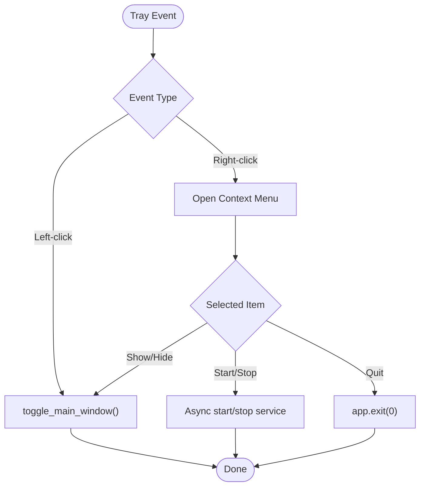

**Diagram sources**
- [lib.rs](file://src-tauri/src/lib.rs#L259-L306)
- [lib.rs](file://src-tauri/src/lib.rs#L207-L218)

**Section sources**
- [lib.rs](file://src-tauri/src/lib.rs#L259-L306)

### Menu System Configuration
- Menu items: Show/Hide, Start/Stop, Quit.
- Menu binding: The tray builder attaches the menu to the tray icon.
- Event routing: Menu events are handled to dispatch to the appropriate action handlers.

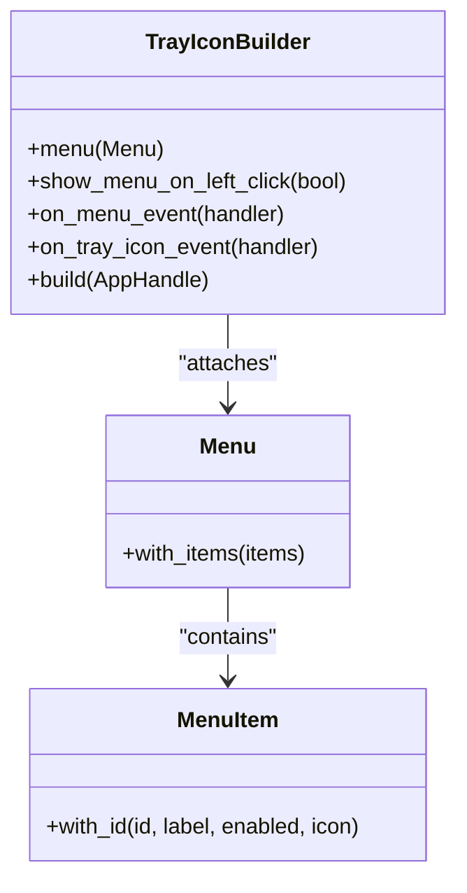

**Diagram sources**
- [lib.rs](file://src-tauri/src/lib.rs#L259-L306)

**Section sources**
- [lib.rs](file://src-tauri/src/lib.rs#L259-L306)

### Event Handling: Left-Click and Right-Click Interactions
- Left-click: Triggers a visibility toggle and focuses the window when shown.
- Right-click: Opens the context menu without affecting window visibility.
- Close and focus events: Closing the window is prevented; hiding occurs on close requested and when focus is lost.

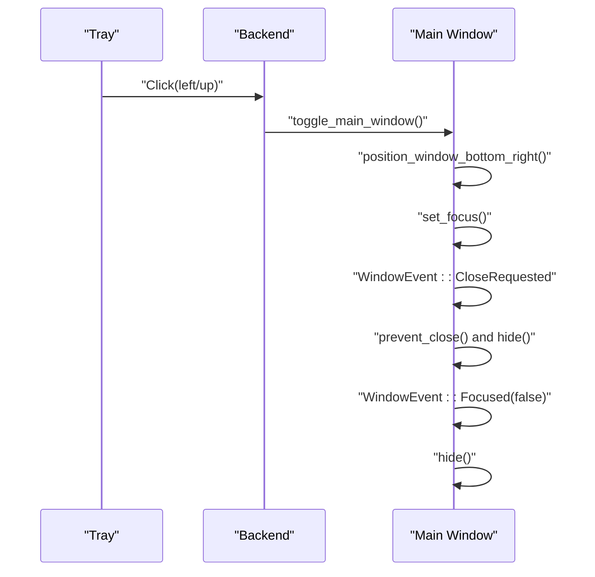

**Diagram sources**
- [lib.rs](file://src-tauri/src/lib.rs#L207-L236)
- [lib.rs](file://src-tauri/src/lib.rs#L238-L257)
- [lib.rs](file://src-tauri/src/lib.rs#L289-L298)

**Section sources**
- [lib.rs](file://src-tauri/src/lib.rs#L207-L236)
- [lib.rs](file://src-tauri/src/lib.rs#L238-L257)
- [lib.rs](file://src-tauri/src/lib.rs#L289-L298)

### Floating Window Properties and Positioning
- Window configuration: Always-on-top, hidden by default, non-resizable, non-minimizable, non-maximizable, skip taskbar.
- Positioning: Positioned at the bottom-right corner of the current monitor with margins.
- Visibility and focus: Controlled programmatically; focus is set when shown.

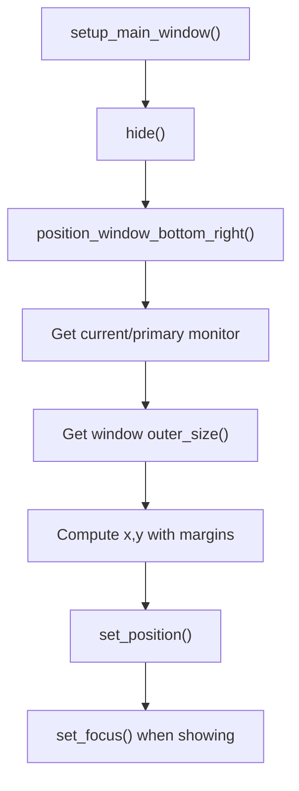

**Diagram sources**
- [lib.rs](file://src-tauri/src/lib.rs#L238-L257)
- [lib.rs](file://src-tauri/src/lib.rs#L220-L236)

**Section sources**
- [tauri.conf.json](file://src-tauri/tauri.conf.json#L13-L25)
- [lib.rs](file://src-tauri/src/lib.rs#L220-L236)
- [lib.rs](file://src-tauri/src/lib.rs#L238-L257)

### Notification System
- Notifications are triggered on service transitions, errors, and connectivity loss.
- The notification plugin is initialized during app setup.

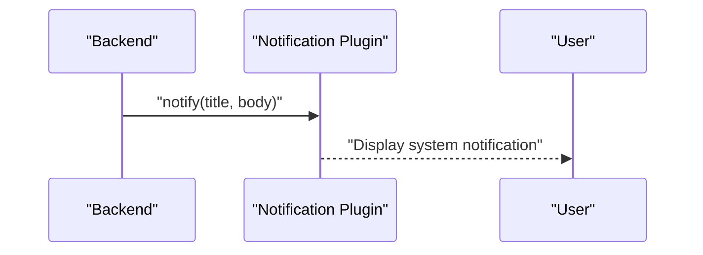

**Diagram sources**
- [lib.rs](file://src-tauri/src/lib.rs#L184-L205)
- [lib.rs](file://src-tauri/src/lib.rs#L669-L670)

**Section sources**
- [lib.rs](file://src-tauri/src/lib.rs#L184-L205)
- [lib.rs](file://src-tauri/src/lib.rs#L669-L670)

### Platform-Specific Features
- Windows network connectivity check: Uses system commands to detect active network adapters.
- Other platforms: Returns an error indicating unsupported checks.

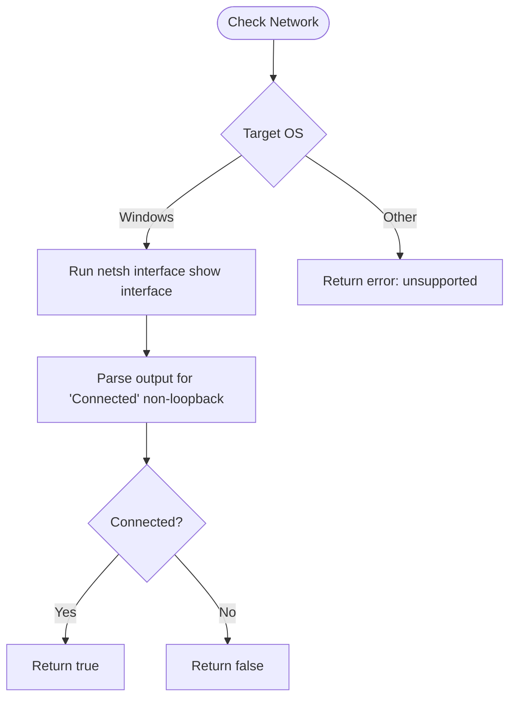

**Diagram sources**
- [lib.rs](file://src-tauri/src/lib.rs#L308-L349)

**Section sources**
- [lib.rs](file://src-tauri/src/lib.rs#L308-L349)

### Auto-Start Configuration
- The repository does not include an auto-start mechanism. To add auto-start, integrate a platform-specific launcher or registry entry via Tauri plugins or custom Rust code. This is outside the current implementation.

[No sources needed since this section provides general guidance]

### Tauri Configuration for Desktop Integration
- Product metadata and build settings define the development and build URLs and frontend distribution path.
- Main window configuration sets size, behavior, and visibility defaults.
- Bundling includes platform-specific icons.
- Capabilities define permissions for the main window, including opener and notification defaults.

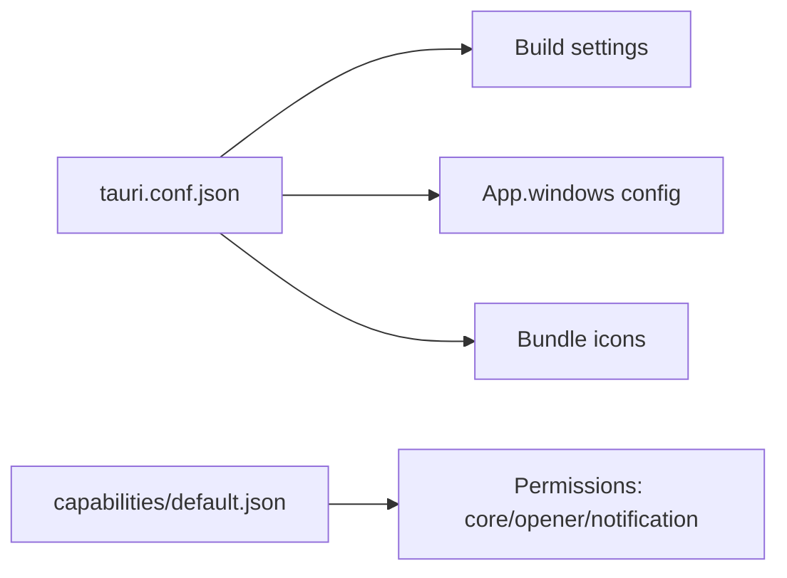

**Diagram sources**
- [tauri.conf.json](file://src-tauri/tauri.conf.json#L6-L11)
- [tauri.conf.json](file://src-tauri/tauri.conf.json#L12-L29)
- [tauri.conf.json](file://src-tauri/tauri.conf.json#L30-L40)
- [default.json](file://src-tauri/capabilities/default.json#L6-L10)

**Section sources**
- [tauri.conf.json](file://src-tauri/tauri.conf.json#L1-L42)
- [default.json](file://src-tauri/capabilities/default.json#L1-L12)

### Icon Management Across Platforms
- Icons are included under the Tauri icons directory with multiple sizes and formats for Windows, macOS, and Android.
- The Tauri configuration references these icons for bundling.

**Section sources**
- [tauri.conf.json](file://src-tauri/tauri.conf.json#L33-L39)

### Window Behavior Customization
- Always-on-top ensures visibility above other windows.
- Hidden by default prevents initial clutter.
- Non-resizable and non-interactive controls reduce accidental changes.
- Skip taskbar keeps the window out of the taskbar list.

**Section sources**
- [tauri.conf.json](file://src-tauri/tauri.conf.json#L13-L25)

### Frontend Integration and Command Invocation
- The frontend uses a hook to poll status and invoke commands exposed by the backend.
- UI components render status, logs, and controls that call into the backend.

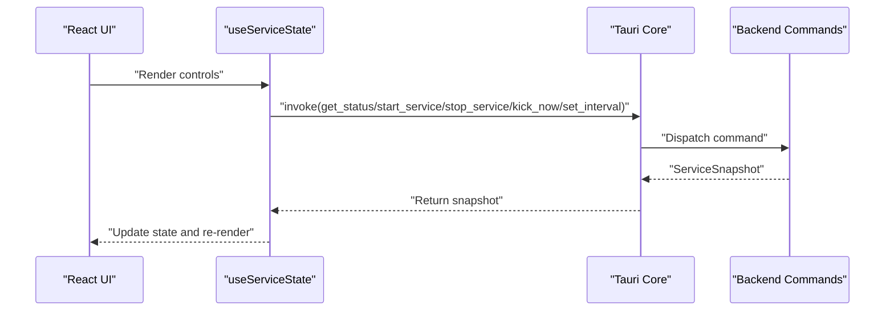

**Diagram sources**
- [useServiceState.ts](file://src/hooks/useServiceState.ts#L88-L152)
- [lib.rs](file://src-tauri/src/lib.rs#L599-L656)
- [Index.tsx](file://src/pages/Index.tsx#L9-L51)

**Section sources**
- [useServiceState.ts](file://src/hooks/useServiceState.ts#L67-L162)
- [lib.rs](file://src-tauri/src/lib.rs#L599-L656)
- [Index.tsx](file://src/pages/Index.tsx#L9-L51)

### Extending Tray Functionality and Adding New Features
- Add new tray menu items by creating additional menu items and attaching them to the menu builder.
- Bind new event handlers to the on_menu_event callback to implement additional actions.
- Introduce new Tauri commands in the backend and expose them via the invoke handler to enable frontend control.
- Extend the frontend hook to invoke new commands and update UI accordingly.

Examples of extension points:
- New tray item: Create a new menu item and attach it to the existing menu.
- New command: Define a new command in the backend and add it to the invoke handler.
- New UI control: Add a new component that invokes the new command via the hook.

**Section sources**
- [lib.rs](file://src-tauri/src/lib.rs#L259-L306)
- [lib.rs](file://src-tauri/src/lib.rs#L675-L682)
- [useServiceState.ts](file://src/hooks/useServiceState.ts#L127-L144)

## Dependency Analysis
The desktop integration relies on several key dependencies and their interactions:
- Tauri core for window management, tray, menu, and command invocation.
- Tauri plugins for opener and notifications.
- Platform-specific APIs for network checks on Windows.
- Frontend hook for invoking commands and polling status.

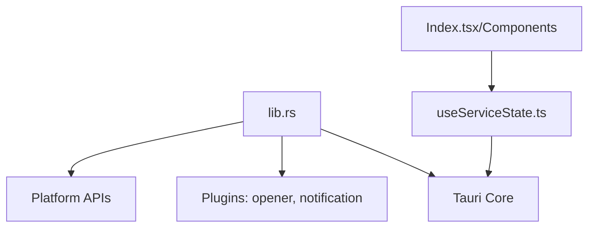

**Diagram sources**
- [lib.rs](file://src-tauri/src/lib.rs#L659-L685)
- [useServiceState.ts](file://src/hooks/useServiceState.ts#L88-L152)
- [Index.tsx](file://src/pages/Index.tsx#L9-L51)

**Section sources**
- [lib.rs](file://src-tauri/src/lib.rs#L659-L685)
- [useServiceState.ts](file://src/hooks/useServiceState.ts#L67-L162)

## Performance Considerations
- Polling interval: The frontend polls the backend at a fixed interval; adjust the polling interval to balance responsiveness and resource usage.
- Worker loop: The service worker sleeps for the configured interval between kicks; ensure intervals are reasonable to avoid excessive network activity.
- Window operations: Positioning and focus operations occur on visibility changes; minimize unnecessary recalculations by checking current state before applying changes.

[No sources needed since this section provides general guidance]

## Troubleshooting Guide
- Tray icon not responding:
  - Verify tray setup runs during app initialization.
  - Check menu and tray icon event handlers for errors.
- Window not showing or not focusing:
  - Confirm the window is positioned and focused when shown.
  - Ensure the window is not being hidden by focus loss events.
- Notifications not appearing:
  - Confirm the notification plugin is initialized and the app has permission to send notifications.
- Network checks failing on non-Windows platforms:
  - Expect an error indicating unsupported checks; implement platform-specific logic elsewhere if needed.
- Commands not working:
  - Ensure commands are registered in the invoke handler and the frontend is invoking them correctly.

**Section sources**
- [lib.rs](file://src-tauri/src/lib.rs#L669-L670)
- [lib.rs](file://src-tauri/src/lib.rs#L207-L218)
- [lib.rs](file://src-tauri/src/lib.rs#L238-L257)
- [lib.rs](file://src-tauri/src/lib.rs#L308-L349)
- [useServiceState.ts](file://src/hooks/useServiceState.ts#L88-L152)

## Conclusion
The desktop integration combines a robust Tauri backend with a responsive React frontend to deliver a tray-based utility with a floating control panel. The system tray supports quick show/hide and context menu actions, the main window is always-on-top and positioned for convenience, and notifications keep users informed. Platform-specific checks and Tauri commands enable reliable operation, and the architecture supports straightforward extensions for new features.

[No sources needed since this section summarizes without analyzing specific files]

## Appendices

### Keyboard Shortcuts Reference
- Left-click tray icon: Show/hide control panel
- Right-click tray icon: Open context menu (Show/Hide, Start/Stop, Quit)

**Section sources**
- [README.md](file://README.md#L112-L114)