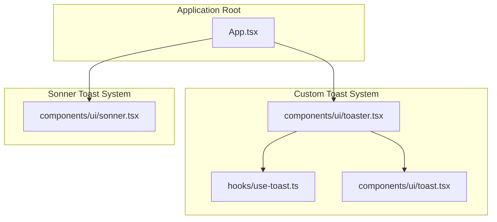
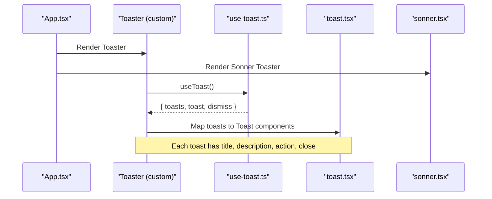
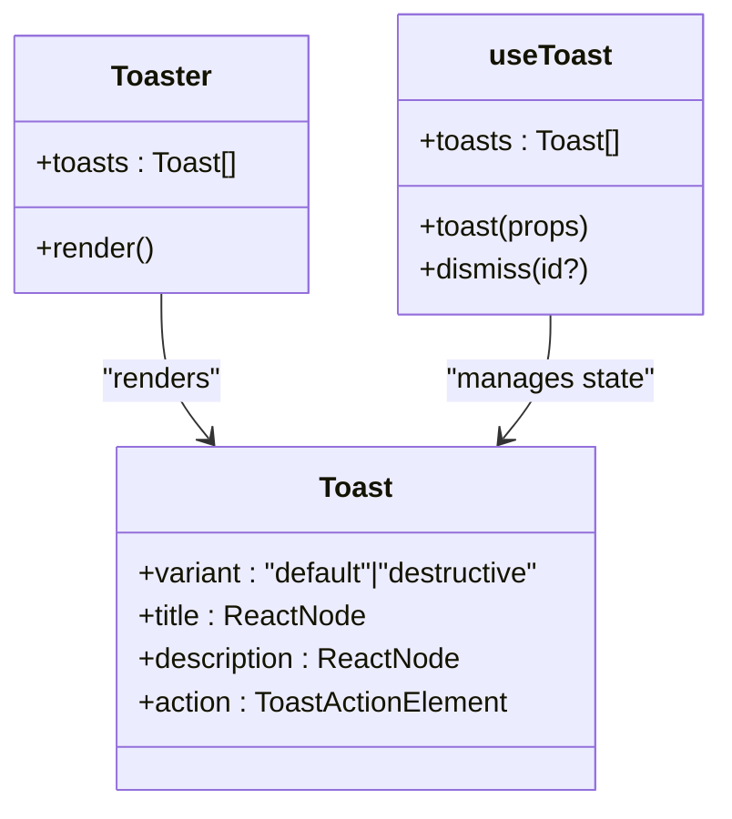
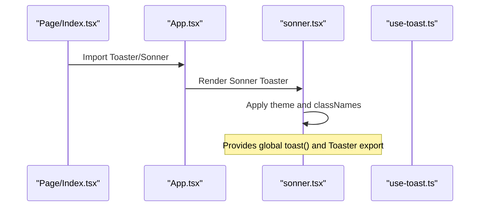
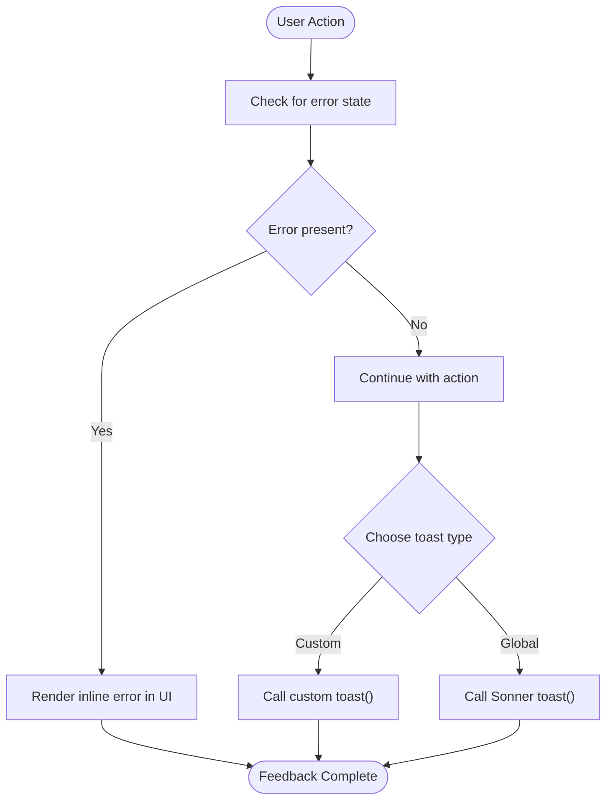
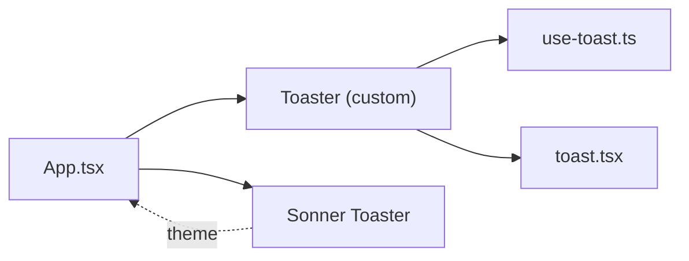

# Notification System

<cite>
**Referenced Files in This Document**
- [App.tsx](file://src/App.tsx)
- [use-toast.ts](file://src/hooks/use-toast.ts)
- [toast.tsx](file://src/components/ui/toast.tsx)
- [toaster.tsx](file://src/components/ui/toaster.tsx)
- [sonner.tsx](file://src/components/ui/sonner.tsx)
- [use-toast.ts (UI export)](file://src/components/ui/use-toast.ts)
- [Index.tsx](file://src/pages/Index.tsx)
- [PrimaryControls.tsx](file://src/components/PrimaryControls.tsx)
- [StatusCard.tsx](file://src/components/StatusCard.tsx)
</cite>

## Table of Contents
1. [Introduction](#introduction)
2. [Project Structure](#project-structure)
3. [Core Components](#core-components)
4. [Architecture Overview](#architecture-overview)
5. [Detailed Component Analysis](#detailed-component-analysis)
6. [Dependency Analysis](#dependency-analysis)
7. [Performance Considerations](#performance-considerations)
8. [Troubleshooting Guide](#troubleshooting-guide)
9. [Conclusion](#conclusion)

## Introduction
This document explains the notification and user feedback system used by the application. It covers the toast notification implementation, status indicators, and user feedback mechanisms. It also documents how notifications are triggered for service status changes, errors, and user actions, along with integration with the frontend toast systems, notification timing, and user interaction patterns. Guidance is included for adding new notification types, customizing appearance, implementing persistence, and ensuring accessibility and platform-specific behaviors.

## Project Structure
The notification system is composed of:
- A custom toast implementation built on Radix UI primitives
- A lightweight hook-based state manager for toast lifecycle
- A Sonner-based toast provider for global notifications
- A Toaster component that renders the toast queue
- Application integration in the root App component

**Diagram sources**
- [App.tsx](file://src/App.tsx#L1-L28)
- [use-toast.ts](file://src/hooks/use-toast.ts#L1-L187)
- [toast.tsx](file://src/components/ui/toast.tsx#L1-L112)
- [toaster.tsx](file://src/components/ui/toaster.tsx#L1-L25)
- [sonner.tsx](file://src/components/ui/sonner.tsx#L1-L28)

**Section sources**
- [App.tsx](file://src/App.tsx#L1-L28)
- [use-toast.ts](file://src/hooks/use-toast.ts#L1-L187)
- [toast.tsx](file://src/components/ui/toast.tsx#L1-L112)
- [toaster.tsx](file://src/components/ui/toaster.tsx#L1-L25)
- [sonner.tsx](file://src/components/ui/sonner.tsx#L1-L28)

## Core Components
- Custom toast provider and renderer
  - Provider and viewport: [toast.tsx](file://src/components/ui/toast.tsx#L8-L23)
  - Toast container: [toaster.tsx](file://src/components/ui/toaster.tsx#L4-L24)
  - Toast primitives and variants: [toast.tsx](file://src/components/ui/toast.tsx#L25-L46)
  - Close and action controls: [toast.tsx](file://src/components/ui/toast.tsx#L48-L79)
- Hook-based state manager
  - Toast state machine and dispatcher: [use-toast.ts](file://src/hooks/use-toast.ts#L71-L133)
  - Public API (toast, dismiss, useToast): [use-toast.ts](file://src/hooks/use-toast.ts#L137-L184)
- Sonner integration
  - Theme-aware Sonner provider: [sonner.tsx](file://src/components/ui/sonner.tsx#L6-L25)
  - Export re-exports: [use-toast.ts (UI export)](file://src/components/ui/use-toast.ts#L1-L4)

Key behaviors:
- Single-toast limit enforced via reducer slice operation
- Automatic dismissal after a long timeout with per-toast removal queue
- Dismiss-on-open-change pattern to align with Radix UI lifecycle
- Dual providers: custom Radix-based toasts and Sonner for global notifications

**Section sources**
- [toast.tsx](file://src/components/ui/toast.tsx#L1-L112)
- [toaster.tsx](file://src/components/ui/toaster.tsx#L1-L25)
- [use-toast.ts](file://src/hooks/use-toast.ts#L1-L187)
- [sonner.tsx](file://src/components/ui/sonner.tsx#L1-L28)
- [use-toast.ts (UI export)](file://src/components/ui/use-toast.ts#L1-L4)

## Architecture Overview
The system integrates two complementary toast providers:
- Custom Radix-based toasts rendered by the Toaster component
- Sonner-based toasts for global, app-wide notifications

**Diagram sources**
- [App.tsx](file://src/App.tsx#L11-L25)
- [toaster.tsx](file://src/components/ui/toaster.tsx#L4-L24)
- [use-toast.ts](file://src/hooks/use-toast.ts#L166-L184)
- [toast.tsx](file://src/components/ui/toast.tsx#L10-L46)
- [sonner.tsx](file://src/components/ui/sonner.tsx#L6-L25)

## Detailed Component Analysis

### Custom Toast Implementation
The custom toast system is built around:
- A stateful reducer managing a capped queue of toasts
- A per-toast timeout mechanism to remove toasts after a delay
- Radix UI primitives for rendering and animations

**Diagram sources**
- [toaster.tsx](file://src/components/ui/toaster.tsx#L4-L24)
- [toast.tsx](file://src/components/ui/toast.tsx#L40-L46)
- [use-toast.ts](file://src/hooks/use-toast.ts#L166-L184)

Key implementation patterns:
- Single-toast limit enforced by slicing the queue to one item
- Per-toast timers stored in a Map keyed by toast ID
- Dismiss-on-open-change to align with Radix UI lifecycle
- Variant classes for default and destructive styles

**Section sources**
- [use-toast.ts](file://src/hooks/use-toast.ts#L5-L133)
- [toast.tsx](file://src/components/ui/toast.tsx#L25-L46)
- [toaster.tsx](file://src/components/ui/toaster.tsx#L9-L21)

### Sonner Toast Integration
Sonner provides a modern, theme-aware toast experience with:
- Automatic theme detection and consistent styling
- Global toast registry and imperative API
- Tailored class names for toast, description, and action buttons

**Diagram sources**
- [Index.tsx](file://src/pages/Index.tsx#L1-L55)
- [App.tsx](file://src/App.tsx#L1-L28)
- [sonner.tsx](file://src/components/ui/sonner.tsx#L6-L25)
- [use-toast.ts (UI export)](file://src/components/ui/use-toast.ts#L1-L4)

**Section sources**
- [sonner.tsx](file://src/components/ui/sonner.tsx#L1-L28)
- [use-toast.ts (UI export)](file://src/components/ui/use-toast.ts#L1-L4)
- [App.tsx](file://src/App.tsx#L1-L28)

### Notification Triggering and User Feedback
Current usage patterns:
- Error display in the UI: The PrimaryControls component conditionally renders an error message block when an error exists. While this is not a toast, it provides immediate inline feedback.
- Service status and timing: The StatusCard component displays network, internet, and last-kick status, complementing the toast system with persistent status indicators.
- Application integration: Both custom and Sonner toasts are mounted at the root level in App.tsx, enabling any part of the application to trigger notifications.

**Diagram sources**
- [PrimaryControls.tsx](file://src/components/PrimaryControls.tsx#L25-L29)
- [StatusCard.tsx](file://src/components/StatusCard.tsx#L19-L42)
- [App.tsx](file://src/App.tsx#L11-L25)

**Section sources**
- [PrimaryControls.tsx](file://src/components/PrimaryControls.tsx#L1-L73)
- [StatusCard.tsx](file://src/components/StatusCard.tsx#L1-L63)
- [App.tsx](file://src/App.tsx#L1-L28)

### Adding New Notification Types
To add new notification types:
- Extend the toast props interface to include optional fields (e.g., severity, category)
- Add new variants in the toast component’s variant system
- Introduce new imperative calls or wrappers around the existing toast() function
- Update the Toaster component to handle new fields and render accordingly

Implementation references:
- Toast props and variants: [toast.tsx](file://src/components/ui/toast.tsx#L97-L111)
- Toast variants definition: [toast.tsx](file://src/components/ui/toast.tsx#L25-L38)
- Toast creation and update API: [use-toast.ts](file://src/hooks/use-toast.ts#L137-L164)

**Section sources**
- [toast.tsx](file://src/components/ui/toast.tsx#L25-L38)
- [toast.tsx](file://src/components/ui/toast.tsx#L97-L111)
- [use-toast.ts](file://src/hooks/use-toast.ts#L137-L164)

### Customizing Notification Appearance
To customize appearance:
- Modify the toast variants and class names in the toast component
- Adjust the Sonner toastOptions classNames for global styling
- Use the theme-aware provider to align with dark/light modes

References:
- Toast variants and classes: [toast.tsx](file://src/components/ui/toast.tsx#L25-L38)
- Sonner classNames customization: [sonner.tsx](file://src/components/ui/sonner.tsx#L13-L21)

**Section sources**
- [toast.tsx](file://src/components/ui/toast.tsx#L25-L38)
- [sonner.tsx](file://src/components/ui/sonner.tsx#L13-L21)

### Implementing Notification Persistence
To persist notifications across sessions:
- Store toast metadata in local storage or a persistent store
- Rehydrate the toast queue on application startup
- Ensure IDs remain stable and avoid duplicates

Implementation references:
- Toast ID generation and state updates: [use-toast.ts](file://src/hooks/use-toast.ts#L24-L27), [use-toast.ts](file://src/hooks/use-toast.ts#L137-L164)
- Toast removal queue and timeouts: [use-toast.ts](file://src/hooks/use-toast.ts#L53-L69)

**Section sources**
- [use-toast.ts](file://src/hooks/use-toast.ts#L24-L27)
- [use-toast.ts](file://src/hooks/use-toast.ts#L53-L69)
- [use-toast.ts](file://src/hooks/use-toast.ts#L137-L164)

### Accessibility and Platform-Specific Behaviors
Accessibility considerations:
- Ensure sufficient color contrast for default and destructive variants
- Provide keyboard-accessible close buttons and actions
- Announce important notifications to assistive technologies using ARIA attributes if needed

Platform-specific behaviors:
- The current Sonner integration respects the system theme setting
- Consider platform-specific notification permissions and delivery for desktop environments

References:
- Theme-aware provider: [sonner.tsx](file://src/components/ui/sonner.tsx#L7-L7)
- Toast close button accessibility: [toast.tsx](file://src/components/ui/toast.tsx#L63-L79)

**Section sources**
- [sonner.tsx](file://src/components/ui/sonner.tsx#L7-L7)
- [toast.tsx](file://src/components/ui/toast.tsx#L63-L79)

## Dependency Analysis
The notification system has minimal coupling and clear separation of concerns:
- App.tsx depends on both custom and Sonner providers
- Toaster depends on the hook state manager
- Sonner is independent and self-contained

**Diagram sources**
- [App.tsx](file://src/App.tsx#L1-L28)
- [toaster.tsx](file://src/components/ui/toaster.tsx#L1-L25)
- [use-toast.ts](file://src/hooks/use-toast.ts#L1-L187)
- [toast.tsx](file://src/components/ui/toast.tsx#L1-L112)
- [sonner.tsx](file://src/components/ui/sonner.tsx#L1-L28)

**Section sources**
- [App.tsx](file://src/App.tsx#L1-L28)
- [toaster.tsx](file://src/components/ui/toaster.tsx#L1-L25)
- [use-toast.ts](file://src/hooks/use-toast.ts#L1-L187)
- [toast.tsx](file://src/components/ui/toast.tsx#L1-L112)
- [sonner.tsx](file://src/components/ui/sonner.tsx#L1-L28)

## Performance Considerations
- Single-toast limit reduces DOM overhead and prevents toast pile-ups
- Per-toast timers are cleaned up to prevent memory leaks
- Sonner’s global registry minimizes re-renders by batching updates

Recommendations:
- Avoid flooding the toast queue with rapid successive notifications
- Use the dismiss API to programmatically clear stale toasts
- Prefer Sonner for global, infrequent notifications and custom toasts for contextual feedback

**Section sources**
- [use-toast.ts](file://src/hooks/use-toast.ts#L5-L133)
- [use-toast.ts](file://src/hooks/use-toast.ts#L53-L69)

## Troubleshooting Guide
Common issues and resolutions:
- Toasts not appearing
  - Verify both Toaster providers are rendered in the root App component
  - Ensure the hook is imported and used correctly in components
- Toasts not dismissing
  - Confirm the open change handler triggers dismiss
  - Check that per-toast timers are registered and not prematurely cleared
- Duplicate or stale toasts
  - Use the dismiss API to clear specific toasts
  - Limit concurrent toast creation to avoid overwhelming the queue

References:
- Root integration: [App.tsx](file://src/App.tsx#L11-L25)
- Toast lifecycle: [use-toast.ts](file://src/hooks/use-toast.ts#L71-L133), [use-toast.ts](file://src/hooks/use-toast.ts#L137-L164)

**Section sources**
- [App.tsx](file://src/App.tsx#L11-L25)
- [use-toast.ts](file://src/hooks/use-toast.ts#L71-L133)
- [use-toast.ts](file://src/hooks/use-toast.ts#L137-L164)

## Conclusion
The notification system combines a custom Radix-based toast provider with a Sonner-based global toast solution. It offers a concise API, predictable lifecycle management, and flexible customization. By following the patterns documented here, developers can extend the system with new notification types, tailor appearance, implement persistence, and maintain accessibility and platform compatibility.