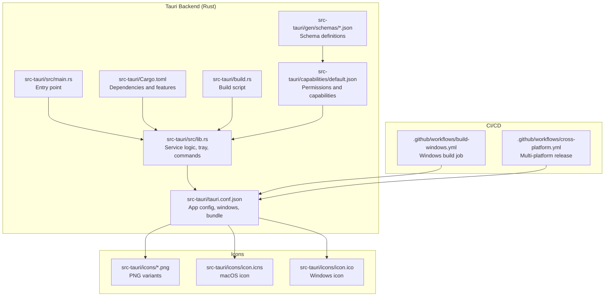
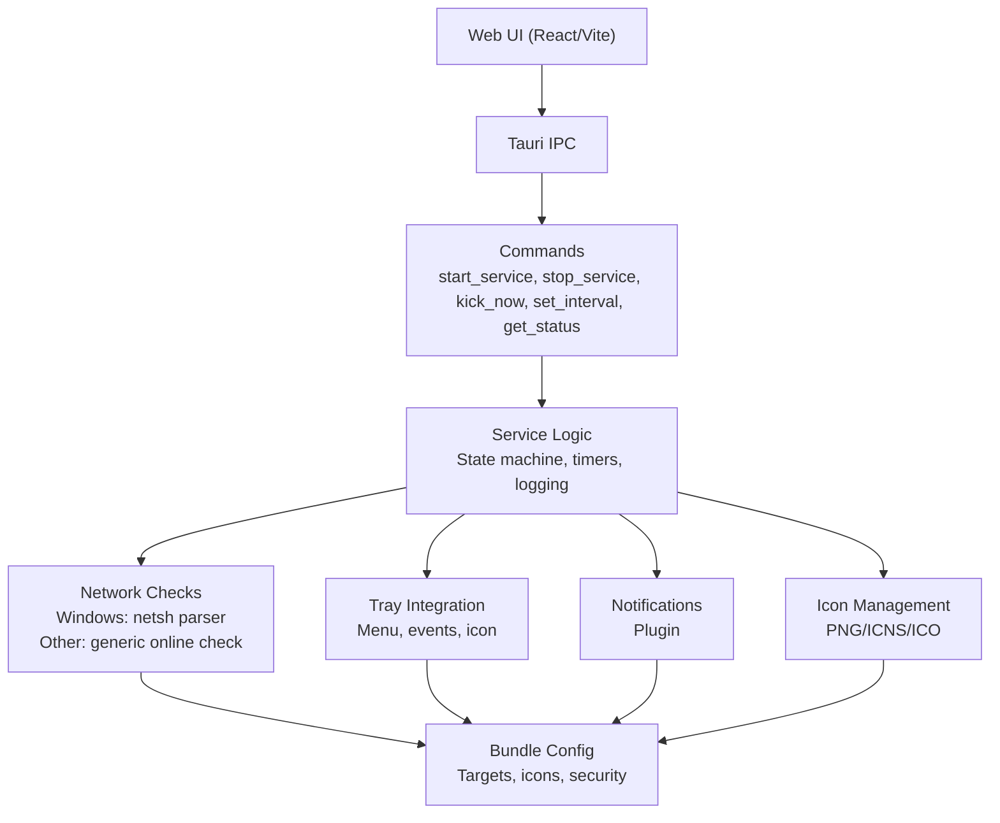
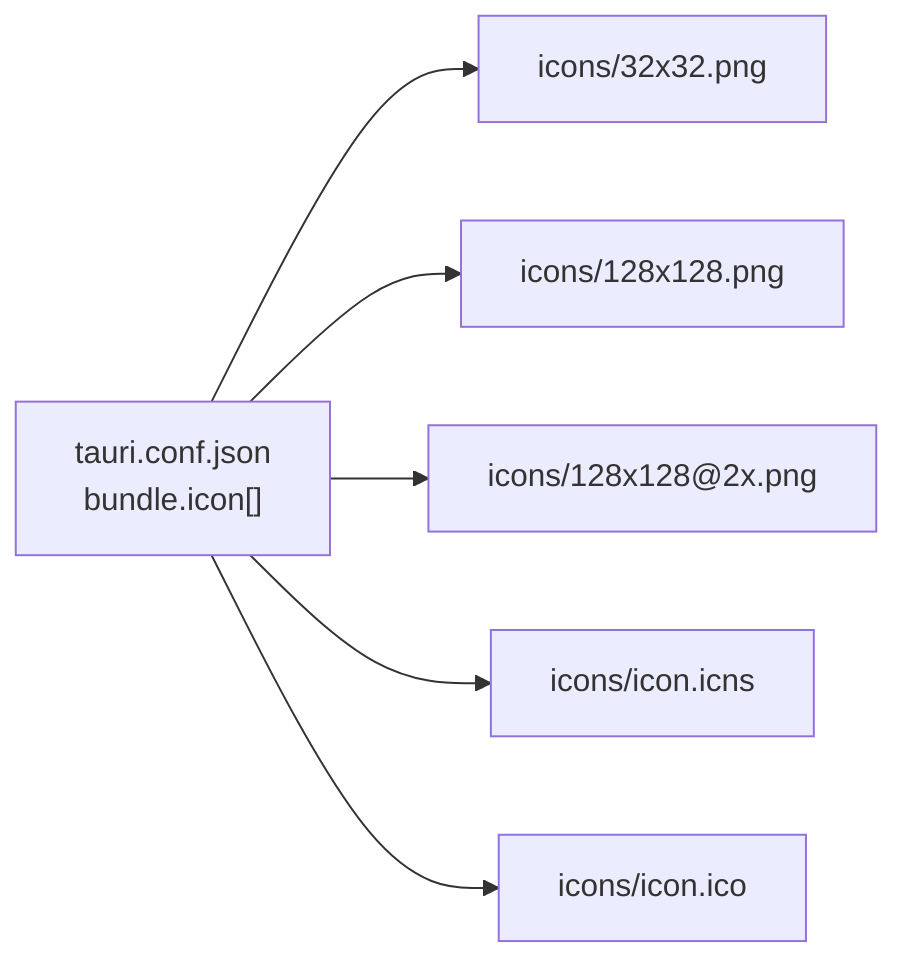
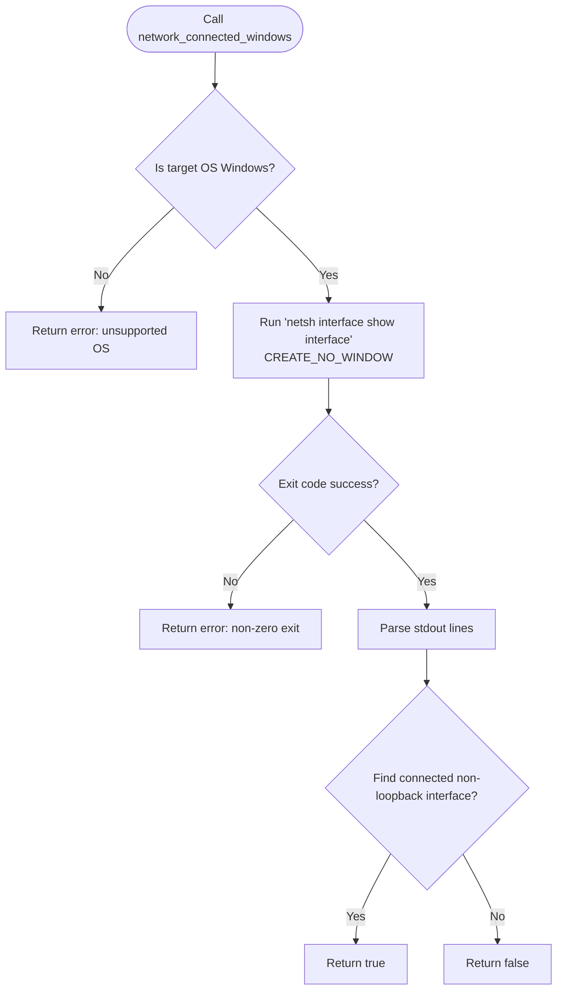
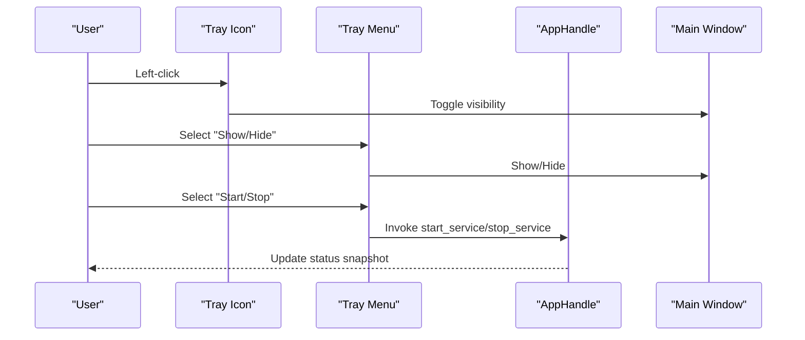
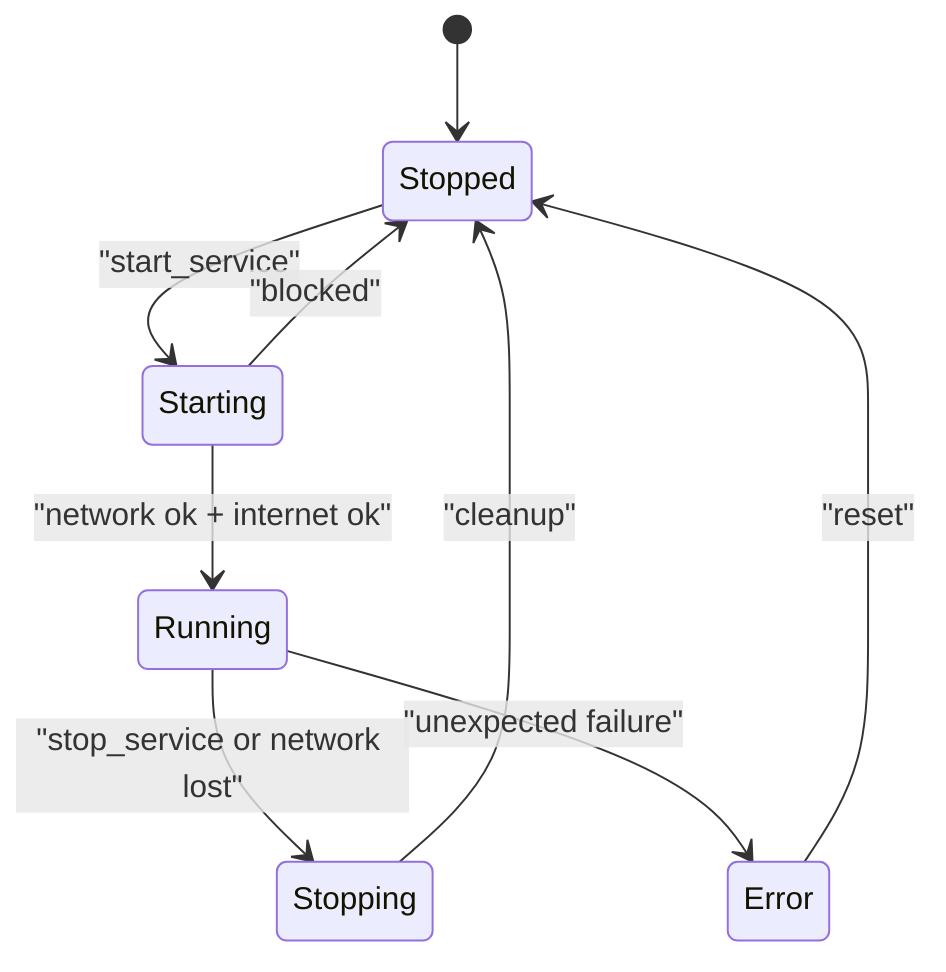
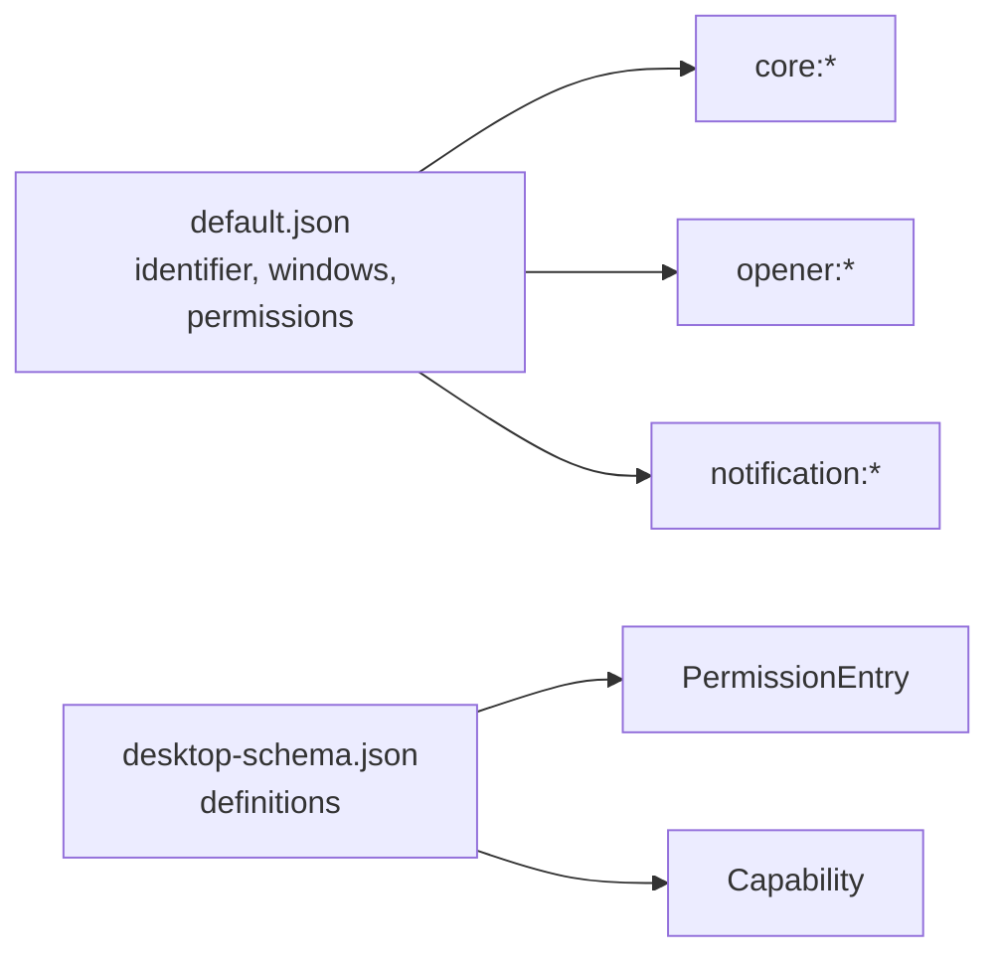
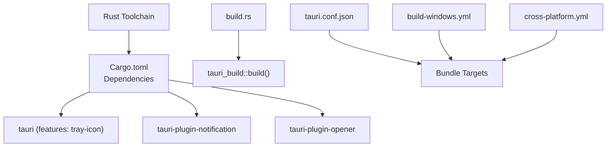

# Platform-Specific Features

<cite>
**Referenced Files in This Document**
- [tauri.conf.json](file://src-tauri/tauri.conf.json)
- [Cargo.toml](file://src-tauri/Cargo.toml)
- [lib.rs](file://src-tauri/src/lib.rs)
- [main.rs](file://src-tauri/src/main.rs)
- [build.rs](file://src-tauri/build.rs)
- [default.json](file://src-tauri/capabilities/default.json)
- [desktop-schema.json](file://src-tauri/gen/schemas/desktop-schema.json)
- [windows-schema.json](file://src-tauri/gen/schemas/windows-schema.json)
- [build-windows.yml](file://.github/workflows/build-windows.yml)
- [cross-platform.yml](file://.github/workflows/cross-platform.yml)
</cite>

## Table of Contents
1. [Introduction](#introduction)
2. [Project Structure](#project-structure)
3. [Core Components](#core-components)
4. [Architecture Overview](#architecture-overview)
5. [Detailed Component Analysis](#detailed-component-analysis)
6. [Dependency Analysis](#dependency-analysis)
7. [Performance Considerations](#performance-considerations)
8. [Troubleshooting Guide](#troubleshooting-guide)
9. [Conclusion](#conclusion)
10. [Appendices](#appendices)

## Introduction
This document explains the platform-specific desktop integration features and configurations implemented in the project. It focuses on:
- Icon management across platforms (PNG, ICNS, ICO)
- Bundle configuration for Windows, macOS, and Linux
- Platform-specific behavior differences (e.g., Windows network detection)
- Auto-start configuration possibilities
- Platform API integrations via Tauri plugins
- Extending platform support and handling differences
- Compatibility and deployment implications

## Project Structure
The desktop integration is primarily implemented in the Tauri backend under src-tauri, with configuration files controlling bundling, icons, and capabilities. The frontend is a web-based UI built with Vite and React, embedded inside the Tauri app.

**Diagram sources**
- [lib.rs](file://src-tauri/src/lib.rs#L1-L686)
- [main.rs](file://src-tauri/src/main.rs#L1-L7)
- [Cargo.toml](file://src-tauri/Cargo.toml#L1-L29)
- [build.rs](file://src-tauri/build.rs#L1-L4)
- [tauri.conf.json](file://src-tauri/tauri.conf.json#L1-L42)
- [default.json](file://src-tauri/capabilities/default.json#L1-L12)
- [desktop-schema.json](file://src-tauri/gen/schemas/desktop-schema.json#L1-L800)
- [windows-schema.json](file://src-tauri/gen/schemas/windows-schema.json#L1-L800)
- [build-windows.yml](file://.github/workflows/build-windows.yml#L1-L49)
- [cross-platform.yml](file://.github/workflows/cross-platform.yml#L1-L194)

**Section sources**
- [tauri.conf.json](file://src-tauri/tauri.conf.json#L1-L42)
- [Cargo.toml](file://src-tauri/Cargo.toml#L1-L29)
- [lib.rs](file://src-tauri/src/lib.rs#L1-L686)
- [main.rs](file://src-tauri/src/main.rs#L1-L7)
- [build.rs](file://src-tauri/build.rs#L1-L4)
- [default.json](file://src-tauri/capabilities/default.json#L1-L12)
- [desktop-schema.json](file://src-tauri/gen/schemas/desktop-schema.json#L1-L800)
- [windows-schema.json](file://src-tauri/gen/schemas/windows-schema.json#L1-L800)
- [build-windows.yml](file://.github/workflows/build-windows.yml#L1-L49)
- [cross-platform.yml](file://.github/workflows/cross-platform.yml#L1-L194)

## Core Components
- Application configuration and bundling: tauri.conf.json defines product metadata, window behavior, security, and bundle targets with platform-specific icons.
- Service logic and platform checks: lib.rs implements a service state machine, tray integration, notifications, and a Windows-specific network detection routine.
- Plugin integrations: Cargo.toml lists tauri-plugin-opener and tauri-plugin-notification, enabling external URL opening and native notifications.
- Entry point and subsystem: main.rs sets the Windows subsystem to hide the console in release mode.
- Capabilities and permissions: default.json and schema files define IPC permissions and platform scoping.

Key platform-specific elements:
- Windows-only network detection via netsh parsing
- Tray icon and menu integration
- Notification plugin usage
- Bundling with PNG, ICNS, and ICO icons

**Section sources**
- [tauri.conf.json](file://src-tauri/tauri.conf.json#L1-L42)
- [lib.rs](file://src-tauri/src/lib.rs#L308-L349)
- [lib.rs](file://src-tauri/src/lib.rs#L184-L205)
- [Cargo.toml](file://src-tauri/Cargo.toml#L20-L29)
- [main.rs](file://src-tauri/src/main.rs#L1-L7)
- [default.json](file://src-tauri/capabilities/default.json#L1-L12)

## Architecture Overview
The desktop app architecture integrates a Rust backend (service logic, tray, commands) with a web-based UI. Platform-specific behavior is encapsulated in conditional compilation and plugin usage.

**Diagram sources**
- [lib.rs](file://src-tauri/src/lib.rs#L415-L473)
- [lib.rs](file://src-tauri/src/lib.rs#L308-L349)
- [lib.rs](file://src-tauri/src/lib.rs#L184-L205)
- [tauri.conf.json](file://src-tauri/tauri.conf.json#L1-L42)

**Section sources**
- [lib.rs](file://src-tauri/src/lib.rs#L415-L473)
- [lib.rs](file://src-tauri/src/lib.rs#L308-L349)
- [lib.rs](file://src-tauri/src/lib.rs#L184-L205)
- [tauri.conf.json](file://src-tauri/tauri.conf.json#L1-L42)

## Detailed Component Analysis

### Icon Management System
The project supports platform-specific icon formats:
- PNG variants for general use
- ICNS for macOS
- ICO for Windows

These are configured in the bundle section of the Tauri configuration and placed under src-tauri/icons.

**Diagram sources**
- [tauri.conf.json](file://src-tauri/tauri.conf.json#L30-L40)

**Section sources**
- [tauri.conf.json](file://src-tauri/tauri.conf.json#L30-L40)

### Windows Network Detection Implementation
A Windows-only function parses the output of netsh to detect if any non-loopback interface is connected. On success, it returns true; otherwise, it returns false or an error. This is used to gate service startup and runtime behavior.

**Diagram sources**
- [lib.rs](file://src-tauri/src/lib.rs#L308-L349)

**Section sources**
- [lib.rs](file://src-tauri/src/lib.rs#L308-L349)

### Tray Integration and Notifications
The application creates a tray icon with a menu containing Show/Hide, Start/Stop, and Quit actions. Clicking the tray icon toggles the main window visibility. Notifications are issued via the notification plugin.

**Diagram sources**
- [lib.rs](file://src-tauri/src/lib.rs#L259-L306)
- [lib.rs](file://src-tauri/src/lib.rs#L604-L618)

**Section sources**
- [lib.rs](file://src-tauri/src/lib.rs#L259-L306)
- [lib.rs](file://src-tauri/src/lib.rs#L604-L618)

### Service State Machine and Worker Loop
The service transitions through states (Stopped, Starting, Running, Stopping, Error) and runs a worker loop that periodically checks network connectivity, internet availability, and performs kick requests.

**Diagram sources**
- [lib.rs](file://src-tauri/src/lib.rs#L27-L51)
- [lib.rs](file://src-tauri/src/lib.rs#L160-L171)
- [lib.rs](file://src-tauri/src/lib.rs#L415-L473)

**Section sources**
- [lib.rs](file://src-tauri/src/lib.rs#L27-L51)
- [lib.rs](file://src-tauri/src/lib.rs#L160-L171)
- [lib.rs](file://src-tauri/src/lib.rs#L415-L473)

### Capability and Permission Model
Capabilities define which commands and permissions are available to windows and webviews. The default capability grants core, opener, and notification permissions to the main window.

**Diagram sources**
- [default.json](file://src-tauri/capabilities/default.json#L1-L12)
- [desktop-schema.json](file://src-tauri/gen/schemas/desktop-schema.json#L39-L104)

**Section sources**
- [default.json](file://src-tauri/capabilities/default.json#L1-L12)
- [desktop-schema.json](file://src-tauri/gen/schemas/desktop-schema.json#L39-L104)

### Auto-Start Configuration Possibilities
Auto-start is not explicitly configured in the repository. To add auto-start:
- Windows: Use a launcher or registry entry during installation (outside Tauri’s scope)
- macOS: Configure login item via entitlements or installer scripts
- Linux: Use desktop entries or system services

Recommendation:
- Add a dedicated installer or post-install hook to register the app with the OS autostart facility
- Keep the app’s tray behavior consistent so users can disable auto-start via UI

[No sources needed since this section provides general guidance]

### Extending Platform Support
To add a new platform or platform-specific feature:
- Add platform-specific code behind cfg(target_os = "...") guards
- Extend capabilities and permissions for the new platform
- Include appropriate icon formats in the bundle configuration
- Update CI workflows to build and package for the new platform

Example extension points:
- New platform network detection function
- Platform-specific notification or tray behavior
- Additional Tauri plugins for platform APIs

[No sources needed since this section provides general guidance]

## Dependency Analysis
The backend depends on Tauri core, plugins, and standard libraries. The build pipeline uses tauri-build and GitHub Actions for multi-platform releases.

**Diagram sources**
- [Cargo.toml](file://src-tauri/Cargo.toml#L1-L29)
- [build.rs](file://src-tauri/build.rs#L1-L4)
- [tauri.conf.json](file://src-tauri/tauri.conf.json#L1-L42)
- [build-windows.yml](file://.github/workflows/build-windows.yml#L1-L49)
- [cross-platform.yml](file://.github/workflows/cross-platform.yml#L1-L194)

**Section sources**
- [Cargo.toml](file://src-tauri/Cargo.toml#L1-L29)
- [build.rs](file://src-tauri/build.rs#L1-L4)
- [tauri.conf.json](file://src-tauri/tauri.conf.json#L1-L42)
- [build-windows.yml](file://.github/workflows/build-windows.yml#L1-L49)
- [cross-platform.yml](file://.github/workflows/cross-platform.yml#L1-L194)

## Performance Considerations
- Network checks: The Windows netsh parser runs synchronously; consider moving to async or caching results to avoid blocking
- Logging: Circular buffer limits logs to a fixed size to control memory usage
- Timers: Worker loop sleeps for the configured interval; ensure minimum intervals are enforced to prevent excessive polling
- Icons: Using multiple PNG sizes and platform-specific formats increases bundle size; keep only necessary resolutions

[No sources needed since this section provides general guidance]

## Troubleshooting Guide
Common issues and remedies:
- Windows network detection fails
  - Verify netsh availability and permissions
  - Ensure the process runs without a visible console in release mode
- Tray icon missing or incorrect
  - Confirm default window icon is available and bundle includes platform-specific icons
- Notifications not showing
  - Ensure notification plugin is initialized and permissions are granted
- CI build failures
  - Check platform-specific dependencies (Linux requires webkit, appindicator, rsvg, patchelf)
  - Validate Tauri signing environment variables for macOS

**Section sources**
- [lib.rs](file://src-tauri/src/lib.rs#L308-L349)
- [lib.rs](file://src-tauri/src/lib.rs#L184-L205)
- [Cargo.toml](file://src-tauri/Cargo.toml#L20-L29)
- [cross-platform.yml](file://.github/workflows/cross-platform.yml#L25-L31)
- [cross-platform.yml](file://.github/workflows/cross-platform.yml#L94-L100)

## Conclusion
The project implements robust desktop integration with platform-specific features centered around Windows network detection, tray and notification plugins, and a flexible capability model. Icons are configured for multiple platforms, and CI pipelines support multi-platform builds. Extending support to new platforms involves adding platform-specific code, updating capabilities, and adjusting CI workflows.

[No sources needed since this section summarizes without analyzing specific files]

## Appendices

### Appendix A: Bundle Configuration Reference
- Product name, version, and identifier are defined centrally
- Windows window properties include size, visibility, and top-most behavior
- Security policy is configured per app settings
- Bundle targets are set to build for all platforms with explicit icon formats

**Section sources**
- [tauri.conf.json](file://src-tauri/tauri.conf.json#L1-L42)

### Appendix B: CI/CD Pipeline Highlights
- Windows build job installs Node, Rust, caches dependencies, and produces executables
- Cross-platform release job builds for Windows, Ubuntu, and macOS with platform-specific artifact creation and signing disabled for macOS in CI

**Section sources**
- [build-windows.yml](file://.github/workflows/build-windows.yml#L1-L49)
- [cross-platform.yml](file://.github/workflows/cross-platform.yml#L1-L194)