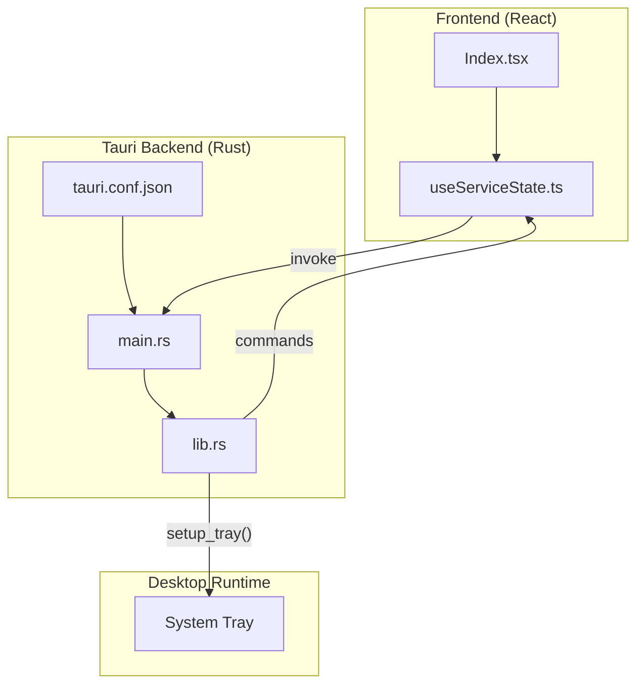
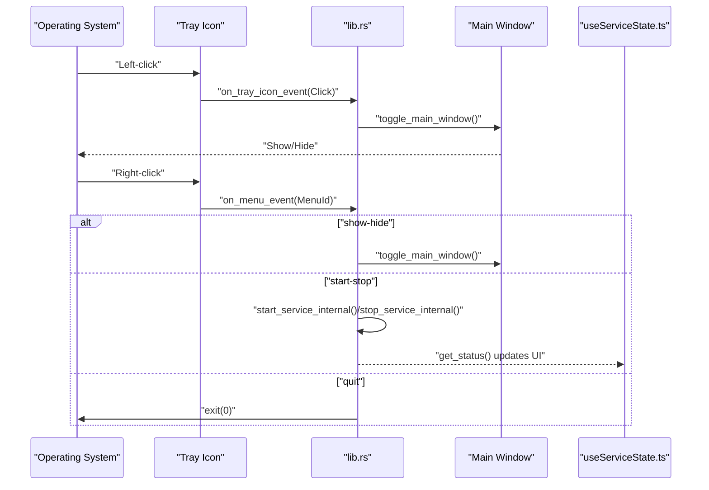
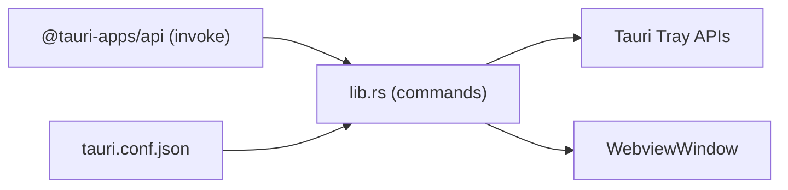

# System Tray Integration

<cite>
**Referenced Files in This Document**
- [main.rs](file://src-tauri/src/main.rs)
- [lib.rs](file://src-tauri/src/lib.rs)
- [tauri.conf.json](file://src-tauri/tauri.conf.json)
- [Index.tsx](file://src/pages/Index.tsx)
- [useServiceState.ts](file://src/hooks/useServiceState.ts)
- [package.json](file://package.json)
</cite>

## Table of Contents
1. [Introduction](#introduction)
2. [Project Structure](#project-structure)
3. [Core Components](#core-components)
4. [Architecture Overview](#architecture-overview)
5. [Detailed Component Analysis](#detailed-component-analysis)
6. [Dependency Analysis](#dependency-analysis)
7. [Performance Considerations](#performance-considerations)
8. [Troubleshooting Guide](#troubleshooting-guide)
9. [Conclusion](#conclusion)

## Introduction
This document explains the system tray integration for the desktop application. It covers tray icon configuration, click and context menu handling, application visibility management, and platform-specific behavior. It also describes how to customize tray actions, add new menu items, and manage tray icon state changes.

## Project Structure
The tray integration is implemented in the Tauri backend (Rust) and surfaced to the UI via commands. The frontend uses React and Tauri's invoke mechanism to communicate with the backend.

**Diagram sources**
- [main.rs](file://src-tauri/src/main.rs#L4-L6)
- [lib.rs](file://src-tauri/src/lib.rs#L259-L306)
- [tauri.conf.json](file://src-tauri/tauri.conf.json#L1-L42)
- [Index.tsx](file://src/pages/Index.tsx#L1-L55)
- [useServiceState.ts](file://src/hooks/useServiceState.ts#L1-L163)

**Section sources**
- [main.rs](file://src-tauri/src/main.rs#L1-L7)
- [lib.rs](file://src-tauri/src/lib.rs#L259-L306)
- [tauri.conf.json](file://src-tauri/tauri.conf.json#L1-L42)
- [Index.tsx](file://src/pages/Index.tsx#L1-L55)
- [useServiceState.ts](file://src/hooks/useServiceState.ts#L1-L163)

## Core Components
- Tray setup and event handlers are defined in the backend Rust module.
- The frontend exposes commands to control the service and application lifecycle, which the tray menu triggers.
- The main window is hidden by default and shown/hidden via tray interactions.

Key responsibilities:
- Build tray icon with menu and event callbacks.
- Toggle main window visibility on left-click.
- Handle context menu actions to show/hide window, start/stop service, and quit.
- Manage platform-specific tray behavior (left-click menu vs. show/hide).

**Section sources**
- [lib.rs](file://src-tauri/src/lib.rs#L259-L306)
- [lib.rs](file://src-tauri/src/lib.rs#L207-L218)
- [tauri.conf.json](file://src-tauri/tauri.conf.json#L13-L25)

## Architecture Overview
The tray integration follows a clear separation of concerns:
- Backend initializes the tray, registers menu items, and wires event handlers.
- Frontend invokes commands to control service state and application lifecycle.
- Window visibility is managed centrally to avoid duplication.

**Diagram sources**
- [lib.rs](file://src-tauri/src/lib.rs#L259-L306)
- [lib.rs](file://src-tauri/src/lib.rs#L207-L218)
- [useServiceState.ts](file://src/hooks/useServiceState.ts#L88-L107)

## Detailed Component Analysis

### Tray Builder and Menu Items
- Creates three menu items: Show/Hide, Start/Stop, Quit.
- Builds a Menu and attaches it to the TrayIconBuilder.
- Configures left-click behavior to show/hide the main window without opening the menu.

Implementation highlights:
- Menu items are created with unique IDs and labels.
- Menu is attached to the tray builder.
- Left-click toggles window visibility; right-click opens the context menu.

**Section sources**
- [lib.rs](file://src-tauri/src/lib.rs#L259-L306)

### Event Handlers
- on_tray_icon_event: Handles left-click to toggle window visibility.
- on_menu_event: Handles context menu selections:
  - Show/Hide: toggles window visibility.
  - Start/Stop: starts or stops the service asynchronously.
  - Quit: exits the application.

Asynchronous service control:
- Uses async runtime to start/stop service without blocking the UI thread.
- Errors are captured and converted to application state changes.

**Section sources**
- [lib.rs](file://src-tauri/src/lib.rs#L268-L288)
- [lib.rs](file://src-tauri/src/lib.rs#L289-L298)

### Application Visibility Management
- The main window is hidden by default and repositioned near the bottom-right corner when shown.
- Focus is set when the window is shown.
- Close events are intercepted to hide the window instead of closing the app.

**Section sources**
- [lib.rs](file://src-tauri/src/lib.rs#L207-L218)
- [lib.rs](file://src-tauri/src/lib.rs#L238-L257)

### Platform-Specific Behavior
- Left-click show/hide behavior is configured explicitly.
- Right-click opens the context menu.
- The tray icon uses the default window icon if available.

**Section sources**
- [lib.rs](file://src-tauri/src/lib.rs#L267-L302)

### Frontend Integration
- The frontend polls the backend for status updates.
- Commands invoked from the UI (start, stop, kick now, set interval, quit) are handled by the backend.
- The UI does not directly manipulate the tray; it relies on backend-driven state changes.

**Section sources**
- [useServiceState.ts](file://src/hooks/useServiceState.ts#L88-L107)
- [useServiceState.ts](file://src/hooks/useServiceState.ts#L109-L152)
- [Index.tsx](file://src/pages/Index.tsx#L1-L55)

## Dependency Analysis
- The backend depends on Tauri's tray and menu APIs.
- The frontend depends on @tauri-apps/api for invoking commands.
- The main window configuration is defined in tauri.conf.json.

**Diagram sources**
- [package.json](file://package.json#L48-L49)
- [lib.rs](file://src-tauri/src/lib.rs#L10-L14)
- [tauri.conf.json](file://src-tauri/tauri.conf.json#L1-L42)

**Section sources**
- [package.json](file://package.json#L48-L49)
- [lib.rs](file://src-tauri/src/lib.rs#L10-L14)
- [tauri.conf.json](file://src-tauri/tauri.conf.json#L1-L42)

## Performance Considerations
- Asynchronous service control prevents UI blocking during long-running operations.
- Frequent polling in the frontend is minimal (every ~1.2 seconds) to keep UI responsive.
- Window positioning and focus operations are lightweight and occur only on visibility changes.

## Troubleshooting Guide
Common issues and resolutions:
- Tray menu does not open on right-click:
  - Verify left-click show/hide is disabled and menu is attached to the tray builder.
- Left-click does nothing:
  - Confirm on_tray_icon_event is registered and toggles window visibility.
- Start/Stop from tray has no effect:
  - Ensure async runtime is available and commands are properly exported.
- Window does not hide on close:
  - Check window event handler prevents close and hides the window instead.

Operational checks:
- Confirm backend runs and registers tray during setup.
- Validate frontend invoke calls succeed and update state.

**Section sources**
- [lib.rs](file://src-tauri/src/lib.rs#L259-L306)
- [lib.rs](file://src-tauri/src/lib.rs#L243-L254)
- [useServiceState.ts](file://src/hooks/useServiceState.ts#L88-L107)

## Conclusion
The tray integration provides a compact, efficient way to control the application and service state. It offers predictable behavior across platforms with explicit left-click and right-click semantics, and integrates cleanly with the rest of the application through Tauri commands.