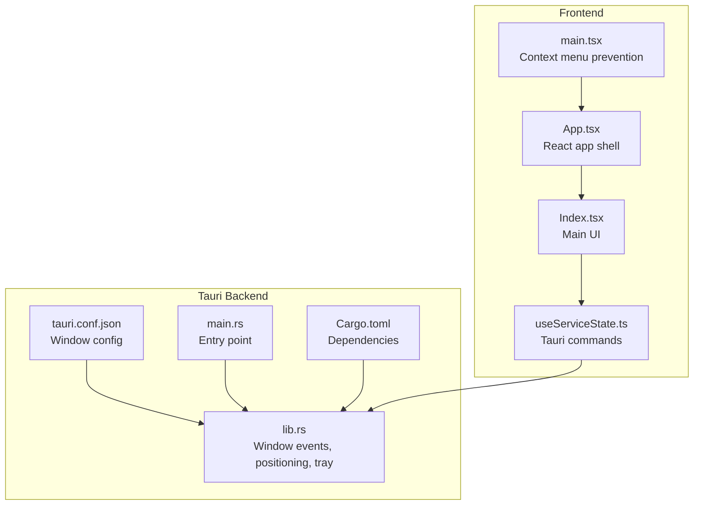
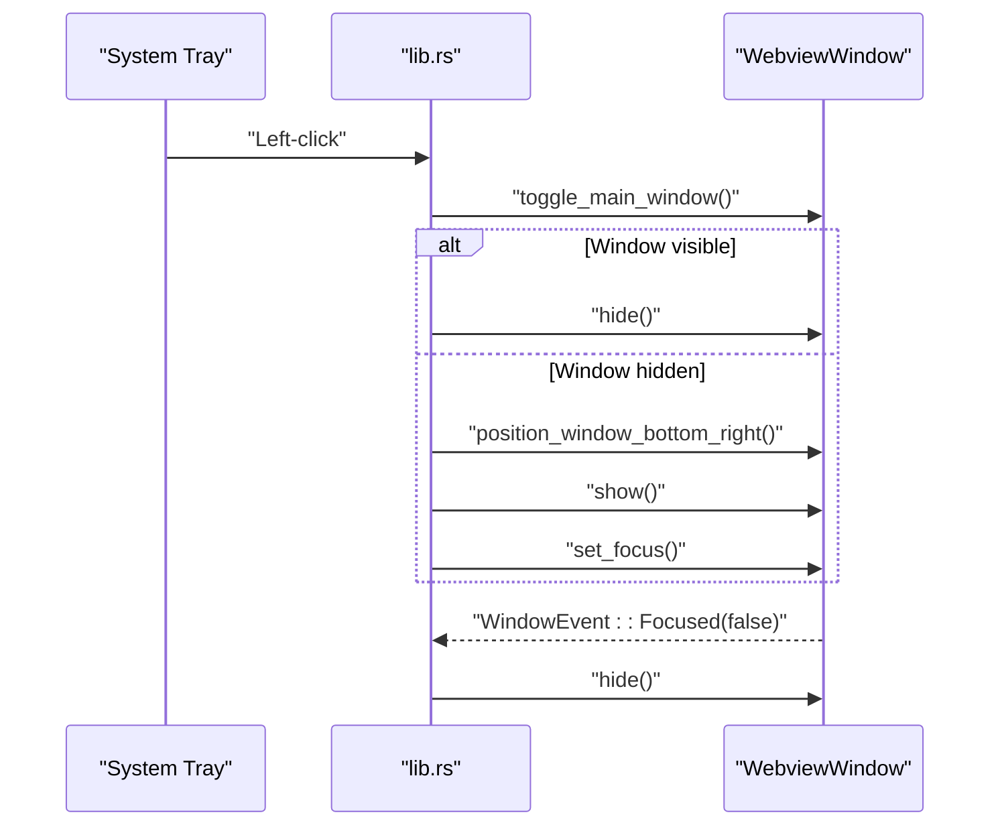
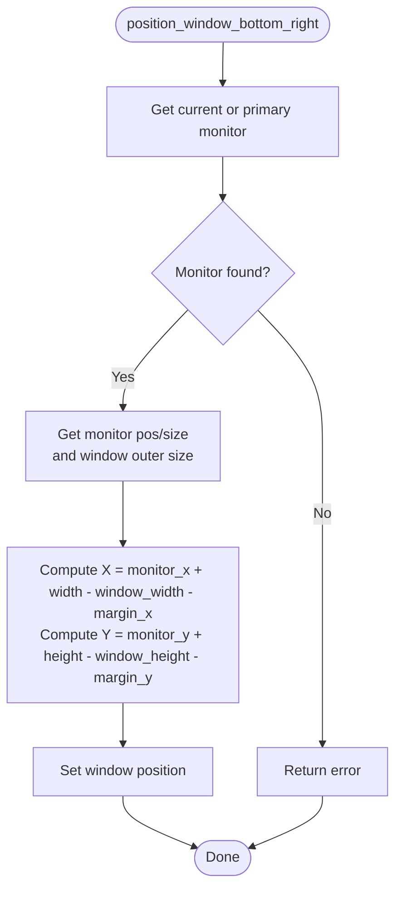
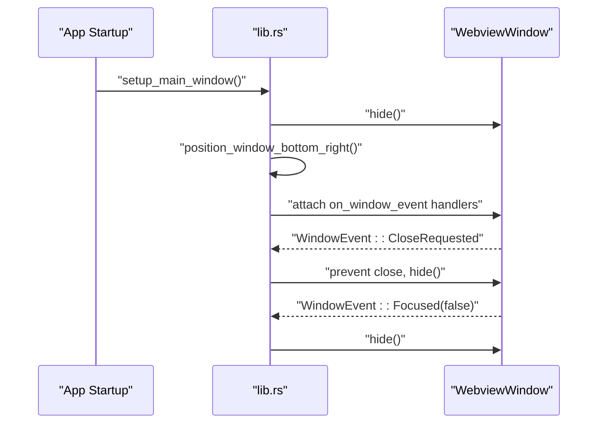
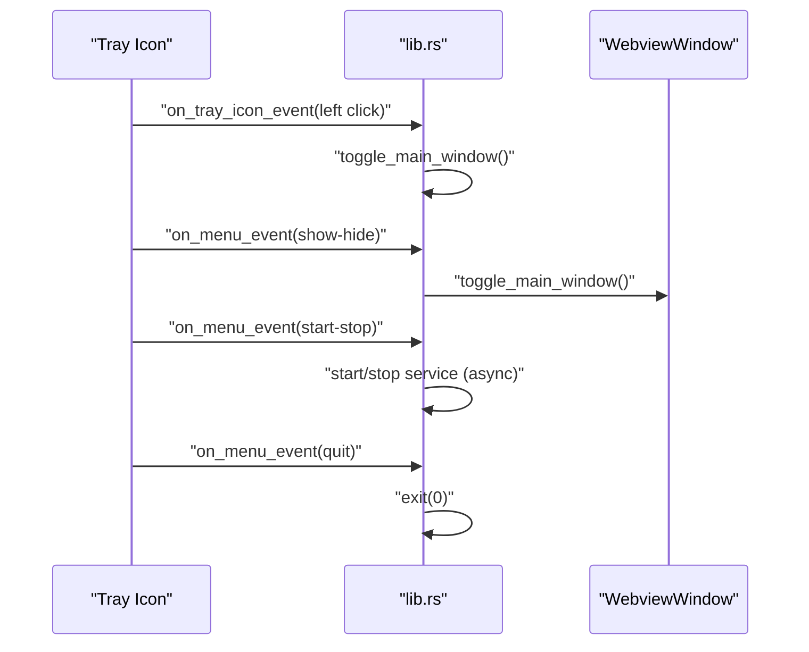
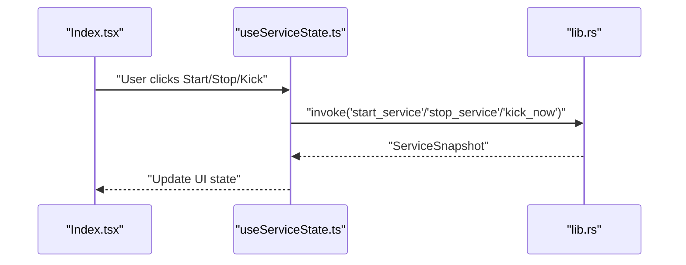
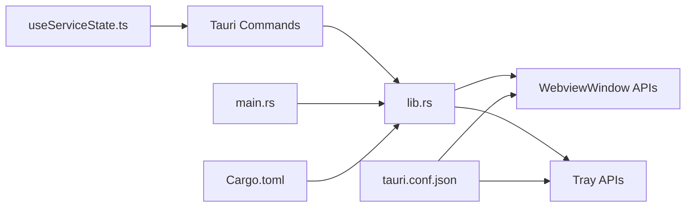

# Window Management

<cite>
**Referenced Files in This Document**
- [tauri.conf.json](file://src-tauri/tauri.conf.json)
- [lib.rs](file://src-tauri/src/lib.rs)
- [main.rs](file://src-tauri/src/main.rs)
- [Cargo.toml](file://src-tauri/Cargo.toml)
- [useServiceState.ts](file://src/hooks/useServiceState.ts)
- [Index.tsx](file://src/pages/Index.tsx)
- [main.tsx](file://src/main.tsx)
</cite>

## Table of Contents
1. [Introduction](#introduction)
2. [Project Structure](#project-structure)
3. [Core Components](#core-components)
4. [Architecture Overview](#architecture-overview)
5. [Detailed Component Analysis](#detailed-component-analysis)
6. [Dependency Analysis](#dependency-analysis)
7. [Performance Considerations](#performance-considerations)
8. [Troubleshooting Guide](#troubleshooting-guide)
9. [Conclusion](#conclusion)

## Introduction
This document explains the window management functionality of the application, focusing on the floating overlay window behavior, positioning logic, visibility controls, always-on-top enforcement, taskbar skipping, and the lifecycle interactions with the system tray. It also covers cross-platform considerations and accessibility-related behaviors observed in the codebase.

## Project Structure
The window management behavior is primarily configured in the Tauri configuration and implemented in the Rust backend. The frontend React code integrates with the backend via Tauri commands to control the window and display status.

**Diagram sources**
- [tauri.conf.json](file://src-tauri/tauri.conf.json#L12-L29)
- [lib.rs](file://src-tauri/src/lib.rs#L658-L686)
- [main.rs](file://src-tauri/src/main.rs#L1-L7)
- [Cargo.toml](file://src-tauri/Cargo.toml#L20-L29)
- [useServiceState.ts](file://src/hooks/useServiceState.ts#L1-L163)
- [Index.tsx](file://src/pages/Index.tsx#L1-L55)
- [main.tsx](file://src/main.tsx#L1-L10)

**Section sources**
- [tauri.conf.json](file://src-tauri/tauri.conf.json#L12-L29)
- [lib.rs](file://src-tauri/src/lib.rs#L658-L686)
- [main.rs](file://src-tauri/src/main.rs#L1-L7)
- [Cargo.toml](file://src-tauri/Cargo.toml#L20-L29)
- [useServiceState.ts](file://src/hooks/useServiceState.ts#L1-L163)
- [Index.tsx](file://src/pages/Index.tsx#L1-L55)
- [main.tsx](file://src/main.tsx#L1-L10)

## Core Components
- Floating overlay window configuration:
  - Size: 360x520 pixels
  - Non-resizable, non-minimizable, non-maximizable
  - Always stays on top
  - Hidden by default
  - Skips the taskbar
- Window positioning:
  - Positioned at the bottom-right corner of the current/primary monitor with margins
- Visibility and focus:
  - Toggle show/hide via tray actions
  - Focus acquisition when shown
- Lifecycle:
  - Close requests are intercepted and converted to hide
  - Auto-hide when losing focus
- Tray integration:
  - Left-click toggles the window
  - Menu items control visibility and service state
- Cross-platform:
  - Windows-specific network detection
  - Other platforms report unsupported for that check

**Section sources**
- [tauri.conf.json](file://src-tauri/tauri.conf.json#L13-L25)
- [lib.rs](file://src-tauri/src/lib.rs#L207-L218)
- [lib.rs](file://src-tauri/src/lib.rs#L220-L236)
- [lib.rs](file://src-tauri/src/lib.rs#L238-L257)
- [lib.rs](file://src-tauri/src/lib.rs#L259-L306)
- [lib.rs](file://src-tauri/src/lib.rs#L308-L349)

## Architecture Overview
The window management architecture centers on the Tauri backend managing a single webview window and a tray icon. The frontend communicates via Tauri commands to control the service and indirectly influence window behavior (e.g., triggering show/hide).

**Diagram sources**
- [lib.rs](file://src-tauri/src/lib.rs#L207-L218)
- [lib.rs](file://src-tauri/src/lib.rs#L220-L236)
- [lib.rs](file://src-tauri/src/lib.rs#L238-L257)
- [lib.rs](file://src-tauri/src/lib.rs#L259-L306)

## Detailed Component Analysis

### Floating Window Properties
- Size constraints:
  - Width and height are fixed at 360 and 520 respectively
  - Resizable, maximizable, and minimizable are disabled
- Always-on-top:
  - The window is configured to stay above other windows
- Visibility:
  - The window starts hidden and is controlled by user actions and focus loss
- Taskbar:
  - Skip taskbar is enabled so the window does not appear in the taskbar

Implementation references:
- Fixed size and non-interactive flags: [tauri.conf.json](file://src-tauri/tauri.conf.json#L16-L21)
- Hidden by default: [tauri.conf.json](file://src-tauri/tauri.conf.json#L22)
- Skip taskbar: [tauri.conf.json](file://src-tauri/tauri.conf.json#L23)

**Section sources**
- [tauri.conf.json](file://src-tauri/tauri.conf.json#L16-L23)

### Positioning Logic
The window is positioned at the bottom-right corner of the current monitor with configurable margins. The calculation uses the monitor’s physical position and size along with the window’s outer size.

**Diagram sources**
- [lib.rs](file://src-tauri/src/lib.rs#L220-L236)

**Section sources**
- [lib.rs](file://src-tauri/src/lib.rs#L220-L236)

### Visibility Controls and Lifecycle
- Toggle visibility:
  - If visible, hide; if hidden, reposition and show, then focus
- Close behavior:
  - Close requests are prevented and converted to hiding
- Auto-hide on focus loss:
  - When the window loses focus, it hides itself
- Startup setup:
  - On startup, the window is hidden, repositioned, and event handlers are attached

**Diagram sources**
- [lib.rs](file://src-tauri/src/lib.rs#L238-L257)

**Section sources**
- [lib.rs](file://src-tauri/src/lib.rs#L207-L218)
- [lib.rs](file://src-tauri/src/lib.rs#L238-L257)

### System Tray Integration
- Tray menu:
  - Show/Hide item toggles the window
  - Start/Stop item toggles the service state
  - Quit exits the application
- Tray click:
  - Left-click toggles the window
- Menu actions:
  - Dispatch asynchronous service control commands
- Icon:
  - Uses the default window icon if available

**Diagram sources**
- [lib.rs](file://src-tauri/src/lib.rs#L259-L306)

**Section sources**
- [lib.rs](file://src-tauri/src/lib.rs#L259-L306)

### Frontend Interaction and Commands
- The frontend invokes Tauri commands to:
  - Get status snapshot
  - Start/stop service
  - Send a manual kick
  - Change the kick interval
  - Quit the application
- These commands are handled by the backend, which updates internal state and may trigger window visibility changes (e.g., showing the window when toggled).

**Diagram sources**
- [Index.tsx](file://src/pages/Index.tsx#L1-L55)
- [useServiceState.ts](file://src/hooks/useServiceState.ts#L109-L152)
- [lib.rs](file://src-tauri/src/lib.rs#L675-L682)

**Section sources**
- [Index.tsx](file://src/pages/Index.tsx#L1-L55)
- [useServiceState.ts](file://src/hooks/useServiceState.ts#L109-L152)
- [lib.rs](file://src-tauri/src/lib.rs#L675-L682)

### Cross-Platform Behavior Differences
- Network connectivity check:
  - Windows: Uses a system command to enumerate network interfaces and detect a connected non-loopback interface
  - Other platforms: Reports unsupported for this check
- Tray icon availability:
  - The tray icon is built conditionally and uses the default window icon if present

**Section sources**
- [lib.rs](file://src-tauri/src/lib.rs#L308-L349)
- [lib.rs](file://src-tauri/src/lib.rs#L259-L306)

### Accessibility Considerations Observed
- Context menu prevention:
  - The frontend prevents the default context menu globally, which can impact keyboard-driven accessibility workflows that rely on context menus
- Focus management:
  - The window attempts to acquire focus when shown; however, platform policies may prevent focus acquisition depending on the OS behavior

**Section sources**
- [main.tsx](file://src/main.tsx#L5-L7)
- [lib.rs](file://src-tauri/src/lib.rs#L214-L214)

## Dependency Analysis
The window management relies on Tauri APIs for window manipulation, event handling, and tray integration. The frontend depends on Tauri commands to control the backend service, which indirectly affects window visibility.

**Diagram sources**
- [useServiceState.ts](file://src/hooks/useServiceState.ts#L1-L163)
- [lib.rs](file://src-tauri/src/lib.rs#L658-L686)
- [tauri.conf.json](file://src-tauri/tauri.conf.json#L12-L29)
- [main.rs](file://src-tauri/src/main.rs#L1-L7)
- [Cargo.toml](file://src-tauri/Cargo.toml#L20-L29)

**Section sources**
- [useServiceState.ts](file://src/hooks/useServiceState.ts#L1-L163)
- [lib.rs](file://src-tauri/src/lib.rs#L658-L686)
- [tauri.conf.json](file://src-tauri/tauri.conf.json#L12-L29)
- [main.rs](file://src-tauri/src/main.rs#L1-L7)
- [Cargo.toml](file://src-tauri/Cargo.toml#L20-L29)

## Performance Considerations
- Event handling:
  - Window event handlers are lightweight; they prevent close and hide on focus loss, minimizing unnecessary redraws
- Positioning:
  - Position recalculation occurs only when toggling visibility, avoiding frequent recalculations
- Tray interactions:
  - Asynchronous service toggling avoids blocking the UI thread

[No sources needed since this section provides general guidance]

## Troubleshooting Guide
- Window does not show on startup:
  - The window is intentionally hidden at startup; toggle via tray or left-click the tray icon
- Window closes unexpectedly:
  - Close requests are intercepted and converted to hiding; verify event handling is intact
- Window loses focus and hides:
  - This is by design; click the tray icon again to bring it back
- Cannot change window size:
  - The window is configured as non-resizable; adjust the configuration if resizing is required
- Tray icon missing:
  - Ensure the default window icon is available; otherwise, the tray icon may not render

**Section sources**
- [lib.rs](file://src-tauri/src/lib.rs#L238-L257)
- [lib.rs](file://src-tauri/src/lib.rs#L207-L218)
- [tauri.conf.json](file://src-tauri/tauri.conf.json#L18-L18)

## Conclusion
The application implements a compact, always-on-top floating window with strict size constraints and hidden-by-default behavior. The window is positioned at the bottom-right of the screen with margins and auto-hides on focus loss. Visibility is controlled via tray interactions, and the lifecycle is managed through event handlers. Cross-platform differences are limited to network checks, while the tray and window APIs are consistent across supported platforms. The frontend communicates with the backend via Tauri commands to manage service state and indirectly control window visibility.