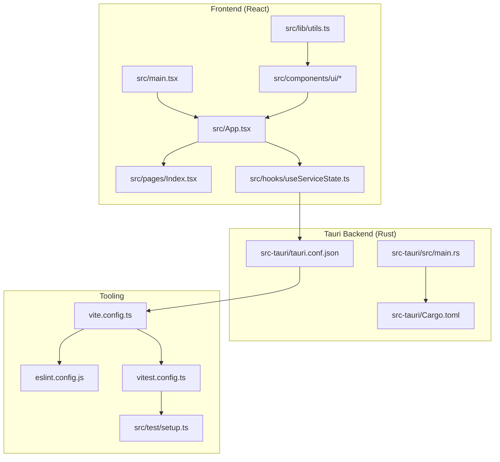
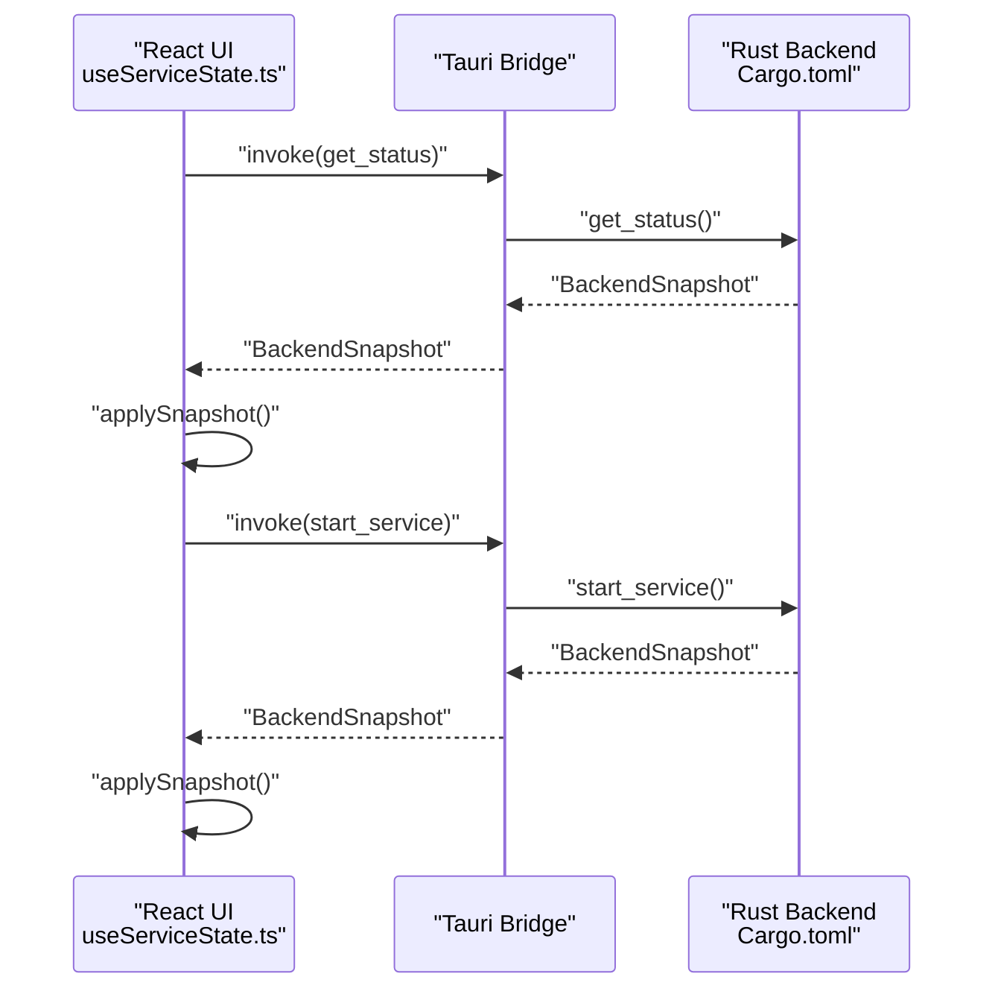
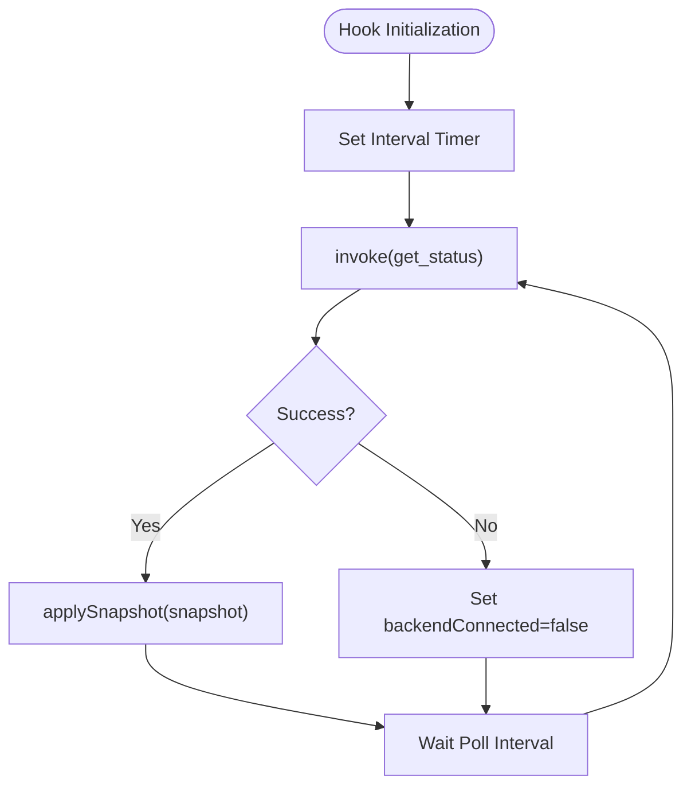
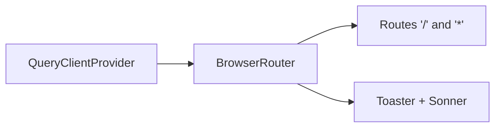
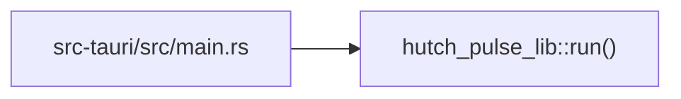
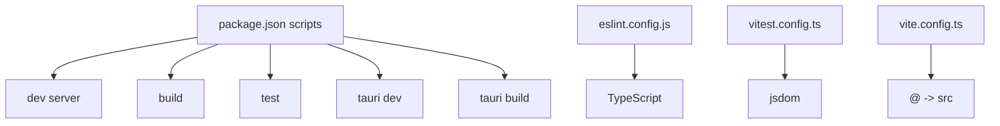
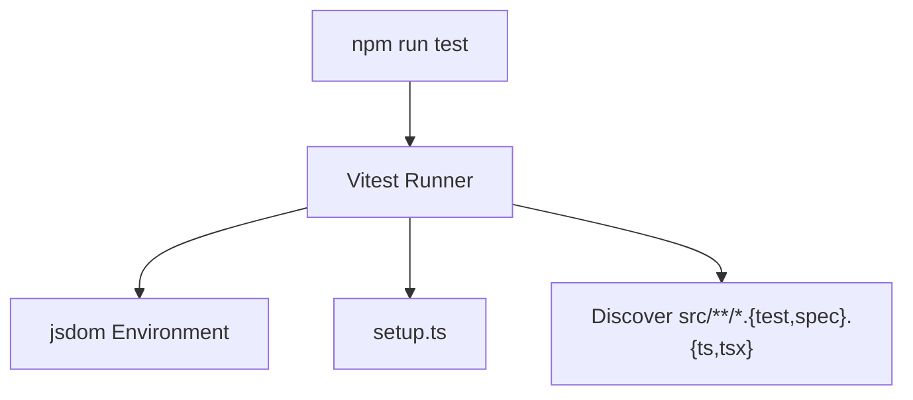
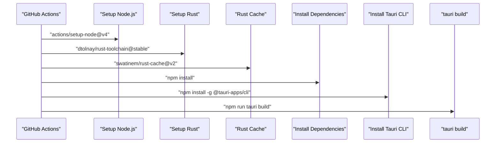

# Development Guide

<cite>
**Referenced Files in This Document**
- [README.md](file://README.md)
- [package.json](file://package.json)
- [vite.config.ts](file://vite.config.ts)
- [eslint.config.js](file://eslint.config.js)
- [vitest.config.ts](file://vitest.config.ts)
- [src/test/setup.ts](file://src/test/setup.ts)
- [src/main.tsx](file://src/main.tsx)
- [src/App.tsx](file://src/App.tsx)
- [src/hooks/useServiceState.ts](file://src/hooks/useServiceState.ts)
- [src/lib/utils.ts](file://src/lib/utils.ts)
- [src-tauri/Cargo.toml](file://src-tauri/Cargo.toml)
- [src-tauri/tauri.conf.json](file://src-tauri/tauri.conf.json)
- [src-tauri/src/main.rs](file://src-tauri/src/main.rs)
- [.github/workflows/build-windows.yml](file://.github/workflows/build-windows.yml)
- [.github/workflows/cross-platform.yml](file://.github/workflows/cross-platform.yml)
- [VERSION](file://VERSION)
</cite>

## Table of Contents
1. [Introduction](#introduction)
2. [Project Structure](#project-structure)
3. [Core Components](#core-components)
4. [Architecture Overview](#architecture-overview)
5. [Detailed Component Analysis](#detailed-component-analysis)
6. [Dependency Analysis](#dependency-analysis)
7. [Performance Considerations](#performance-considerations)
8. [Testing Strategy](#testing-strategy)
9. [Continuous Integration and Releases](#continuous-integration-and-releases)
10. [Development Environment Setup](#development-environment-setup)
11. [Coding Standards and Contribution Guidelines](#coding-standards-and-contribution-guidelines)
12. [Debugging and Profiling](#debugging-and-profiling)
13. [Extending Functionality](#extending-functionality)
14. [Troubleshooting Guide](#troubleshooting-guide)
15. [Conclusion](#conclusion)

## Introduction
Hutch-Pulse is a Tauri-based Windows tray application built with React, TypeScript, and Vite. It periodically triggers a lightweight request to maintain an active Hutch self-care session, automatically pausing when Wi-Fi or internet connectivity is lost. The project integrates frontend UI components (shadcn/ui + Tailwind CSS), state management via React Query, and a Rust backend exposed to the frontend through Tauri commands.

Key goals:
- Lightweight system tray utility
- Automatic pause on connectivity loss
- Configurable kick intervals
- Real-time status and activity logging

**Section sources**
- [README.md](file://README.md#L1-L114)

## Project Structure
High-level layout:
- Frontend: React + TypeScript + Vite under src/
- Backend: Rust/Tauri under src-tauri/
- UI primitives: shadcn/ui component library under src/components/ui/
- Pages: src/pages/
- Hooks: src/hooks/
- Utilities: src/lib/utils.ts
- Build and config: vite.config.ts, eslint.config.js, vitest.config.ts, tauri.conf.json, Cargo.toml
- CI/CD: .github/workflows/

**Diagram sources**
- [src/main.tsx](file://src/main.tsx#L1-L10)
- [src/App.tsx](file://src/App.tsx#L1-L28)
- [src/hooks/useServiceState.ts](file://src/hooks/useServiceState.ts#L1-L163)
- [src-tauri/src/main.rs](file://src-tauri/src/main.rs#L1-L7)
- [src-tauri/Cargo.toml](file://src-tauri/Cargo.toml#L1-L29)
- [src-tauri/tauri.conf.json](file://src-tauri/tauri.conf.json#L1-L42)
- [vite.config.ts](file://vite.config.ts#L1-L22)
- [eslint.config.js](file://eslint.config.js#L1-L27)
- [vitest.config.ts](file://vitest.config.ts#L1-L17)
- [src/test/setup.ts](file://src/test/setup.ts#L1-L16)

**Section sources**
- [README.md](file://README.md#L22-L50)
- [src/main.tsx](file://src/main.tsx#L1-L10)
- [src/App.tsx](file://src/App.tsx#L1-L28)
- [src-tauri/tauri.conf.json](file://src-tauri/tauri.conf.json#L1-L42)

## Core Components
- Application bootstrap and routing: [src/main.tsx](file://src/main.tsx#L1-L10), [src/App.tsx](file://src/App.tsx#L1-L28)
- Service state management and Tauri integration: [src/hooks/useServiceState.ts](file://src/hooks/useServiceState.ts#L1-L163)
- Utility helpers: [src/lib/utils.ts](file://src/lib/utils.ts#L1-L7)
- Tauri backend entrypoint: [src-tauri/src/main.rs](file://src-tauri/src/main.rs#L1-L7)
- Tauri configuration and bundling: [src-tauri/tauri.conf.json](file://src-tauri/tauri.conf.json#L1-L42)
- Rust crate dependencies: [src-tauri/Cargo.toml](file://src-tauri/Cargo.toml#L1-L29)

Key responsibilities:
- Frontend initializes React root, sets up providers (React Query, Router, Toasters), and renders pages.
- useServiceState encapsulates polling, invoking Tauri commands, and mapping backend snapshots to frontend state.
- Tauri configuration defines dev/build URLs, bundling targets, and window behavior.
- Cargo.toml lists Rust dependencies including Tauri, reqwest, tokio, and notification plugin.

**Section sources**
- [src/main.tsx](file://src/main.tsx#L1-L10)
- [src/App.tsx](file://src/App.tsx#L1-L28)
- [src/hooks/useServiceState.ts](file://src/hooks/useServiceState.ts#L1-L163)
- [src-tauri/src/main.rs](file://src-tauri/src/main.rs#L1-L7)
- [src-tauri/tauri.conf.json](file://src-tauri/tauri.conf.json#L1-L42)
- [src-tauri/Cargo.toml](file://src-tauri/Cargo.toml#L1-L29)

## Architecture Overview
End-to-end flow:
- Frontend polls backend via Tauri invoke commands.
- Backend executes logic (e.g., checking Wi-Fi/internet, performing kicks) and returns structured snapshots.
- Frontend updates UI state and displays logs/status.

**Diagram sources**
- [src/hooks/useServiceState.ts](file://src/hooks/useServiceState.ts#L88-L107)
- [src-tauri/Cargo.toml](file://src-tauri/Cargo.toml#L20-L29)

**Section sources**
- [src/hooks/useServiceState.ts](file://src/hooks/useServiceState.ts#L1-L163)
- [src-tauri/Cargo.toml](file://src-tauri/Cargo.toml#L1-L29)

## Detailed Component Analysis

### Frontend State Hook: useServiceState
Responsibilities:
- Poll backend status at a fixed interval.
- Invoke commands to start/stop service, trigger manual kick, adjust interval, and quit app.
- Map backend snapshots to frontend types and normalize timestamps.
- Surface errors and backend connectivity status.

**Diagram sources**
- [src/hooks/useServiceState.ts](file://src/hooks/useServiceState.ts#L88-L107)

**Section sources**
- [src/hooks/useServiceState.ts](file://src/hooks/useServiceState.ts#L1-L163)

### UI Providers and Routing
- React Query provider wraps the app for caching and background updates.
- Router defines routes including a catch-all for 404.
- Toasters provide notifications.

**Diagram sources**
- [src/App.tsx](file://src/App.tsx#L1-L28)

**Section sources**
- [src/App.tsx](file://src/App.tsx#L1-L28)

### Tauri Backend Entrypoint
- Windows subsystem configured for release builds.
- Delegates to a shared Rust library function to run the app.

**Diagram sources**
- [src-tauri/src/main.rs](file://src-tauri/src/main.rs#L1-L7)

**Section sources**
- [src-tauri/src/main.rs](file://src-tauri/src/main.rs#L1-L7)

### Utility Functions
- cn merges and merges Tailwind classes safely.

**Section sources**
- [src/lib/utils.ts](file://src/lib/utils.ts#L1-L7)

## Dependency Analysis
Frontend dependencies include UI primitives, state management, routing, and Tauri APIs. Tooling includes Vite, ESLint, Vitest, and Tailwind.

**Diagram sources**
- [package.json](file://package.json#L6-L16)
- [eslint.config.js](file://eslint.config.js#L1-L27)
- [vitest.config.ts](file://vitest.config.ts#L1-L17)
- [vite.config.ts](file://vite.config.ts#L1-L22)

**Section sources**
- [package.json](file://package.json#L1-L96)
- [eslint.config.js](file://eslint.config.js#L1-L27)
- [vitest.config.ts](file://vitest.config.ts#L1-L17)
- [vite.config.ts](file://vite.config.ts#L1-L22)

## Performance Considerations
- Polling interval: The hook polls every fixed interval; tune POLL_INTERVAL_MS for responsiveness vs. overhead.
- Network requests: Backend uses reqwest; ensure timeouts and retries are configured appropriately.
- UI rendering: Keep render-heavy components memoized; leverage React Query caching to avoid redundant fetches.
- Bundle size: Prefer lazy loading for heavy components; minimize unused dependencies.

[No sources needed since this section provides general guidance]

## Testing Strategy
- Unit and integration tests use Vitest with jsdom environment.
- Global setup includes polyfills for matchMedia to support UI components.
- Tests are discovered under src/**/*.{test,spec}.{ts,tsx} with a setup file.

**Diagram sources**
- [package.json](file://package.json#L12-L13)
- [vitest.config.ts](file://vitest.config.ts#L1-L17)
- [src/test/setup.ts](file://src/test/setup.ts#L1-L16)

**Section sources**
- [package.json](file://package.json#L12-L13)
- [vitest.config.ts](file://vitest.config.ts#L1-L17)
- [src/test/setup.ts](file://src/test/setup.ts#L1-L16)

## Continuous Integration and Releases
- Windows build workflow runs on pushes and PRs, building the Tauri app and uploading the executable artifact.
- Cross-platform release workflow runs on commits with a specific message pattern, reading version and release notes from the VERSION file and commit message, then building for Windows, Ubuntu, and macOS and uploading bundles.

**Diagram sources**
- [.github/workflows/build-windows.yml](file://.github/workflows/build-windows.yml#L1-L49)
- [.github/workflows/cross-platform.yml](file://.github/workflows/cross-platform.yml#L1-L128)

**Section sources**
- [.github/workflows/build-windows.yml](file://.github/workflows/build-windows.yml#L1-L49)
- [.github/workflows/cross-platform.yml](file://.github/workflows/cross-platform.yml#L1-L128)
- [VERSION](file://VERSION)

## Development Environment Setup
Prerequisites:
- Node.js 18+ and npm
- Rust (latest stable)
- Windows 10/11

Installation and running:
- Install dependencies
- Run in development mode (frontend + Tauri dev)
- Build for production

Build and run commands are defined in package.json scripts.

**Section sources**
- [README.md](file://README.md#L70-L99)
- [package.json](file://package.json#L6-L16)

## Coding Standards and Contribution Guidelines
- Linting: ESLint with TypeScript rules and React Hooks plugin.
- Formatting: Tailwind CSS and shadcn/ui components; utilities like cn help manage class merging.
- React refresh: Enabled via ESLint plugin.
- Unused variable linting: Disabled per project rules.

Recommended practices:
- Keep components functional and composable.
- Centralize side effects in hooks (e.g., useServiceState).
- Use React Query for caching and background synchronization.
- Add tests for critical UI logic and async flows.

**Section sources**
- [eslint.config.js](file://eslint.config.js#L1-L27)
- [src/lib/utils.ts](file://src/lib/utils.ts#L1-L7)

## Debugging and Profiling
Common debugging approaches:
- Frontend:
  - Enable React DevTools and Redux DevTools if applicable.
  - Use console logging in hooks and components.
  - Inspect React Query cache and queries.
- Backend:
  - Use Rust logging (log crate) and print statements during development.
  - Verify Tauri command invocations and error propagation.
- Tauri:
  - Confirm dev URL and frontendDist in tauri.conf.json.
  - Validate tray icon and window visibility settings.

Profiling tips:
- Measure hook re-renders with React DevTools Profiler.
- Track network latency for periodic kicks.
- Monitor memory usage with browser devtools.

**Section sources**
- [src-tauri/tauri.conf.json](file://src-tauri/tauri.conf.json#L6-L11)
- [src/hooks/useServiceState.ts](file://src/hooks/useServiceState.ts#L88-L107)

## Extending Functionality
Adding new features:
- UI components: Place new components under src/components/ui/ and reuse shadcn/ui primitives.
- Pages: Add new routes under src/pages/ and register them in src/App.tsx.
- Backend logic: Implement new Tauri commands in Rust and expose them via the bridge; update useServiceState to invoke and handle responses.
- State management: Extend the ServiceState interface and update applySnapshot accordingly.

Best practices:
- Keep UI state normalized and derived from backend snapshots.
- Encapsulate async operations in hooks.
- Write unit tests for new hooks and components.

**Section sources**
- [src/App.tsx](file://src/App.tsx#L1-L28)
- [src/hooks/useServiceState.ts](file://src/hooks/useServiceState.ts#L1-L163)
- [src-tauri/Cargo.toml](file://src-tauri/Cargo.toml#L20-L29)

## Troubleshooting Guide
Common issues and resolutions:
- Frontend not connecting to backend:
  - Verify dev URL and frontendDist in tauri.conf.json.
  - Ensure Tauri CLI is installed globally and dev server is reachable.
- Tests failing due to missing matchMedia:
  - Confirm setup.ts polyfills are loaded by Vitest.
- CI build failures:
  - Check Rust cache and toolchain stability.
  - Validate platform-specific dependencies (Linux deps in cross-platform workflow).
- Version and release notes:
  - Ensure VERSION file exists and commit messages include the expected pattern for releases.

**Section sources**
- [src-tauri/tauri.conf.json](file://src-tauri/tauri.conf.json#L6-L11)
- [src/test/setup.ts](file://src/test/setup.ts#L1-L16)
- [.github/workflows/cross-platform.yml](file://.github/workflows/cross-platform.yml#L33-L68)
- [VERSION](file://VERSION)

## Conclusion
Hutch-Pulse combines a modern React frontend with a Rust-powered Tauri backend to deliver a reliable tray utility. By following the established patterns—centralized state hooks, strict linting, robust testing, and CI-driven releases—you can confidently extend functionality while maintaining performance and reliability.

[No sources needed since this section summarizes without analyzing specific files]