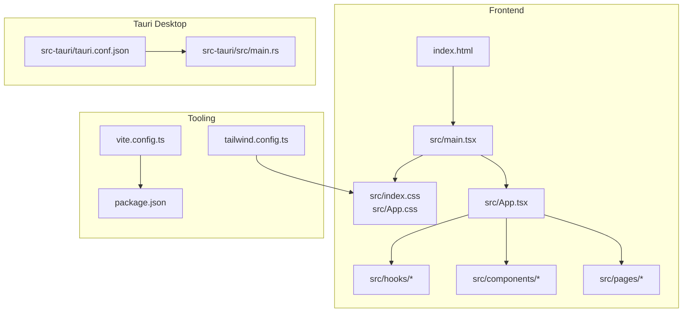
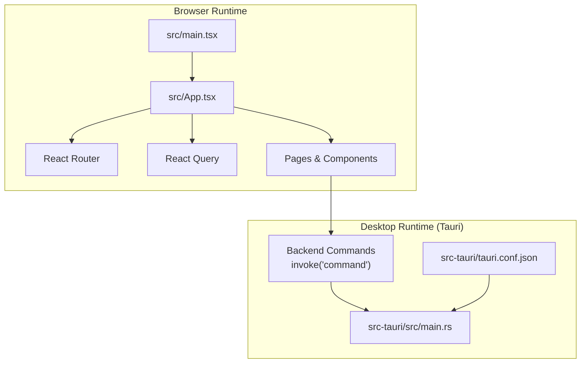
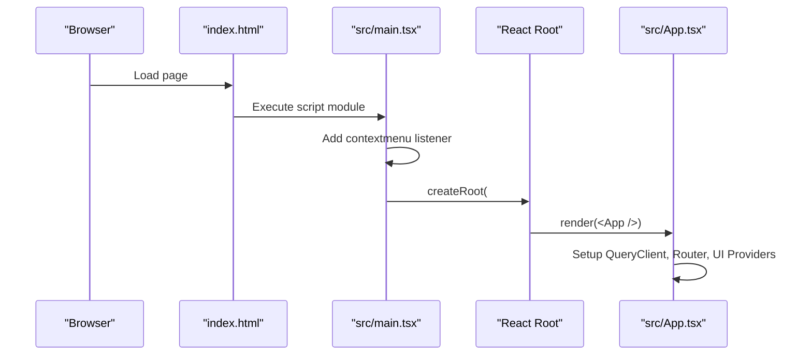
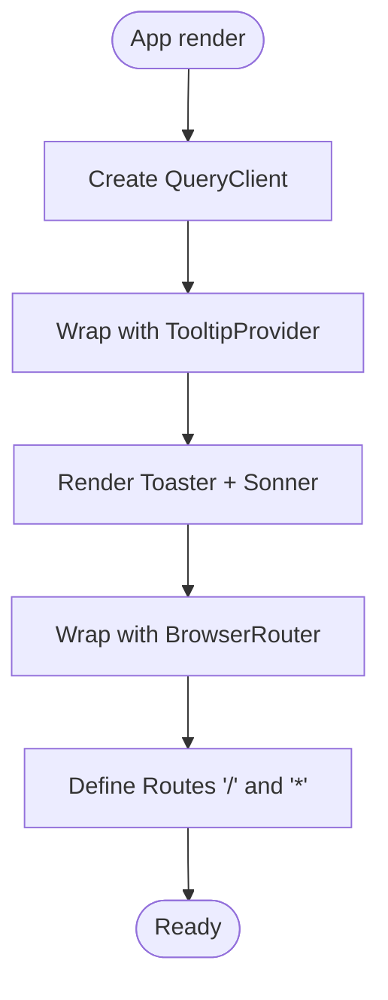
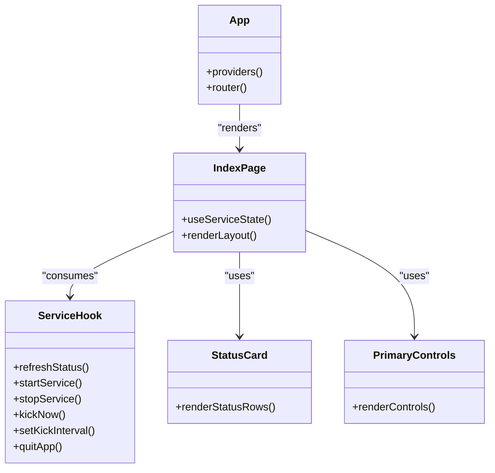
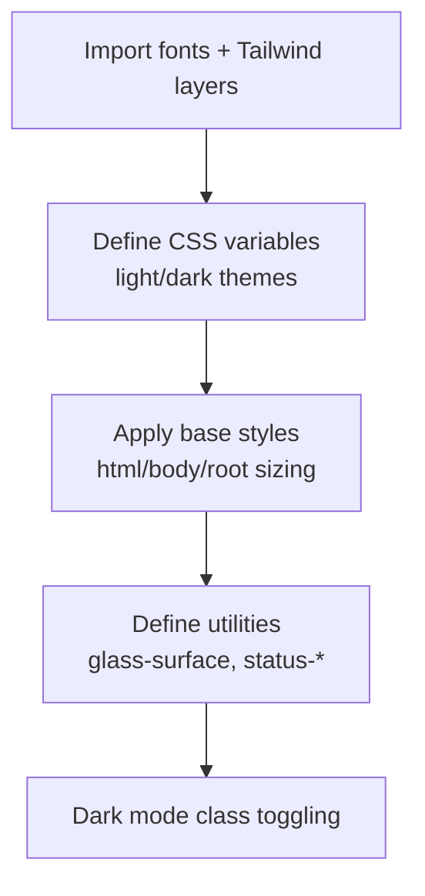
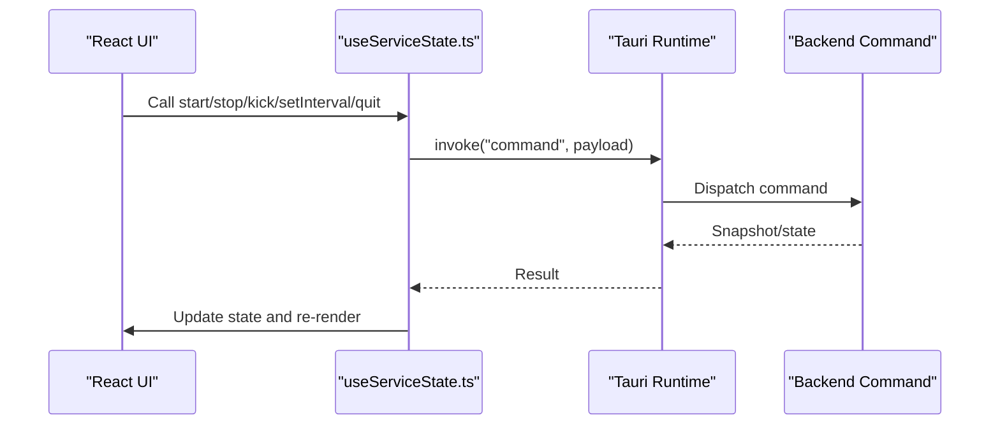
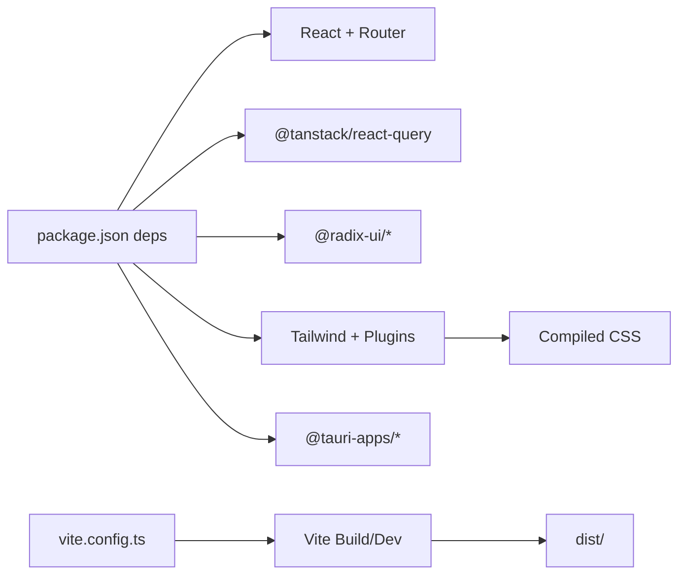

# Application Structure

<cite>
**Referenced Files in This Document**
- [main.tsx](file://src/main.tsx)
- [index.html](file://index.html)
- [App.tsx](file://src/App.tsx)
- [index.css](file://src/index.css)
- [App.css](file://src/App.css)
- [vite.config.ts](file://vite.config.ts)
- [package.json](file://package.json)
- [tauri.conf.json](file://src-tauri/tauri.conf.json)
- [main.rs](file://src-tauri/src/main.rs)
- [Index.tsx](file://src/pages/Index.tsx)
- [NotFound.tsx](file://src/pages/NotFound.tsx)
- [useServiceState.ts](file://src/hooks/useServiceState.ts)
- [StatusCard.tsx](file://src/components/StatusCard.tsx)
- [PrimaryControls.tsx](file://src/components/PrimaryControls.tsx)
- [utils.ts](file://src/lib/utils.ts)
- [tailwind.config.ts](file://tailwind.config.ts)
</cite>

## Table of Contents
1. [Introduction](#introduction)
2. [Project Structure](#project-structure)
3. [Core Components](#core-components)
4. [Architecture Overview](#architecture-overview)
5. [Detailed Component Analysis](#detailed-component-analysis)
6. [Dependency Analysis](#dependency-analysis)
7. [Performance Considerations](#performance-considerations)
8. [Troubleshooting Guide](#troubleshooting-guide)
9. [Conclusion](#conclusion)
10. [Appendices](#appendices)

## Introduction
This document explains the React application structure, focusing on the main entry point configuration, root component setup, global styling initialization, and the bootstrap process. It also covers how the application integrates with the Tauri backend for desktop functionality, including the tray-like behavior and context menu prevention for tray interactions. The document outlines the component hierarchy starting from the root App component, best practices for initialization, performance considerations, and desktop integration patterns.

## Project Structure
The project follows a conventional Vite + React + TypeScript setup with Tailwind CSS for styling and Tauri for desktop packaging. The frontend is bootstrapped via a minimal entry point that mounts the root React component and applies global styles. The Tauri configuration defines a small, always-on-top, taskbar-skipping window intended for tray-like behavior.

**Diagram sources**
- [index.html](file://index.html#L1-L27)
- [main.tsx](file://src/main.tsx#L1-L10)
- [App.tsx](file://src/App.tsx#L1-L28)
- [vite.config.ts](file://vite.config.ts#L1-L22)
- [package.json](file://package.json#L1-L96)
- [tailwind.config.ts](file://tailwind.config.ts#L1-L105)
- [tauri.conf.json](file://src-tauri/tauri.conf.json#L1-L42)
- [main.rs](file://src-tauri/src/main.rs#L1-L7)

**Section sources**
- [index.html](file://index.html#L1-L27)
- [main.tsx](file://src/main.tsx#L1-L10)
- [vite.config.ts](file://vite.config.ts#L1-L22)
- [package.json](file://package.json#L1-L96)
- [tailwind.config.ts](file://tailwind.config.ts#L1-L105)
- [tauri.conf.json](file://src-tauri/tauri.conf.json#L1-L42)
- [main.rs](file://src-tauri/src/main.rs#L1-L7)

## Core Components
- Entry point and bootstrap
  - The application mounts the root React component into the DOM and prevents default context menus to support tray-style right-click behavior.
  - See [main.tsx](file://src/main.tsx#L1-L10).

- Root component and routing
  - The root App component sets up React Query for caching and background updates, Radix UI tooltips, notification providers, and React Router for page routing.
  - See [App.tsx](file://src/App.tsx#L1-L28).

- Global styling
  - Global Tailwind layers and CSS variables define theme tokens, dark mode variants, and utility classes for glass surfaces and status indicators.
  - See [index.css](file://src/index.css#L1-L151).
  - Legacy demo styles are defined in [App.css](file://src/App.css#L1-L43).

- Build and tooling
  - Vite configuration enables React plugin, host binding, and path aliasing; package scripts orchestrate development, building, testing, and Tauri commands.
  - See [vite.config.ts](file://vite.config.ts#L1-L22) and [package.json](file://package.json#L1-L96).

- Desktop integration
  - Tauri configuration defines a small, always-on-top, non-resizable window with hidden visibility and taskbar skipping, suitable for tray-like presentation.
  - Rust entry point delegates to a library crate’s run function.
  - See [tauri.conf.json](file://src-tauri/tauri.conf.json#L1-L42) and [main.rs](file://src-tauri/src/main.rs#L1-L7).

**Section sources**
- [main.tsx](file://src/main.tsx#L1-L10)
- [App.tsx](file://src/App.tsx#L1-L28)
- [index.css](file://src/index.css#L1-L151)
- [App.css](file://src/App.css#L1-L43)
- [vite.config.ts](file://vite.config.ts#L1-L22)
- [package.json](file://package.json#L1-L96)
- [tauri.conf.json](file://src-tauri/tauri.conf.json#L1-L42)
- [main.rs](file://src-tauri/src/main.rs#L1-L7)

## Architecture Overview
The application uses a thin frontend shell integrated with a Tauri backend. The frontend initializes React, applies global styles, and renders the App component. Routing and state management are handled by React Router and React Query. The backend exposes commands invoked by the frontend to manage the service lifecycle and retrieve status snapshots.

**Diagram sources**
- [main.tsx](file://src/main.tsx#L1-L10)
- [App.tsx](file://src/App.tsx#L1-L28)
- [tauri.conf.json](file://src-tauri/tauri.conf.json#L1-L42)
- [main.rs](file://src-tauri/src/main.rs#L1-L7)

## Detailed Component Analysis

### Bootstrap and Entry Point
- Mounting the root component
  - The entry point creates a root and renders the App component inside the #root element.
  - See [main.tsx](file://src/main.tsx#L1-L10) and [index.html](file://index.html#L22-L24).

- Context menu prevention for tray behavior
  - A global listener prevents the browser context menu, enabling custom tray interactions.
  - See [main.tsx](file://src/main.tsx#L5-L7).

- Global styling initialization
  - Tailwind layers and CSS variables are imported to establish theme tokens and utilities.
  - See [main.tsx](file://src/main.tsx#L3) and [index.css](file://src/index.css#L1-L4).

**Diagram sources**
- [index.html](file://index.html#L1-L27)
- [main.tsx](file://src/main.tsx#L1-L10)
- [App.tsx](file://src/App.tsx#L1-L28)

**Section sources**
- [index.html](file://index.html#L1-L27)
- [main.tsx](file://src/main.tsx#L1-L10)
- [index.css](file://src/index.css#L1-L4)

### Root App Component and Routing
- Provider stack
  - React Query client provider for caching and background refetching.
  - Tooltip provider for interactive UI hints.
  - Notification providers for toast-style alerts.
  - Router setup with routes for home and a catch-all 404 page.
  - See [App.tsx](file://src/App.tsx#L1-L28).

- Route composition
  - The Index page is rendered at the root path.
  - A catch-all route renders NotFound for unmatched paths.
  - See [App.tsx](file://src/App.tsx#L16-L22) and [Index.tsx](file://src/pages/Index.tsx#L1-L55), [NotFound.tsx](file://src/pages/NotFound.tsx#L1-L25).

**Diagram sources**
- [App.tsx](file://src/App.tsx#L1-L28)

**Section sources**
- [App.tsx](file://src/App.tsx#L1-L28)
- [Index.tsx](file://src/pages/Index.tsx#L1-L55)
- [NotFound.tsx](file://src/pages/NotFound.tsx#L1-L25)

### Component Hierarchy and State Management
- Index page composition
  - Uses a service state hook to fetch and display current status, network info, logs, and controls.
  - Integrates header, status card, primary controls, advanced settings, log panel, and footer.
  - See [Index.tsx](file://src/pages/Index.tsx#L1-L55).

- Service state hook
  - Manages polling for backend snapshots, invoking Tauri commands for start/stop/kick/set-interval/quit.
  - Transforms backend snapshots into UI state and handles errors.
  - See [useServiceState.ts](file://src/hooks/useServiceState.ts#L1-L163).

- UI components
  - StatusCard displays network and internet status and last kick time.
  - PrimaryControls renders start/stop and immediate kick actions with disabled states based on service status.
  - See [StatusCard.tsx](file://src/components/StatusCard.tsx#L1-L63) and [PrimaryControls.tsx](file://src/components/PrimaryControls.tsx#L1-L73).

**Diagram sources**
- [App.tsx](file://src/App.tsx#L1-L28)
- [Index.tsx](file://src/pages/Index.tsx#L1-L55)
- [useServiceState.ts](file://src/hooks/useServiceState.ts#L1-L163)
- [StatusCard.tsx](file://src/components/StatusCard.tsx#L1-L63)
- [PrimaryControls.tsx](file://src/components/PrimaryControls.tsx#L1-L73)

**Section sources**
- [Index.tsx](file://src/pages/Index.tsx#L1-L55)
- [useServiceState.ts](file://src/hooks/useServiceState.ts#L1-L163)
- [StatusCard.tsx](file://src/components/StatusCard.tsx#L1-L63)
- [PrimaryControls.tsx](file://src/components/PrimaryControls.tsx#L1-L73)

### Styling and Theme System
- CSS import structure
  - Global fonts and Tailwind layers are imported in the entry stylesheet.
  - CSS variables define light/dark themes and semantic tokens for backgrounds, borders, accents, and status colors.
  - See [index.css](file://src/index.css#L1-L151).

- Tailwind configuration
  - Dark mode is class-based, content paths include app and components, and custom shadows and fonts are extended.
  - See [tailwind.config.ts](file://tailwind.config.ts#L1-L105).

- Utility helpers
  - A utility function merges and normalizes class names for Tailwind usage.
  - See [utils.ts](file://src/lib/utils.ts#L1-L7).

**Diagram sources**
- [index.css](file://src/index.css#L1-L151)
- [tailwind.config.ts](file://tailwind.config.ts#L1-L105)

**Section sources**
- [index.css](file://src/index.css#L1-L151)
- [tailwind.config.ts](file://tailwind.config.ts#L1-L105)
- [utils.ts](file://src/lib/utils.ts#L1-L7)

### Tauri Integration and Tray Behavior
- Desktop window configuration
  - A single window is configured as non-resizable, non-minimizable, always-on-top, hidden initially, and excluded from the taskbar.
  - See [tauri.conf.json](file://src-tauri/tauri.conf.json#L13-L25).

- Frontend-backend invocation
  - The service hook invokes backend commands by name, receiving structured snapshots to update UI state.
  - See [useServiceState.ts](file://src/hooks/useServiceState.ts#L88-L152).

- Rust entry point
  - The Tauri main function delegates to a library crate’s run routine.
  - See [main.rs](file://src-tauri/src/main.rs#L4-L6).

**Diagram sources**
- [useServiceState.ts](file://src/hooks/useServiceState.ts#L88-L152)
- [tauri.conf.json](file://src-tauri/tauri.conf.json#L1-L42)
- [main.rs](file://src-tauri/src/main.rs#L1-L7)

**Section sources**
- [tauri.conf.json](file://src-tauri/tauri.conf.json#L1-L42)
- [useServiceState.ts](file://src/hooks/useServiceState.ts#L1-L163)
- [main.rs](file://src-tauri/src/main.rs#L1-L7)

## Dependency Analysis
- Frontend dependencies
  - React, React Router, React Query, Radix UI, Tailwind-based UI primitives, and Tauri APIs are declared in package.json.
  - See [package.json](file://package.json#L18-L69).

- Tooling and build
  - Vite config enables React plugin, host binding, and path aliasing; scripts orchestrate dev/build/test/Tauri workflows.
  - See [vite.config.ts](file://vite.config.ts#L1-L22) and [package.json](file://package.json#L6-L17).

- Styling pipeline
  - Tailwind layers and CSS variables feed into compiled CSS; dark mode and utilities are generated accordingly.
  - See [index.css](file://src/index.css#L1-L151) and [tailwind.config.ts](file://tailwind.config.ts#L1-L105).

**Diagram sources**
- [package.json](file://package.json#L18-L69)
- [vite.config.ts](file://vite.config.ts#L1-L22)
- [index.css](file://src/index.css#L1-L151)
- [tailwind.config.ts](file://tailwind.config.ts#L1-L105)

**Section sources**
- [package.json](file://package.json#L1-L96)
- [vite.config.ts](file://vite.config.ts#L1-L22)
- [index.css](file://src/index.css#L1-L151)
- [tailwind.config.ts](file://tailwind.config.ts#L1-L105)

## Performance Considerations
- Polling strategy
  - The service state hook polls at a fixed interval to keep UI in sync with backend state. Consider debouncing or reducing frequency if unnecessary.
  - See [useServiceState.ts](file://src/hooks/useServiceState.ts#L42) and [useServiceState.ts](file://src/hooks/useServiceState.ts#L100-L107).

- Rendering and memoization
  - Use callbacks and memoized transforms to avoid unnecessary re-renders when applying snapshots.
  - See [useServiceState.ts](file://src/hooks/useServiceState.ts#L70-L86).

- CSS and Tailwind
  - Prefer utility-first classes and avoid excessive nesting. Keep the content globs in Tailwind configuration scoped to reduce rebuilds.
  - See [tailwind.config.ts](file://tailwind.config.ts#L4-L5).

- Window sizing and overflow
  - The root container disables overflow to prevent scrollbars in a fixed-size tray window.
  - See [index.css](file://src/index.css#L105-L112).

[No sources needed since this section provides general guidance]

## Troubleshooting Guide
- Backend connection failures
  - The service state hook marks backend disconnected on invocation errors and preserves previous state otherwise.
  - See [useServiceState.ts](file://src/hooks/useServiceState.ts#L92-L98).

- Route not found
  - The NotFound page logs the attempted path and provides a link back to the home route.
  - See [NotFound.tsx](file://src/pages/NotFound.tsx#L7-L9).

- Context menu interference
  - If right-click behavior is unexpected, verify the contextmenu listener is active at startup.
  - See [main.tsx](file://src/main.tsx#L5-L7).

- Styling anomalies
  - Confirm Tailwind layers and CSS variables are loaded and dark mode class is applied on the document root.
  - See [index.html](file://index.html#L2) and [index.css](file://src/index.css#L1-L151).

**Section sources**
- [useServiceState.ts](file://src/hooks/useServiceState.ts#L92-L98)
- [NotFound.tsx](file://src/pages/NotFound.tsx#L7-L9)
- [main.tsx](file://src/main.tsx#L5-L7)
- [index.html](file://index.html#L2)
- [index.css](file://src/index.css#L1-L151)

## Conclusion
The application employs a clean, modular structure: a minimal React entry point, a root App component with routing and global providers, and a cohesive set of UI components backed by a service state hook that communicates with the Tauri backend. Global styling leverages Tailwind layers and CSS variables for a consistent theme. The Tauri configuration supports a tray-like window with non-standard window controls, while the frontend prevents default context menus to enable custom tray interactions. Following the best practices outlined here ensures maintainable initialization, predictable performance, and robust desktop integration.

[No sources needed since this section summarizes without analyzing specific files]

## Appendices
- Best practices for initialization
  - Keep the entry point minimal and declarative.
  - Centralize global providers in the root component.
  - Use a single source of truth for theme tokens via CSS variables.
  - Avoid heavy work in the entry point; defer to component initialization.

- Desktop integration patterns
  - Use Tauri commands for all backend interactions.
  - Keep the tray window small and non-intrusive.
  - Provide clear feedback for backend availability and errors.

[No sources needed since this section provides general guidance]