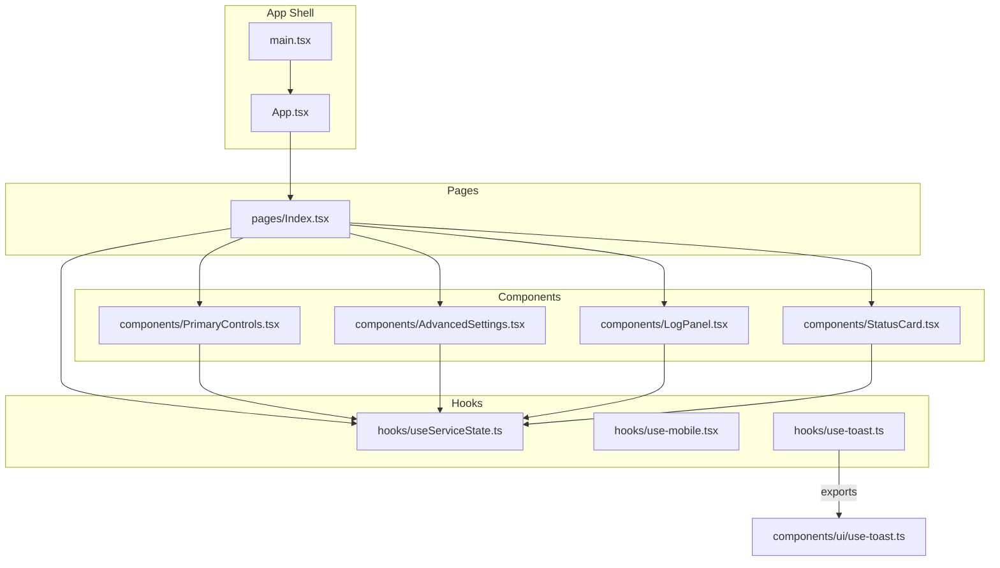
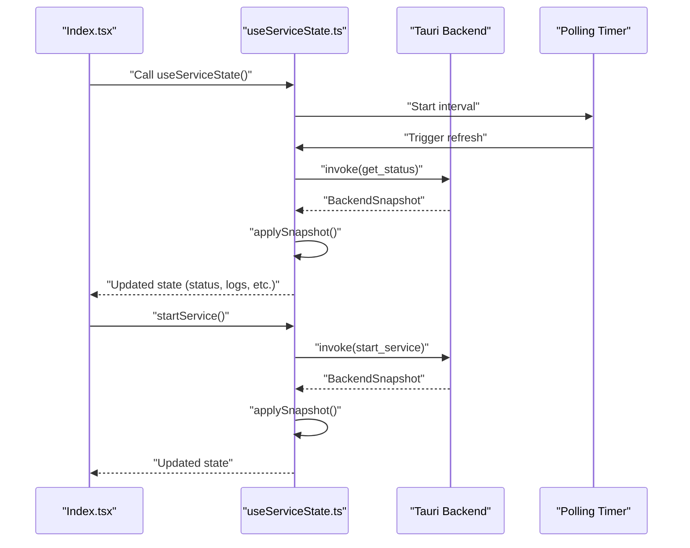
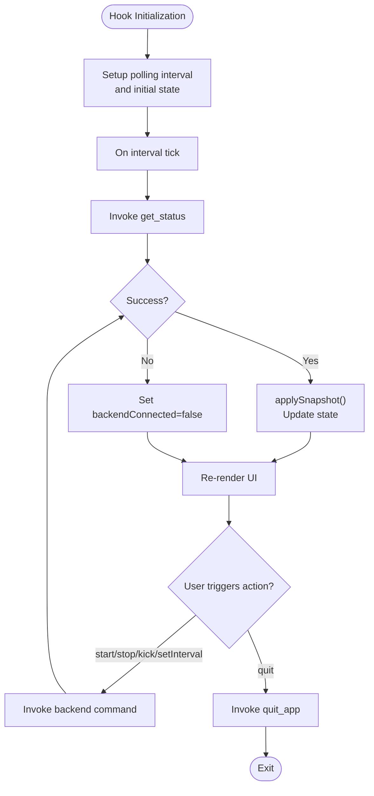
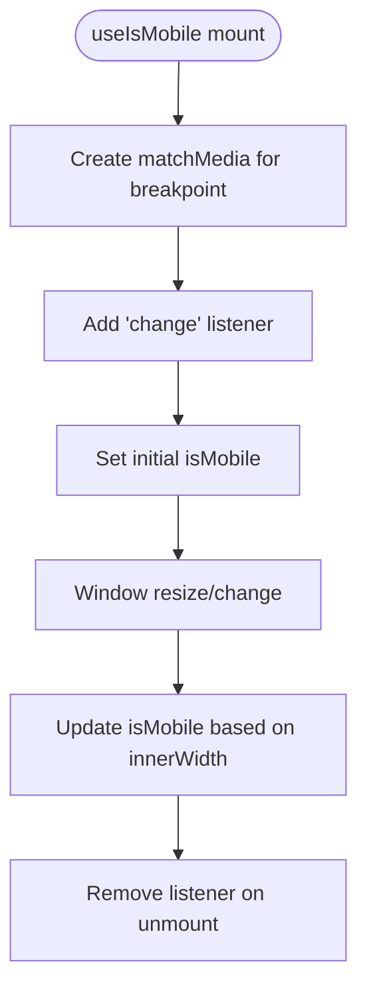
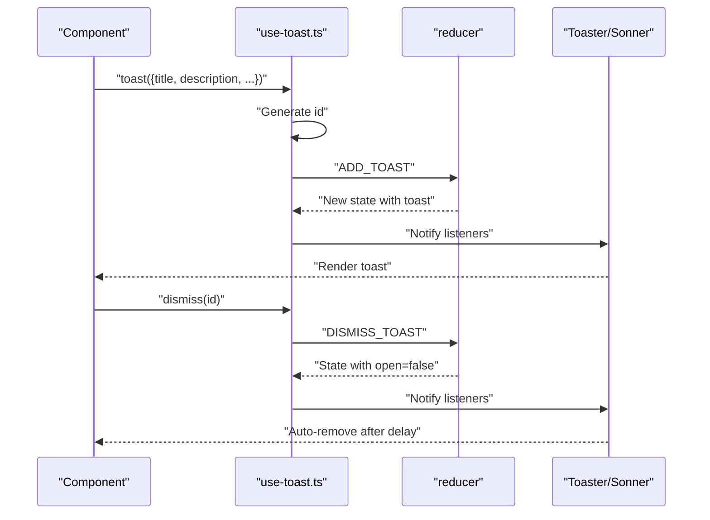
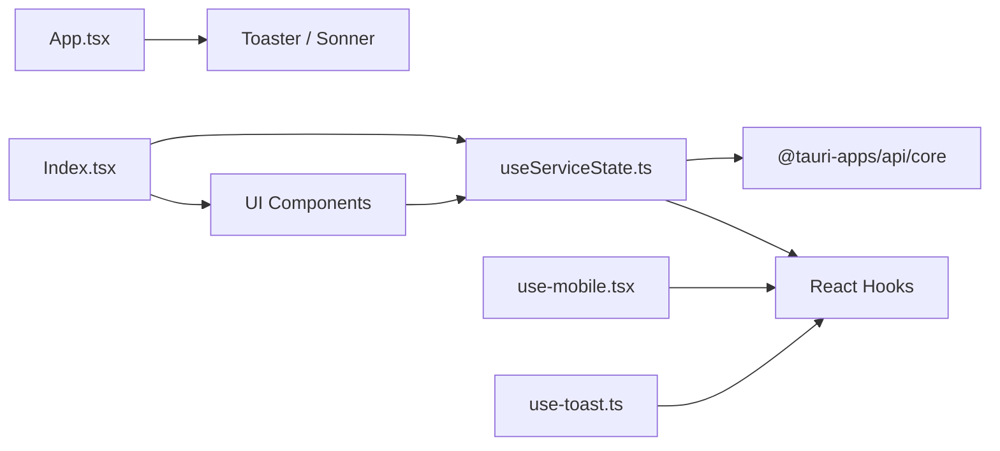

# Custom Hooks

<cite>
**Referenced Files in This Document**
- [useServiceState.ts](file://src/hooks/useServiceState.ts)
- [use-mobile.tsx](file://src/hooks/use-mobile.tsx)
- [use-toast.ts](file://src/hooks/use-toast.ts)
- [use-toast.ts (UI export)](file://src/components/ui/use-toast.ts)
- [App.tsx](file://src/App.tsx)
- [main.tsx](file://src/main.tsx)
- [Index.tsx](file://src/pages/Index.tsx)
- [PrimaryControls.tsx](file://src/components/PrimaryControls.tsx)
- [AdvancedSettings.tsx](file://src/components/AdvancedSettings.tsx)
- [LogPanel.tsx](file://src/components/LogPanel.tsx)
- [StatusCard.tsx](file://src/components/StatusCard.tsx)
</cite>

## Table of Contents
1. [Introduction](#introduction)
2. [Project Structure](#project-structure)
3. [Core Components](#core-components)
4. [Architecture Overview](#architecture-overview)
5. [Detailed Component Analysis](#detailed-component-analysis)
6. [Dependency Analysis](#dependency-analysis)
7. [Performance Considerations](#performance-considerations)
8. [Troubleshooting Guide](#troubleshooting-guide)
9. [Conclusion](#conclusion)
10. [Appendices](#appendices)

## Introduction
This document provides comprehensive documentation for the custom React hooks used in the project, focusing on:
- useServiceState: Manages Tauri bridge communication, service state polling, and real-time updates.
- use-mobile: Provides responsive design handling for mobile breakpoints.
- use-toast: Centralized notification management with a toast queue and imperative API.

It explains hook interfaces, internal dependencies, side effects, integration patterns with the frontend state management, usage examples, performance considerations, and best practices for extending the hook system.

## Project Structure
The hooks live under src/hooks and are consumed by UI components and pages under src/components and src/pages. The App component wires up global providers (toaster, tooltip provider, router) and renders the main page.

**Diagram sources**
- [App.tsx](file://src/App.tsx#L1-L28)
- [main.tsx](file://src/main.tsx#L1-L10)
- [Index.tsx](file://src/pages/Index.tsx#L1-L55)
- [useServiceState.ts](file://src/hooks/useServiceState.ts#L67-L162)
- [use-mobile.tsx](file://src/hooks/use-mobile.tsx#L5-L19)
- [use-toast.ts](file://src/hooks/use-toast.ts#L166-L184)
- [use-toast.ts (UI export)](file://src/components/ui/use-toast.ts#L1-L4)
- [PrimaryControls.tsx](file://src/components/PrimaryControls.tsx#L12-L72)
- [AdvancedSettings.tsx](file://src/components/AdvancedSettings.tsx#L17-L72)
- [LogPanel.tsx](file://src/components/LogPanel.tsx#L12-L51)
- [StatusCard.tsx](file://src/components/StatusCard.tsx#L19-L62)

**Section sources**
- [App.tsx](file://src/App.tsx#L1-L28)
- [main.tsx](file://src/main.tsx#L1-L10)
- [Index.tsx](file://src/pages/Index.tsx#L1-L55)

## Core Components
This section documents the three custom hooks and their roles in the application.

- useServiceState
  - Purpose: Orchestrates Tauri backend state via invoke calls, polls service status periodically, and exposes actions to control the service and adjust settings.
  - Exposed state: status, wifiStatus, internetStatus, lastKick, kickInterval, logs, errorMessage, backendConnected.
  - Actions: startService, stopService, kickNow, setKickInterval, quitApp.
  - Polling: Runs a periodic timer to refresh status from the backend.

- use-mobile
  - Purpose: Detects mobile viewport width and returns a boolean indicating whether the screen is below the mobile breakpoint.
  - Breakpoint: 768 pixels wide.

- use-toast
  - Purpose: Provides a centralized toast notification system with an imperative API and a reducer-based state machine.
  - Features: Limit toast count, auto-dismiss timers, dismiss/update/remove actions, and a listener pattern for state propagation.

**Section sources**
- [useServiceState.ts](file://src/hooks/useServiceState.ts#L44-L53)
- [useServiceState.ts](file://src/hooks/useServiceState.ts#L67-L162)
- [use-mobile.tsx](file://src/hooks/use-mobile.tsx#L3-L19)
- [use-toast.ts](file://src/hooks/use-toast.ts#L5-L69)
- [use-toast.ts](file://src/hooks/use-toast.ts#L166-L184)

## Architecture Overview
The hooks integrate with the UI through a unidirectional data flow:
- useServiceState fetches and normalizes backend snapshots, updating local state and exposing action handlers.
- UI components consume the hook’s state and pass action callbacks to trigger backend operations.
- use-toast provides a global notification surface via Toaster and Sonner providers registered in App.tsx.

**Diagram sources**
- [Index.tsx](file://src/pages/Index.tsx#L9-L52)
- [useServiceState.ts](file://src/hooks/useServiceState.ts#L88-L107)
- [useServiceState.ts](file://src/hooks/useServiceState.ts#L90-L97)
- [useServiceState.ts](file://src/hooks/useServiceState.ts#L109-L116)
- [useServiceState.ts](file://src/hooks/useServiceState.ts#L70-L86)

## Detailed Component Analysis

### useServiceState Hook
- Responsibilities
  - Periodic polling of service status via Tauri invoke.
  - Normalization of backend snapshots into frontend-friendly types.
  - Exposing imperative actions to control the service and adjust settings.
  - Tracking connectivity to the backend and surfacing errors.

- Interfaces and Types
  - Enums and union types define status domains for service, WiFi, and internet.
  - LogEntry and BackendLogEntry represent log records with normalized timestamps.
  - BackendSnapshot and ServiceState describe the shape of backend data and normalized state respectively.
  - KickInterval is constrained to predefined string literals mapped from numeric seconds.

- Dependencies and Side Effects
  - Uses @tauri-apps/api/core invoke for backend calls.
  - Uses React hooks: useState, useEffect, useCallback.
  - Side effects include:
    - Setting up and tearing down a polling interval.
    - Converting backend timestamps to Date objects.
    - Mapping thrown errors to user-facing messages.

- Processing Logic
  - applySnapshot transforms BackendSnapshot into ServiceState, including log normalization and timestamp conversion.
  - refreshStatus invokes get_status and toggles backendConnected on failure.
  - startService, stopService, kickNow, setKickInterval invoke backend commands and re-apply snapshots.
  - quitApp triggers app termination via invoke.

- Integration Patterns
  - Consumed by Index.tsx to render StatusCard, PrimaryControls, AdvancedSettings, LogPanel, and display backend availability.
  - Components receive state props and action callbacks, enabling a clean separation of concerns.

- Usage Examples
  - Rendering status indicators and logs in StatusCard and LogPanel.
  - Wiring buttons to start/stop/kick actions in PrimaryControls.
  - Adjusting kick intervals in AdvancedSettings.

- Error Handling
  - Errors from invoke are caught and stored in errorMessage.
  - On refresh failures, backendConnected is set to false to inform the UI.

- Performance Considerations
  - Polling interval is fixed; consider dynamic intervals or debounced updates based on activity.
  - Snapshot normalization is lightweight; avoid unnecessary re-renders by memoizing derived values in consumers.

**Diagram sources**
- [useServiceState.ts](file://src/hooks/useServiceState.ts#L67-L162)
- [useServiceState.ts](file://src/hooks/useServiceState.ts#L88-L107)
- [useServiceState.ts](file://src/hooks/useServiceState.ts#L109-L152)

**Section sources**
- [useServiceState.ts](file://src/hooks/useServiceState.ts#L4-L40)
- [useServiceState.ts](file://src/hooks/useServiceState.ts#L44-L53)
- [useServiceState.ts](file://src/hooks/useServiceState.ts#L67-L162)
- [Index.tsx](file://src/pages/Index.tsx#L9-L52)
- [PrimaryControls.tsx](file://src/components/PrimaryControls.tsx#L12-L72)
- [AdvancedSettings.tsx](file://src/components/AdvancedSettings.tsx#L17-L72)
- [LogPanel.tsx](file://src/components/LogPanel.tsx#L12-L51)
- [StatusCard.tsx](file://src/components/StatusCard.tsx#L19-L62)

### use-mobile Hook
- Responsibilities
  - Detects mobile viewport width using matchMedia and returns a boolean based on the mobile breakpoint.
  - Handles media query change events to update state reactively.

- Interfaces and Types
  - Returns a boolean coerced to a truthy value for convenience.

- Dependencies and Side Effects
  - Uses matchMedia to observe width changes.
  - Adds and removes event listeners in useEffect lifecycle.

- Integration Patterns
  - Used to conditionally render mobile-specific layouts or adjust component sizes.
  - Can be composed with other hooks to build responsive-aware components.

- Usage Examples
  - Conditional rendering of alternate layouts or smaller controls on narrow screens.

**Diagram sources**
- [use-mobile.tsx](file://src/hooks/use-mobile.tsx#L5-L19)

**Section sources**
- [use-mobile.tsx](file://src/hooks/use-mobile.tsx#L3-L19)

### use-toast Hook
- Responsibilities
  - Provides a global toast notification system with an imperative API.
  - Manages a finite toast queue, auto-dismiss timers, and allows dismissing or updating existing toasts.

- Interfaces and Types
  - ToasterToast extends ToastProps with id, title, description, and action.
  - Action types include ADD_TOAST, UPDATE_TOAST, DISMISS_TOAST, REMOVE_TOAST.
  - State holds an array of toasts with a configurable limit.

- Dependencies and Side Effects
  - Maintains a reducer-based state machine and a listener array for state propagation.
  - Uses a Map to track per-toast removal timeouts.
  - Generates monotonically increasing IDs for toasts.

- Processing Logic
  - toast creates a new toast with an ID, registers onOpenChange to dismiss, and dispatches ADD_TOAST.
  - reducer handles adding/updating/dismissing/removing toasts and enforces the limit.
  - useToast subscribes to global state via a listener and returns the current state plus helpers.

- Integration Patterns
  - Exported via components/ui/use-toast.ts to simplify imports across the app.
  - Integrated into App.tsx via Toaster and Sonner providers.

- Usage Examples
  - Imperative toast creation and dismissal from event handlers or async operations.
  - Updating an existing toast’s content or action.

**Diagram sources**
- [use-toast.ts](file://src/hooks/use-toast.ts#L137-L164)
- [use-toast.ts](file://src/hooks/use-toast.ts#L71-L122)
- [use-toast.ts](file://src/hooks/use-toast.ts#L166-L184)
- [use-toast.ts (UI export)](file://src/components/ui/use-toast.ts#L1-L4)
- [App.tsx](file://src/App.tsx#L1-L28)

**Section sources**
- [use-toast.ts](file://src/hooks/use-toast.ts#L5-L69)
- [use-toast.ts](file://src/hooks/use-toast.ts#L71-L122)
- [use-toast.ts](file://src/hooks/use-toast.ts#L128-L133)
- [use-toast.ts](file://src/hooks/use-toast.ts#L137-L164)
- [use-toast.ts](file://src/hooks/use-toast.ts#L166-L184)
- [use-toast.ts (UI export)](file://src/components/ui/use-toast.ts#L1-L4)
- [App.tsx](file://src/App.tsx#L1-L28)

## Dependency Analysis
- Internal dependencies
  - useServiceState depends on @tauri-apps/api/core invoke and React hooks.
  - use-mobile depends on matchMedia and React hooks.
  - use-toast depends on React hooks and maintains an internal reducer and listener mechanism.

- External dependencies
  - App.tsx integrates Toaster and Sonner providers for toast rendering.
  - Index.tsx composes multiple UI components that rely on useServiceState.

**Diagram sources**
- [useServiceState.ts](file://src/hooks/useServiceState.ts#L1-L2)
- [use-mobile.tsx](file://src/hooks/use-mobile.tsx#L1)
- [use-toast.ts](file://src/hooks/use-toast.ts#L1)
- [App.tsx](file://src/App.tsx#L1-L28)
- [Index.tsx](file://src/pages/Index.tsx#L1-L55)

**Section sources**
- [useServiceState.ts](file://src/hooks/useServiceState.ts#L1-L2)
- [use-mobile.tsx](file://src/hooks/use-mobile.tsx#L1)
- [use-toast.ts](file://src/hooks/use-toast.ts#L1)
- [App.tsx](file://src/App.tsx#L1-L28)
- [Index.tsx](file://src/pages/Index.tsx#L1-L55)

## Performance Considerations
- useServiceState
  - Polling interval is constant; consider adaptive intervals or pausing when the tab is inactive.
  - Normalize logs efficiently; avoid large arrays by limiting history or implementing pagination.
  - Debounce user-triggered actions to prevent rapid repeated invocations.

- use-mobile
  - matchMedia listeners are efficient; avoid excessive re-renders by memoizing dependent computations.

- use-toast
  - Limit the number of concurrent toasts to reduce DOM overhead.
  - Reuse existing toasts with update instead of creating new ones unnecessarily.

[No sources needed since this section provides general guidance]

## Troubleshooting Guide
- useServiceState
  - If backendConnected becomes false, verify the Tauri runtime is available and the backend commands are registered.
  - Inspect errorMessage for actionable messages when invoking backend commands fails.
  - Ensure logs are being trimmed appropriately to avoid memory pressure.

- use-mobile
  - If the mobile detection does not update, confirm the media query listener is attached and removed correctly during unmount.

- use-toast
  - If toasts do not appear, verify Toaster and Sonner providers are rendered in the app shell.
  - If toasts persist indefinitely, check that onOpenChange is firing and triggering dismiss.

**Section sources**
- [useServiceState.ts](file://src/hooks/useServiceState.ts#L92-L97)
- [use-mobile.tsx](file://src/hooks/use-mobile.tsx#L8-L16)
- [use-toast.ts](file://src/hooks/use-toast.ts#L166-L184)
- [App.tsx](file://src/App.tsx#L1-L28)

## Conclusion
These custom hooks encapsulate cross-cutting concerns—backend state synchronization, responsive behavior, and notifications—into reusable, composable primitives. They integrate cleanly with the UI through a predictable data flow and provide clear extension points for future enhancements.

[No sources needed since this section summarizes without analyzing specific files]

## Appendices
- Best practices for extending the hook system
  - Keep hooks focused on a single responsibility and expose minimal, well-typed props/actions.
  - Encapsulate side effects behind callbacks to enable testing and composability.
  - Use memoization and normalization to optimize rendering and data transformations.
  - Provide clear error boundaries and user-facing messages for failed operations.

[No sources needed since this section provides general guidance]