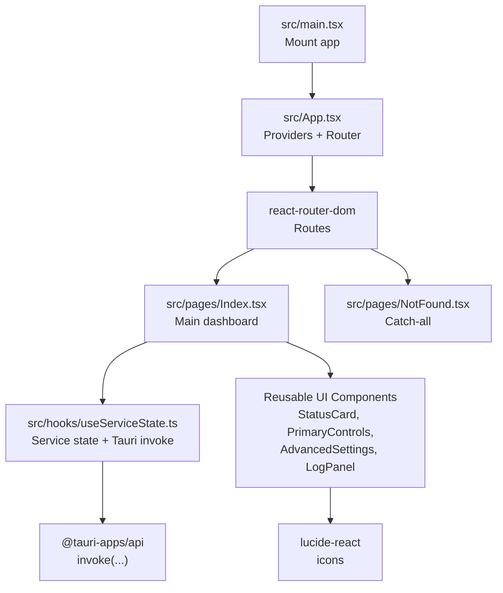
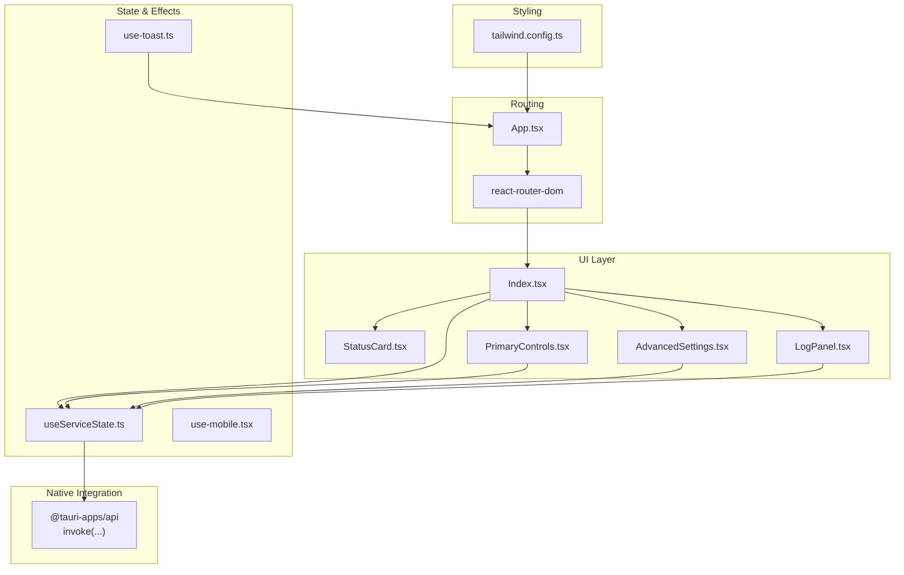
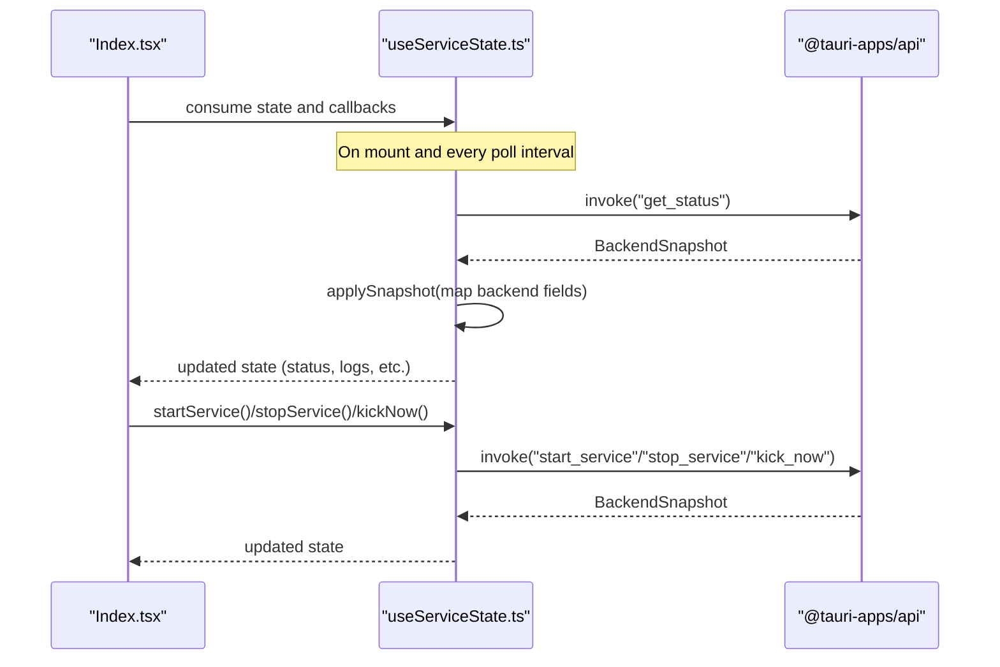
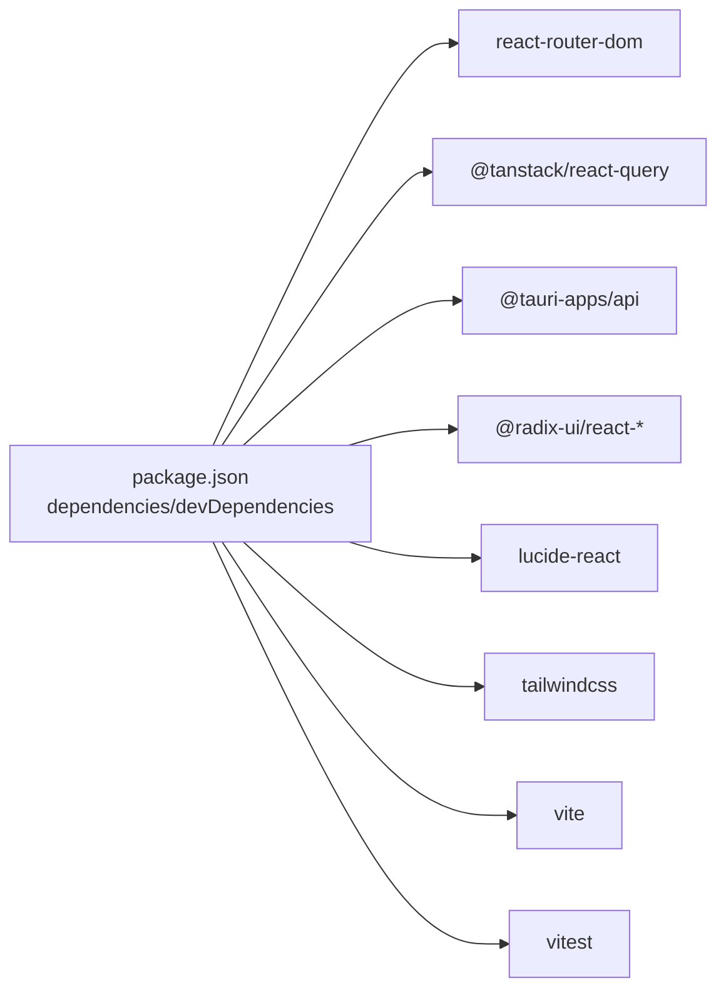

# Frontend Application

<cite>
**Referenced Files in This Document**
- [App.tsx](file://src/App.tsx)
- [main.tsx](file://src/main.tsx)
- [Index.tsx](file://src/pages/Index.tsx)
- [NotFound.tsx](file://src/pages/NotFound.tsx)
- [useServiceState.ts](file://src/hooks/useServiceState.ts)
- [use-mobile.tsx](file://src/hooks/use-mobile.tsx)
- [use-toast.ts](file://src/hooks/use-toast.ts)
- [StatusCard.tsx](file://src/components/StatusCard.tsx)
- [PrimaryControls.tsx](file://src/components/PrimaryControls.tsx)
- [AdvancedSettings.tsx](file://src/components/AdvancedSettings.tsx)
- [LogPanel.tsx](file://src/components/LogPanel.tsx)
- [package.json](file://package.json)
- [tailwind.config.ts](file://tailwind.config.ts)
- [vite.config.ts](file://vite.config.ts)
</cite>

## Table of Contents
1. [Introduction](#introduction)
2. [Project Structure](#project-structure)
3. [Core Components](#core-components)
4. [Architecture Overview](#architecture-overview)
5. [Detailed Component Analysis](#detailed-component-analysis)
6. [Dependency Analysis](#dependency-analysis)
7. [Performance Considerations](#performance-considerations)
8. [Troubleshooting Guide](#troubleshooting-guide)
9. [Conclusion](#conclusion)
10. [Appendices](#appendices)

## Introduction
This document describes the React frontend application for the Hutch-Pulse project. It explains the component hierarchy, state management via React Query and custom hooks, routing configuration, and the styling system powered by Tailwind CSS. It also covers integration with the Tauri backend, event handling patterns, performance optimization techniques, and best practices for extending the UI layer.

## Project Structure
The frontend is organized into pages, components, hooks, and shared utilities. The application bootstraps via Vite, configures Tailwind CSS, and integrates Tauri APIs for native capabilities.

**Diagram sources**
- [main.tsx](file://src/main.tsx#L1-L10)
- [App.tsx](file://src/App.tsx#L1-L28)
- [Index.tsx](file://src/pages/Index.tsx#L1-L55)
- [NotFound.tsx](file://src/pages/NotFound.tsx#L1-L25)
- [useServiceState.ts](file://src/hooks/useServiceState.ts#L1-L163)

**Section sources**
- [main.tsx](file://src/main.tsx#L1-L10)
- [App.tsx](file://src/App.tsx#L1-L28)
- [vite.config.ts](file://vite.config.ts#L1-L22)
- [tailwind.config.ts](file://tailwind.config.ts#L1-L105)

## Core Components
- App shell and providers:
  - React Query provider for caching and background updates.
  - Tooltip provider for UI affordances.
  - Global toasters (Radix and Sonner) for notifications.
  - Browser router with routes for home and 404 fallback.
- Pages:
  - Index: primary dashboard composing status, controls, settings, logs, and footer.
  - NotFound: simple 404 page with logging and navigation.
- Reusable UI components:
  - StatusCard: displays connectivity and last-kick status.
  - PrimaryControls: start/stop toggles and manual kick button.
  - AdvancedSettings: expandable panel for interval selection and info.
  - LogPanel: recent events display with copy-to-clipboard.
- Custom hooks:
  - useServiceState: orchestrates Tauri backend communication, polling, and state mapping.
  - use-mobile: responsive breakpoint detection.
  - use-toast: toast notification manager with controlled queueing.

**Section sources**
- [App.tsx](file://src/App.tsx#L1-L28)
- [Index.tsx](file://src/pages/Index.tsx#L1-L55)
- [NotFound.tsx](file://src/pages/NotFound.tsx#L1-L25)
- [useServiceState.ts](file://src/hooks/useServiceState.ts#L1-L163)
- [use-mobile.tsx](file://src/hooks/use-mobile.tsx#L1-L20)
- [use-toast.ts](file://src/hooks/use-toast.ts#L1-L187)
- [StatusCard.tsx](file://src/components/StatusCard.tsx#L1-L63)
- [PrimaryControls.tsx](file://src/components/PrimaryControls.tsx#L1-L73)
- [AdvancedSettings.tsx](file://src/components/AdvancedSettings.tsx#L1-L73)
- [LogPanel.tsx](file://src/components/LogPanel.tsx#L1-L52)

## Architecture Overview
The frontend follows a unidirectional data flow:
- The Index page consumes a service state hook that polls the backend via Tauri invoke.
- UI components receive props from the service state and trigger actions via callbacks exposed by the hook.
- Notifications are handled centrally via a toast manager hook.
- Routing is handled by react-router-dom with a catch-all for 404s.

**Diagram sources**
- [App.tsx](file://src/App.tsx#L1-L28)
- [Index.tsx](file://src/pages/Index.tsx#L1-L55)
- [useServiceState.ts](file://src/hooks/useServiceState.ts#L1-L163)
- [StatusCard.tsx](file://src/components/StatusCard.tsx#L1-L63)
- [PrimaryControls.tsx](file://src/components/PrimaryControls.tsx#L1-L73)
- [AdvancedSettings.tsx](file://src/components/AdvancedSettings.tsx#L1-L73)
- [LogPanel.tsx](file://src/components/LogPanel.tsx#L1-L52)
- [use-toast.ts](file://src/hooks/use-toast.ts#L1-L187)
- [tailwind.config.ts](file://tailwind.config.ts#L1-L105)

## Detailed Component Analysis

### App Shell and Providers
- Wraps the entire app with:
  - React Query client provider.
  - Tooltip provider.
  - Global toasts (Radix and Sonner).
  - Browser router with routes:
    - "/" renders the main Index page.
    - "*" renders NotFound.
- Provides a centralized place to add global providers and configure routing.

**Section sources**
- [App.tsx](file://src/App.tsx#L1-L28)

### Main Dashboard (Index)
- Composes:
  - PopoverHeader (from the provided components folder).
  - StatusCard (wifi/internet/last kick).
  - PrimaryControls (start/stop/kick now).
  - AdvancedSettings (interval selector and info).
  - LogPanel (recent events).
  - PopoverFooter (version and quit).
- Uses service state from useServiceState to render current status and pass callbacks for actions.
- Displays a backend connectivity notice when the backend is unavailable.

**Section sources**
- [Index.tsx](file://src/pages/Index.tsx#L1-L55)

### Service State Hook (useServiceState)
Responsibilities:
- Defines types for service status, wifi/internet status, kick interval, and log entries.
- Manages a snapshot of backend state and maps it to UI-friendly types.
- Polls the backend periodically to keep the UI fresh.
- Exposes actions:
  - startService
  - stopService
  - kickNow
  - setKickInterval
  - quitApp
- Handles errors by setting an error message and marks backend connectivity status.

Key behaviors:
- Periodic polling with a fixed interval.
- Converts backend timestamps to Date objects.
- Maps numeric intervals to discrete KickInterval options.
- Uses Tauri invoke to call backend commands.

**Diagram sources**
- [Index.tsx](file://src/pages/Index.tsx#L1-L55)
- [useServiceState.ts](file://src/hooks/useServiceState.ts#L1-L163)

**Section sources**
- [useServiceState.ts](file://src/hooks/useServiceState.ts#L1-L163)

### StatusCard
- Props: wifiStatus, internetStatus, lastKick.
- Renders three rows:
  - Network connectivity (wifi).
  - Internet availability.
  - Last kick time with relative time formatting.
- Uses Lucide icons and conditional styling based on status.

**Section sources**
- [StatusCard.tsx](file://src/components/StatusCard.tsx#L1-L63)

### PrimaryControls
- Props: status, onStart, onStop, onKickNow, errorMessage.
- Renders a single primary action button (Start/Stop) and a secondary "Kick Now" button.
- Disables buttons during transitions (starting/stopping).
- Shows an error banner when present.

**Section sources**
- [PrimaryControls.tsx](file://src/components/PrimaryControls.tsx#L1-L73)

### AdvancedSettings
- Props: kickInterval, onKickIntervalChange.
- Expandable panel with:
  - Fixed kick URL.
  - Kick interval selector with four options.
  - Connectivity check endpoint.
- Uses a chevron icon to toggle visibility and applies smooth animations.

**Section sources**
- [AdvancedSettings.tsx](file://src/components/AdvancedSettings.tsx#L1-L73)

### LogPanel
- Props: logs array.
- Displays recent events with timestamps and messages.
- Provides a copy-to-clipboard action for all logs.

**Section sources**
- [LogPanel.tsx](file://src/components/LogPanel.tsx#L1-L52)

### Toast Manager (use-toast)
- Centralized toast notifications with:
  - Limiting concurrent toasts.
  - Auto-dismiss timers per toast.
  - Actions to add, update, dismiss, and remove toasts.
- Provides a hook to consume and control toasts across the app.

**Section sources**
- [use-toast.ts](file://src/hooks/use-toast.ts#L1-L187)

### Responsive Hook (use-mobile)
- Detects mobile viewport using a media query and a breakpoint constant.
- Returns a boolean indicating mobile layout needs.

**Section sources**
- [use-mobile.tsx](file://src/hooks/use-mobile.tsx#L1-L20)

## Dependency Analysis
- Routing and navigation:
  - react-router-dom powers routes and location-based logging in NotFound.
- State management:
  - React Query provider is declared in App; custom hooks manage service state and toasts.
- Styling:
  - Tailwind CSS configured with dark mode, custom shadows, radii, and color tokens.
- Native integration:
  - @tauri-apps/api is used to invoke backend commands.
- Build and tooling:
  - Vite with React plugin and path aliasing.
  - ESLint, Vitest, and Tailwind plugins.

**Diagram sources**
- [package.json](file://package.json#L1-L96)

**Section sources**
- [package.json](file://package.json#L1-L96)
- [tailwind.config.ts](file://tailwind.config.ts#L1-L105)
- [vite.config.ts](file://vite.config.ts#L1-L22)

## Performance Considerations
- Polling cadence:
  - The service state hook polls at a fixed interval. Adjust the interval to balance responsiveness and resource usage.
- Rendering optimization:
  - Memoize derived values (e.g., formatted timestamps) outside of render-heavy loops.
  - Prefer shallow comparisons for props to avoid unnecessary re-renders.
- Toast queueing:
  - Limit concurrent toasts to reduce DOM churn and improve perceived performance.
- Styling:
  - Tailwind’s JIT and purging minimize bundle size; ensure content globs cover all component paths.
- Build:
  - Vite provides fast HMR and optimized builds; enable production optimizations for release.

[No sources needed since this section provides general guidance]

## Troubleshooting Guide
- Backend connectivity:
  - When the backend is unreachable, the UI shows a notice. Verify the app is running under Tauri desktop runtime.
- Error messages:
  - The service state hook captures errors from Tauri calls and surfaces them in the UI. Check the error banner in PrimaryControls.
- 404 handling:
  - NotFound logs the attempted path and provides a link back to the home page.
- Toasts not appearing:
  - Ensure the toast provider is mounted in the app shell and that the use-toast hook is used correctly.

**Section sources**
- [Index.tsx](file://src/pages/Index.tsx#L39-L43)
- [useServiceState.ts](file://src/hooks/useServiceState.ts#L109-L152)
- [NotFound.tsx](file://src/pages/NotFound.tsx#L7-L9)
- [use-toast.ts](file://src/hooks/use-toast.ts#L1-L187)

## Conclusion
The frontend is structured around a clean separation of concerns: routing and providers in App, a focused dashboard in Index, and reusable UI components. State orchestration is centralized in a custom hook that communicates with the Tauri backend, while Tailwind CSS provides a consistent, themeable design system. The toast manager centralizes notifications, and responsive utilities support adaptive layouts.

[No sources needed since this section summarizes without analyzing specific files]

## Appendices

### Styling System with Tailwind CSS
- Dark mode enabled via class strategy.
- Custom shadows, border radii, and semantic color tokens.
- Font families and animation presets extended for consistent UX.
- Content scanning targets pages, components, app, and src directories.

**Section sources**
- [tailwind.config.ts](file://tailwind.config.ts#L1-L105)

### Routing Configuration
- Single-page app with react-router-dom.
- Home route renders the main dashboard.
- Catch-all route renders a 404 page with error logging.

**Section sources**
- [App.tsx](file://src/App.tsx#L16-L21)
- [NotFound.tsx](file://src/pages/NotFound.tsx#L1-L25)

### Tauri Integration Patterns
- useServiceState invokes backend commands by name and expects a snapshot response.
- The hook maps backend timestamps and enums to UI-friendly types.
- Quit action triggers a shutdown command.

**Section sources**
- [useServiceState.ts](file://src/hooks/useServiceState.ts#L88-L152)

### Component Composition Patterns
- Presentational components accept props and render visuals.
- Container components (like Index) orchestrate data fetching and pass callbacks.
- Compound components (e.g., AdvancedSettings) encapsulate expand/collapse behavior.

**Section sources**
- [Index.tsx](file://src/pages/Index.tsx#L1-L55)
- [AdvancedSettings.tsx](file://src/components/AdvancedSettings.tsx#L17-L72)

### Prop Interfaces and Types
- ServiceStatus, WifiStatus, InternetStatus, KickInterval, LogEntry, BackendSnapshot, ServiceState.
- Props for StatusCard, PrimaryControls, AdvancedSettings, LogPanel reflect the service state and actions.

**Section sources**
- [useServiceState.ts](file://src/hooks/useServiceState.ts#L4-L40)
- [StatusCard.tsx](file://src/components/StatusCard.tsx#L4-L8)
- [PrimaryControls.tsx](file://src/components/PrimaryControls.tsx#L4-L10)
- [AdvancedSettings.tsx](file://src/components/AdvancedSettings.tsx#L5-L8)
- [LogPanel.tsx](file://src/components/LogPanel.tsx#L4-L6)

### Best Practices for Extending the UI Layer
- Keep presentational components pure and props-driven.
- Encapsulate async operations in custom hooks to isolate side effects.
- Use Tailwind utilities consistently and leverage semantic tokens for theming.
- Add unit tests for hooks and small components using Vitest and React Testing Library.
- Document component APIs with TypeScript interfaces and keep prop contracts stable.

[No sources needed since this section provides general guidance]