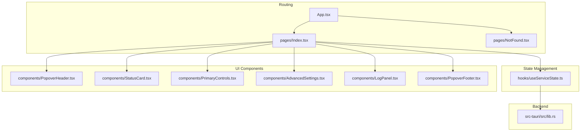
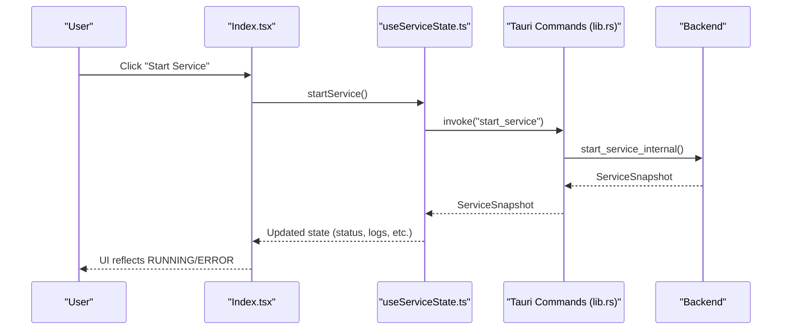
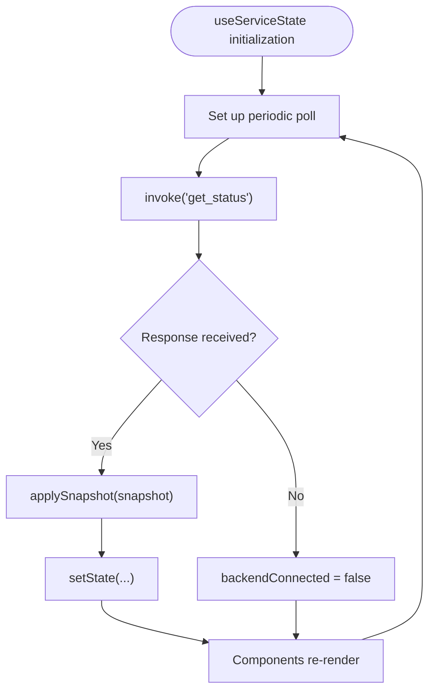
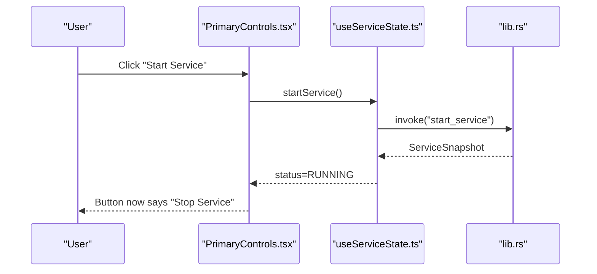
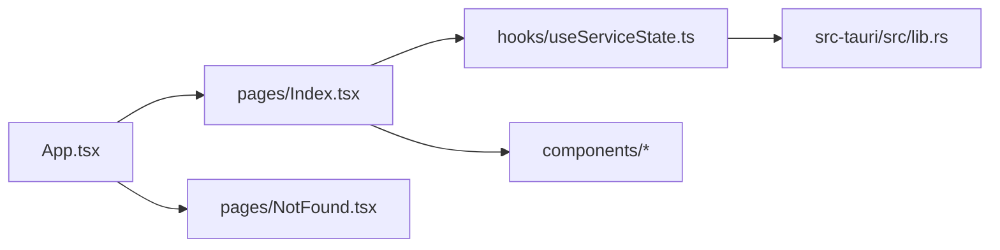

# Page Components

<cite>
**Referenced Files in This Document**
- [Index.tsx](file://src/pages/Index.tsx)
- [NotFound.tsx](file://src/pages/NotFound.tsx)
- [useServiceState.ts](file://src/hooks/useServiceState.ts)
- [App.tsx](file://src/App.tsx)
- [StatusCard.tsx](file://src/components/StatusCard.tsx)
- [PrimaryControls.tsx](file://src/components/PrimaryControls.tsx)
- [AdvancedSettings.tsx](file://src/components/AdvancedSettings.tsx)
- [LogPanel.tsx](file://src/components/LogPanel.tsx)
- [PopoverHeader.tsx](file://src/components/PopoverHeader.tsx)
- [PopoverFooter.tsx](file://src/components/PopoverFooter.tsx)
- [lib.rs](file://src-tauri/src/lib.rs)
- [main.tsx](file://src/main.tsx)
</cite>

## Table of Contents
1. [Introduction](#introduction)
2. [Project Structure](#project-structure)
3. [Core Components](#core-components)
4. [Architecture Overview](#architecture-overview)
5. [Detailed Component Analysis](#detailed-component-analysis)
6. [Dependency Analysis](#dependency-analysis)
7. [Performance Considerations](#performance-considerations)
8. [Troubleshooting Guide](#troubleshooting-guide)
9. [Conclusion](#conclusion)

## Introduction
This document focuses on the page-level components of the application, specifically the main Index.tsx page and the NotFound.tsx error handler. It explains the layout, status display, and control panels, and documents how they integrate with the service state management hook. It also covers component composition patterns, prop interfaces, state management integration, and user interaction flows. Examples of page rendering, conditional displays, and integration with the service state management hook are included.

## Project Structure
The page-level components live under src/pages and are wired into the routing system via App.tsx. The Index page composes several UI components and integrates with a custom React hook that bridges to the Tauri backend. NotFound.tsx handles unmatched routes and logs the attempted path for diagnostics.

**Diagram sources**
- [App.tsx](file://src/App.tsx#L11-L25)
- [Index.tsx](file://src/pages/Index.tsx#L9-L52)
- [useServiceState.ts](file://src/hooks/useServiceState.ts#L67-L162)
- [PopoverHeader.tsx](file://src/components/PopoverHeader.tsx#L15-L31)
- [StatusCard.tsx](file://src/components/StatusCard.tsx#L19-L62)
- [PrimaryControls.tsx](file://src/components/PrimaryControls.tsx#L12-L72)
- [AdvancedSettings.tsx](file://src/components/AdvancedSettings.tsx#L17-L72)
- [LogPanel.tsx](file://src/components/LogPanel.tsx#L12-L51)
- [PopoverFooter.tsx](file://src/components/PopoverFooter.tsx#L6-L20)
- [lib.rs](file://src-tauri/src/lib.rs#L599-L656)

**Section sources**
- [App.tsx](file://src/App.tsx#L11-L25)
- [main.tsx](file://src/main.tsx#L1-L10)

## Core Components
- Index.tsx: The main application page that renders the header, status card, primary controls, advanced settings, log panel, and footer. It reads state from useServiceState and passes callbacks to control the service lifecycle and settings.
- NotFound.tsx: A minimal 404 page that logs the attempted path and provides a link to return home.

Key integration points:
- useServiceState provides reactive state and action methods (start, stop, kick, set interval, quit).
- Tauri commands are invoked via @tauri-apps/api to fetch status snapshots and mutate service state.

**Section sources**
- [Index.tsx](file://src/pages/Index.tsx#L9-L52)
- [NotFound.tsx](file://src/pages/NotFound.tsx#L4-L24)
- [useServiceState.ts](file://src/hooks/useServiceState.ts#L67-L162)
- [lib.rs](file://src-tauri/src/lib.rs#L599-L656)

## Architecture Overview
The page-level components follow a unidirectional data flow:
- The Index page subscribes to state updates via useServiceState.
- User actions trigger callbacks that invoke Tauri commands.
- The backend responds with a snapshot that the hook applies to update local state.
- UI components re-render based on the updated state.

**Diagram sources**
- [Index.tsx](file://src/pages/Index.tsx#L26-L32)
- [useServiceState.ts](file://src/hooks/useServiceState.ts#L109-L116)
- [lib.rs](file://src-tauri/src/lib.rs#L605-L610)

## Detailed Component Analysis

### Index.tsx: Main Application Page
- Layout: Full-screen container with a card-like inner layout, header, divider, content area, and footer.
- Status display: PopoverHeader shows current service status with a dot indicator and label.
- Control panels:
  - StatusCard shows Wi-Fi, Internet, and Last Kick status.
  - PrimaryControls toggles Start/Stop, shows loading states, and exposes a manual Kick Now action.
  - AdvancedSettings allows changing the kick interval and shows static info.
  - LogPanel lists recent events and supports copying logs.
- Conditional rendering:
  - A destructively styled banner appears when backendConnected is false, instructing the user to run under Tauri.
- Footer: PopoverFooter shows version and a Quit action.

Prop interfaces and integration:
- Props are passed from useServiceState to child components (e.g., StatusCard receives wifiStatus, internetStatus, lastKick).
- Callbacks are passed down for user actions (onStart, onStop, onKickNow, onKickIntervalChange, onQuit).

Rendering patterns:
- Flex layout with a flexible content region and fixed header/footer regions.
- Conditional banner below controls when backend is unavailable.

Integration with service state:
- useServiceState manages polling, applying snapshots, and exposing action methods.

**Section sources**
- [Index.tsx](file://src/pages/Index.tsx#L9-L52)
- [PopoverHeader.tsx](file://src/components/PopoverHeader.tsx#L15-L31)
- [StatusCard.tsx](file://src/components/StatusCard.tsx#L19-L62)
- [PrimaryControls.tsx](file://src/components/PrimaryControls.tsx#L12-L72)
- [AdvancedSettings.tsx](file://src/components/AdvancedSettings.tsx#L17-L72)
- [LogPanel.tsx](file://src/components/LogPanel.tsx#L12-L51)
- [PopoverFooter.tsx](file://src/components/PopoverFooter.tsx#L6-L20)
- [useServiceState.ts](file://src/hooks/useServiceState.ts#L67-L162)

### NotFound.tsx: Error Handling and Route Management
- Purpose: Handles unmatched routes by logging the attempted path and rendering a friendly 404 page.
- Behavior: Uses react-router-dom’s useLocation to capture the pathname and useEffect to log it. Provides a link back to the home route.

User interaction flow:
- User navigates to a non-existent route.
- NotFound renders the 404 UI and logs the path for diagnostics.

**Section sources**
- [NotFound.tsx](file://src/pages/NotFound.tsx#L4-L24)
- [App.tsx](file://src/App.tsx#L17-L20)

### Component Composition Patterns
- Composition over inheritance: Each page component composes smaller presentational components and passes props.
- Single responsibility: Each component encapsulates a single concern (header, status, controls, settings, logs, footer).
- Prop contracts: Strongly typed props define the interface between parent and children.

Examples:
- Index.tsx composes PopoverHeader, StatusCard, PrimaryControls, AdvancedSettings, LogPanel, and PopoverFooter.
- PrimaryControls conditionally renders an error message and disables buttons based on status.

**Section sources**
- [Index.tsx](file://src/pages/Index.tsx#L15-L48)
- [PrimaryControls.tsx](file://src/components/PrimaryControls.tsx#L25-L29)

### State Management Integration with useServiceState
- State shape: Includes status, Wi-Fi and Internet connectivity, last kick time, kick interval, logs, error messages, and a flag indicating backend connectivity.
- Actions: startService, stopService, kickNow, setKickInterval, quitApp.
- Polling: Periodic refreshStatus invokes a Tauri command to fetch a snapshot and update state.
- Backend integration: All actions call Tauri commands; snapshots are mapped to the internal state.

**Diagram sources**
- [useServiceState.ts](file://src/hooks/useServiceState.ts#L88-L107)
- [lib.rs](file://src-tauri/src/lib.rs#L599-L602)

**Section sources**
- [useServiceState.ts](file://src/hooks/useServiceState.ts#L67-L162)
- [lib.rs](file://src-tauri/src/lib.rs#L599-L656)

### User Interaction Flows
- Start/Stop toggling:
  - PrimaryControls triggers startService or stopService depending on current status.
  - UI reflects STARTING/STOPPING states with spinners and disabled controls.
- Manual kick:
  - Kick Now is enabled only when running; invokes kickNow which calls the backend command.
- Settings change:
  - AdvancedSettings triggers setKickInterval with a selected value; backend enforces a minimum interval.
- Quit:
  - PopoverFooter triggers quitApp which exits the application.

**Diagram sources**
- [PrimaryControls.tsx](file://src/components/PrimaryControls.tsx#L32-L40)
- [useServiceState.ts](file://src/hooks/useServiceState.ts#L109-L116)
- [lib.rs](file://src-tauri/src/lib.rs#L605-L610)

**Section sources**
- [PrimaryControls.tsx](file://src/components/PrimaryControls.tsx#L12-L72)
- [AdvancedSettings.tsx](file://src/components/AdvancedSettings.tsx#L17-L72)
- [PopoverFooter.tsx](file://src/components/PopoverFooter.tsx#L6-L20)
- [useServiceState.ts](file://src/hooks/useServiceState.ts#L136-L152)
- [lib.rs](file://src-tauri/src/lib.rs#L644-L656)

### Conditional Displays
- Backend availability banner:
  - Shown when backendConnected is false, prompting the user to run under Tauri.
- Error message display:
  - Rendered inside PrimaryControls when an action fails.
- Disabled states:
  - Buttons are disabled during STARTING/STOPPING transitions.

**Section sources**
- [Index.tsx](file://src/pages/Index.tsx#L39-L43)
- [PrimaryControls.tsx](file://src/components/PrimaryControls.tsx#L25-L29)
- [PrimaryControls.tsx](file://src/components/PrimaryControls.tsx#L34-L35)

## Dependency Analysis
- Index.tsx depends on:
  - useServiceState for state and actions.
  - Child components for UI rendering.
- useServiceState depends on:
  - Tauri invoke for backend commands.
  - React state and effects for polling and updates.
- NotFound.tsx depends on:
  - react-router-dom for location and navigation cues.
- App.tsx orchestrates routing and wraps the app with providers.

**Diagram sources**
- [Index.tsx](file://src/pages/Index.tsx#L9-L52)
- [useServiceState.ts](file://src/hooks/useServiceState.ts#L67-L162)
- [lib.rs](file://src-tauri/src/lib.rs#L599-L656)
- [App.tsx](file://src/App.tsx#L11-L25)

**Section sources**
- [App.tsx](file://src/App.tsx#L11-L25)
- [Index.tsx](file://src/pages/Index.tsx#L9-L52)
- [useServiceState.ts](file://src/hooks/useServiceState.ts#L67-L162)
- [lib.rs](file://src-tauri/src/lib.rs#L599-L656)

## Performance Considerations
- Polling interval: The hook polls at a fixed interval; adjust POLL_INTERVAL_MS thoughtfully to balance responsiveness and resource usage.
- Rendering cost: LogPanel maps over potentially long arrays; consider virtualization for very large log sets.
- Backend connectivity: When backendConnected is false, avoid unnecessary polling or show a simplified UI to reduce overhead.

## Troubleshooting Guide
- Backend unavailable banner:
  - Occurs when invoking backend commands fails. Ensure the app runs under Tauri desktop runtime.
- Action errors:
  - Errors from start/stop/kick/setInterval are captured and surfaced as error messages in PrimaryControls.
- 404 handling:
  - NotFound logs the attempted path and provides a link back to the home page.

**Section sources**
- [Index.tsx](file://src/pages/Index.tsx#L39-L43)
- [PrimaryControls.tsx](file://src/components/PrimaryControls.tsx#L25-L29)
- [NotFound.tsx](file://src/pages/NotFound.tsx#L7-L9)
- [useServiceState.ts](file://src/hooks/useServiceState.ts#L92-L98)

## Conclusion
The page-level components provide a cohesive, reactive interface for managing and observing the service state. Index.tsx composes focused UI elements and integrates tightly with useServiceState, which bridges to the Tauri backend via typed commands. NotFound.tsx ensures graceful handling of invalid routes. Together, they form a clear, maintainable pattern for page-level composition, state management, and user interaction.