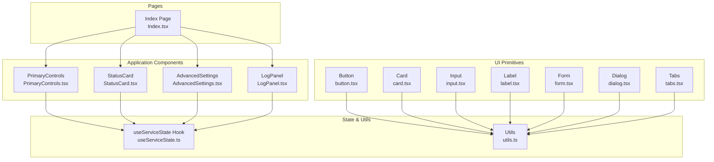
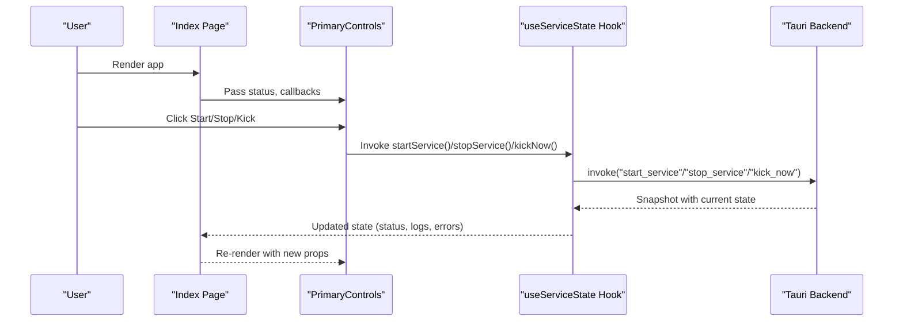
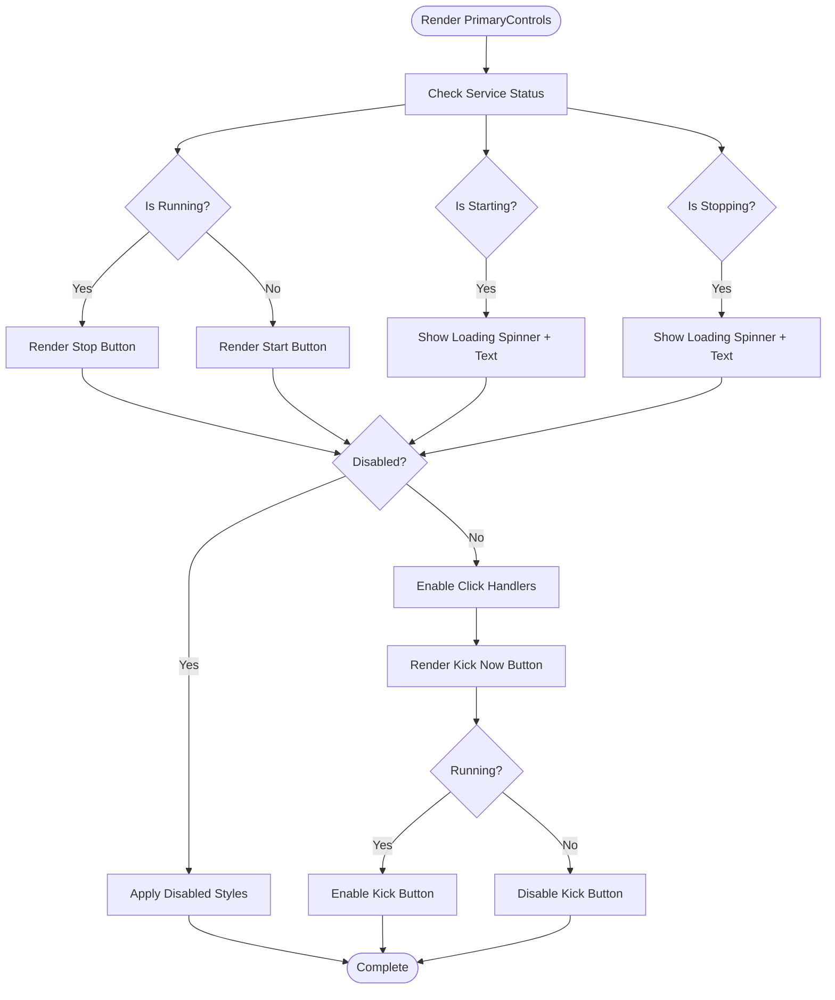
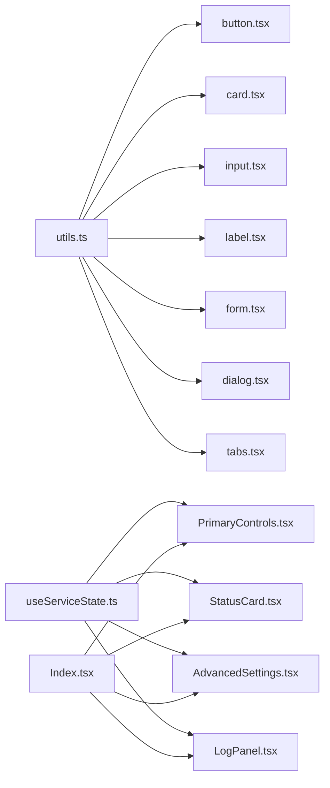
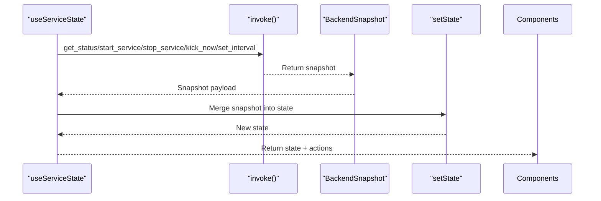

# UI Components

<cite>
**Referenced Files in This Document**
- [button.tsx](file://src/components/ui/button.tsx)
- [card.tsx](file://src/components/ui/card.tsx)
- [input.tsx](file://src/components/ui/input.tsx)
- [label.tsx](file://src/components/ui/label.tsx)
- [form.tsx](file://src/components/ui/form.tsx)
- [dialog.tsx](file://src/components/ui/dialog.tsx)
- [tabs.tsx](file://src/components/ui/tabs.tsx)
- [PrimaryControls.tsx](file://src/components/PrimaryControls.tsx)
- [StatusCard.tsx](file://src/components/StatusCard.tsx)
- [AdvancedSettings.tsx](file://src/components/AdvancedSettings.tsx)
- [LogPanel.tsx](file://src/components/LogPanel.tsx)
- [useServiceState.ts](file://src/hooks/useServiceState.ts)
- [utils.ts](file://src/lib/utils.ts)
- [Index.tsx](file://src/pages/Index.tsx)
- [App.tsx](file://src/App.tsx)
- [tailwind.config.ts](file://tailwind.config.ts)
</cite>

## Table of Contents
1. [Introduction](#introduction)
2. [Project Structure](#project-structure)
3. [Core Components](#core-components)
4. [Architecture Overview](#architecture-overview)
5. [Detailed Component Analysis](#detailed-component-analysis)
6. [Dependency Analysis](#dependency-analysis)
7. [Performance Considerations](#performance-considerations)
8. [Accessibility Features](#accessibility-features)
9. [Responsive Design](#responsive-design)
10. [Customization and Styling](#customization-and-styling)
11. [Integration with Service State](#integration-with-service-state)
12. [Troubleshooting Guide](#troubleshooting-guide)
13. [Conclusion](#conclusion)

## Introduction
This document provides comprehensive documentation for the UI component library and application-specific components used in the Hutch-Pulse project. It covers Radix UI primitive components (button, card, input, form, dialog, tabs, label) and application-specific components (PrimaryControls, StatusCard, AdvancedSettings, LogPanel). The guide explains component props, interfaces, styling options, usage patterns, accessibility features, responsive design considerations, and performance optimization techniques. It also details how these components integrate with the service state hook to manage real-time application behavior.

## Project Structure
The UI components are organized into two primary categories:
- Radix UI primitive components under src/components/ui/, providing accessible, unstyled primitives with consistent styling via Tailwind CSS and class merging utilities.
- Application-specific components under src/components/, implementing domain-specific UI logic and integrating with the service state hook.

Key supporting files:
- src/lib/utils.ts: Utility for merging Tailwind classes safely.
- src/hooks/useServiceState.ts: Centralized service state management with polling and Tauri backend integration.
- tailwind.config.ts: Tailwind CSS configuration extending design tokens and animations.

**Diagram sources**
- [button.tsx](file://src/components/ui/button.tsx#L1-L48)
- [card.tsx](file://src/components/ui/card.tsx#L1-L44)
- [input.tsx](file://src/components/ui/input.tsx#L1-L23)
- [label.tsx](file://src/components/ui/label.tsx#L1-L18)
- [form.tsx](file://src/components/ui/form.tsx#L1-L130)
- [dialog.tsx](file://src/components/ui/dialog.tsx#L1-L96)
- [tabs.tsx](file://src/components/ui/tabs.tsx#L1-L54)
- [PrimaryControls.tsx](file://src/components/PrimaryControls.tsx#L1-L73)
- [StatusCard.tsx](file://src/components/StatusCard.tsx#L1-L63)
- [AdvancedSettings.tsx](file://src/components/AdvancedSettings.tsx#L1-L73)
- [LogPanel.tsx](file://src/components/LogPanel.tsx#L1-L52)
- [useServiceState.ts](file://src/hooks/useServiceState.ts#L1-L163)
- [utils.ts](file://src/lib/utils.ts#L1-L7)
- [Index.tsx](file://src/pages/Index.tsx#L1-L55)

**Section sources**
- [Index.tsx](file://src/pages/Index.tsx#L1-L55)
- [App.tsx](file://src/App.tsx#L1-L28)
- [tailwind.config.ts](file://tailwind.config.ts#L1-L105)

## Core Components
This section documents the Radix UI primitive components that form the foundation of the UI library.

### Button
- Purpose: Base interactive element with variant and size options.
- Props:
  - Inherits standard button attributes.
  - variant: default, destructive, outline, secondary, ghost, link.
  - size: default, sm, lg, icon.
  - asChild: renders as a slot for composition.
- Styling: Uses class variance authority (CVA) with Tailwind classes; merges via cn utility.
- Accessibility: Preserves focus-visible styles and maintains semantic button behavior.

**Section sources**
- [button.tsx](file://src/components/ui/button.tsx#L1-L48)
- [utils.ts](file://src/lib/utils.ts#L1-L7)

### Card
- Purpose: Container with header, footer, title, description, and content slots.
- Composition:
  - Card: container div with card background and shadow.
  - CardHeader: vertical stack with spacing.
  - CardTitle: heading with size and weight.
  - CardDescription: muted paragraph.
  - CardContent/Footer: flexible layout helpers.
- Styling: Tailwind classes applied via cn; composed through forwardRef.

**Section sources**
- [card.tsx](file://src/components/ui/card.tsx#L1-L44)
- [utils.ts](file://src/lib/utils.ts#L1-L7)

### Input
- Purpose: Text input with consistent focus states and responsive sizing.
- Props: Standard input attributes plus className extension.
- Styling: Responsive typography and focus ring; consistent padding and border.

**Section sources**
- [input.tsx](file://src/components/ui/input.tsx#L1-L23)
- [utils.ts](file://src/lib/utils.ts#L1-L7)

### Label
- Purpose: Associates text with form controls; integrates with form validation.
- Styling: Variants via CVA; peer-disabled cursor and opacity handled.

**Section sources**
- [label.tsx](file://src/components/ui/label.tsx#L1-L18)
- [utils.ts](file://src/lib/utils.ts#L1-L7)

### Form (Form Provider, Field, Label, Control, Description, Message)
- Purpose: Integrates react-hook-form with Radix UI and Tailwind for accessible forms.
- Key APIs:
  - Form: Provider wrapping react-hook-form.
  - FormField: Context provider for field name.
  - useFormField: Accesses field state and ids for accessibility.
  - FormItem: Provides unique ids and spacing.
  - FormLabel: Conditional error styling.
  - FormControl: Attaches aria attributes and ids.
  - FormDescription/FormMessage: Descriptive and error messaging.
- Accessibility: Proper aria-invalid, aria-describedby, and id generation.

**Section sources**
- [form.tsx](file://src/components/ui/form.tsx#L1-L130)

### Dialog
- Purpose: Modal overlay with portal rendering and close controls.
- Composition:
  - Dialog: Root and Trigger.
  - DialogPortal/Overlay: Fullscreen backdrop with animations.
  - DialogContent: Centered grid with close button and sr-only label.
  - DialogHeader/Footer: Layout helpers.
  - DialogTitle/Description: Typography and semantics.
- Animations: Fade and slide transitions keyed by open state.

**Section sources**
- [dialog.tsx](file://src/components/ui/dialog.tsx#L1-L96)
- [utils.ts](file://src/lib/utils.ts#L1-L7)

### Tabs
- Purpose: Tabbed interface with accessible keyboard navigation.
- Composition:
  - Tabs: Root.
  - TabsList: Background and spacing.
  - TabsTrigger: Active state styling and focus behavior.
  - TabsContent: Focus-visible outline and ring.
- Styling: Consistent ring focus and transition effects.

**Section sources**
- [tabs.tsx](file://src/components/ui/tabs.tsx#L1-L54)
- [utils.ts](file://src/lib/utils.ts#L1-L7)

## Architecture Overview
The application composes UI primitives and application-specific components around a centralized service state managed by a hook. The Index page orchestrates component rendering and passes state callbacks to application components.

**Diagram sources**
- [Index.tsx](file://src/pages/Index.tsx#L1-L55)
- [PrimaryControls.tsx](file://src/components/PrimaryControls.tsx#L1-L73)
- [useServiceState.ts](file://src/hooks/useServiceState.ts#L67-L162)

**Section sources**
- [Index.tsx](file://src/pages/Index.tsx#L1-L55)
- [App.tsx](file://src/App.tsx#L1-L28)
- [useServiceState.ts](file://src/hooks/useServiceState.ts#L1-L163)

## Detailed Component Analysis

### PrimaryControls
- Purpose: Unified control panel for service lifecycle and immediate action.
- Props:
  - status: ServiceStatus union for rendering state.
  - onStart/onStop/onKickNow: Callbacks bound to service actions.
  - errorMessage: Optional error display.
- Behavior:
  - Renders a single button toggling Start/Stop with loading states.
  - Kick Now button enabled only when running.
  - Error banner shown when present.
- Styling: Tailwind classes for spacing, colors, borders, and transitions; responsive text sizing.

**Diagram sources**
- [PrimaryControls.tsx](file://src/components/PrimaryControls.tsx#L1-L73)

**Section sources**
- [PrimaryControls.tsx](file://src/components/PrimaryControls.tsx#L1-L73)
- [useServiceState.ts](file://src/hooks/useServiceState.ts#L4-L40)

### StatusCard
- Purpose: Displays connectivity and timing status with color-coded indicators.
- Props:
  - wifiStatus: WifiStatus union.
  - internetStatus: InternetStatus union.
  - lastKick: Date or null.
- Behavior:
  - Computes derived values for connected/online states.
  - Formats relative time for last kick.
- Styling: Icon alignment, muted labels, and conditional text colors.

**Section sources**
- [StatusCard.tsx](file://src/components/StatusCard.tsx#L1-L63)
- [useServiceState.ts](file://src/hooks/useServiceState.ts#L4-L40)

### AdvancedSettings
- Purpose: Collapsible advanced configuration panel with interval selection.
- Props:
  - kickInterval: KickInterval union.
  - onKickIntervalChange: Handler to update interval.
- Behavior:
  - Toggle visibility with animated expansion.
  - Renders fixed interval options and informational URLs.
- Styling: Glass surface effect, subtle animations, and monospace typography for technical details.

**Section sources**
- [AdvancedSettings.tsx](file://src/components/AdvancedSettings.tsx#L1-L73)
- [useServiceState.ts](file://src/hooks/useServiceState.ts#L7-L8)

### LogPanel
- Purpose: Displays recent log entries with copy-to-clipboard functionality.
- Props:
  - logs: Array of LogEntry with id, message, timestamp.
- Behavior:
  - Formats timestamps to HH:mm:ss.
  - Copies concatenated logs to clipboard.
  - Handles empty state with placeholder text.
- Styling: Monospace font for timestamps, muted and foreground text contrast.

**Section sources**
- [LogPanel.tsx](file://src/components/LogPanel.tsx#L1-L52)
- [useServiceState.ts](file://src/hooks/useServiceState.ts#L9-L19)

### Integration with UI Primitives
- Buttons and Inputs: Used within application components for actions and inputs.
- Cards: Used for grouping related UI sections (e.g., StatusCard).
- Forms: Integrated via form primitives for validation and accessibility.
- Dialog/Tabs: Available for modal and tabbed layouts as needed.

**Section sources**
- [button.tsx](file://src/components/ui/button.tsx#L1-L48)
- [input.tsx](file://src/components/ui/input.tsx#L1-L23)
- [card.tsx](file://src/components/ui/card.tsx#L1-L44)
- [form.tsx](file://src/components/ui/form.tsx#L1-L130)
- [dialog.tsx](file://src/components/ui/dialog.tsx#L1-L96)
- [tabs.tsx](file://src/components/ui/tabs.tsx#L1-L54)

## Dependency Analysis
The component library exhibits low coupling and high cohesion:
- UI primitives depend on Radix UI and Tailwind utilities via a shared cn utility.
- Application components depend on the service state hook for data and actions.
- The Index page composes application components and passes state-derived props.

**Diagram sources**
- [utils.ts](file://src/lib/utils.ts#L1-L7)
- [button.tsx](file://src/components/ui/button.tsx#L1-L48)
- [card.tsx](file://src/components/ui/card.tsx#L1-L44)
- [input.tsx](file://src/components/ui/input.tsx#L1-L23)
- [label.tsx](file://src/components/ui/label.tsx#L1-L18)
- [form.tsx](file://src/components/ui/form.tsx#L1-L130)
- [dialog.tsx](file://src/components/ui/dialog.tsx#L1-L96)
- [tabs.tsx](file://src/components/ui/tabs.tsx#L1-L54)
- [useServiceState.ts](file://src/hooks/useServiceState.ts#L1-L163)
- [PrimaryControls.tsx](file://src/components/PrimaryControls.tsx#L1-L73)
- [StatusCard.tsx](file://src/components/StatusCard.tsx#L1-L63)
- [AdvancedSettings.tsx](file://src/components/AdvancedSettings.tsx#L1-L73)
- [LogPanel.tsx](file://src/components/LogPanel.tsx#L1-L52)
- [Index.tsx](file://src/pages/Index.tsx#L1-L55)

**Section sources**
- [utils.ts](file://src/lib/utils.ts#L1-L7)
- [useServiceState.ts](file://src/hooks/useServiceState.ts#L1-L163)
- [Index.tsx](file://src/pages/Index.tsx#L1-L55)

## Performance Considerations
- Memoization: The service state hook uses useCallback for action handlers to prevent unnecessary re-renders.
- Polling: A fixed polling interval updates state periodically; consider debouncing or adaptive intervals for heavy workloads.
- Rendering: Application components conditionally render based on state; avoid rendering heavy subtrees when hidden.
- Class Merging: The cn utility merges classes efficiently; minimize redundant class concatenation.
- Animations: Dialog and tabs use CSS transitions; keep animation durations reasonable for responsiveness.

[No sources needed since this section provides general guidance]

## Accessibility Features
- Focus Management: Buttons and form controls preserve focus-visible outlines and rings.
- ARIA Attributes: Form components attach aria-invalid and aria-describedby dynamically based on field state.
- Semantic HTML: Headings, paragraphs, and labels use appropriate elements.
- Keyboard Navigation: Tabs and dialogs support keyboard activation and focus trapping via Radix UI.
- Screen Reader: Icons include sr-only labels where applicable (e.g., Dialog close button).

**Section sources**
- [button.tsx](file://src/components/ui/button.tsx#L1-L48)
- [form.tsx](file://src/components/ui/form.tsx#L85-L99)
- [dialog.tsx](file://src/components/ui/dialog.tsx#L45-L48)

## Responsive Design
- Typography: Input and text sizes adapt with responsive breakpoints.
- Spacing: Consistent padding and gap utilities scale across devices.
- Layout: Flexbox and gap utilities create adaptive column layouts.
- Animations: Slide and fade transitions enhance mobile usability.

**Section sources**
- [input.tsx](file://src/components/ui/input.tsx#L1-L23)
- [tailwind.config.ts](file://tailwind.config.ts#L1-L105)

## Customization and Styling
- Tailwind Classes: All components accept className prop; pass additional classes to override defaults.
- Variants: Button and Label expose variant options for consistent theming.
- Utilities: Use cn to merge classes safely; avoid conflicting Tailwind utilities.
- Design Tokens: Extend Tailwind theme colors, radii, shadows, and fonts to match brand guidelines.

**Section sources**
- [button.tsx](file://src/components/ui/button.tsx#L1-L48)
- [label.tsx](file://src/components/ui/label.tsx#L1-L18)
- [utils.ts](file://src/lib/utils.ts#L1-L7)
- [tailwind.config.ts](file://tailwind.config.ts#L1-L105)

## Integration with Service State
- Data Flow: useServiceState manages backend snapshots and exposes actions to mutate state.
- Props Passing: The Index page forwards state and callbacks to application components.
- Error Handling: Errors are surfaced as messages and can trigger UI warnings.
- Backend Connectivity: A flag indicates backend availability; UI adapts accordingly.

**Diagram sources**
- [useServiceState.ts](file://src/hooks/useServiceState.ts#L67-L162)

**Section sources**
- [useServiceState.ts](file://src/hooks/useServiceState.ts#L1-L163)
- [Index.tsx](file://src/pages/Index.tsx#L1-L55)

## Troubleshooting Guide
- No Backend Available: When backendConnected is false, display a clear message advising to run with the Tauri desktop runtime.
- Action Failures: Errors from backend invocations are captured and stored as errorMessage; display a visible banner and consider retry mechanisms.
- Polling Issues: If state does not update, verify the polling interval and backend health.
- Form Validation: Ensure useFormField is used within FormField/Form contexts; missing context will cause errors.

**Section sources**
- [Index.tsx](file://src/pages/Index.tsx#L39-L43)
- [useServiceState.ts](file://src/hooks/useServiceState.ts#L92-L98)
- [form.tsx](file://src/components/ui/form.tsx#L40-L42)

## Conclusion
The UI component library combines accessible Radix UI primitives with Tailwind-driven styling and application-specific components that integrate tightly with a centralized service state. By leveraging variants, className extension, and proper accessibility attributes, the components offer a consistent, customizable, and responsive user experience. The architecture supports maintainability, performance, and scalability for future enhancements.