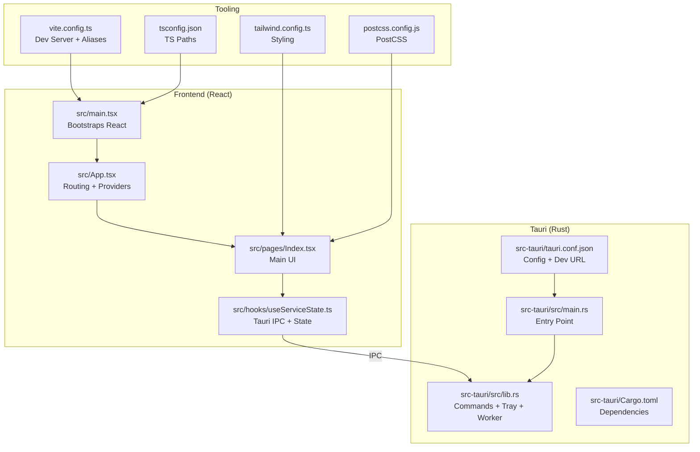
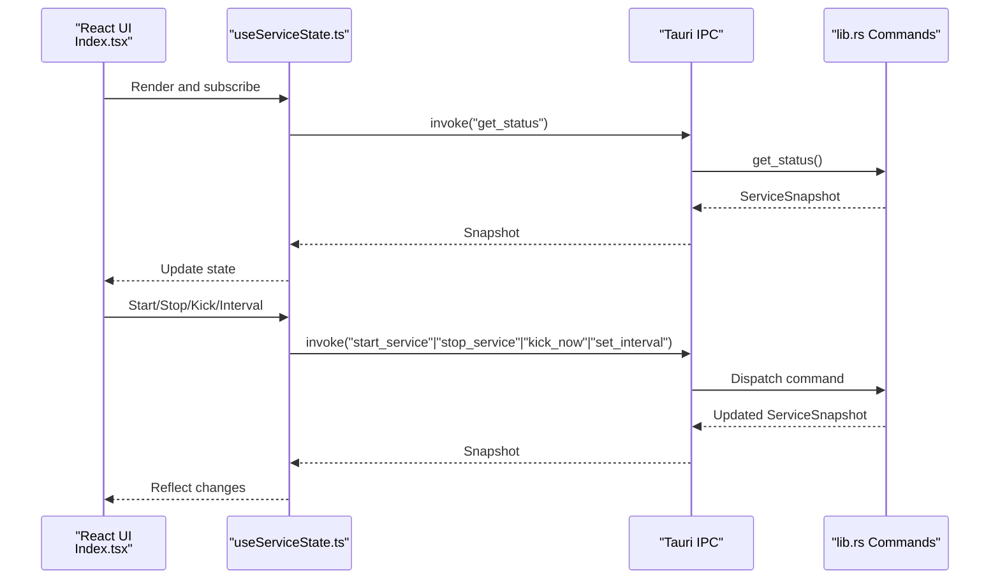

# Getting Started

<cite>
**Referenced Files in This Document**
- [README.md](file://README.md)
- [package.json](file://package.json)
- [vite.config.ts](file://vite.config.ts)
- [src-tauri/tauri.conf.json](file://src-tauri/tauri.conf.json)
- [src-tauri/Cargo.toml](file://src-tauri/Cargo.toml)
- [src-tauri/src/lib.rs](file://src-tauri/src/lib.rs)
- [src-tauri/src/main.rs](file://src-tauri/src/main.rs)
- [src/App.tsx](file://src/App.tsx)
- [src/main.tsx](file://src/main.tsx)
- [src/pages/Index.tsx](file://src/pages/Index.tsx)
- [src/hooks/useServiceState.ts](file://src/hooks/useServiceState.ts)
- [tailwind.config.ts](file://tailwind.config.ts)
- [tsconfig.json](file://tsconfig.json)
- [postcss.config.js](file://postcss.config.js)
</cite>

## Table of Contents
1. [Introduction](#introduction)
2. [Project Structure](#project-structure)
3. [Core Components](#core-components)
4. [Architecture Overview](#architecture-overview)
5. [Installation and Setup](#installation-and-setup)
6. [Development Environment](#development-environment)
7. [Building From Source](#building-from-source)
8. [Running the Application](#running-the-application)
9. [Usage Instructions](#usage-instructions)
10. [Troubleshooting](#troubleshooting)
11. [Verification Checklist](#verification-checklist)
12. [Conclusion](#conclusion)

## Introduction
Hutch-Pulse is a Windows tray application built with Tauri (Rust) and React (TypeScript). It periodically sends lightweight requests to keep your Hutch self-care page active, improving connection responsiveness during intermittent Wi-Fi or internet drops. The app runs in the system tray, provides real-time status, and offers manual controls and advanced settings.

## Project Structure
The project follows a hybrid desktop architecture:
- Frontend: React + TypeScript + Vite (Serves the UI)
- Backend: Tauri (Rust) with Tokio async runtime
- Styling: Tailwind CSS via PostCSS
- State management: React Query for data fetching and caching
- UI components: shadcn/ui with Radix UI primitives

**Diagram sources**
- [src/main.tsx](file://src/main.tsx#L1-L10)
- [src/App.tsx](file://src/App.tsx#L1-L28)
- [src/pages/Index.tsx](file://src/pages/Index.tsx#L1-L55)
- [src/hooks/useServiceState.ts](file://src/hooks/useServiceState.ts#L1-L163)
- [src-tauri/src/main.rs](file://src-tauri/src/main.rs#L1-L7)
- [src-tauri/src/lib.rs](file://src-tauri/src/lib.rs#L1-L686)
- [src-tauri/Cargo.toml](file://src-tauri/Cargo.toml#L1-L29)
- [src-tauri/tauri.conf.json](file://src-tauri/tauri.conf.json#L1-L42)
- [vite.config.ts](file://vite.config.ts#L1-L22)
- [tailwind.config.ts](file://tailwind.config.ts#L1-L105)
- [postcss.config.js](file://postcss.config.js#L1-L7)
- [tsconfig.json](file://tsconfig.json#L1-L17)

**Section sources**
- [README.md](file://README.md#L22-L50)
- [src-tauri/tauri.conf.json](file://src-tauri/tauri.conf.json#L6-L11)
- [vite.config.ts](file://vite.config.ts#L1-L22)

## Core Components
- Tauri backend commands expose service control and status to the frontend:
  - get_status: fetch current state and logs
  - start_service / stop_service: manage the periodic kicker
  - kick_now: manual trigger
  - set_interval: configure kick frequency
  - quit_app: exit the app
- Rust tray icon with context menu supports left-click to toggle UI and menu actions.
- Async worker loop checks Wi-Fi and internet connectivity, performs kicks, and updates state.
- Frontend uses React Query providers and React Router for routing.

**Section sources**
- [src-tauri/src/lib.rs](file://src-tauri/src/lib.rs#L599-L656)
- [src/hooks/useServiceState.ts](file://src/hooks/useServiceState.ts#L67-L163)
- [src/App.tsx](file://src/App.tsx#L1-L28)

## Architecture Overview
The desktop app integrates a Rust backend with a React frontend via Tauri’s IPC. The frontend polls backend state and invokes commands to control the service.

**Diagram sources**
- [src/pages/Index.tsx](file://src/pages/Index.tsx#L1-L55)
- [src/hooks/useServiceState.ts](file://src/hooks/useServiceState.ts#L88-L144)
- [src-tauri/src/lib.rs](file://src-tauri/src/lib.rs#L599-L656)

## Installation and Setup
- Supported platforms: Windows 10/11
- Prerequisites:
  - Node.js 18+ (for frontend toolchain)
  - Rust stable (for Tauri/Rust backend)
- Clone and install:
  - Clone the repository
  - Install dependencies
- Development launch:
  - Run Tauri dev to start both frontend and backend

**Section sources**
- [README.md](file://README.md#L70-L92)
- [package.json](file://package.json#L6-L16)

## Development Environment
- Node.js 18+ and npm are required for the React/Vite frontend.
- Rust stable toolchain is required for Tauri builds.
- Windows 10/11 is required for tray icon and network checks.

**Section sources**
- [README.md](file://README.md#L72-L76)
- [src-tauri/Cargo.toml](file://src-tauri/Cargo.toml#L1-L29)

## Building From Source
- Production build:
  - Use the Tauri build script to bundle the app for distribution.
- Development build:
  - Use the Tauri dev script to run in development mode with hot reloading.

**Section sources**
- [README.md](file://README.md#L94-L99)
- [package.json](file://package.json#L14-L16)

## Running the Application
- Development mode:
  - Start the Vite dev server and Tauri backend concurrently.
  - The frontend serves at the configured dev URL.
- Desktop runtime:
  - Launch the Tauri app to run in the system tray with the popover UI.

**Section sources**
- [README.md](file://README.md#L90-L92)
- [src-tauri/tauri.conf.json](file://src-tauri/tauri.conf.json#L6-L11)
- [vite.config.ts](file://vite.config.ts#L8-L14)

## Usage Instructions
- Launch the app from the system tray.
- Left-click the tray icon to toggle the always-on-top popover.
- Right-click the tray icon to open the context menu:
  - Show/Hide: Toggle the popover window
  - Start/Stop: Control the service
  - Quit: Exit the application
- In the popover:
  - Start/Stop the service
  - Kick Now to manually trigger a request
  - Adjust the kick interval in Advanced Settings
  - View Wi-Fi and internet status indicators
  - Review activity logs

**Section sources**
- [README.md](file://README.md#L101-L114)
- [src-tauri/src/lib.rs](file://src-tauri/src/lib.rs#L259-L306)
- [src/pages/Index.tsx](file://src/pages/Index.tsx#L19-L48)

## Troubleshooting
Common issues and resolutions:
- Backend not available in browser:
  - The UI requires Tauri desktop runtime to communicate with Rust commands. Run the app via Tauri dev or build.
- Network checks fail on non-Windows:
  - Network connectivity checks are implemented for Windows only. Non-Windows environments will report unknown network state.
- Cannot connect to dev server:
  - Ensure the Vite dev server is running on the configured port and address.
- Tray icon missing:
  - Confirm Tauri tray plugin is enabled and the app is launched via Tauri.

**Section sources**
- [src/pages/Index.tsx](file://src/pages/Index.tsx#L39-L43)
- [src-tauri/src/lib.rs](file://src-tauri/src/lib.rs#L346-L350)
- [vite.config.ts](file://vite.config.ts#L8-L14)
- [src-tauri/tauri.conf.json](file://src-tauri/tauri.conf.json#L12-L29)

## Verification Checklist
- Prerequisites installed:
  - Node.js 18+ and npm
  - Rust stable toolchain
  - Windows 10/11
- Dependencies installed:
  - Run the frontend dependency installer
- Development mode:
  - Start Tauri dev and confirm the tray icon appears
  - Verify the popover opens on tray icon click
  - Use Start/Stop and Kick Now controls
- Production build:
  - Build the app and verify the installer/package is generated

**Section sources**
- [README.md](file://README.md#L72-L99)
- [package.json](file://package.json#L6-L16)
- [src-tauri/tauri.conf.json](file://src-tauri/tauri.conf.json#L6-L11)

## Conclusion
You are ready to use Hutch-Pulse. Start in development mode, verify tray and controls, then build for distribution. The app’s tray-driven UI and automatic connectivity-aware behavior make it easy to maintain a responsive connection with minimal system impact.