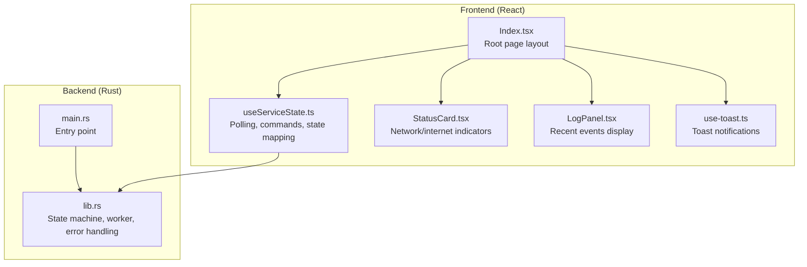
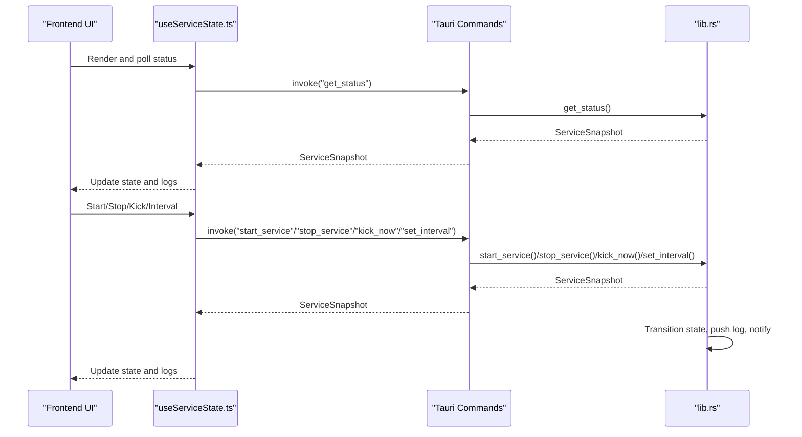
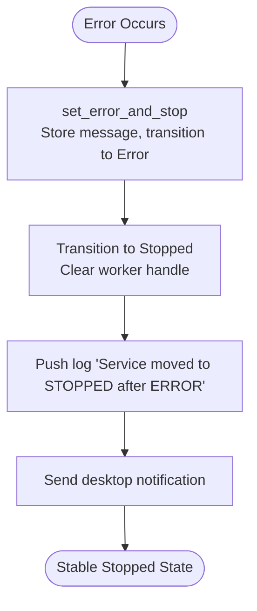
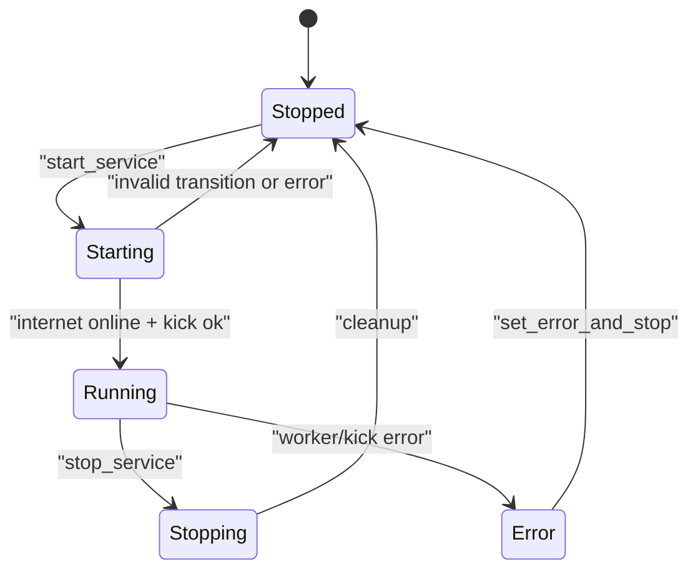
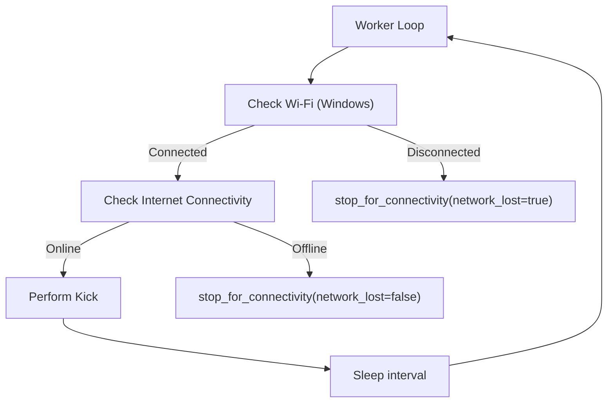
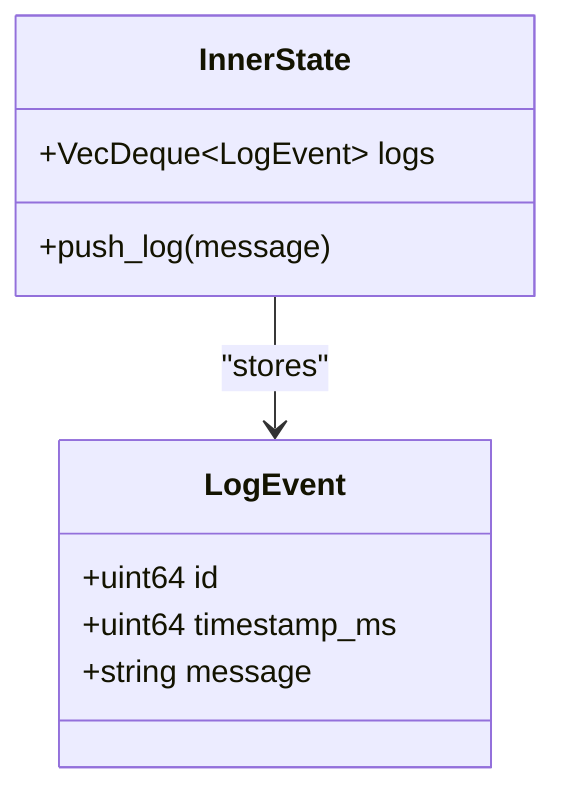
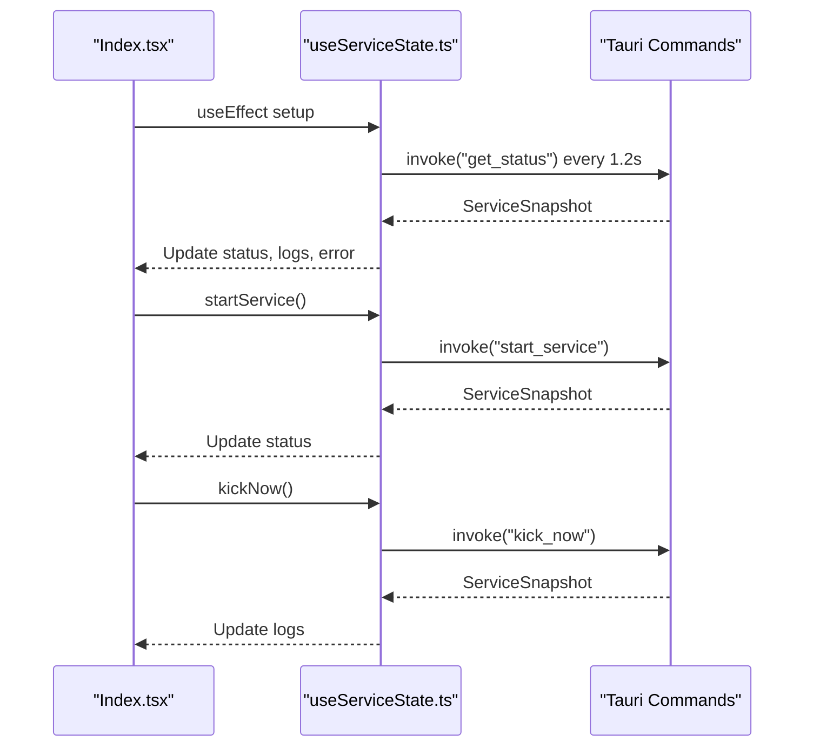
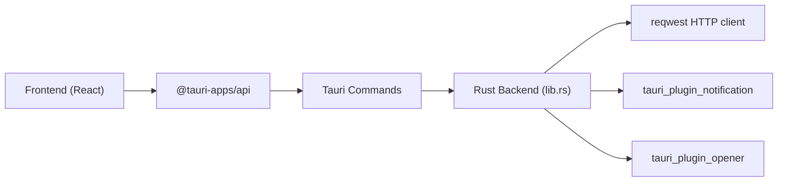

# Diagnostic Tools and Troubleshooting

<cite>
**Referenced Files in This Document**
- [lib.rs](file://src-tauri/src/lib.rs)
- [main.rs](file://src-tauri/src/main.rs)
- [useServiceState.ts](file://src/hooks/useServiceState.ts)
- [LogPanel.tsx](file://src/components/LogPanel.tsx)
- [Index.tsx](file://src/pages/Index.tsx)
- [StatusCard.tsx](file://src/components/StatusCard.tsx)
- [use-toast.ts](file://src/hooks/use-toast.ts)
</cite>

## Table of Contents
1. [Introduction](#introduction)
2. [Project Structure](#project-structure)
3. [Core Components](#core-components)
4. [Architecture Overview](#architecture-overview)
5. [Detailed Component Analysis](#detailed-component-analysis)
6. [Dependency Analysis](#dependency-analysis)
7. [Performance Considerations](#performance-considerations)
8. [Troubleshooting Guide](#troubleshooting-guide)
9. [Conclusion](#conclusion)
10. [Appendices](#appendices)

## Introduction
This document explains the diagnostic tools and troubleshooting workflows for the application. It focuses on the error handling system, state machine transitions, notification integration, logging, and practical steps to diagnose and resolve common issues such as network connectivity problems, authentication/kick failures, timeouts, and platform-specific limitations. It also covers log analysis techniques, interpreting error messages, and integrating with external diagnostic tools and system monitoring.

## Project Structure
The diagnostic system spans both the Rust backend (Tauri) and the React frontend:
- Backend (Rust/Tauri):
  - State machine and worker loop
  - Error handling and notifications
  - HTTP client and connectivity checks
- Frontend (React):
  - Real-time status polling and UI rendering
  - Log panel and toast notifications
  - User controls for start/stop/kick and interval adjustment

**Diagram sources**
- [lib.rs](file://src-tauri/src/lib.rs#L1-L686)
- [main.rs](file://src-tauri/src/main.rs#L1-L7)
- [useServiceState.ts](file://src/hooks/useServiceState.ts#L1-L163)
- [Index.tsx](file://src/pages/Index.tsx#L1-L55)
- [StatusCard.tsx](file://src/components/StatusCard.tsx#L1-L63)
- [LogPanel.tsx](file://src/components/LogPanel.tsx#L1-L52)
- [use-toast.ts](file://src/hooks/use-toast.ts#L1-L187)

**Section sources**
- [lib.rs](file://src-tauri/src/lib.rs#L1-L686)
- [main.rs](file://src-tauri/src/main.rs#L1-L7)
- [useServiceState.ts](file://src/hooks/useServiceState.ts#L1-L163)
- [Index.tsx](file://src/pages/Index.tsx#L1-L55)
- [StatusCard.tsx](file://src/components/StatusCard.tsx#L1-L63)
- [LogPanel.tsx](file://src/components/LogPanel.tsx#L1-L52)
- [use-toast.ts](file://src/hooks/use-toast.ts#L1-L187)

## Core Components
- State machine and snapshots:
  - States: Stopped, Starting, Running, Stopping, Error
  - Transitions are validated and logged; invalid transitions produce errors
  - Snapshots expose current state, statuses, logs, and error messages
- Logging:
  - Fixed-size ring buffer of recent events with timestamps
  - Frontend displays recent events and supports copying logs
- Error handling:
  - Centralized error handler sets error state, transitions to Error, then to Stopped, and notifies the user
  - Worker loop and manual actions propagate errors via this handler
- Notifications:
  - Desktop notifications are triggered on state changes and errors
- Connectivity checks:
  - Platform-specific Wi-Fi detection on Windows
  - Internet connectivity via HEAD request to a known endpoint
  - Kick request to the captive portal to maintain session
- Frontend diagnostics:
  - Periodic polling of backend status
  - UI indicators for network, internet, and last kick time
  - Interval adjustment and manual kick trigger

**Section sources**
- [lib.rs](file://src-tauri/src/lib.rs#L27-L141)
- [lib.rs](file://src-tauri/src/lib.rs#L193-L205)
- [lib.rs](file://src-tauri/src/lib.rs#L415-L473)
- [lib.rs](file://src-tauri/src/lib.rs#L600-L651)
- [useServiceState.ts](file://src/hooks/useServiceState.ts#L42-L107)
- [LogPanel.tsx](file://src/components/LogPanel.tsx#L12-L51)
- [use-toast.ts](file://src/hooks/use-toast.ts#L1-L187)

## Architecture Overview
The backend exposes Tauri commands consumed by the frontend. The frontend polls status and invokes commands to start/stop/kick and adjust intervals. The backend runs a worker loop that monitors connectivity and performs periodic kicks, transitioning states and recording logs.

**Diagram sources**
- [useServiceState.ts](file://src/hooks/useServiceState.ts#L88-L144)
- [lib.rs](file://src-tauri/src/lib.rs#L599-L651)
- [Index.tsx](file://src/pages/Index.tsx#L9-L54)

## Detailed Component Analysis

### Error Handling and Notification System
- set_error_and_stop centralizes error handling:
  - Stores the error message
  - Forces transition to Error, then to Stopped
  - Clears worker handle and records a log entry
  - Sends a desktop notification
- Notifications:
  - Triggered on error conditions and state changes (e.g., network disconnect, internet loss)
- Propagation:
  - Worker loop and manual actions call set_error_and_stop on failure
  - Tray menu error handling re-invokes set_error_and_stop

**Diagram sources**
- [lib.rs](file://src-tauri/src/lib.rs#L193-L205)

**Section sources**
- [lib.rs](file://src-tauri/src/lib.rs#L193-L205)
- [lib.rs](file://src-tauri/src/lib.rs#L281-L283)
- [lib.rs](file://src-tauri/src/lib.rs#L388-L403)
- [lib.rs](file://src-tauri/src/lib.rs#L460-L462)
- [lib.rs](file://src-tauri/src/lib.rs#L630-L633)

### State Machine and Transitions
- Valid transitions:
  - Stopped → Starting → Running
  - Starting → Stopped
  - Running → Stopping → Stopped
  - Any state → Error → Stopped
- Invalid transitions are rejected and reported as errors
- Logs record each transition and state change

**Diagram sources**
- [lib.rs](file://src-tauri/src/lib.rs#L27-L35)
- [lib.rs](file://src-tauri/src/lib.rs#L160-L171)
- [lib.rs](file://src-tauri/src/lib.rs#L129-L140)

**Section sources**
- [lib.rs](file://src-tauri/src/lib.rs#L27-L35)
- [lib.rs](file://src-tauri/src/lib.rs#L160-L171)
- [lib.rs](file://src-tauri/src/lib.rs#L129-L140)

### Connectivity Checks and Automatic Stops
- Wi-Fi detection:
  - Windows: Uses platform-specific command to enumerate interfaces and detect a connected non-loopback adapter
  - Other platforms: Returns unsupported error
- Internet connectivity:
  - HEAD request to a known endpoint with short timeout
- Automatic stop:
  - On Wi-Fi disconnect or internet offline while running, transitions to Stopping then Stopped and notifies the user

**Diagram sources**
- [lib.rs](file://src-tauri/src/lib.rs#L415-L473)
- [lib.rs](file://src-tauri/src/lib.rs#L308-L349)
- [lib.rs](file://src-tauri/src/lib.rs#L351-L362)
- [lib.rs](file://src-tauri/src/lib.rs#L373-L413)

**Section sources**
- [lib.rs](file://src-tauri/src/lib.rs#L308-L349)
- [lib.rs](file://src-tauri/src/lib.rs#L351-L362)
- [lib.rs](file://src-tauri/src/lib.rs#L373-L413)
- [lib.rs](file://src-tauri/src/lib.rs#L415-L473)

### Logging and Log Analysis
- Backend logs:
  - Ring buffer with fixed capacity; newest entries appear first
  - Each entry includes ID, timestamp, and message
- Frontend log panel:
  - Displays recent events with formatted timestamps
  - Provides copy-to-clipboard for quick sharing
- Log analysis tips:
  - Look for “Start requested”, “Service transitioned to RUNNING”, “Kick sent successfully”
  - Identify “Network adapter disconnected while running” or “Internet connectivity lost while running”
  - Note “Unexpected failure” and “Service moved to STOPPED after ERROR”
  - Correlate timestamps with interval changes and manual kicks

**Diagram sources**
- [lib.rs](file://src-tauri/src/lib.rs#L53-L59)
- [lib.rs](file://src-tauri/src/lib.rs#L116-L127)

**Section sources**
- [lib.rs](file://src-tauri/src/lib.rs#L53-L59)
- [lib.rs](file://src-tauri/src/lib.rs#L116-L127)
- [LogPanel.tsx](file://src/components/LogPanel.tsx#L12-L51)
- [useServiceState.ts](file://src/hooks/useServiceState.ts#L70-L86)

### Frontend Diagnostics and User Controls
- Polling:
  - Periodic invocation of get_status to refresh UI state
  - Detects backend unavailability and shows a warning
- Controls:
  - Start/Stop toggles service lifecycle
  - Manual kick triggers immediate session maintenance
  - Interval selector adjusts sleep between kicks
- Indicators:
  - Network/Wi-Fi and Internet status cards
  - Last kick time with relative “ago” display

**Diagram sources**
- [useServiceState.ts](file://src/hooks/useServiceState.ts#L88-L144)
- [Index.tsx](file://src/pages/Index.tsx#L9-L54)

**Section sources**
- [useServiceState.ts](file://src/hooks/useServiceState.ts#L42-L107)
- [useServiceState.ts](file://src/hooks/useServiceState.ts#L109-L144)
- [Index.tsx](file://src/pages/Index.tsx#L9-L54)
- [StatusCard.tsx](file://src/components/StatusCard.tsx#L19-L62)

## Dependency Analysis
- Backend dependencies:
  - reqwest HTTP client with connect/request timeouts
  - tauri_plugin_notification for desktop notifications
  - tauri_plugin_opener for external tool integration
- Frontend dependencies:
  - @tauri-apps/api for invoking backend commands
  - React Query for caching and retries
  - UI toast/sonner for user feedback

**Diagram sources**
- [useServiceState.ts](file://src/hooks/useServiceState.ts#L1)
- [lib.rs](file://src-tauri/src/lib.rs#L660-L685)

**Section sources**
- [lib.rs](file://src-tauri/src/lib.rs#L660-L685)
- [useServiceState.ts](file://src/hooks/useServiceState.ts#L1)

## Performance Considerations
- Worker loop sleeps for the configured interval; minimum enforced to avoid excessive polling
- HTTP timeouts are short to prevent blocking; connectivity checks are lightweight
- Log buffer is bounded to limit memory growth
- Frontend polling interval balances responsiveness with CPU usage

[No sources needed since this section provides general guidance]

## Troubleshooting Guide

### Step-by-Step Workflows

- Verify backend availability
  - If the UI shows “Backend unavailable,” run the app under the Tauri desktop runtime
  - Confirm Tauri commands are reachable via invoke

- Investigate network connectivity issues
  - Check Wi-Fi status indicators; if disconnected, reconnect and restart the service
  - On Windows, the backend enumerates adapters; if none are connected, start is blocked
  - If Wi-Fi disconnects while running, the service automatically transitions to Stopped and notifies

- Investigate internet connectivity problems
  - If internet is offline, the service blocks start and transitions to Stopped
  - During operation, if internet drops, the service transitions to Stopped and notifies

- Resolve authentication/session maintenance failures
  - If “Kick request failed,” the service transitions to Error then Stopped
  - Retry after ensuring network and internet are available
  - Use “Manual kick” to test connectivity to the captive portal

- Adjust interval and test behavior
  - Use the interval selector to increase or decrease the sleep between kicks
  - Observe logs for “Kick sent successfully” and “Kick interval set to Xs”

- Inspect logs for diagnosis
  - Copy recent events from the log panel for support
  - Look for timestamps around start/stop, interval changes, and error messages

- Platform-specific checks
  - Wi-Fi detection is supported only on Windows; on other platforms, network checks return unsupported
  - If unsupported, use external tools to verify adapter status

- Timeout-related issues
  - Connectivity and request timeouts are short; slow networks may cause frequent transitions
  - Increase interval to reduce frequency of requests during unstable periods

- Service crashes or unexpected stops
  - Review logs for “Unexpected failure” and the subsequent “Service moved to STOPPED after ERROR”
  - Restart the service after addressing underlying causes

- Notification and toast issues
  - Desktop notifications are sent on state changes and errors
  - Toasts are limited to avoid spam; check the toast area for transient messages

- Integration with external diagnostic tools
  - Use tauri_plugin_opener to open external tools or URLs from the backend
  - Copy logs and share with support teams for deeper analysis

**Section sources**
- [useServiceState.ts](file://src/hooks/useServiceState.ts#L88-L107)
- [lib.rs](file://src-tauri/src/lib.rs#L308-L349)
- [lib.rs](file://src-tauri/src/lib.rs#L351-L362)
- [lib.rs](file://src-tauri/src/lib.rs#L373-L413)
- [lib.rs](file://src-tauri/src/lib.rs#L460-L462)
- [lib.rs](file://src-tauri/src/lib.rs#L630-L633)
- [lib.rs](file://src-tauri/src/lib.rs#L644-L651)
- [LogPanel.tsx](file://src/components/LogPanel.tsx#L12-L51)
- [use-toast.ts](file://src/hooks/use-toast.ts#L1-L187)

## Conclusion
The application provides a robust diagnostic framework with a clear state machine, centralized error handling, actionable logs, and desktop notifications. Users can troubleshoot connectivity, authentication, and platform-specific issues by inspecting logs, verifying network status, and adjusting intervals. The frontend offers real-time visibility and simple controls to manage the service lifecycle.

[No sources needed since this section summarizes without analyzing specific files]

## Appendices

### Quick Reference: Common Error Messages and Actions
- “Start blocked because no network adapter is connected.”
  - Action: Connect Wi-Fi/Ethernet; retry start.
- “Internet unavailable. Start blocked.”
  - Action: Fix internet connectivity; retry start.
- “Network check failed: …”
  - Action: Check platform support; use external tools to verify adapter state.
- “Network adapter disconnected while running.”
  - Action: Reconnect; restart service.
- “Internet connectivity lost while running.”
  - Action: Restore internet; restart service.
- “Kick request failed.”
  - Action: Verify captive portal accessibility; retry manual kick.
- “Manual kick failed.”
  - Action: Check connectivity; retry after resolving issues.
- “Unexpected failure: …”
  - Action: Review logs; restart service; escalate if recurring.

**Section sources**
- [lib.rs](file://src-tauri/src/lib.rs#L490-L516)
- [lib.rs](file://src-tauri/src/lib.rs#L528-L536)
- [lib.rs](file://src-tauri/src/lib.rs#L308-L349)
- [lib.rs](file://src-tauri/src/lib.rs#L373-L413)
- [lib.rs](file://src-tauri/src/lib.rs#L460-L462)
- [lib.rs](file://src-tauri/src/lib.rs#L630-L633)
- [lib.rs](file://src-tauri/src/lib.rs#L193-L205)