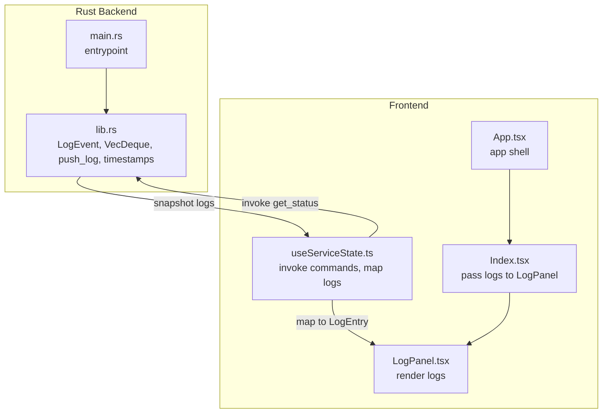
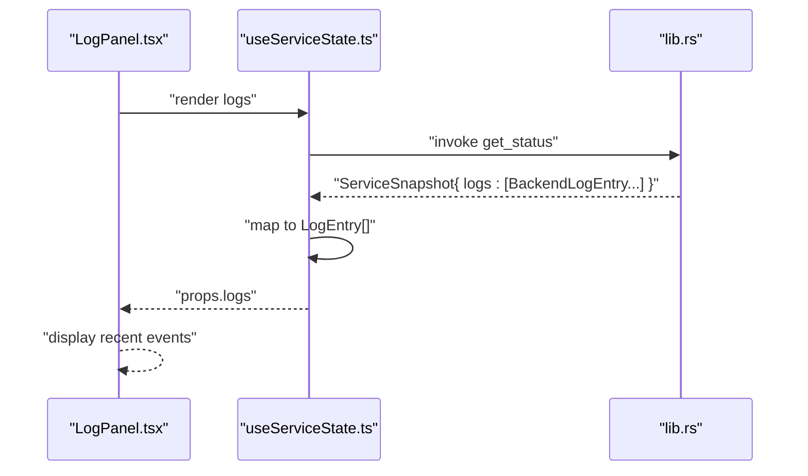
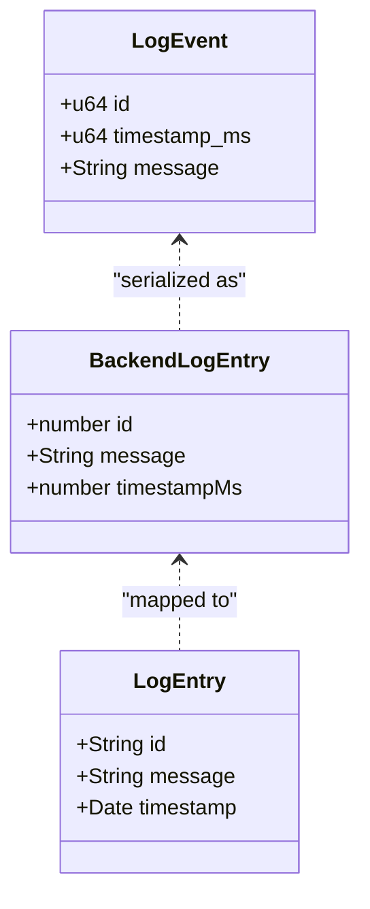
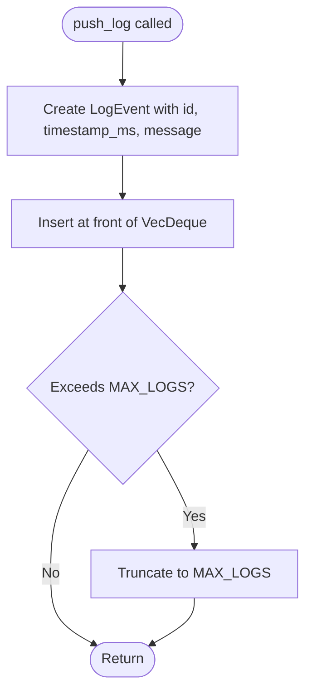
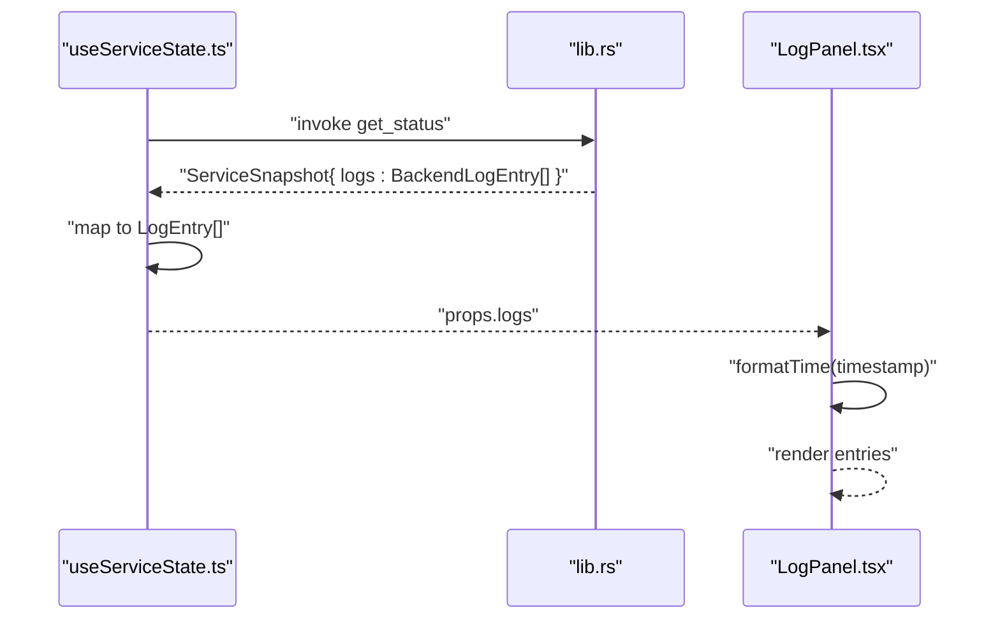
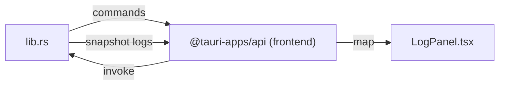

# Log Management

<cite>
**Referenced Files in This Document**
- [lib.rs](file://src-tauri/src/lib.rs)
- [main.rs](file://src-tauri/src/main.rs)
- [useServiceState.ts](file://src/hooks/useServiceState.ts)
- [LogPanel.tsx](file://src/components/LogPanel.tsx)
- [Index.tsx](file://src/pages/Index.tsx)
- [App.tsx](file://src/App.tsx)
- [README.md](file://README.md)
</cite>

## Table of Contents
1. [Introduction](#introduction)
2. [Project Structure](#project-structure)
3. [Core Components](#core-components)
4. [Architecture Overview](#architecture-overview)
5. [Detailed Component Analysis](#detailed-component-analysis)
6. [Dependency Analysis](#dependency-analysis)
7. [Performance Considerations](#performance-considerations)
8. [Troubleshooting Guide](#troubleshooting-guide)
9. [Conclusion](#conclusion)

## Introduction
This document explains the logging system used by the application. It covers the LogEvent data structure, the circular buffer implementation using a deque for log rotation, the push_log mechanism, timestamp conversion utilities, and how logs are serialized and displayed in the frontend. It also describes the integration between the Rust backend and the React frontend, along with practical examples and troubleshooting guidance.

## Project Structure
The logging system spans the Rust backend and the React frontend:
- Backend (Tauri/Rust): Defines LogEvent, maintains a rotating log buffer, and exposes commands to fetch snapshots containing logs.
- Frontend (React/TypeScript): Invokes backend commands, transforms backend log entries into frontend types, and renders recent events.

**Diagram sources**
- [lib.rs](file://src-tauri/src/lib.rs#L53-L71)
- [main.rs](file://src-tauri/src/main.rs#L4-L6)
- [useServiceState.ts](file://src/hooks/useServiceState.ts#L70-L86)
- [LogPanel.tsx](file://src/components/LogPanel.tsx#L12-L51)
- [Index.tsx](file://src/pages/Index.tsx#L45-L45)
- [App.tsx](file://src/App.tsx#L11-L25)

**Section sources**
- [README.md](file://README.md#L34-L62)
- [lib.rs](file://src-tauri/src/lib.rs#L53-L71)
- [useServiceState.ts](file://src/hooks/useServiceState.ts#L9-L29)
- [LogPanel.tsx](file://src/components/LogPanel.tsx#L1-L52)
- [Index.tsx](file://src/pages/Index.tsx#L1-L55)
- [App.tsx](file://src/App.tsx#L1-L28)

## Core Components
- LogEvent: Holds a unique numeric id, a millisecond-precision timestamp, and a message string. It is serializable for transport to the frontend.
- Circular buffer: A VecDeque sized to a fixed maximum capacity to maintain a bounded set of recent log entries.
- push_log: Adds a new entry to the front of the deque and enforces the maximum size by truncating excess entries.
- Timestamp utilities: Convert SystemTime to milliseconds since Unix epoch for consistent, sortable timestamps.
- Snapshot exposure: The backend’s snapshot aggregates current state and the current log buffer for the frontend.

Key constants and types:
- MAX_LOGS: Controls the maximum number of log entries retained.
- LogEvent: Fields include id, timestamp_ms, and message.
- BackendLogEntry: Transport shape used by the frontend mapping layer.
- LogEntry: Frontend type with id as string, message, and timestamp as Date.

**Section sources**
- [lib.rs](file://src-tauri/src/lib.rs#L21-L21)
- [lib.rs](file://src-tauri/src/lib.rs#L53-L59)
- [lib.rs](file://src-tauri/src/lib.rs#L78-L79)
- [lib.rs](file://src-tauri/src/lib.rs#L115-L127)
- [lib.rs](file://src-tauri/src/lib.rs#L173-L182)
- [useServiceState.ts](file://src/hooks/useServiceState.ts#L9-L19)
- [useServiceState.ts](file://src/hooks/useServiceState.ts#L70-L86)

## Architecture Overview
The logging pipeline connects backend events to frontend rendering via Tauri commands.

**Diagram sources**
- [useServiceState.ts](file://src/hooks/useServiceState.ts#L88-L98)
- [useServiceState.ts](file://src/hooks/useServiceState.ts#L70-L86)
- [lib.rs](file://src-tauri/src/lib.rs#L104-L114)
- [LogPanel.tsx](file://src/components/LogPanel.tsx#L12-L51)

## Detailed Component Analysis

### LogEvent Data Structure
- Purpose: Encapsulates a single log entry with a monotonic id, precise timestamp, and human-readable message.
- Serialization: Structured for JSON transport and mapped to the frontend’s LogEntry type.
- Field mapping:
  - id: Numeric id from the backend; mapped to a string on the frontend.
  - timestamp_ms: Milliseconds since Unix epoch; mapped to a Date on the frontend.
  - message: Text content of the event.

**Diagram sources**
- [lib.rs](file://src-tauri/src/lib.rs#L53-L59)
- [useServiceState.ts](file://src/hooks/useServiceState.ts#L15-L19)
- [useServiceState.ts](file://src/hooks/useServiceState.ts#L9-L13)

**Section sources**
- [lib.rs](file://src-tauri/src/lib.rs#L53-L59)
- [useServiceState.ts](file://src/hooks/useServiceState.ts#L9-L19)
- [useServiceState.ts](file://src/hooks/useServiceState.ts#L70-L86)

### Circular Buffer and Rotation (VecDeque)
- Capacity: Set to a fixed maximum to bound memory usage.
- Insertion: push_front adds new entries at the head.
- Rotation: When exceeding capacity, truncate to the most recent MAX_LOGS entries.
- Ordering: Newer entries appear earlier in the deque; snapshot collects them in order.

**Diagram sources**
- [lib.rs](file://src-tauri/src/lib.rs#L115-L127)
- [lib.rs](file://src-tauri/src/lib.rs#L94-L94)
- [lib.rs](file://src-tauri/src/lib.rs#L21-L21)

**Section sources**
- [lib.rs](file://src-tauri/src/lib.rs#L21-L21)
- [lib.rs](file://src-tauri/src/lib.rs#L78-L79)
- [lib.rs](file://src-tauri/src/lib.rs#L94-L94)
- [lib.rs](file://src-tauri/src/lib.rs#L115-L127)

### push_log Method
- Responsibilities:
  - Assign the next sequential id.
  - Capture current time in milliseconds.
  - Append the entry to the front of the deque.
  - Enforce the maximum size by truncation.
- Thread-safety: Accesses shared state via a mutex guard in the caller context.

Integration points:
- Called during lifecycle transitions, errors, and user actions (start, stop, manual kick).

**Section sources**
- [lib.rs](file://src-tauri/src/lib.rs#L115-L127)
- [lib.rs](file://src-tauri/src/lib.rs#L193-L205)
- [lib.rs](file://src-tauri/src/lib.rs#L373-L413)
- [lib.rs](file://src-tauri/src/lib.rs#L460-L473)
- [lib.rs](file://src-tauri/src/lib.rs#L475-L564)
- [lib.rs](file://src-tauri/src/lib.rs#L566-L597)
- [lib.rs](file://src-tauri/src/lib.rs#L621-L642)
- [lib.rs](file://src-tauri/src/lib.rs#L644-L651)

### Timestamp Conversion Utilities
- now_ms(): Returns current time in milliseconds since Unix epoch.
- system_time_to_ms(): Converts SystemTime to milliseconds with fallback to zero on error.
- Frontend mapping: Backend timestampMs is mapped to a JavaScript Date on the frontend.

**Section sources**
- [lib.rs](file://src-tauri/src/lib.rs#L173-L182)
- [useServiceState.ts](file://src/hooks/useServiceState.ts#L76-L82)

### Log Entry Serialization and Snapshot Exposure
- Backend snapshot: Collects current state and a copy of the log buffer for transport.
- Frontend mapping: Transforms BackendLogEntry array into LogEntry array, converting ids and timestamps appropriately.
- Rendering: LogPanel displays the most recent entries with formatted timestamps.

**Section sources**
- [lib.rs](file://src-tauri/src/lib.rs#L104-L114)
- [useServiceState.ts](file://src/hooks/useServiceState.ts#L70-L86)
- [LogPanel.tsx](file://src/components/LogPanel.tsx#L12-L51)

### Frontend Integration: LogPanel and useServiceState
- useServiceState:
  - Polls backend snapshots at a fixed interval.
  - Applies snapshots to update status, intervals, last kick time, and logs.
  - Maps backend log entries to frontend LogEntry with id as string and timestamp as Date.
- LogPanel:
  - Renders recent events with a compact time and message layout.
  - Provides a copy action to export logs as text.

**Diagram sources**
- [useServiceState.ts](file://src/hooks/useServiceState.ts#L88-L98)
- [useServiceState.ts](file://src/hooks/useServiceState.ts#L70-L86)
- [LogPanel.tsx](file://src/components/LogPanel.tsx#L12-L51)

**Section sources**
- [useServiceState.ts](file://src/hooks/useServiceState.ts#L42-L107)
- [useServiceState.ts](file://src/hooks/useServiceState.ts#L70-L86)
- [LogPanel.tsx](file://src/components/LogPanel.tsx#L12-L51)
- [Index.tsx](file://src/pages/Index.tsx#L45-L45)
- [App.tsx](file://src/App.tsx#L11-L25)

## Dependency Analysis
- Backend depends on:
  - Standard library for time and collections.
  - Serde for serialization.
  - Tauri for commands and state management.
- Frontend depends on:
  - @tauri-apps/api for invoking backend commands.
  - React for rendering and state updates.
- Cross-cutting concerns:
  - Consistent timestamp units (milliseconds) across backend and frontend.
  - Stable id mapping from numeric backend ids to string frontend ids.

**Diagram sources**
- [lib.rs](file://src-tauri/src/lib.rs#L599-L651)
- [useServiceState.ts](file://src/hooks/useServiceState.ts#L88-L98)
- [LogPanel.tsx](file://src/components/LogPanel.tsx#L12-L51)

**Section sources**
- [lib.rs](file://src-tauri/src/lib.rs#L1-L15)
- [useServiceState.ts](file://src/hooks/useServiceState.ts#L1-L2)
- [LogPanel.tsx](file://src/components/LogPanel.tsx#L1-L2)

## Performance Considerations
- Fixed-size buffer: MAX_LOGS bounds memory usage and insertion/removal costs remain O(1) amortized.
- Truncation cost: Occurs infrequently and is O(n) in the number of excess entries; acceptable given the small fixed size.
- Serialization overhead: Minimal due to simple numeric and string fields; JSON transport is lightweight.
- Frontend rendering: Efficient list rendering with stable keys; copying logs for display avoids mutation.
- Recommendations:
  - Keep MAX_LOGS small to reduce memory footprint.
  - Avoid extremely frequent polling; the current interval balances responsiveness and load.
  - Consider debouncing manual actions that trigger immediate snapshots if needed.

[No sources needed since this section provides general guidance]

## Troubleshooting Guide
Common issues and resolutions:
- No logs displayed:
  - Verify backend is reachable and returning snapshots. The frontend marks backend connectivity down when invocations fail.
  - Confirm the LogPanel receives props from the parent component.
- Incorrect timestamps:
  - Ensure the frontend maps timestampMs to Date consistently.
  - Check that the backend uses a monotonic time source and converts to milliseconds since Unix epoch.
- Excessive memory usage:
  - Confirm MAX_LOGS is enforced; verify truncation occurs when exceeding capacity.
- Duplicate or out-of-order ids:
  - Ensure sequential id assignment and insertion at the front of the deque.
- Exporting logs:
  - Use the copy button in LogPanel to export recent events as text.

**Section sources**
- [useServiceState.ts](file://src/hooks/useServiceState.ts#L88-L98)
- [useServiceState.ts](file://src/hooks/useServiceState.ts#L70-L86)
- [lib.rs](file://src-tauri/src/lib.rs#L115-L127)
- [LogPanel.tsx](file://src/components/LogPanel.tsx#L12-L51)

## Conclusion
The logging system combines a fixed-capacity circular buffer in the Rust backend with a straightforward frontend mapping and rendering layer. It provides reliable, bounded storage of recent events, precise timestamps, and a simple integration model via Tauri commands. The design supports predictable performance and clear visibility into service activity.