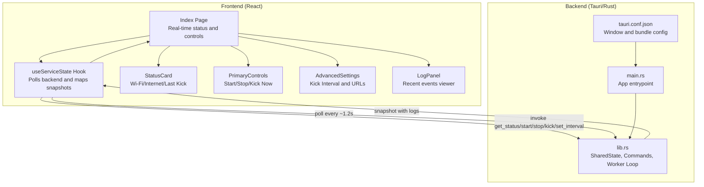
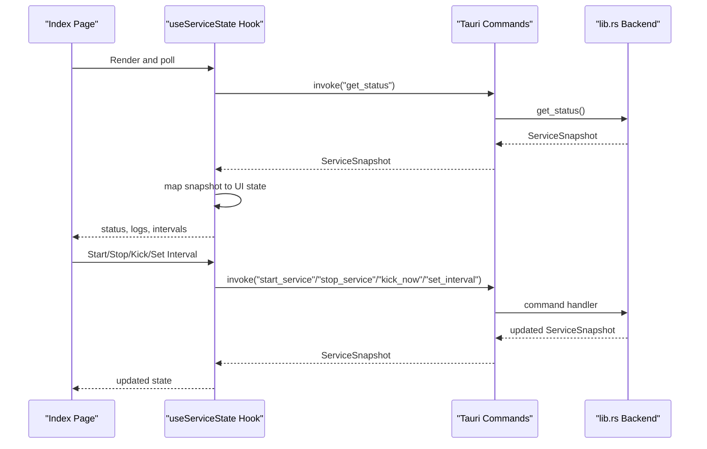
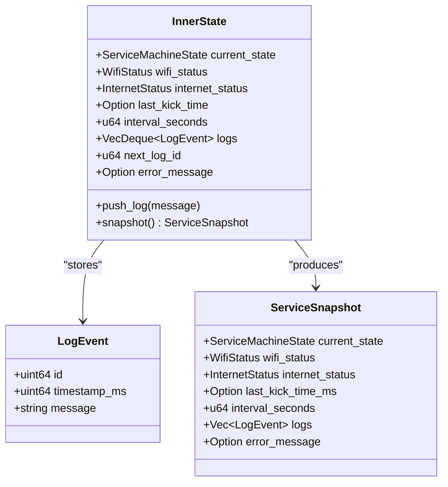
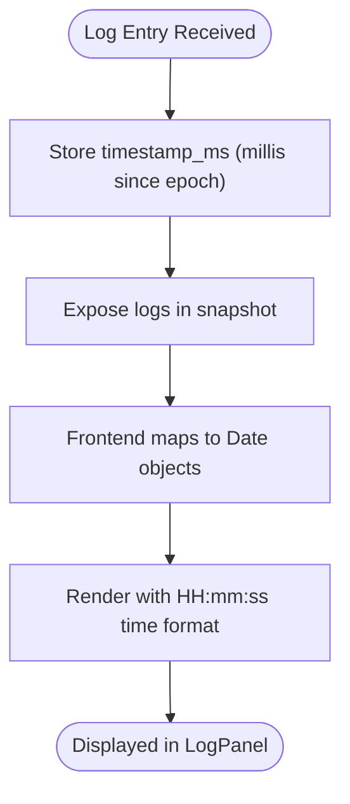
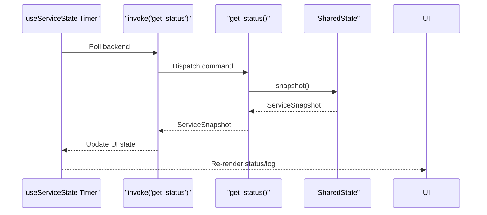
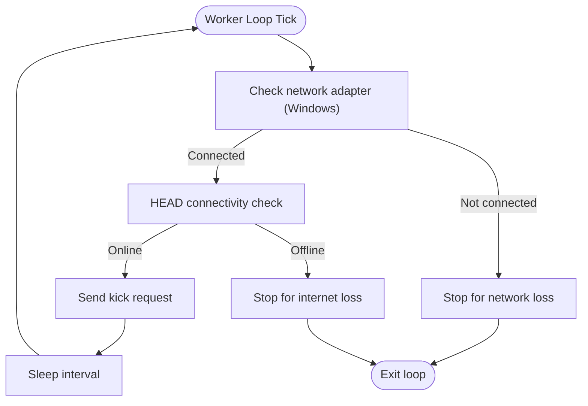
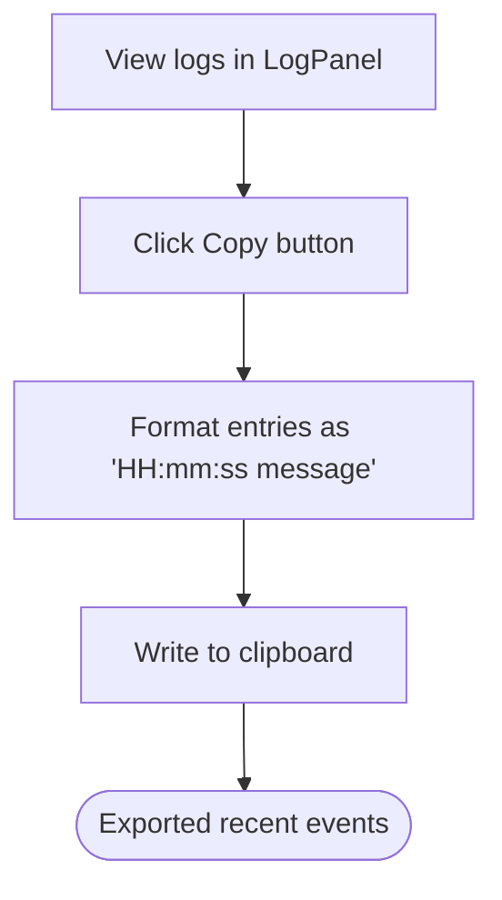
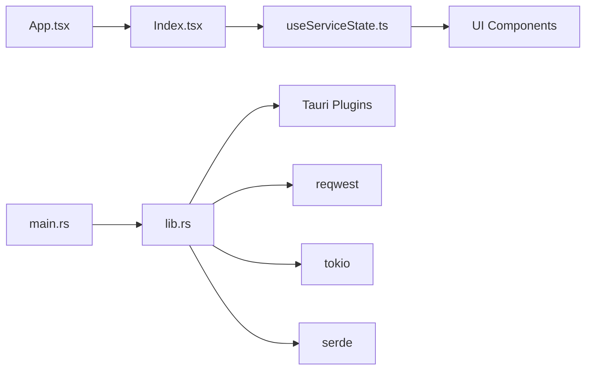

# Monitoring and Logging

<cite>
**Referenced Files in This Document**
- [README.md](file://README.md)
- [src/App.tsx](file://src/App.tsx)
- [src/pages/Index.tsx](file://src/pages/Index.tsx)
- [src/hooks/useServiceState.ts](file://src/hooks/useServiceState.ts)
- [src/components/StatusCard.tsx](file://src/components/StatusCard.tsx)
- [src/components/PrimaryControls.tsx](file://src/components/PrimaryControls.tsx)
- [src/components/AdvancedSettings.tsx](file://src/components/AdvancedSettings.tsx)
- [src/components/LogPanel.tsx](file://src/components/LogPanel.tsx)
- [src-tauri/src/lib.rs](file://src-tauri/src/lib.rs)
- [src-tauri/src/main.rs](file://src-tauri/src/main.rs)
- [src-tauri/Cargo.toml](file://src-tauri/Cargo.toml)
- [src-tauri/tauri.conf.json](file://src-tauri/tauri.conf.json)
</cite>

## Table of Contents
1. [Introduction](#introduction)
2. [Project Structure](#project-structure)
3. [Core Components](#core-components)
4. [Architecture Overview](#architecture-overview)
5. [Detailed Component Analysis](#detailed-component-analysis)
6. [Dependency Analysis](#dependency-analysis)
7. [Performance Considerations](#performance-considerations)
8. [Troubleshooting Guide](#troubleshooting-guide)
9. [Conclusion](#conclusion)
10. [Appendices](#appendices)

## Introduction
This document describes the monitoring and logging system for the application. It covers the log structure and event types, timestamp formatting, log rotation, real-time status monitoring, performance metrics collection, health checks, the log viewer component, filtering and export capabilities, debugging strategies, diagnostic workflows, and integration points with external monitoring systems.

The application is a Tauri desktop app with a React frontend and a Rust backend. The backend runs a periodic “kick” service that sends HTTP requests to maintain an active session, and the frontend displays real-time status, logs, and controls.

**Section sources**
- [README.md](file://README.md#L1-L114)

## Project Structure
The monitoring and logging system spans both the frontend and backend:

- Frontend (React + TypeScript):
  - Real-time status polling via Tauri commands
  - UI components for status, controls, advanced settings, and log panel
- Backend (Tauri + Rust):
  - Service state machine and lifecycle management
  - Connectivity checks and health monitoring
  - Event logging with rotation and serialization
  - Tauri commands exposed to the frontend

**Diagram sources**
- [src/pages/Index.tsx](file://src/pages/Index.tsx#L1-L55)
- [src/hooks/useServiceState.ts](file://src/hooks/useServiceState.ts#L1-L163)
- [src/components/StatusCard.tsx](file://src/components/StatusCard.tsx#L1-L63)
- [src/components/PrimaryControls.tsx](file://src/components/PrimaryControls.tsx#L1-L73)
- [src/components/AdvancedSettings.tsx](file://src/components/AdvancedSettings.tsx#L1-L73)
- [src/components/LogPanel.tsx](file://src/components/LogPanel.tsx#L1-L52)
- [src-tauri/src/lib.rs](file://src-tauri/src/lib.rs#L1-L686)
- [src-tauri/src/main.rs](file://src-tauri/src/main.rs#L1-L7)
- [src-tauri/tauri.conf.json](file://src-tauri/tauri.conf.json#L1-L42)

**Section sources**
- [src/App.tsx](file://src/App.tsx#L1-L28)
- [src/pages/Index.tsx](file://src/pages/Index.tsx#L1-L55)
- [src/hooks/useServiceState.ts](file://src/hooks/useServiceState.ts#L1-L163)
- [src-tauri/src/lib.rs](file://src-tauri/src/lib.rs#L1-L686)
- [src-tauri/src/main.rs](file://src-tauri/src/main.rs#L1-L7)
- [src-tauri/tauri.conf.json](file://src-tauri/tauri.conf.json#L1-L42)

## Core Components
- Service state machine and snapshot:
  - States: Stopped, Starting, Running, Stopping, Error
  - Snapshot includes current state, Wi-Fi and Internet status, last kick time, interval, logs, and optional error message
- Logging model:
  - LogEvent with numeric ID, millisecond-precision timestamp, and message
  - Circular buffer with fixed capacity for recent events
- Real-time monitoring:
  - Periodic polling of backend snapshot
  - UI updates with mapped timestamps and statuses
- Health checks:
  - Network adapter presence (Windows-specific)
  - Connectivity check via HEAD request to a known endpoint
  - Internet availability validated before allowing service start
- UI components:
  - StatusCard: Wi-Fi, Internet, Last Kick
  - PrimaryControls: Start/Stop, Kick Now
  - AdvancedSettings: Kick interval presets and URLs
  - LogPanel: Recent events viewer with copy-to-clipboard

**Section sources**
- [src-tauri/src/lib.rs](file://src-tauri/src/lib.rs#L27-L71)
- [src-tauri/src/lib.rs](file://src-tauri/src/lib.rs#L73-L141)
- [src-tauri/src/lib.rs](file://src-tauri/src/lib.rs#L415-L473)
- [src/hooks/useServiceState.ts](file://src/hooks/useServiceState.ts#L21-L40)
- [src/hooks/useServiceState.ts](file://src/hooks/useServiceState.ts#L88-L107)
- [src/components/StatusCard.tsx](file://src/components/StatusCard.tsx#L1-L63)
- [src/components/PrimaryControls.tsx](file://src/components/PrimaryControls.tsx#L1-L73)
- [src/components/AdvancedSettings.tsx](file://src/components/AdvancedSettings.tsx#L1-L73)
- [src/components/LogPanel.tsx](file://src/components/LogPanel.tsx#L1-L52)

## Architecture Overview
The frontend polls the backend via Tauri commands and renders real-time status and logs. The backend maintains a shared state with a worker loop that performs connectivity checks and periodic kicks.

**Diagram sources**
- [src/pages/Index.tsx](file://src/pages/Index.tsx#L1-L55)
- [src/hooks/useServiceState.ts](file://src/hooks/useServiceState.ts#L88-L144)
- [src-tauri/src/lib.rs](file://src-tauri/src/lib.rs#L599-L651)

## Detailed Component Analysis

### Logging Model and Rotation
- LogEvent structure:
  - Numeric ID, millisecond-precision timestamp, message
- Storage:
  - Fixed-capacity deque storing up to a configured maximum number of recent entries
- Rotation:
  - On insertion beyond capacity, older entries are truncated to maintain size
- Serialization:
  - Snapshot exposes logs as a vector for transport to the frontend

**Diagram sources**
- [src-tauri/src/lib.rs](file://src-tauri/src/lib.rs#L53-L71)
- [src-tauri/src/lib.rs](file://src-tauri/src/lib.rs#L73-L141)
- [src-tauri/src/lib.rs](file://src-tauri/src/lib.rs#L104-L114)

**Section sources**
- [src-tauri/src/lib.rs](file://src-tauri/src/lib.rs#L21-L21)
- [src-tauri/src/lib.rs](file://src-tauri/src/lib.rs#L53-L71)
- [src-tauri/src/lib.rs](file://src-tauri/src/lib.rs#L116-L127)
- [src-tauri/src/lib.rs](file://src-tauri/src/lib.rs#L104-L114)

### Timestamp Formatting and Display
- Backend stores timestamps in milliseconds since Unix epoch.
- Frontend converts to Date objects for rendering.
- LogPanel displays localized time in HH:mm:ss format.

**Diagram sources**
- [src-tauri/src/lib.rs](file://src-tauri/src/lib.rs#L116-L127)
- [src-tauri/src/lib.rs](file://src-tauri/src/lib.rs#L104-L114)
- [src/hooks/useServiceState.ts](file://src/hooks/useServiceState.ts#L70-L86)
- [src/components/LogPanel.tsx](file://src/components/LogPanel.tsx#L8-L10)

**Section sources**
- [src-tauri/src/lib.rs](file://src-tauri/src/lib.rs#L177-L182)
- [src-tauri/src/lib.rs](file://src-tauri/src/lib.rs#L116-L127)
- [src/hooks/useServiceState.ts](file://src/hooks/useServiceState.ts#L70-L86)
- [src/components/LogPanel.tsx](file://src/components/LogPanel.tsx#L8-L10)

### Real-Time Status Monitoring
- Polling:
  - Frontend polls backend every ~1.2 seconds for latest snapshot
- Status mapping:
  - Backend snapshot maps to frontend enums and types
- UI rendering:
  - StatusCard shows Wi-Fi, Internet, and Last Kick
  - PrimaryControls reflect current state and enable/disable actions
  - AdvancedSettings shows current interval and URLs

**Diagram sources**
- [src/hooks/useServiceState.ts](file://src/hooks/useServiceState.ts#L88-L107)
- [src-tauri/src/lib.rs](file://src-tauri/src/lib.rs#L600-L602)

**Section sources**
- [src/hooks/useServiceState.ts](file://src/hooks/useServiceState.ts#L42-L53)
- [src/hooks/useServiceState.ts](file://src/hooks/useServiceState.ts#L88-L107)
- [src/components/StatusCard.tsx](file://src/components/StatusCard.tsx#L19-L42)
- [src/components/PrimaryControls.tsx](file://src/components/PrimaryControls.tsx#L12-L22)
- [src/components/AdvancedSettings.tsx](file://src/components/AdvancedSettings.tsx#L17-L28)

### Health Checks and Connectivity
- Network adapter detection (Windows):
  - Uses system command to enumerate interfaces and detect a non-loopback connected state
- Internet connectivity:
  - HEAD request to a known endpoint with timeout
- Behavior on loss:
  - Transition to Stopping/Stopped and notify user
  - Logs appropriate messages for network vs internet loss

**Diagram sources**
- [src-tauri/src/lib.rs](file://src-tauri/src/lib.rs#L415-L473)
- [src-tauri/src/lib.rs](file://src-tauri/src/lib.rs#L308-L344)
- [src-tauri/src/lib.rs](file://src-tauri/src/lib.rs#L351-L362)
- [src-tauri/src/lib.rs](file://src-tauri/src/lib.rs#L373-L413)

**Section sources**
- [src-tauri/src/lib.rs](file://src-tauri/src/lib.rs#L308-L344)
- [src-tauri/src/lib.rs](file://src-tauri/src/lib.rs#L351-L362)
- [src-tauri/src/lib.rs](file://src-tauri/src/lib.rs#L373-L413)

### Log Viewer Component and Export
- LogPanel:
  - Displays recent events with formatted time and messages
  - Provides a copy action to clipboard with newline-separated entries
- Filtering:
  - No built-in filtering in the current implementation
- Export:
  - Copy-to-clipboard enables exporting the visible recent events

**Diagram sources**
- [src/components/LogPanel.tsx](file://src/components/LogPanel.tsx#L12-L16)
- [src/components/LogPanel.tsx](file://src/components/LogPanel.tsx#L39-L47)

**Section sources**
- [src/components/LogPanel.tsx](file://src/components/LogPanel.tsx#L1-L52)

### Performance Metrics Collection
- Current metrics:
  - Service state transitions
  - Wi-Fi and Internet status
  - Kick interval and last kick time
  - Log count and recent entries
- Observability:
  - Snapshot includes interval and last kick time for trend analysis
  - Logs capture operational events for diagnostics

**Section sources**
- [src-tauri/src/lib.rs](file://src-tauri/src/lib.rs#L63-L71)
- [src/hooks/useServiceState.ts](file://src/hooks/useServiceState.ts#L21-L29)

### Debugging Strategies and Diagnostics
- Backend error handling:
  - Centralized error propagation and state transitions to Error/Stopped
  - Notifications for unexpected failures
- Frontend diagnostics:
  - Backend connectivity indicator when invoke fails
  - Error message propagation from commands
- Diagnostic workflow:
  - Verify backend availability
  - Inspect logs for recent events
  - Confirm network and internet status
  - Adjust kick interval and retry

**Section sources**
- [src-tauri/src/lib.rs](file://src-tauri/src/lib.rs#L193-L205)
- [src/hooks/useServiceState.ts](file://src/hooks/useServiceState.ts#L92-L98)
- [src/pages/Index.tsx](file://src/pages/Index.tsx#L39-L43)

## Dependency Analysis
- Frontend depends on Tauri APIs for invoking backend commands and on React Query for state management.
- Backend depends on Tauri, reqwest, tokio, serde, and notification plugins.
- The main entrypoint initializes the backend and registers commands.

**Diagram sources**
- [src/App.tsx](file://src/App.tsx#L1-L28)
- [src/pages/Index.tsx](file://src/pages/Index.tsx#L1-L55)
- [src/hooks/useServiceState.ts](file://src/hooks/useServiceState.ts#L1-L163)
- [src-tauri/src/main.rs](file://src-tauri/src/main.rs#L1-L7)
- [src-tauri/src/lib.rs](file://src-tauri/src/lib.rs#L658-L686)
- [src-tauri/Cargo.toml](file://src-tauri/Cargo.toml#L20-L29)

**Section sources**
- [src-tauri/Cargo.toml](file://src-tauri/Cargo.toml#L1-L29)
- [src-tauri/src/main.rs](file://src-tauri/src/main.rs#L1-L7)
- [src-tauri/src/lib.rs](file://src-tauri/src/lib.rs#L658-L686)

## Performance Considerations
- Polling cadence:
  - Frontend polls every ~1.2 seconds; adjust if needed to balance responsiveness and overhead
- Logging overhead:
  - Fixed-capacity deque prevents unbounded memory growth
  - Millisecond timestamps avoid precision loss
- Network checks:
  - Timeout-based connectivity checks prevent blocking
- Worker loop:
  - Sleep between iterations reduces CPU usage during idle periods

[No sources needed since this section provides general guidance]

## Troubleshooting Guide
Common scenarios and steps:
- Backend unavailable:
  - The UI shows a connectivity notice; ensure the app runs under Tauri desktop runtime
- Start blocked due to network:
  - Verify Wi-Fi/ethernet adapter is connected; the backend checks for a non-loopback connected interface on Windows
- Start blocked due to internet:
  - Internet connectivity check must succeed; confirm DNS and proxy settings
- Service stops unexpectedly:
  - Review logs for network or internet loss events; the backend transitions to Stopped and notifies
- Manual kick fails:
  - The backend records an error and transitions to Error/Stopped; inspect logs and retry

**Section sources**
- [src/pages/Index.tsx](file://src/pages/Index.tsx#L39-L43)
- [src-tauri/src/lib.rs](file://src-tauri/src/lib.rs#L489-L516)
- [src-tauri/src/lib.rs](file://src-tauri/src/lib.rs#L528-L536)
- [src-tauri/src/lib.rs](file://src-tauri/src/lib.rs#L373-L413)
- [src-tauri/src/lib.rs](file://src-tauri/src/lib.rs#L621-L642)

## Conclusion
The monitoring and logging system combines a compact Rust backend with a React frontend to deliver real-time visibility into service status, connectivity, and recent events. Logs are stored with millisecond precision and rotated to a fixed-size buffer, enabling concise diagnostics. While filtering and export are not built-in, the log viewer supports copying recent events for external analysis. Health checks and notifications help maintain predictable behavior and rapid incident response.

[No sources needed since this section summarizes without analyzing specific files]

## Appendices

### Log Structure Reference
- LogEvent fields:
  - id: numeric identifier
  - timestamp_ms: milliseconds since Unix epoch
  - message: human-readable event description
- Rotation policy:
  - Maximum number of recent entries retained

**Section sources**
- [src-tauri/src/lib.rs](file://src-tauri/src/lib.rs#L21-L21)
- [src-tauri/src/lib.rs](file://src-tauri/src/lib.rs#L116-L127)

### Event Types and Snapshots
- ServiceSnapshot includes:
  - current_state, wifi_status, internet_status, last_kick_time_ms, interval_seconds, logs, error_message
- Typical events:
  - Initialization, start/stop transitions, connectivity loss, successful kick, manual kick, interval change

**Section sources**
- [src-tauri/src/lib.rs](file://src-tauri/src/lib.rs#L63-L71)
- [src-tauri/src/lib.rs](file://src-tauri/src/lib.rs#L104-L114)

### Timestamp Formatting Details
- Backend: milliseconds since Unix epoch
- Frontend: converted to Date for rendering
- LogPanel: HH:mm:ss time format

**Section sources**
- [src-tauri/src/lib.rs](file://src-tauri/src/lib.rs#L177-L182)
- [src/hooks/useServiceState.ts](file://src/hooks/useServiceState.ts#L70-L86)
- [src/components/LogPanel.tsx](file://src/components/LogPanel.tsx#L8-L10)

### Health Check Endpoints and Intervals
- Connectivity check URL: HEAD request to a known endpoint
- Kick URL: target for periodic requests
- Default and configurable intervals: 20s, 60s, 120s, 300s

**Section sources**
- [src-tauri/src/lib.rs](file://src-tauri/src/lib.rs#L24-L25)
- [src-tauri/src/lib.rs](file://src-tauri/src/lib.rs#L25-L25)
- [src/components/AdvancedSettings.tsx](file://src/components/AdvancedSettings.tsx#L10-L15)

### UI Components and Interactions
- StatusCard: Wi-Fi, Internet, Last Kick
- PrimaryControls: Start/Stop, Kick Now
- AdvancedSettings: Kick interval presets and URLs
- LogPanel: Recent events viewer with copy-to-clipboard

**Section sources**
- [src/components/StatusCard.tsx](file://src/components/StatusCard.tsx#L19-L42)
- [src/components/PrimaryControls.tsx](file://src/components/PrimaryControls.tsx#L12-L22)
- [src/components/AdvancedSettings.tsx](file://src/components/AdvancedSettings.tsx#L17-L28)
- [src/components/LogPanel.tsx](file://src/components/LogPanel.tsx#L12-L16)

### Example Workflows

#### Log Analysis Workflow
- Copy recent events from LogPanel
- Paste into a text editor or log analysis tool
- Filter by timestamp range and keywords
- Correlate with status changes and intervals

**Section sources**
- [src/components/LogPanel.tsx](file://src/components/LogPanel.tsx#L12-L16)

#### Performance Monitoring Workflow
- Observe last_kick_time_ms trends
- Track interval_seconds adjustments
- Monitor state transitions for anomalies

**Section sources**
- [src/hooks/useServiceState.ts](file://src/hooks/useServiceState.ts#L70-L86)
- [src-tauri/src/lib.rs](file://src-tauri/src/lib.rs#L63-L71)

#### Error Tracking Workflow
- Inspect error_message in snapshot
- Review recent logs around the error
- Restart service after resolving root cause

**Section sources**
- [src-tauri/src/lib.rs](file://src-tauri/src/lib.rs#L193-L205)
- [src/hooks/useServiceState.ts](file://src/hooks/useServiceState.ts#L113-L115)

### Integration with External Monitoring Systems
- Current integration points:
  - Desktop notifications for service state changes
  - Copy-to-clipboard export from LogPanel
- Suggested extensions:
  - Expose a read-only endpoint for logs
  - Add structured metrics export
  - Integrate with system notification or telemetry SDKs

[No sources needed since this section provides general guidance]