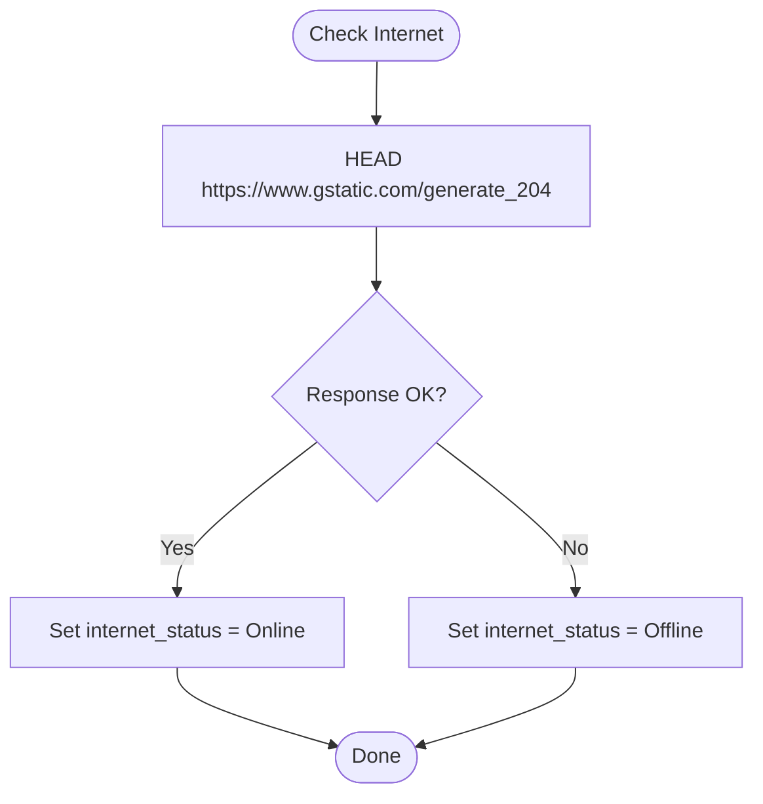

# Real-time Status Monitoring

<cite>
**Referenced Files in This Document**
- [useServiceState.ts](file://src/hooks/useServiceState.ts)
- [lib.rs](file://src-tauri/src/lib.rs)
- [StatusCard.tsx](file://src/components/StatusCard.tsx)
- [Index.tsx](file://src/pages/Index.tsx)
- [PrimaryControls.tsx](file://src/components/PrimaryControls.tsx)
- [AdvancedSettings.tsx](file://src/components/AdvancedSettings.tsx)
- [LogPanel.tsx](file://src/components/LogPanel.tsx)
- [PopoverHeader.tsx](file://src/components/PopoverHeader.tsx)
- [main.rs](file://src-tauri/src/main.rs)
</cite>

## Table of Contents
1. [Introduction](#introduction)
2. [Project Structure](#project-structure)
3. [Core Components](#core-components)
4. [Architecture Overview](#architecture-overview)
5. [Detailed Component Analysis](#detailed-component-analysis)
6. [Dependency Analysis](#dependency-analysis)
7. [Performance Considerations](#performance-considerations)
8. [Troubleshooting Guide](#troubleshooting-guide)
9. [Conclusion](#conclusion)
10. [Appendices](#appendices)

## Introduction
This document describes the real-time status monitoring system that tracks and displays the operational state of a background service responsible for periodic authentication “kicks” against a captive portal. It covers the ServiceSnapshot structure, the polling mechanism, state machine transitions, and detection algorithms for Wi-Fi connectivity and internet availability. It also documents frontend integration via the useServiceState React hook and reactive UI updates, along with examples of status interpretation and troubleshooting steps.

## Project Structure
The monitoring system spans a Tauri desktop backend and a React frontend:
- Frontend hooks and UI components manage polling, state, and rendering.
- Backend Rust manages the state machine, runs detection routines, and exposes commands for the frontend.
- The main entry points wire the backend runtime and UI.

**Diagram sources**
- [useServiceState.ts](file://src/hooks/useServiceState.ts#L67-L162)
- [Index.tsx](file://src/pages/Index.tsx#L9-L54)
- [StatusCard.tsx](file://src/components/StatusCard.tsx#L19-L62)
- [PrimaryControls.tsx](file://src/components/PrimaryControls.tsx#L12-L72)
- [AdvancedSettings.tsx](file://src/components/AdvancedSettings.tsx#L17-L72)
- [LogPanel.tsx](file://src/components/LogPanel.tsx#L12-L51)
- [PopoverHeader.tsx](file://src/components/PopoverHeader.tsx#L15-L31)
- [main.rs](file://src-tauri/src/main.rs#L4-L6)
- [lib.rs](file://src-tauri/src/lib.rs#L659-L685)

**Section sources**
- [useServiceState.ts](file://src/hooks/useServiceState.ts#L1-L163)
- [lib.rs](file://src-tauri/src/lib.rs#L1-L686)
- [Index.tsx](file://src/pages/Index.tsx#L1-L55)
- [main.rs](file://src-tauri/src/main.rs#L1-L7)

## Core Components
- ServiceSnapshot: The backend’s canonical state representation exposed to the frontend.
- useServiceState: The frontend hook that polls the backend, applies snapshots, and exposes actions.
- UI components: Render status, controls, logs, and advanced settings.

Key responsibilities:
- Backend: Manage state machine, detect Wi-Fi/internet, perform kicks, maintain logs, and expose commands.
- Frontend: Poll at fixed intervals, map backend snapshots to UI state, and render controls.

**Section sources**
- [lib.rs](file://src-tauri/src/lib.rs#L61-L114)
- [useServiceState.ts](file://src/hooks/useServiceState.ts#L21-L86)
- [Index.tsx](file://src/pages/Index.tsx#L9-L54)

## Architecture Overview
The system uses a polling loop on the frontend and a dedicated worker loop on the backend. The frontend polls every 1200 ms for a fresh snapshot. The backend maintains a state machine and runs periodic checks for Wi-Fi connectivity and internet availability, performing authentication kicks and updating logs accordingly.

**Diagram sources**
- [useServiceState.ts](file://src/hooks/useServiceState.ts#L88-L107)
- [lib.rs](file://src-tauri/src/lib.rs#L599-L651)

## Detailed Component Analysis

### ServiceSnapshot and State Model
ServiceSnapshot encapsulates the current state of the monitoring service:
- current_state: ServiceMachineState (Stopped, Starting, Running, Stopping, Error)
- wifi_status: WifiStatus (Connected, Disconnected, Unknown)
- internet_status: InternetStatus (Online, Offline, Unknown)
- last_kick_time_ms: Optional timestamp of last successful kick
- interval_seconds: Current kick interval in seconds
- logs: Vector of recent log events
- error_message: Optional error message

Backend structures mirror the snapshot with camelCase serialization for frontend compatibility.

**Diagram sources**
- [lib.rs](file://src-tauri/src/lib.rs#L61-L114)
- [lib.rs](file://src-tauri/src/lib.rs#L73-L141)
- [lib.rs](file://src-tauri/src/lib.rs#L143-L158)

**Section sources**
- [lib.rs](file://src-tauri/src/lib.rs#L61-L114)
- [lib.rs](file://src-tauri/src/lib.rs#L73-L141)
- [lib.rs](file://src-tauri/src/lib.rs#L143-L158)

### ServiceMachineState Transitions
The state machine enforces valid transitions:
- Stopped -> Starting
- Starting -> Running or Stopped
- Running -> Stopping
- Stopping -> Stopped
- Any state -> Error
- Error -> Stopped

Invalid transitions are rejected and logged as errors.

**Diagram sources**
- [lib.rs](file://src-tauri/src/lib.rs#L27-L35)
- [lib.rs](file://src-tauri/src/lib.rs#L160-L171)

**Section sources**
- [lib.rs](file://src-tauri/src/lib.rs#L27-L35)
- [lib.rs](file://src-tauri/src/lib.rs#L160-L171)

### Polling Mechanism and Snapshot Application
- Frontend polls every 1200 ms using a browser interval.
- Each poll invokes the backend command to fetch a fresh snapshot.
- The hook maps backend timestamps and enums to frontend-friendly types and updates state.

**Diagram sources**
- [useServiceState.ts](file://src/hooks/useServiceState.ts#L88-L107)
- [useServiceState.ts](file://src/hooks/useServiceState.ts#L70-L86)
- [lib.rs](file://src-tauri/src/lib.rs#L599-L602)

**Section sources**
- [useServiceState.ts](file://src/hooks/useServiceState.ts#L42-L107)
- [lib.rs](file://src-tauri/src/lib.rs#L599-L602)

### Network Connectivity Detection (Windows)
The backend uses Windows netsh to enumerate network interfaces and determines connectivity by scanning for a connected non-loopback interface. On unsupported platforms, connectivity checks are not available.

Detection logic:
- Invoke netsh interface enumeration.
- Parse output lines to extract state and interface type.
- Treat any connected non-loopback interface as connected.

**Section sources**
- [lib.rs](file://src-tauri/src/lib.rs#L308-L344)

### Internet Online Checking
The backend performs an HTTP HEAD request to a known endpoint to determine internet availability. The request is bounded by connect and request timeouts.

**Diagram sources**
- [lib.rs](file://src-tauri/src/lib.rs#L351-L362)

**Section sources**
- [lib.rs](file://src-tauri/src/lib.rs#L24-L25)
- [lib.rs](file://src-tauri/src/lib.rs#L351-L362)

### Authentication Kick Functionality
The backend sends an HTTP GET to the captive portal URL to keep the session alive. On success, it records the kick timestamp and logs the event. On failure, it transitions to Error and stops the service.

**Diagram sources**
- [lib.rs](file://src-tauri/src/lib.rs#L415-L473)
- [lib.rs](file://src-tauri/src/lib.rs#L364-L371)
- [lib.rs](file://src-tauri/src/lib.rs#L621-L642)

**Section sources**
- [lib.rs](file://src-tauri/src/lib.rs#L25)
- [lib.rs](file://src-tauri/src/lib.rs#L415-L473)
- [lib.rs](file://src-tauri/src/lib.rs#L621-L642)

### Frontend Integration and Reactive UI
The useServiceState hook:
- Initializes state and sets up a 1200 ms polling loop.
- Applies backend snapshots to update status, Wi-Fi, internet, kick time, logs, and error messages.
- Exposes actions: startService, stopService, kickNow, setKickInterval, quitApp.
- Handles backend connectivity failures by marking backendConnected false.

UI components consume the hook:
- PopoverHeader renders the current service status with a colored indicator.
- StatusCard shows Wi-Fi, internet, and last kick time with color-coded indicators.
- PrimaryControls enables Start/Stop and manual Kick with appropriate states.
- AdvancedSettings allows changing the kick interval and shows URLs.
- LogPanel displays recent events and supports copying logs.

**Diagram sources**
- [useServiceState.ts](file://src/hooks/useServiceState.ts#L67-L162)
- [Index.tsx](file://src/pages/Index.tsx#L9-L54)
- [StatusCard.tsx](file://src/components/StatusCard.tsx#L19-L62)
- [PrimaryControls.tsx](file://src/components/PrimaryControls.tsx#L12-L72)
- [AdvancedSettings.tsx](file://src/components/AdvancedSettings.tsx#L17-L72)
- [LogPanel.tsx](file://src/components/LogPanel.tsx#L12-L51)
- [PopoverHeader.tsx](file://src/components/PopoverHeader.tsx#L15-L31)

**Section sources**
- [useServiceState.ts](file://src/hooks/useServiceState.ts#L67-L162)
- [Index.tsx](file://src/pages/Index.tsx#L9-L54)
- [StatusCard.tsx](file://src/components/StatusCard.tsx#L19-L62)
- [PrimaryControls.tsx](file://src/components/PrimaryControls.tsx#L12-L72)
- [AdvancedSettings.tsx](file://src/components/AdvancedSettings.tsx#L17-L72)
- [LogPanel.tsx](file://src/components/LogPanel.tsx#L12-L51)
- [PopoverHeader.tsx](file://src/components/PopoverHeader.tsx#L15-L31)

## Dependency Analysis
- Frontend depends on Tauri’s invoke API to call backend commands.
- Backend depends on an HTTP client, OS-specific network detection, and a shared state container.
- UI components depend on the hook’s state and actions.

**Diagram sources**
- [Index.tsx](file://src/pages/Index.tsx#L9-L54)
- [useServiceState.ts](file://src/hooks/useServiceState.ts#L1-L163)
- [lib.rs](file://src-tauri/src/lib.rs#L1-L686)

**Section sources**
- [useServiceState.ts](file://src/hooks/useServiceState.ts#L1-L163)
- [lib.rs](file://src-tauri/src/lib.rs#L1-L686)

## Performance Considerations
- Polling interval: 1200 ms strikes a balance between responsiveness and overhead.
- Backend worker sleeps for the configured interval between checks; minimum interval enforced at 20 seconds.
- Logging is capped to a fixed number of entries to limit memory growth.
- HTTP timeouts are configured to avoid blocking long operations.

Recommendations:
- Keep the polling interval consistent with UX needs.
- Avoid excessively short intervals to prevent unnecessary load.
- Monitor log buffer size to ensure timely trimming.

**Section sources**
- [useServiceState.ts](file://src/hooks/useServiceState.ts#L42-L42)
- [lib.rs](file://src-tauri/src/lib.rs#L17-L21)
- [lib.rs](file://src-tauri/src/lib.rs#L21-L21)
- [lib.rs](file://src-tauri/src/lib.rs#L644-L651)

## Troubleshooting Guide
Common scenarios and resolutions:
- Backend unavailable: The UI shows a notice indicating the backend must be accessed via the Tauri desktop runtime.
- Network disconnected while running: The service transitions to Stopped and notifies the user.
- Internet lost while running: The service transitions to Stopped and notifies the user.
- Start blocked due to unknown network state: The service remains Stopped and suggests connecting Wi-Fi or Ethernet.
- Manual kick fails: The service transitions to Error and stops; review logs for details.
- Logs not updating: Verify the worker loop is running and the backend is reachable.

Interpretation examples:
- Wi-Fi: Connected and Internet: Online indicates normal operation.
- Wi-Fi: Disconnected triggers immediate stop.
- Internet: Offline triggers stop after connectivity checks.
- Error state: Indicates a transient failure; service auto-recovers to Stopped.

**Section sources**
- [useServiceState.ts](file://src/hooks/useServiceState.ts#L39-L43)
- [lib.rs](file://src-tauri/src/lib.rs#L373-L413)
- [lib.rs](file://src-tauri/src/lib.rs#L475-L536)
- [lib.rs](file://src-tauri/src/lib.rs#L621-L642)
- [LogPanel.tsx](file://src/components/LogPanel.tsx#L12-L51)

## Conclusion
The real-time status monitoring system combines a robust backend state machine with a responsive frontend polling loop. It provides clear visibility into Wi-Fi and internet status, automated periodic authentication kicks, and user-driven controls. The modular design ensures maintainability and straightforward troubleshooting.

## Appendices

### Appendix A: Status Interpretation Examples
- RUNNING with Connected/Online: Service is healthy and performing kicks.
- STARTING: Preparing to start; wait for transition to Running or Error.
- STOPPING: Gracefully stopping; expect transition to Stopped.
- ERROR: Unexpected failure; service auto-recovered to Stopped.
- STOPPED with Disconnected: No active network adapter; connect and retry.
- STOPPED with Offline: Internet unavailable; fix connectivity and retry.

**Section sources**
- [lib.rs](file://src-tauri/src/lib.rs#L27-L51)
- [lib.rs](file://src-tauri/src/lib.rs#L475-L536)
- [lib.rs](file://src-tauri/src/lib.rs#L373-L413)