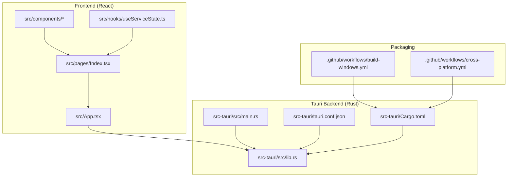
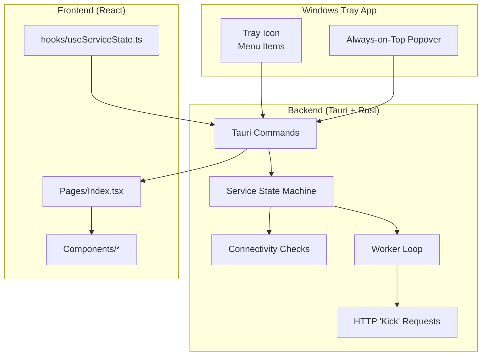
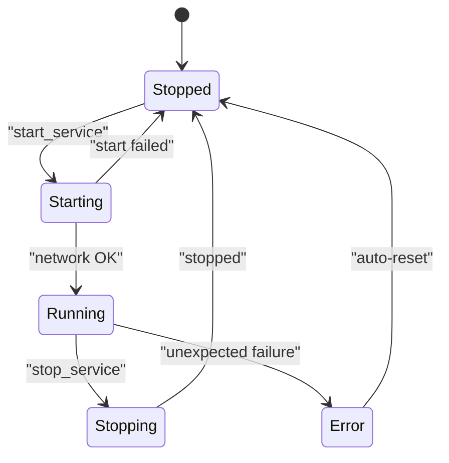
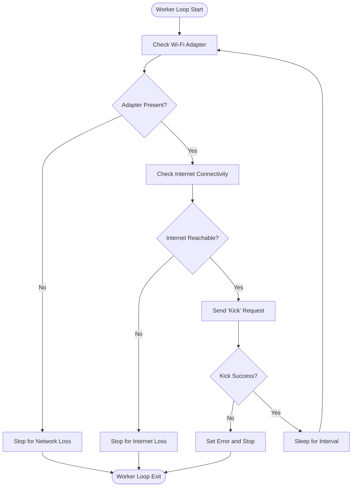
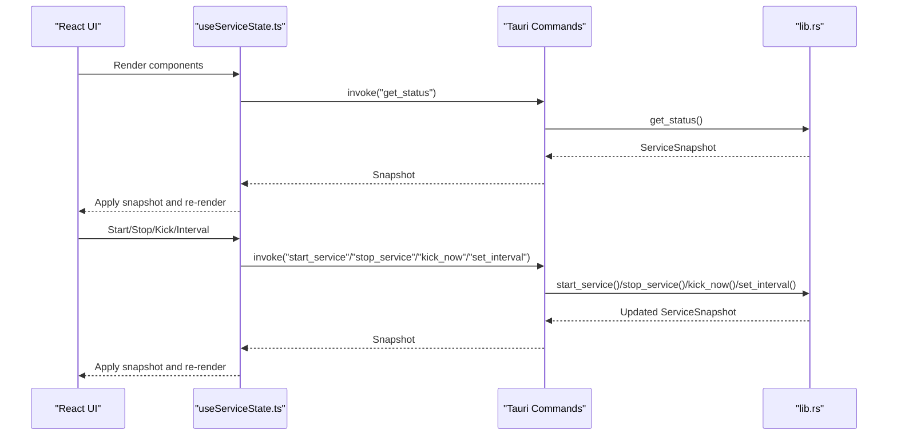
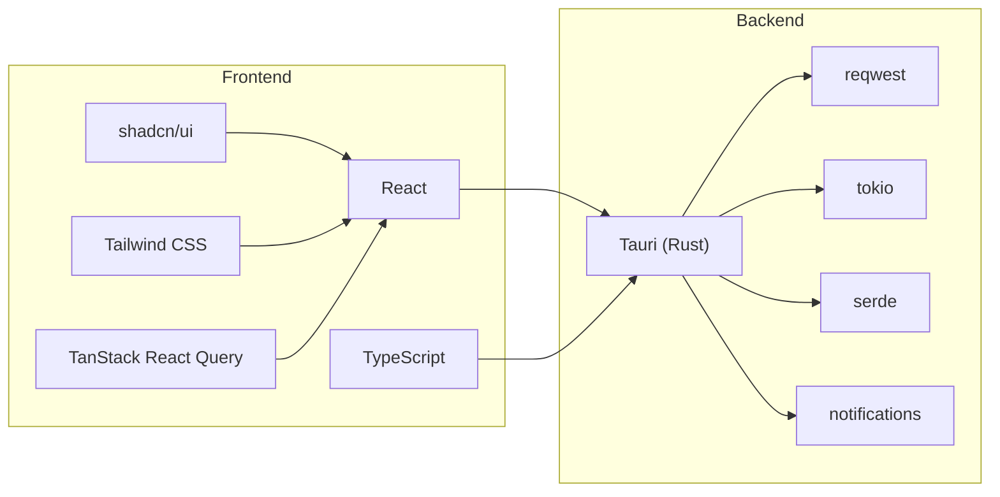

# Project Overview

<cite>
**Referenced Files in This Document**
- [README.md](file://README.md)
- [package.json](file://package.json)
- [src-tauri/Cargo.toml](file://src-tauri/Cargo.toml)
- [src-tauri/tauri.conf.json](file://src-tauri/tauri.conf.json)
- [src-tauri/src/lib.rs](file://src-tauri/src/lib.rs)
- [src/App.tsx](file://src/App.tsx)
- [src/pages/Index.tsx](file://src/pages/Index.tsx)
- [src/hooks/useServiceState.ts](file://src/hooks/useServiceState.ts)
- [src/components/PrimaryControls.tsx](file://src/components/PrimaryControls.tsx)
- [src/components/StatusCard.tsx](file://src/components/StatusCard.tsx)
- [src/components/AdvancedSettings.tsx](file://src/components/AdvancedSettings.tsx)
- [src/components/LogPanel.tsx](file://src/components/LogPanel.tsx)
- [.github/workflows/build-windows.yml](file://.github/workflows/build-windows.yml)
- [.github/workflows/cross-platform.yml](file://.github/workflows/cross-platform.yml)
</cite>

## Table of Contents
1. [Introduction](#introduction)
2. [Project Structure](#project-structure)
3. [Core Components](#core-components)
4. [Architecture Overview](#architecture-overview)
5. [Detailed Component Analysis](#detailed-component-analysis)
6. [Dependency Analysis](#dependency-analysis)
7. [Performance Considerations](#performance-considerations)
8. [Troubleshooting Guide](#troubleshooting-guide)
9. [Conclusion](#conclusion)

## Introduction
Hutch-Kick is a Windows tray application designed to maintain reliable internet connectivity for Hutch.lk subscribers by periodically sending lightweight authentication requests to the Hutch Selfcare portal. It operates silently in the system tray, automatically pausing when Wi-Fi or internet connectivity is lost, and provides a compact always-on-top control panel for quick access. The project addresses real-world network behavior where stable signal strength does not guarantee responsive internet access, offering a practical solution to keep connections “alive” without manual intervention.

Why this matters:
- Many captive or carrier-managed networks throttle or stall traffic even when the wireless indicator shows full bars.
- Periodic authentication-like activity helps keep NAT sessions and upstream gateways in a responsive state.
- Users benefit from a predictable, low-noise utility that minimizes disruption while maintaining performance.

Target audience:
- Hutch.lk subscribers experiencing intermittent connectivity despite strong signal.
- Users who want a simple, unobtrusive way to keep their connection responsive.
- Anyone needing a minimal Windows tray utility with real-time status and logging.

Key benefits:
- Runs quietly in the system tray with a quick-access popover.
- Automatically pauses on connectivity loss and resumes when conditions improve.
- Manages a configurable kick interval (default 20 seconds) and supports manual “Kick Now.”
- Provides live Wi-Fi and internet status indicators and a recent events log.

Core functionality:
- Start/stop the background service via tray controls.
- Periodic background checks to ensure Wi-Fi adapter is present and internet is reachable.
- Lightweight HTTP GET to the Hutch Selfcare login page to simulate an active session.
- Real-time status updates and event logging.
- Optional manual trigger for immediate “kick.”

Technology stack overview:
- Frontend: React, TypeScript, Vite, shadcn/ui, Tailwind CSS.
- Backend: Tauri (Rust) with async runtime and HTTP client.
- State management: React Query for caching and optimistic updates.
- Cross-platform packaging: Tauri CLI with GitHub Actions for Windows, Linux, and macOS builds.

System requirements:
- Windows 10/11.
- Node.js 18+ and Rust stable toolchain for development.
- Administrative privileges may be required for network adapter detection on some systems.

High-level architecture:
- The Tauri backend (Rust) manages the tray icon, background worker, and connectivity checks.
- The React frontend renders the control panel, displays status, and communicates with the backend via Tauri commands.
- The worker loop performs periodic checks and sends “kick” requests, pausing or stopping on connectivity loss.

Captive portal context:
- Many ISPs use captive portals or session-based routing that require periodic activity to keep sessions alive.
- By simulating a browser visit to the Selfcare page, the app keeps the session active without requiring user interaction.

**Section sources**
- [README.md](file://README.md#L15-L20)
- [README.md](file://README.md#L70-L114)
- [src-tauri/src/lib.rs](file://src-tauri/src/lib.rs#L17-L26)
- [src-tauri/src/lib.rs](file://src-tauri/src/lib.rs#L415-L473)
- [src-tauri/src/lib.rs](file://src-tauri/src/lib.rs#L659-L685)

## Project Structure
The project follows a clear separation of concerns:
- Frontend (React + TypeScript) under src/, with pages, components, hooks, and styles.
- Tauri backend (Rust) under src-tauri/, including configuration, build scripts, and the main library.
- Packaging and CI under .github/workflows/.

**Diagram sources**
- [src/pages/Index.tsx](file://src/pages/Index.tsx#L1-L55)
- [src/App.tsx](file://src/App.tsx#L1-L28)
- [src/hooks/useServiceState.ts](file://src/hooks/useServiceState.ts#L1-L163)
- [src-tauri/src/lib.rs](file://src-tauri/src/lib.rs#L659-L685)
- [src-tauri/src/main.rs](file://src-tauri/src/main.rs#L1-L7)
- [src-tauri/tauri.conf.json](file://src-tauri/tauri.conf.json#L1-L42)
- [src-tauri/Cargo.toml](file://src-tauri/Cargo.toml#L1-L29)
- [.github/workflows/build-windows.yml](file://.github/workflows/build-windows.yml#L1-L49)
- [.github/workflows/cross-platform.yml](file://.github/workflows/cross-platform.yml#L1-L128)

**Section sources**
- [README.md](file://README.md#L22-L50)
- [package.json](file://package.json#L1-L96)
- [src-tauri/Cargo.toml](file://src-tauri/Cargo.toml#L1-L29)
- [src-tauri/tauri.conf.json](file://src-tauri/tauri.conf.json#L1-L42)

## Core Components
- Tray and window lifecycle: The backend sets up a tray icon and an always-on-top popover window that appears on left-click or via the tray menu.
- Service state machine: A finite-state machine governs transitions among STOPPED, STARTING, RUNNING, STOPPING, and ERROR states.
- Connectivity checks: The backend verifies Wi-Fi adapter presence and internet reachability before starting and during operation.
- Worker loop: An async loop periodically validates connectivity, performs a “kick,” and sleeps for the configured interval.
- Frontend integration: React components render status, controls, advanced settings, and logs, polling backend snapshots via Tauri commands.

Key UI elements:
- Status card: Displays Wi-Fi, internet, and last kick time with contextual color coding.
- Primary controls: Start/Stop toggles and a manual “Kick Now” button.
- Advanced settings: Adjustable kick intervals and informational URLs.
- Log panel: Displays recent events with copy-to-clipboard support.

**Section sources**
- [src-tauri/src/lib.rs](file://src-tauri/src/lib.rs#L27-L51)
- [src-tauri/src/lib.rs](file://src-tauri/src/lib.rs#L160-L171)
- [src-tauri/src/lib.rs](file://src-tauri/src/lib.rs#L415-L473)
- [src-tauri/src/lib.rs](file://src-tauri/src/lib.rs#L659-L685)
- [src/pages/Index.tsx](file://src/pages/Index.tsx#L1-L55)
- [src/components/StatusCard.tsx](file://src/components/StatusCard.tsx#L1-L63)
- [src/components/PrimaryControls.tsx](file://src/components/PrimaryControls.tsx#L1-L73)
- [src/components/AdvancedSettings.tsx](file://src/components/AdvancedSettings.tsx#L1-L73)
- [src/components/LogPanel.tsx](file://src/components/LogPanel.tsx#L1-L52)

## Architecture Overview
The system combines a Tauri-powered Rust backend with a React frontend. The backend exposes commands for status, start/stop/kick, and configuration, while the frontend polls and invokes these commands to reflect and control the service state.

**Diagram sources**
- [src-tauri/src/lib.rs](file://src-tauri/src/lib.rs#L259-L306)
- [src-tauri/src/lib.rs](file://src-tauri/src/lib.rs#L415-L473)
- [src-tauri/src/lib.rs](file://src-tauri/src/lib.rs#L599-L656)
- [src/pages/Index.tsx](file://src/pages/Index.tsx#L1-L55)
- [src/hooks/useServiceState.ts](file://src/hooks/useServiceState.ts#L1-L163)

## Detailed Component Analysis

### Backend Service State Machine
The backend defines a deterministic state machine to manage service lifecycle and error handling. Transitions are validated to prevent invalid state changes, and errors are surfaced to the UI with notifications.

**Diagram sources**
- [src-tauri/src/lib.rs](file://src-tauri/src/lib.rs#L27-L51)
- [src-tauri/src/lib.rs](file://src-tauri/src/lib.rs#L160-L171)
- [src-tauri/src/lib.rs](file://src-tauri/src/lib.rs#L193-L205)

**Section sources**
- [src-tauri/src/lib.rs](file://src-tauri/src/lib.rs#L27-L51)
- [src-tauri/src/lib.rs](file://src-tauri/src/lib.rs#L160-L171)
- [src-tauri/src/lib.rs](file://src-tauri/src/lib.rs#L193-L205)

### Worker Loop and Connectivity Checks
The worker loop orchestrates periodic checks and “kick” requests, with careful handling of connectivity loss and error states.

**Diagram sources**
- [src-tauri/src/lib.rs](file://src-tauri/src/lib.rs#L415-L473)
- [src-tauri/src/lib.rs](file://src-tauri/src/lib.rs#L373-L413)
- [src-tauri/src/lib.rs](file://src-tauri/src/lib.rs#L460-L463)

**Section sources**
- [src-tauri/src/lib.rs](file://src-tauri/src/lib.rs#L415-L473)
- [src-tauri/src/lib.rs](file://src-tauri/src/lib.rs#L351-L371)
- [src-tauri/src/lib.rs](file://src-tauri/src/lib.rs#L308-L344)

### Frontend Integration and Polling
The frontend polls the backend snapshot every ~1.2 seconds, applying updates to local state and rendering UI components. It invokes commands for start/stop/kick and interval changes.

**Diagram sources**
- [src/hooks/useServiceState.ts](file://src/hooks/useServiceState.ts#L88-L107)
- [src/hooks/useServiceState.ts](file://src/hooks/useServiceState.ts#L109-L144)
- [src-tauri/src/lib.rs](file://src-tauri/src/lib.rs#L599-L656)

**Section sources**
- [src/hooks/useServiceState.ts](file://src/hooks/useServiceState.ts#L1-L163)
- [src/pages/Index.tsx](file://src/pages/Index.tsx#L1-L55)
- [src-tauri/src/lib.rs](file://src-tauri/src/lib.rs#L599-L656)

### UI Components Overview
- StatusCard: Displays Wi-Fi, internet, and last kick time with contextual feedback.
- PrimaryControls: Start/Stop toggle and “Kick Now” button with disabled states during transitions.
- AdvancedSettings: Interval selector and informational URLs.
- LogPanel: Displays recent events with copy-to-clipboard.

**Section sources**
- [src/components/StatusCard.tsx](file://src/components/StatusCard.tsx#L1-L63)
- [src/components/PrimaryControls.tsx](file://src/components/PrimaryControls.tsx#L1-L73)
- [src/components/AdvancedSettings.tsx](file://src/components/AdvancedSettings.tsx#L1-L73)
- [src/components/LogPanel.tsx](file://src/components/LogPanel.tsx#L1-L52)

## Dependency Analysis
- Frontend dependencies include React, shadcn/ui primitives, Radix UI, Tailwind, and TanStack React Query for state management.
- Backend dependencies include Tauri, reqwest for HTTP, tokio for async runtime, serde for serialization, and notification plugins.
- Tauri configuration defines the app window behavior, tray icon, and bundling targets.

**Diagram sources**
- [package.json](file://package.json#L18-L70)
- [src-tauri/Cargo.toml](file://src-tauri/Cargo.toml#L20-L28)
- [src-tauri/tauri.conf.json](file://src-tauri/tauri.conf.json#L1-L42)

**Section sources**
- [package.json](file://package.json#L18-L70)
- [src-tauri/Cargo.toml](file://src-tauri/Cargo.toml#L20-L28)
- [src-tauri/tauri.conf.json](file://src-tauri/tauri.conf.json#L1-L42)

## Performance Considerations
- The worker loop sleeps for the configured interval after each “kick,” minimizing CPU usage.
- HTTP timeouts are set to balance responsiveness and reliability.
- Logging is capped to a fixed number of entries to control memory usage.
- The UI polls at a moderate cadence to keep the interface fresh without overloading the backend.

[No sources needed since this section provides general guidance]

## Troubleshooting Guide
Common scenarios and remedies:
- Service fails to start due to missing network adapter: The backend checks for an active adapter and blocks startup if none is found. Connect Wi-Fi or Ethernet and retry.
- Internet unreachable: The backend verifies reachability via a connectivity endpoint and prevents starting if offline.
- Unexpected error during operation: The backend transitions to an error state, stops the worker, and notifies the user. Restart the service after resolving the underlying issue.
- Logs help diagnose issues: Use the log panel’s copy function to share recent events.

**Section sources**
- [src-tauri/src/lib.rs](file://src-tauri/src/lib.rs#L475-L564)
- [src-tauri/src/lib.rs](file://src-tauri/src/lib.rs#L566-L597)
- [src-tauri/src/lib.rs](file://src-tauri/src/lib.rs#L193-L205)
- [src/components/LogPanel.tsx](file://src/components/LogPanel.tsx#L1-L52)

## Conclusion
Hutch-Kick delivers a focused, reliable solution for maintaining Hutch.lk connectivity by periodically authenticating with the Selfcare portal. Its clean architecture separates a robust Rust backend from a responsive React frontend, ensuring predictable behavior, low overhead, and clear diagnostics. Users gain a simple tray-based utility that stays out of the way while keeping their connection responsive.

[No sources needed since this section summarizes without analyzing specific files]