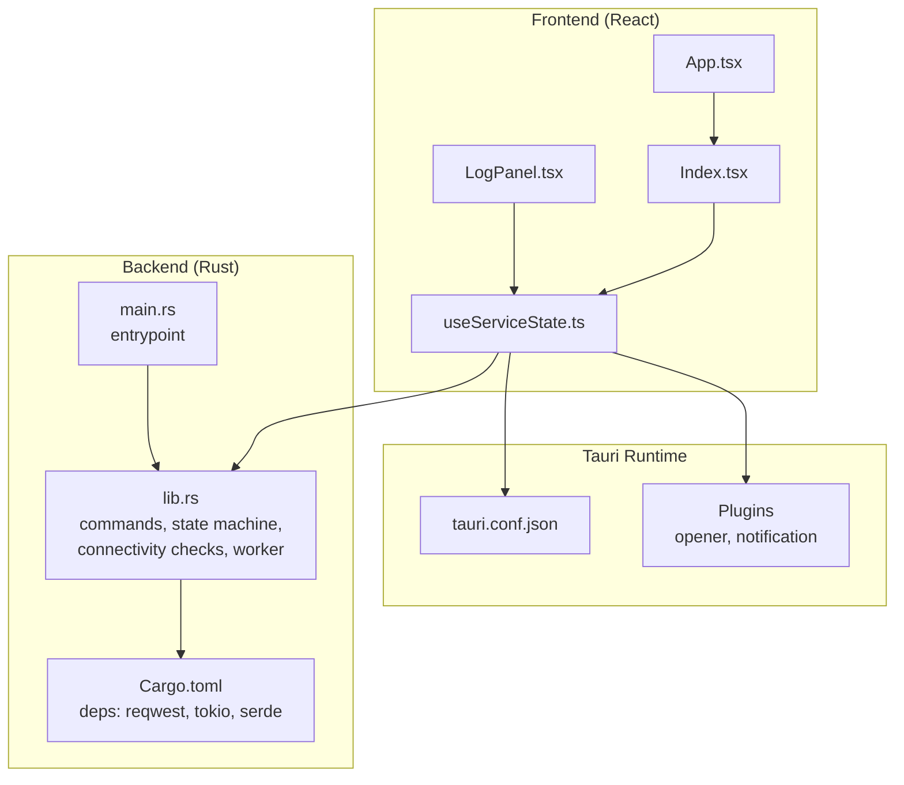
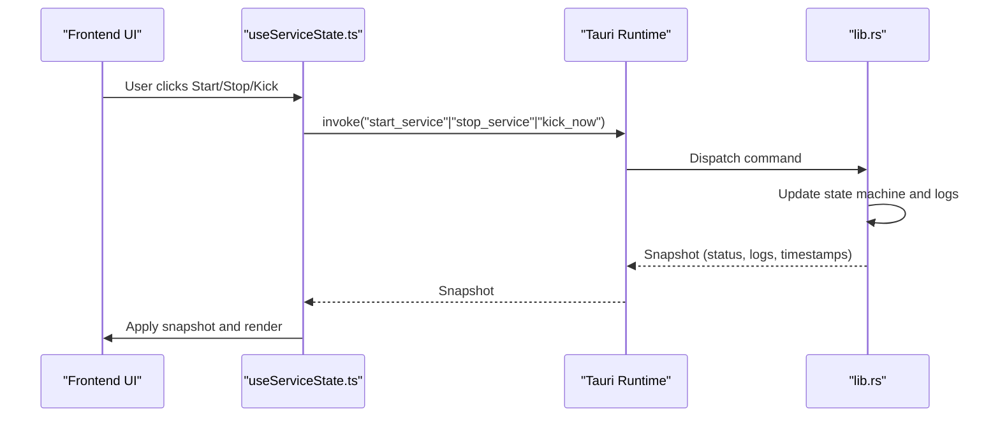
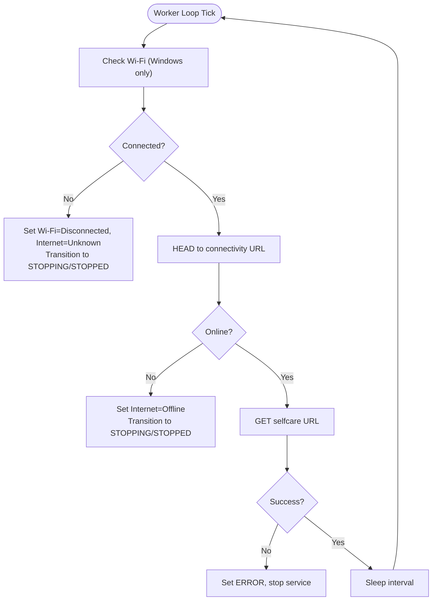
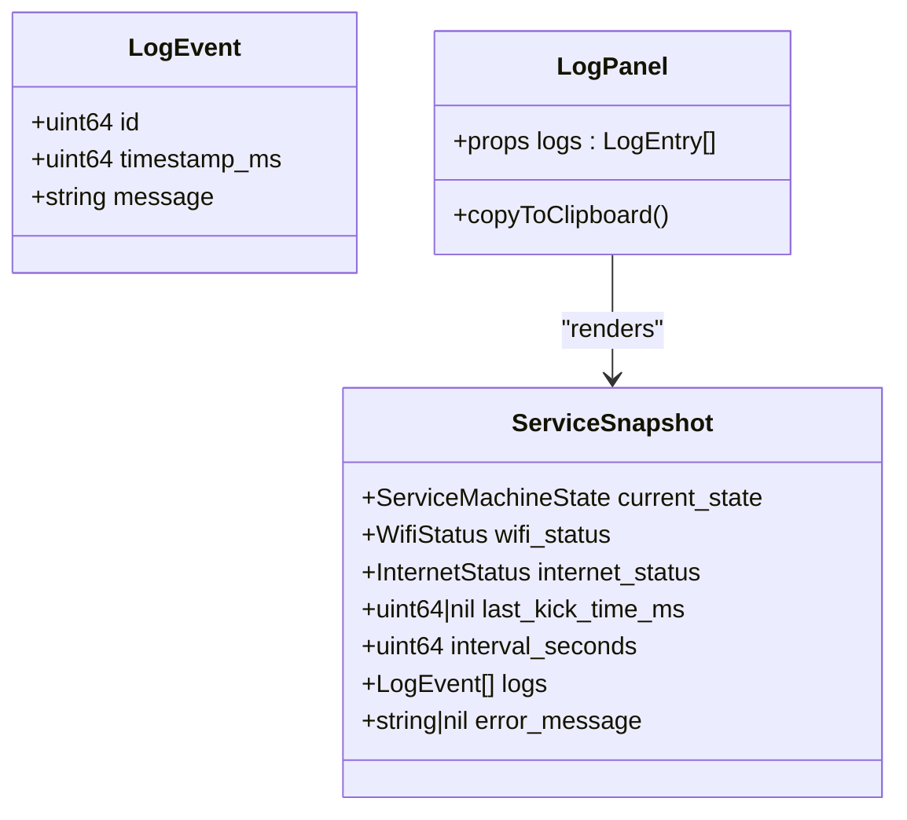
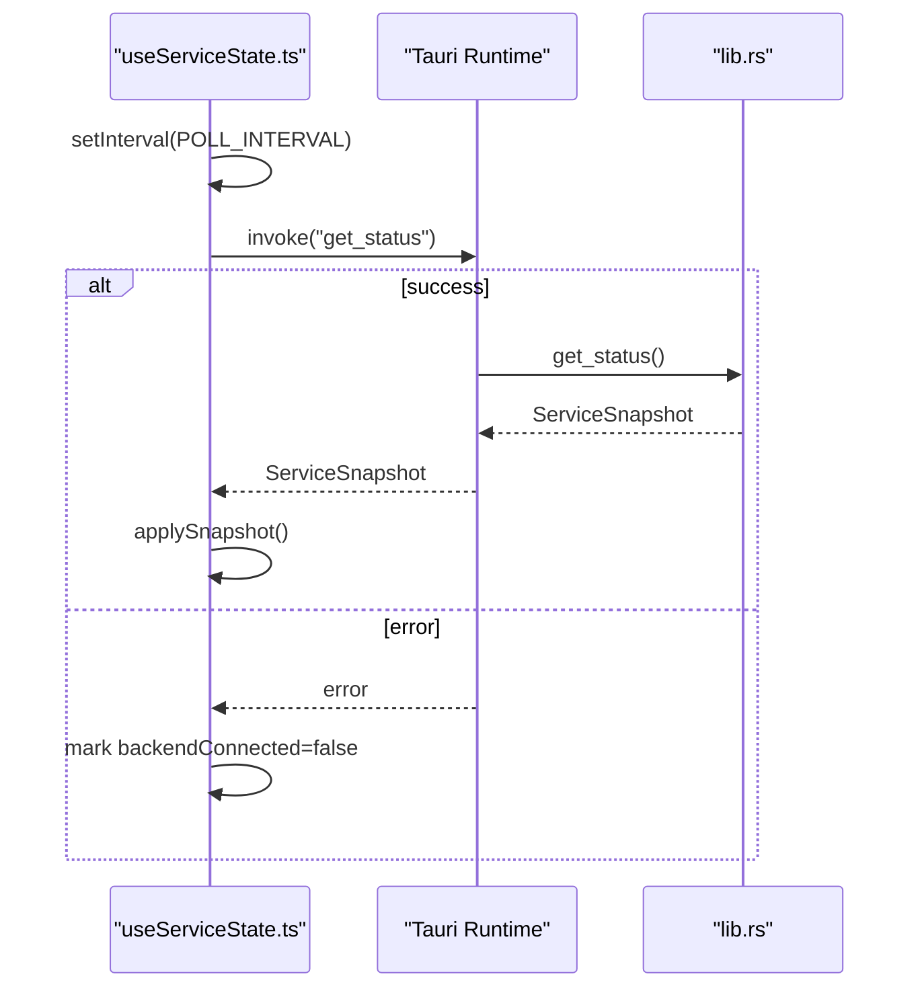
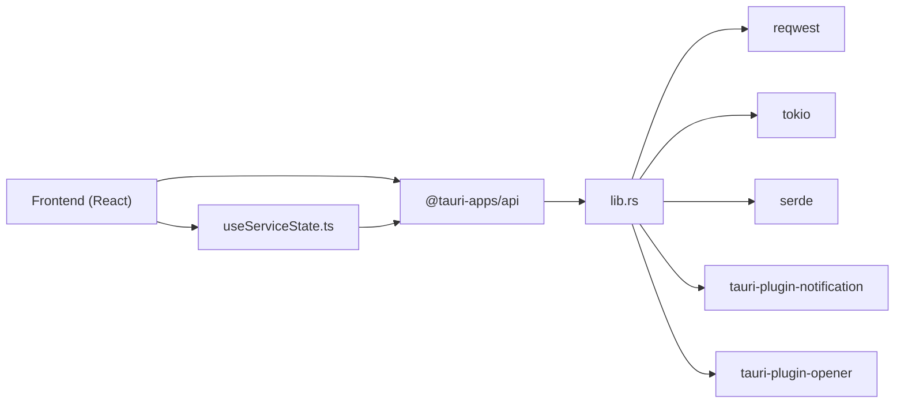

# Troubleshooting and FAQ

<cite>
**Referenced Files in This Document**
- [README.md](file://README.md)
- [package.json](file://package.json)
- [vite.config.ts](file://vite.config.ts)
- [tailwind.config.ts](file://tailwind.config.ts)
- [src-tauri/Cargo.toml](file://src-tauri/Cargo.toml)
- [src-tauri/tauri.conf.json](file://src-tauri/tauri.conf.json)
- [src-tauri/src/lib.rs](file://src-tauri/src/lib.rs)
- [src-tauri/src/main.rs](file://src-tauri/src/main.rs)
- [src/App.tsx](file://src/App.tsx)
- [src/pages/Index.tsx](file://src/pages/Index.tsx)
- [src/components/LogPanel.tsx](file://src/components/LogPanel.tsx)
- [src/hooks/useServiceState.ts](file://src/hooks/useServiceState.ts)
- [.github/workflows/build-windows.yml](file://.github/workflows/build-windows.yml)
- [.github/workflows/cross-platform.yml](file://.github/workflows/cross-platform.yml)
</cite>

## Table of Contents
1. [Introduction](#introduction)
2. [Project Structure](#project-structure)
3. [Core Components](#core-components)
4. [Architecture Overview](#architecture-overview)
5. [Detailed Component Analysis](#detailed-component-analysis)
6. [Dependency Analysis](#dependency-analysis)
7. [Performance Considerations](#performance-considerations)
8. [Troubleshooting Guide](#troubleshooting-guide)
9. [Conclusion](#conclusion)
10. [Appendices](#appendices)

## Introduction
This document provides comprehensive troubleshooting guidance for Hutch-Pulse (formerly Hutch-Kick). It covers installation and build issues, network connectivity detection failures, performance and timeout problems, platform-specific limitations, and usage FAQs. It also includes diagnostic procedures, log analysis techniques, and step-by-step resolutions for common scenarios.

## Project Structure
Hutch-Pulse is a Tauri desktop application with a React + TypeScript frontend and a Rust backend. The frontend communicates with the backend via Tauri commands. The backend manages a periodic “kick” service to keep the Hutch self-care session alive, monitors Wi-Fi and internet connectivity, and exposes a tray-based UI.

**Diagram sources**
- [src/pages/Index.tsx](file://src/pages/Index.tsx#L1-L55)
- [src/App.tsx](file://src/App.tsx#L1-L28)
- [src/hooks/useServiceState.ts](file://src/hooks/useServiceState.ts#L1-L163)
- [src/components/LogPanel.tsx](file://src/components/LogPanel.tsx#L1-L52)
- [src-tauri/tauri.conf.json](file://src-tauri/tauri.conf.json#L1-L42)
- [src-tauri/src/lib.rs](file://src-tauri/src/lib.rs#L1-L686)
- [src-tauri/src/main.rs](file://src-tauri/src/main.rs#L1-L7)
- [src-tauri/Cargo.toml](file://src-tauri/Cargo.toml#L1-L29)

**Section sources**
- [README.md](file://README.md#L22-L50)
- [src-tauri/tauri.conf.json](file://src-tauri/tauri.conf.json#L1-L42)
- [src-tauri/Cargo.toml](file://src-tauri/Cargo.toml#L1-L29)

## Core Components
- Frontend UI and state:
  - Application shell and routing provider.
  - Hook that polls backend state via Tauri commands and updates UI.
  - Log panel with copy-to-clipboard functionality.
- Backend service:
  - State machine for service lifecycle.
  - Connectivity checks (Wi-Fi via OS command on Windows; internet via HEAD request).
  - Worker loop that periodically performs a “kick” request.
  - Tauri commands exposed to the frontend.

Key implementation references:
- Frontend state and polling: [src/hooks/useServiceState.ts](file://src/hooks/useServiceState.ts#L88-L107)
- Tauri commands and state snapshot: [src-tauri/src/lib.rs](file://src-tauri/src/lib.rs#L599-L656)
- Connectivity checks and worker loop: [src-tauri/src/lib.rs](file://src-tauri/src/lib.rs#L415-L473)
- Tray and window setup: [src-tauri/src/lib.rs](file://src-tauri/src/lib.rs#L238-L306)

**Section sources**
- [src/pages/Index.tsx](file://src/pages/Index.tsx#L1-L55)
- [src/hooks/useServiceState.ts](file://src/hooks/useServiceState.ts#L1-L163)
- [src-tauri/src/lib.rs](file://src-tauri/src/lib.rs#L1-L686)

## Architecture Overview
The frontend invokes Tauri commands to control the backend service. The backend maintains an internal state machine and logs, and performs connectivity checks and periodic kicks.

**Diagram sources**
- [src/hooks/useServiceState.ts](file://src/hooks/useServiceState.ts#L109-L134)
- [src-tauri/src/lib.rs](file://src-tauri/src/lib.rs#L599-L656)

## Detailed Component Analysis

### Connectivity and Network Checks
- Wi-Fi detection on Windows uses a system command to enumerate interfaces and detect a connected non-loopback adapter.
- Internet connectivity is verified via a HEAD request to a known endpoint.
- If either check fails while running, the service transitions to stopping/stopped and logs the reason.

**Diagram sources**
- [src-tauri/src/lib.rs](file://src-tauri/src/lib.rs#L415-L473)
- [src-tauri/src/lib.rs](file://src-tauri/src/lib.rs#L308-L344)
- [src-tauri/src/lib.rs](file://src-tauri/src/lib.rs#L351-L371)

**Section sources**
- [src-tauri/src/lib.rs](file://src-tauri/src/lib.rs#L308-L344)
- [src-tauri/src/lib.rs](file://src-tauri/src/lib.rs#L351-L371)
- [src-tauri/src/lib.rs](file://src-tauri/src/lib.rs#L415-L473)

### Logging and Diagnostics
- Backend maintains a bounded log queue with timestamps and messages.
- Frontend displays recent events and allows copying logs for support.

**Diagram sources**
- [src-tauri/src/lib.rs](file://src-tauri/src/lib.rs#L53-L71)
- [src/components/LogPanel.tsx](file://src/components/LogPanel.tsx#L1-L52)

**Section sources**
- [src-tauri/src/lib.rs](file://src-tauri/src/lib.rs#L116-L127)
- [src-tauri/src/lib.rs](file://src-tauri/src/lib.rs#L104-L114)
- [src/components/LogPanel.tsx](file://src/components/LogPanel.tsx#L12-L51)

### Frontend State and Polling
- The hook polls backend state at a fixed interval and maps backend snapshots to frontend types.
- It handles invoke errors by marking backend connectivity down.

**Diagram sources**
- [src/hooks/useServiceState.ts](file://src/hooks/useServiceState.ts#L88-L107)
- [src-tauri/src/lib.rs](file://src-tauri/src/lib.rs#L599-L602)

**Section sources**
- [src/hooks/useServiceState.ts](file://src/hooks/useServiceState.ts#L88-L107)
- [src/pages/Index.tsx](file://src/pages/Index.tsx#L39-L43)

## Dependency Analysis
- Frontend depends on Tauri APIs and React Query-like state management via a custom hook.
- Backend depends on reqwest for HTTP, tokio for async runtime, serde for serialization, and Tauri plugins for notifications and opening URLs.

**Diagram sources**
- [package.json](file://package.json#L18-L69)
- [src-tauri/Cargo.toml](file://src-tauri/Cargo.toml#L20-L28)
- [src-tauri/src/lib.rs](file://src-tauri/src/lib.rs#L1-L15)

**Section sources**
- [package.json](file://package.json#L18-L69)
- [src-tauri/Cargo.toml](file://src-tauri/Cargo.toml#L20-L28)

## Performance Considerations
- Minimum interval is enforced to avoid excessive requests.
- HTTP timeouts are configured for connect and request durations.
- Logs are capped to reduce memory overhead.

Recommendations:
- Keep intervals reasonable (minimum enforced at backend).
- Avoid setting very short intervals on unstable networks.
- Monitor logs to detect recurring failures and adjust accordingly.

**Section sources**
- [src-tauri/src/lib.rs](file://src-tauri/src/lib.rs#L17-L21)
- [src-tauri/src/lib.rs](file://src-tauri/src/lib.rs#L660-L664)
- [src-tauri/src/lib.rs](file://src-tauri/src/lib.rs#L94-L96)

## Troubleshooting Guide

### Installation and Build Issues
Common symptoms:
- Build fails on CI or local machines.
- Missing system dependencies for non-Windows platforms.

Checklist:
- Verify prerequisites:
  - Node.js and Rust installed as per project documentation.
  - Windows 10/11 for intended platform.
- Local build:
  - Install dependencies and run the Tauri build script.
- CI builds:
  - Confirm workflow installs Node.js, Rust, and system dependencies for the target OS.
  - Ensure Tauri CLI is installed globally in CI.

Diagnostics:
- Review CI logs for dependency installation and build steps.
- On Linux/macOS, confirm system packages are present before building.

Resolution steps:
- Install missing dependencies and retry build.
- For CI, align matrix OS and dependency steps with the cross-platform workflow.

**Section sources**
- [README.md](file://README.md#L72-L99)
- [.github/workflows/build-windows.yml](file://.github/workflows/build-windows.yml#L15-L42)
- [.github/workflows/cross-platform.yml](file://.github/workflows/cross-platform.yml#L25-L31)
- [.github/workflows/cross-platform.yml](file://.github/workflows/cross-platform.yml#L76-L92)

### Network Connectivity Issues
Symptoms:
- Service does not start.
- Service stops unexpectedly.
- Wi-Fi or internet status shows as disconnected/offline.

Root causes:
- No active network adapter on Windows.
- Internet connectivity unavailable.
- Worker loop detects loss and transitions to stopping/stopped.

Diagnostics:
- Check backend logs for explicit reasons (“Network adapter disconnected”, “Internet connectivity lost”, “Start blocked because internet is offline”).
- Verify Wi-Fi status and internet status in the UI.
- Confirm HEAD request to connectivity URL succeeds.

Resolution steps:
- Connect Wi-Fi or Ethernet and restart the service.
- If internet is offline, wait until connectivity is restored.
- Reduce interval to minimize repeated failures during transient outages.

**Section sources**
- [src-tauri/src/lib.rs](file://src-tauri/src/lib.rs#L489-L516)
- [src-tauri/src/lib.rs](file://src-tauri/src/lib.rs#L528-L536)
- [src-tauri/src/lib.rs](file://src-tauri/src/lib.rs#L430-L458)
- [src-tauri/src/lib.rs](file://src-tauri/src/lib.rs#L373-L413)

### Platform-Specific Challenges
- Wi-Fi connectivity checks are implemented for Windows only.
- Non-Windows systems will report unknown network state for safety.

Diagnostics:
- If network state remains unknown, confirm you are on Windows.
- Expect limited connectivity detection on other platforms.

Resolution steps:
- Use Windows for reliable Wi-Fi detection.
- On other platforms, rely on internet connectivity checks and manual start/stop.

**Section sources**
- [src-tauri/src/lib.rs](file://src-tauri/src/lib.rs#L308-L349)

### Performance Problems and Timeouts
Symptoms:
- Frequent ERROR state transitions.
- Slow UI updates or unresponsive controls.

Root causes:
- Excessive or too-frequent kicks.
- Network timeouts or slow endpoints.
- Backend worker being aborted or stuck.

Diagnostics:
- Inspect logs for “Kick request failed” or “Unexpected failure” entries.
- Observe interval and recent kick timestamps.
- Check if the worker handle exists in the snapshot.

Resolution steps:
- Increase kick interval to reduce load.
- Verify external endpoints are reachable.
- Restart the service to reset the worker.

**Section sources**
- [src-tauri/src/lib.rs](file://src-tauri/src/lib.rs#L460-L463)
- [src-tauri/src/lib.rs](file://src-tauri/src/lib.rs#L193-L205)
- [src-tauri/src/lib.rs](file://src-tauri/src/lib.rs#L549-L561)

### Frontend/Backend Communication Failures
Symptoms:
- “Backend unavailable” notice appears.
- Controls are unresponsive.

Root causes:
- Running the UI without Tauri desktop runtime.
- Tauri command invocation errors.

Diagnostics:
- Look for backendConnected=false in the UI state.
- Check browser console for Tauri API errors.

Resolution steps:
- Launch via Tauri desktop runtime (dev or prod).
- Reopen the app window if hidden.

**Section sources**
- [src/pages/Index.tsx](file://src/pages/Index.tsx#L39-L43)
- [src/hooks/useServiceState.ts](file://src/hooks/useServiceState.ts#L88-L98)

### Logging and Diagnostic Commands
- Use the Log Panel’s copy-to-clipboard action to gather recent events.
- Include timestamps and messages when reporting issues.
- For deeper inspection, review backend logs maintained in-memory.

Diagnostic tips:
- Reproduce the issue and capture logs immediately after.
- Share the copied log text with support channels.

**Section sources**
- [src/components/LogPanel.tsx](file://src/components/LogPanel.tsx#L12-L51)
- [src-tauri/src/lib.rs](file://src-tauri/src/lib.rs#L116-L127)

### Frequently Asked Questions (FAQ)

Q: Why does the service not start on my system?
- Ensure Wi-Fi/Ethernet is connected (Windows) and internet is reachable. The service blocks startup if network state is unavailable.

Q: Can I run this on macOS/Linux?
- The tray and desktop runtime are supported, but Wi-Fi connectivity checks are Windows-only. Internet checks still work.

Q: How often can I change the kick interval?
- The minimum enforced interval is applied at the backend. Choose sensible values (e.g., 20s, 60s, 120s, 300s).

Q: What does “ERROR” mean?
- An unexpected failure occurred; the service transitioned to ERROR, then STOPPED automatically.

Q: How do I stop the service cleanly?
- Use the Stop control or right-click tray menu. The worker is aborted and state transitions to STOPPED.

Q: Where are the logs stored?
- Logs are maintained in-memory by the backend and surfaced in the UI. Copy them for sharing.

Q: How do I rebuild the app?
- Use the Tauri build script. On CI, ensure Node.js, Rust, and platform-specific dependencies are installed.

**Section sources**
- [src-tauri/src/lib.rs](file://src-tauri/src/lib.rs#L644-L651)
- [src-tauri/src/lib.rs](file://src-tauri/src/lib.rs#L193-L205)
- [src-tauri/src/lib.rs](file://src-tauri/src/lib.rs#L566-L597)
- [README.md](file://README.md#L78-L99)

### Escalation Procedures
- Capture and share:
  - Copied logs from the UI.
  - OS/platform details and Hutch-Pulse version.
  - Steps to reproduce and observed behavior.
- If the issue persists after trying recommended fixes, open a support ticket with the above information.

## Conclusion
This guide outlined systematic diagnostics and resolutions for common Hutch-Pulse issues, focusing on installation, connectivity, performance, and platform differences. Use the provided procedures to isolate problems quickly, collect actionable logs, and apply targeted fixes.

## Appendices

### Quick Reference: Key Behaviors and Defaults
- Minimum kick interval enforced by backend.
- Connectivity URL for internet checks.
- Tray icon toggles the always-on-top popover window.
- Tauri commands exposed for status, start, stop, kick, interval, and quit.

**Section sources**
- [src-tauri/src/lib.rs](file://src-tauri/src/lib.rs#L17-L21)
- [src-tauri/src/lib.rs](file://src-tauri/src/lib.rs#L24-L25)
- [src-tauri/src/lib.rs](file://src-tauri/src/lib.rs#L207-L218)
- [src-tauri/src/lib.rs](file://src-tauri/src/lib.rs#L599-L656)